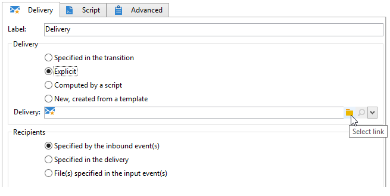

# Diffusion{#delivery}


Une activité de type **Diffusion** permet de créer une action de diffusion. Elle peut être construite à partir des éléments entrants.

Pour la paramétrer, éditez l&#39;activité et renseignez les options de la diffusion.


1. **Diffusion**

   Vous pouvez ainsi :

   * Agir sur la diffusion spécifiée dans la transition entrante. Pour ce faire, sélectionnez la première option de la **[!UICONTROL Diffusion]** de la fenêtre.

     Cette option peut être utilisée lorsqu&#39;une activité précédente du workflow a déjà créé ou spécifié la diffusion. Cela peut avoir été effectué, comme dans l&#39;exemple ci-dessous, par une activité du même type ayant généré une transition sortante.

     Dans l&#39;exemple suivant, la diffusion est créée dans un premier temps. La population et le contenu sont définis ensuite. Enfin, les informations de ces trois éléments sont reprises dans une nouvelle activité de diffusion via la transition entrante, afin que cette dernière puisse être envoyée.

     

   * Sélectionnez directement la diffusion concernée. Pour ce faire, sélectionnez l’option **[!UICONTROL Explicite]** et sélectionnez la diffusion dans la liste déroulante du **[!UICONTROL Diffusion]** champ .

     La liste affiche les diffusions non terminées contenues dans la **Diffusions** par défaut. Pour accéder à d’autres campagnes, cliquez sur le bouton **[!UICONTROL Choisir le lien]** Icône

     

     Sélectionnez le dossier visé dans la liste déroulante du champ **[!UICONTROL Dossier]** ou cliquez sur **[!UICONTROL Afficher les fils]** pour afficher toutes les diffusions contenues dans les sous-dossiers :

     

     Une fois l&#39;action de diffusion sélectionnée, vous pouvez en visualiser le contenu en cliquant sur l&#39;icône **[!UICONTROL Editer le lien]**.

   * Créez un script pour calculer la diffusion. Pour cela, sélectionnez l’option **[!UICONTROL Calculée par un script]** et saisissez le script. Vous pouvez ouvrir une fenêtre de saisie en cliquant sur **[!UICONTROL Éditer...]**. L’exemple suivant permet de récupérer l’identifiant de la diffusion :

     

   * Créez une nouvelle diffusion. Pour ce faire, sélectionnez l’option **[!UICONTROL Nouveau, créé à partir d’un modèle]** et sélectionnez le modèle de diffusion sur lequel sera basée la diffusion.

     

     Cliquez sur l&#39;icône **[!UICONTROL Choisir le lien]** pour parcourir les dossiers et sur l&#39;icône **[!UICONTROL Editer le lien]** si vous souhaitez visualiser le contenu du modèle sélectionné.

1. **Destinataires**

   Les destinataires peuvent être spécifiés par les événements entrants, par exemple suite à un import de fichier, ou spécifiés dans l&#39;action de diffusion. Ils peuvent également être stockés dans un ou plusieurs fichiers.

   

1. **Content**

   Le contenu du message peut être défini dans la diffusion ou dans l&#39;événement entrant.

   

1. **Action à effectuer**

   Vous pouvez créer la diffusion, la préparer, la démarrer, estimer la cible ou envoyer un bon à tirer.

   

   Sélectionnez le type d&#39;action à effectuer parmi les options disponibles :

   * **[!UICONTROL Enregistrer]** : cette option permet de créer la diffusion et de l&#39;enregistrer. Aucune analyse ni envoi n&#39;est effectué.
   * **[!UICONTROL Estimation de la cible]**: cette option permet de calculer la cible de la diffusion afin d&#39;en évaluer le potentiel (première phase d&#39;analyse). Cette action équivaut à sélectionner la variable **[!UICONTROL Estimation de la population à cibler]** option et clic **[!UICONTROL Analyser]** lors de l&#39;envoi d&#39;une diffusion à la cible principale via **Diffusion**.
   * **[!UICONTROL Préparer]**: cette option permet de lancer le processus d&#39;analyse complet (calcul de la cible et préparation du contenu). La diffusion n&#39;est pas envoyée. Cette action équivaut à sélectionner la variable **[!UICONTROL Diffuser dès que possible]** option et clic **[!UICONTROL Analyser]** lors de l&#39;envoi d&#39;une diffusion à la cible principale avec **Diffusion**.
   * **[!UICONTROL Envoyer un bon à tirer]**: cette option permet d&#39;envoyer un BAT de la diffusion. Cette action équivaut à cliquer sur le bouton **[!UICONTROL Envoyer un bon à tirer]** dans la barre d&#39;outils d&#39;une diffusion avec **Diffusion**
   * **[!UICONTROL Préparation et démarrage]**: cette option lance le processus d&#39;analyse complet (calcul de la cible et préparation du contenu) et envoie la diffusion. Cette action équivaut à cliquer sur **[!UICONTROL Diffuser dès que possible]**, **[!UICONTROL Analyser]**, et **[!UICONTROL Confirmer l&#39;envoi]** lors de l&#39;envoi d&#39;une diffusion à la cible principale avec **Diffusion**.

   L’activité **[!UICONTROL Agir sur une diffusion]**, placée ultérieurement dans le workflow, vous permettra de lancer toutes les étapes restantes nécessaires au démarrage de la diffusion (calcul de la cible, préparation du contenu, diffusion). Pour plus d&#39;informations, consultez la section [Agir sur une diffusion](delivery-control.md).

   Les options suivantes sont également disponibles :

   * **[!UICONTROL Générer une transition sortante]**

     Crée une transition sortante qui sera activée à la fin de l&#39;exécution. Vous pouvez choisir de récupérer la cible de l&#39;action de diffusion en sortie, ou non.

   * **[!UICONTROL Ne pas récupérer la cible]**

     Ne récupère pas la cible de l&#39;action de diffusion en sortie.

   * **[!UICONTROL Traiter les erreurs]**

     Pour plus d&#39;informations, consultez la section [Agir sur une diffusion](delivery-control.md).

   L&#39;onglet **Script** permet de modifier les paramètres de la diffusion.

   

## Exemple : workflow de diffusion {#example--delivery-workflow}

Créez un nouveau workflow et ajoutez des activités comme dans l&#39;exemple ci-dessous :


Ouvrez l&#39;activité **Diffusion** et définissez ses propriétés comme suit :

* Dans la section **[!UICONTROL Diffusion]**, choisissez **[!UICONTROL Nouvelle, créée depuis un modèle]** et sélectionnez un modèle de diffusion.
* Dans la section **[!UICONTROL Destinataires]**, choisissez **[!UICONTROL Spécifiés dans la diffusion]**.
* Dans la section **[!UICONTROL Action à effectuer]**, conservez l&#39;option **[!UICONTROL Préparer]**.


Cliquez sur **[!UICONTROL OK]** pour fermer la fenêtre de propriétés. Vous venez de configurer une activité consistant à créer et préparer une nouvelle diffusion depuis un modèle de diffusion dont la cible sera celle spécifiée dans le modèle.

Ouvrez l&#39;activité **Validation** et définissez ses propriétés comme suit :

1. Dans le champ **[!UICONTROL Assignation]**, sélectionnez un groupe dans lequel vous êtes inscrit. Si vous êtes connecté avec le compte &#39;admin&#39;, choisissez le groupe Administration.
1. Saisissez ensuite un titre et insérez le texte suivant dans le corps du message :

   ```
   Do you wish to approve delivery (<%= vars.recCount %> recipient(s))?
   ```

   Il s’agit d’un message incluant une expression JavaScript : l’expression **[!UICONTROL vars.recCount]** représente le nombre de destinataires ciblés par la diffusion de la tâche qui précède. Pour plus d’informations sur les expressions JavaScript, voir la section [Scripts/Templates JavaScript](javascript-scripts-and-templates.md).

   

   La tâche de validation est présentée dans la section [Validation](approval.md).

## Paramètres d&#39;entrée {#input-parameters}

Identifiant de la diffusion, si l&#39;option **[!UICONTROL Spécifiée par la transition]** est sélectionnée dans la partie **[!UICONTROL Diffusion]**.

* deliveryId
* tableName
* schema

Chacun des événements entrants doit spécifier une cible définie par ces paramètres.

>[!NOTE]
>
>Ce paramètre n&#39;apparaît que si l&#39;option **[!UICONTROL Spécifiés par le ou les événements entrants]** est sélectionnée dans la partie **[!UICONTROL Destinataires]**.

* filename

  Nom complet du fichier généré, si l&#39;option **[!UICONTROL Fichier(s) spécifié(s) par le ou les événements entrants]** est sélectionnée dans la partie **[!UICONTROL Destinataires]**.

* contentId

  Identifiant du contenu, lorsque l&#39;option **[!UICONTROL Spécifié par l&#39;événement entrant]** est sélectionnée dans la partie **[!UICONTROL Contenu]**.

## Paramètres de sortie {#output-parameters}

* tableName
* schema
* recCount

Ce triplet de valeurs identifie la cible résultant de la diffusion. **[!UICONTROL tableName]** est le nom de la table qui mémorise les identifiants de la cible, **[!UICONTROL schema]** est le schéma de la population (habituellement nms:recipient) et **[!UICONTROL recCount]** est le nombre d’éléments dans le tableau.

La transition associée au complémentaire possède les mêmes paramètres.

>[!NOTE]
>
>Il n&#39;y a aucun paramètre de sortie lorsque l&#39;option **[!UICONTROL Ne pas récupérer la cible]** est sélectionnée.
