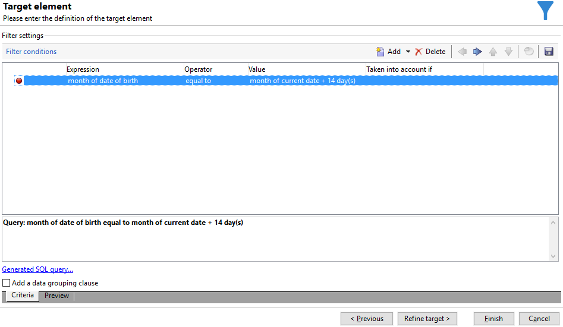
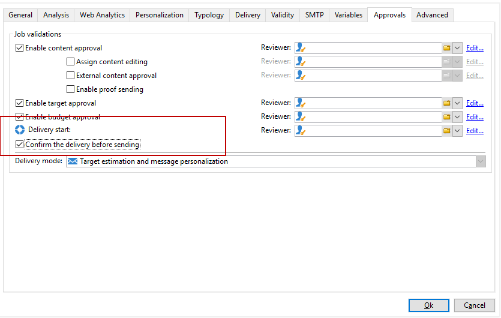

# Enrichissement des emails avec des champs de date personnalisés{#email-enrichment-with-custom-date-fields}


Dans cet exemple, nous souhaitons envoyer un email avec des champs de données personnalisés aux destinataires qui célèbrent leur anniversaire ce mois-ci. Cet email inclura un coupon valide une semaine avant et après leur anniversaire.

Nous devons cibler à partir d&#39;une liste les destinataires qui célébreront leur anniversaire ce mois-ci avec une activité **[!UICONTROL Partage]**. Ensuite, grâce à l&#39;activité **[!UICONTROL Enrichissement]**, le champ de données personnalisé présentera les dates de validité dans l&#39;email pour l&#39;offre spéciale du client.


Pour réaliser cet exemple, les étapes sont les suivantes :

1. Dans l&#39;onglet **[!UICONTROL Ciblages et workflows]** de votre campagne, faites glisser et déposez une activité **[!UICONTROL Lecture de liste]** pour cibler votre liste de destinataires.
1. La liste à traiter peut être spécifiée explicitement, calculée par un script ou localisée dynamiquement, selon les options sélectionnées et les paramètres définis ici.

   

1. Ajoutez une activité **[!UICONTROL Partage]** pour différencier les destinataires qui célébreront leur anniversaire ce mois-ci des autres destinataires.
1. Pour fractionner votre liste, dans le **[!UICONTROL Filtrage des enregistrements sélectionnés]** catégorie, sélectionner **[!UICONTROL Ajout d&#39;une condition de filtrage sur la population entrante]**. Cliquez ensuite sur **[!UICONTROL Modifier]**.

   

1. Sélectionnez **[!UICONTROL Critères de filtrage]**, puis cliquez sur le bouton **[!UICONTROL Editer l&#39;expression]** pour filtrer le mois de l&#39;anniversaire du destinataire.

   

1. Cliquez sur **[!UICONTROL Sélection avancée]**, puis sur **[!UICONTROL Editer la formule à partir d&#39;une expression]** et ajoutez l&#39;expression suivante : Month(@birthDate).
1. Dans la colonne **[!UICONTROL Opérateur]**, sélectionnez **[!UICONTROL égal à]**.
1. Filtrez davantage votre condition en ajoutant la **[!UICONTROL Valeur]** de mois de la date actuelle : Month(GetDate()).

   Cela interrogera les destinataires dont le mois d&#39;anniversaire correspond au mois actuel.

   

1. Cliquez sur **[!UICONTROL Terminer]**. Ensuite, dans le **[!UICONTROL Général]** onglet de votre **[!UICONTROL Fractionner]** activité, cliquez sur **[!UICONTROL Générer le complémentaire]** dans le **[!UICONTROL Résultats]** catégorie.

   Avec le **[!UICONTROL Complémentaire]** Vous pouvez donc ajouter une activité de diffusion ou mettre à jour une liste. Ici, nous venons d’ajouter une **[!UICONTROL Fin]** activité.

   

Vous devez maintenant paramétrer votre activité **[!UICONTROL Enrichissement]** :

1. Ajoutez une activité **[!UICONTROL Enrichissement]** après votre sous-ensemble pour ajouter vos champs de date personnalisés.

   

1. Ouvrez votre **[!UICONTROL Enrichissement]** activité. Dans le **[!UICONTROL Complément d&#39;information]** catégorie, cliquez sur **[!UICONTROL Ajouter des données]**.

   

1. Sélectionnez **[!UICONTROL Données liées à la dimension de filtrage]**, puis **[!UICONTROL Données de la dimension de filtrage]**.
1. Cliquez sur le bouton **[!UICONTROL Ajouter]**.

   

1. Ajouter un **[!UICONTROL Libellé]**. Ensuite, dans le **[!UICONTROL Expression]** colonne, cliquez sur **[!UICONTROL Modifier l’expression]**.

   

1. Tout d’abord, nous devons cibler la semaine précédant la date d’anniversaire comme **Date de début de validité** à l’aide de l’**[!UICONTROL Expression]** suivante : `SubDays([target/@birthDate], 7)`.

   

1. Ensuite, pour créer le champ de date personnalisé **Date de fin de validité** qui ciblera la semaine après la date de naissance, vous devez ajouter l’**[!UICONTROL Expression]** : `AddDays([target/@birthDate], 7)`.

   Vous pouvez ajouter un libellé à votre expression.

   

1. Cliquez sur **[!UICONTROL OK]**. Votre enrichissement est maintenant prêt.

Après votre activité **[!UICONTROL Enrichissement]**, vous pouvez ajouter une diffusion. Dans ce cas, nous avons ajouté une diffusion par email pour envoyer une offre spéciale avec des dates de validité aux clients célébrant leur anniversaire ce mois-ci.

1. Faites glisser et déposez une activité **[!UICONTROL Diffusion par email]** après votre activité **[!UICONTROL Enrichissement]**.

   

1. Double cliquez sur votre activité **[!UICONTROL Diffusion par email]** pour commencer à personnaliser votre diffusion.
1. Ajoutez un **[!UICONTROL Libellé]** à votre diffusion, puis cliquez sur **[!UICONTROL Continuer]**.
1. Cliquez sur **[!UICONTROL Enregistrer]** pour créer votre diffusion par email.
1. Vérifiez dans l&#39;onglet **[!UICONTROL Approbation]** des **[!UICONTROL Propriétés]** de la diffusion par email que l&#39;option **[!UICONTROL Confirmer la diffusion avant l&#39;envoi]** est cochée.

   Ensuite, démarrez votre workflow pour enrichir votre transition sortante avec les informations ciblées.

   

Vous pouvez maintenant commencer à concevoir votre diffusion par email avec les champs de date personnalisés créés dans l&#39;activité **[!UICONTROL Enrichissement]**.

1. Double cliquez sur votre activité **[!UICONTROL Diffusion par email]**.
1. Ajoutez vos extensions cibles à votre email. Il devrait se trouver à l&#39;intérieur de l&#39;expression suivante afin de paramétrer le format de vos dates de validité :

   ```
   <%=
           formatDate(targetData.alias of your expression,"%2D.%2M")  %>
   ```

1. Clic . Sélectionner **[!UICONTROL Extension Target]** puis les dates de validité personnalisées créées précédemment avec **[!UICONTROL Enrichissement]** activité permettant d’ajouter votre extension à l’expression formatDate.

   

1. Paramétrez votre contenu d&#39;email selon vos besoins.

   

1. Prévisualisez votre email pour vérifier si vos champs de date personnalisés ont été correctement paramétrés.

   

Votre email est maintenant prêt. Vous pouvez commencer à envoyer vos BAT et confirmer la diffusion concernant vos emails d’anniversaire.
