# Enrichir les données{#enriching-data}

## À propos de l&#39;enrichissement des données {#about-enriching-data}

Ce cas d’utilisation décrit les utilisations possibles de l’activité **[!UICONTROL Enrichissement]** dans un workflow de ciblage. Pour plus d’informations sur l’utilisation de l’activité **[!UICONTROL Enrichissement]**, voir la section : [Enrichissement](enrichment.md).

Vous trouverez également dans [cette section](email-enrichment-with-custom-date-fields.md) un cas pratique montrant comment enrichir une diffusion d’email avec des dates personnalisées.

Un jeu concours est proposé, par le biais d&#39;une application web, aux contacts de la base marketing. Les résultats du jeu concours sont récupérés dans la table **[!UICONTROL Résultats jeux]**. Cette table est liée à la table des contacts (**[!UICONTROL Destinataires]**). La table **[!UICONTROL Résultats jeux]** comporte les champs suivants :

* Nom du jeu (@game)
* Numéro de l&#39;essai (@trial)
* Score (@score)

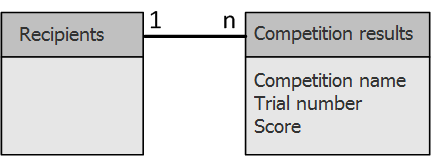

Un contact présent dans le tableau **[!UICONTROL Destinataires]** peut être associé à plusieurs lignes dans le tableau **[!UICONTROL Résultats jeux]**. La relation entre ces deux tables est de type 1-n. Voici un exemple des logs de résultats pour un destinataire :

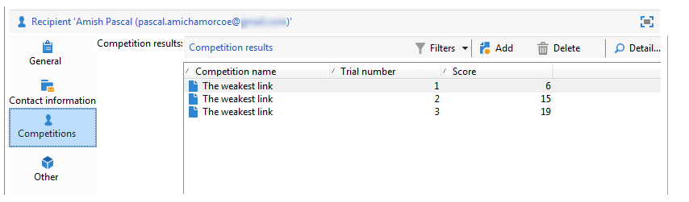

Ce cas pratique a pour but d’envoyer des diffusions personnalisées aux personnes ayant participé au dernier jeu-concours en fonction de leurs scores les plus élevés. Le destinataire ayant obtenu la meilleure note obtient le premier prix, le destinataire ayant obtenu la deuxième meilleure note obtient un prix de consolation et tous les autres reçoivent un message leur souhaitant une meilleure chance la prochaine fois.

Pour réaliser ce cas d&#39;utilisation, nous avons créé le workflow de ciblage suivant :

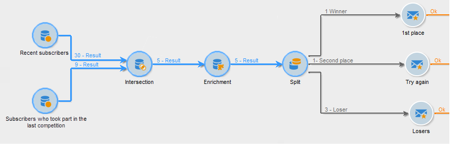

Les étapes principales de création du workflow sont les suivantes :

1. Deux activités de type **[!UICONTROL Requête]** et une **[!UICONTROL Intersection]** sont ajoutées afin de cibler les nouveaux abonnés qui ont participé au dernier jeu concours.
1. L’activité **[!UICONTROL Enrichissement]** permet d’ajouter des données stockées dans le tableau **[!UICONTROL Résultats jeux]**. Le champ **[!UICONTROL Score]** sur lequel la personnalisation de la diffusion sera effectuée est ajouté à la table de travail du workflow.
1. L’activité de type **[!UICONTROL Partage]**, permet de créer des sous-ensembles de destinataires selon le score qu’ils ont obtenu.
1. Pour chacun des sous-ensembles, une activité de **[!UICONTROL Diffusion]** est ajoutée.

## Etape 1 : Ciblage {#step-1--targeting}

La première requête permet de cibler les destinataires qui ont été ajoutés dans la base de données au cours des six derniers mois.

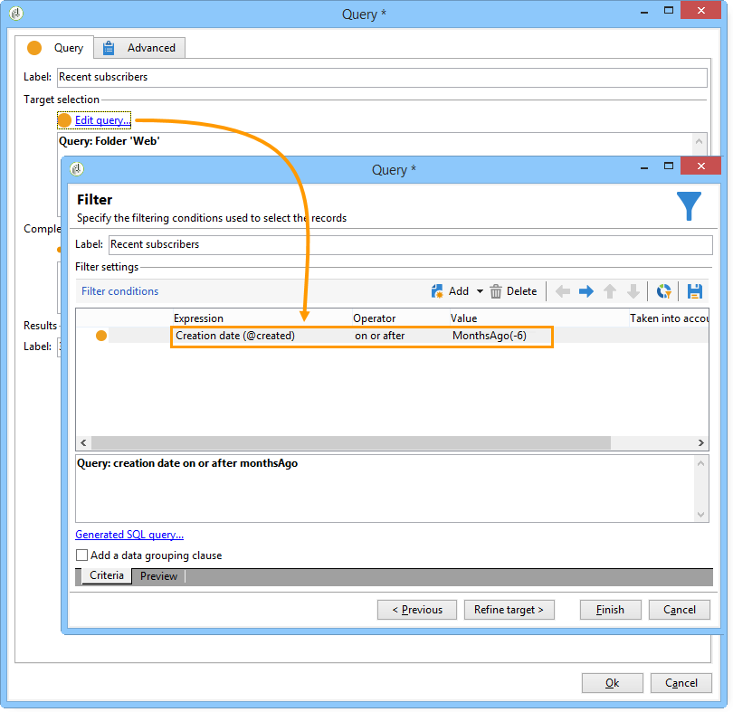

La seconde requête permet de cibler les destinataires ayant participé au dernier jeu.

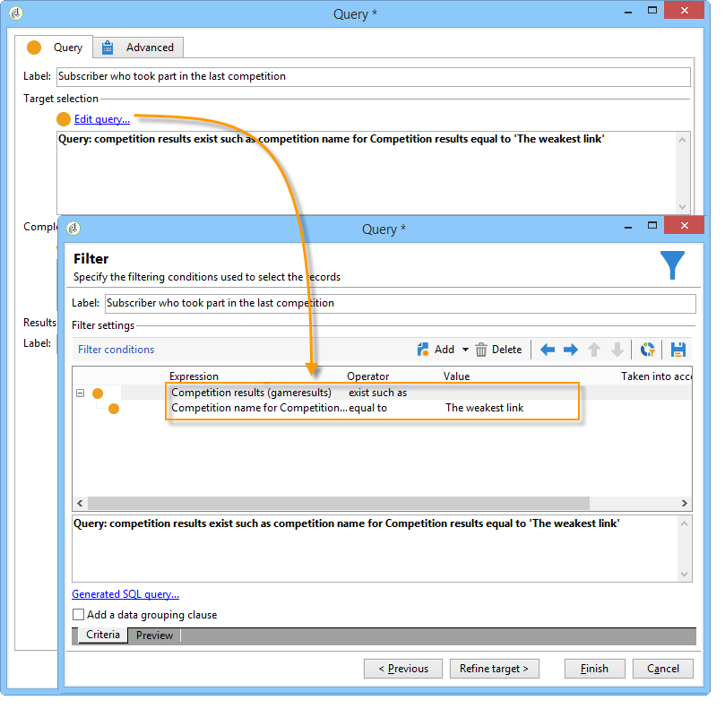

Une activité de type **[!UICONTROL Intersection]** est ensuite ajoutée pour cibler les destinataires qui ont été ajoutés dans la base de données au cours des six derniers mois et qui ont participé au dernier jeu.

## Etape 2 : Enrichissement {#step-2--enrichment}

Dans cet exemple, vous allez découvrir comment personnaliser les diffusions en fonction du champ **[!UICONTROL Score]**, stocké dans le tableau **[!UICONTROL Résultats jeux]**. Ce tableau a une relation de type 1-n avec la tableau des destinataires. L’activité **[!UICONTROL Enrichissement]** permet d’ajouter à la table de travail du workflow des données provenant d’une table associée à la dimension de filtrage.

1. Dans l’écran d’édition de l’activité d’enrichissement, sélectionnez **[!UICONTROL Ajouter des données]**, puis **[!UICONTROL Données liées]** à la dimension de filtrage, et cliquez sur **[!UICONTROL Suivant]**.

   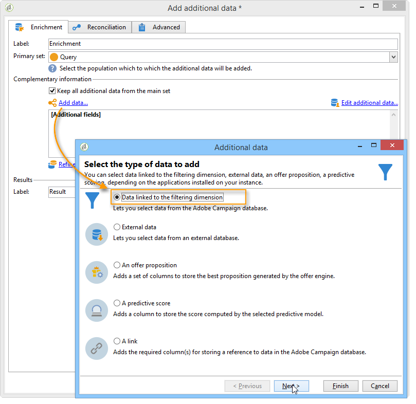

1. Choisissez ensuite l&#39;option **[!UICONTROL Données liées à la dimension de filtrage]**, sélectionnez la table **[!UICONTROL Résultats jeux]**, et cliquez sur **[!UICONTROL Suivant]**.

   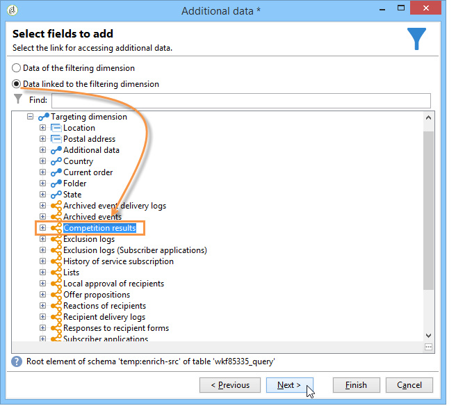

1. Saisissez un identifiant et un libellé, et choisissez l’option **[!UICONTROL Limiter le nombre de lignes]**, dans le champ **[!UICONTROL Données collectées]**. Dans le champ **[!UICONTROL Lignes à récupérer]**, choisissez la valeur « 1 ». Pour chaque destinataire, l’activité d’enrichissement ajoutera, à la table de travail du workflow, une seule ligne provenant de la table **[!UICONTROL Résultats jeux]**. Cliquez sur **[!UICONTROL Suivant]**.

   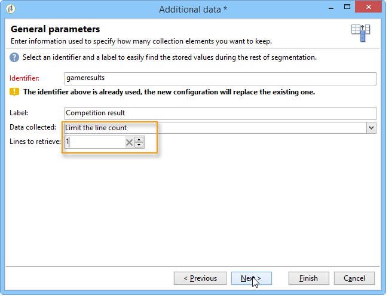

1. Dans notre exemple, nous souhaitons récupérer le meilleur score du destinataire, mais uniquement sur le dernier jeu. Pour cela, ajoutez un filtre sur le champ **[!UICONTROL Nom du jeu]** pour exclure toutes les lignes correspondant aux jeux précédents. Cliquez sur **[!UICONTROL Suivant]**.

   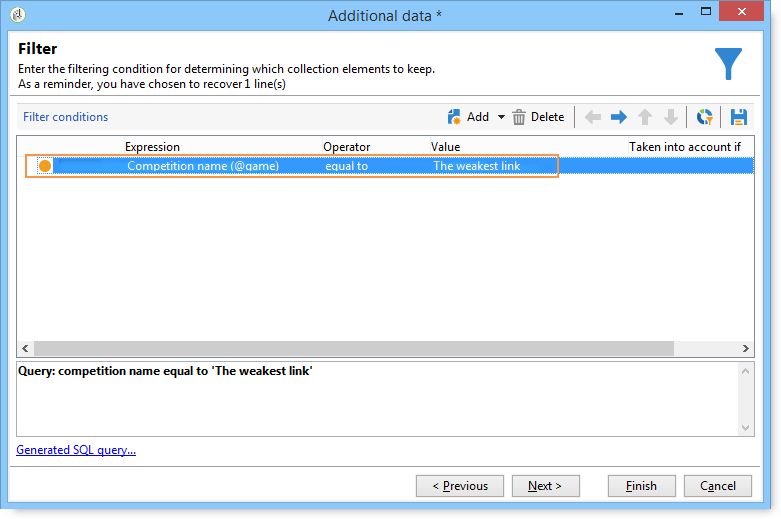

1. Dans l&#39;écran **[!UICONTROL Trier]**, cliquez sur le bouton **[!UICONTROL Ajouter]**, sélectionnez le champ **[!UICONTROL Score]** et cochez la case de la colonne **[!UICONTROL descendant]** pour trier les éléments des champs **[!UICONTROL Score]** par ordre décroissant. Pour chaque destinataire, l’activité d’enrichissement ajoute une ligne correspondant au score le plus élevé du dernier jeu. Cliquez sur **[!UICONTROL Suivant]**.

   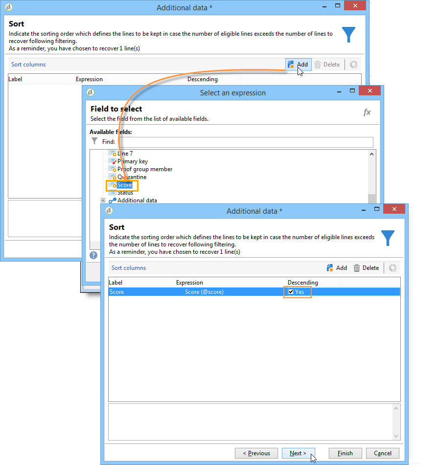

1. Dans l’écran **[!UICONTROL Données à ajouter]**, double-cliquez sur le champ **[!UICONTROL Score]**. Pour chaque destinataire, l’activité d’enrichissement ajoutera uniquement le champ **[!UICONTROL Score]**. Cliquez sur **[!UICONTROL Terminer]**.

   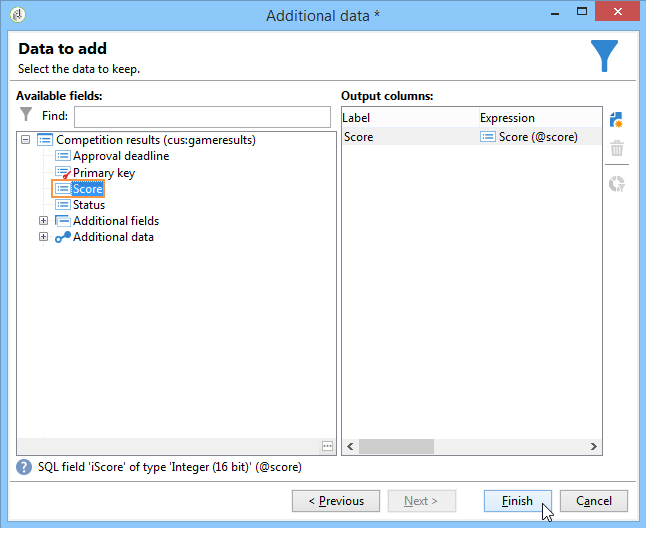

Cliquez avec le bouton droit sur la transition entrante de l&#39;activité d&#39;enrichissement et sélectionnez **[!UICONTROL Afficher la cible]**. La table de travail contient les données suivantes :

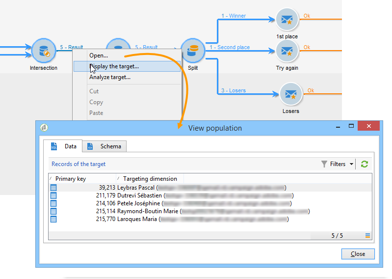

Le schéma associé est le suivant :

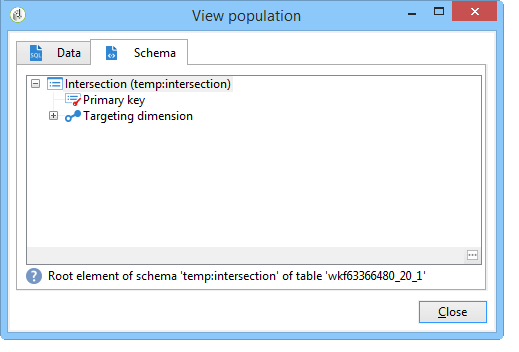

Renouvelez cette opération sur la transition sortante de l&#39;activité d&#39;enrichissement. Nous pouvons constater que les données liées aux scores des destinataires ont été ajoutées. Le score le plus élevé de chaque destinataire a été récupéré.

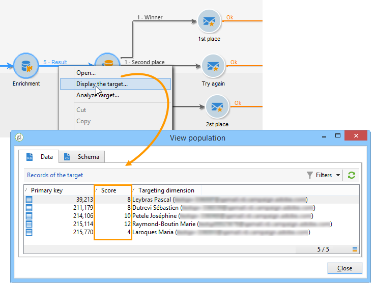

Le schéma correspondant a également été enrichi.

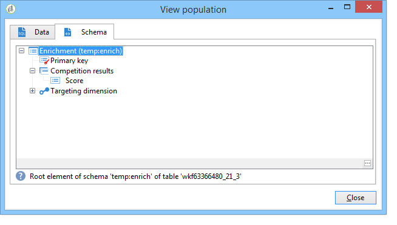

## Etape 3 : Partage et diffusions {#step-3--split-and-delivery}

Afin de répartir les destinataires en fonction de leur score, une activité de **[!UICONTROL Partage]** est ajoutée à la suite de l&#39;enrichissement.

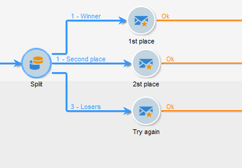

1. Un premier sous-ensemble (**gagnant**) a été défini pour inclure le destinataire ayant le score le plus élevé. Pour ce faire, définissez une limitation du nombre d’enregistrements, appliquez un tri décroissant au score et limitez le nombre d’enregistrements à 1.

   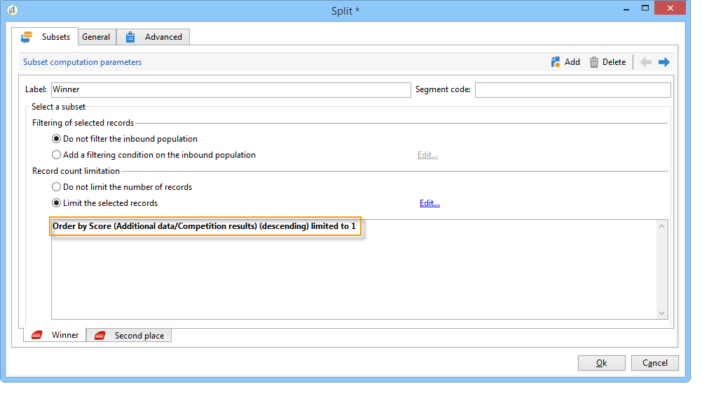

1. Le deuxième sous-ensemble (**deuxième place**) comprend le destinataire ayant le deuxième score le plus élevé. La configuration est la même que pour le premier sous-ensemble.

   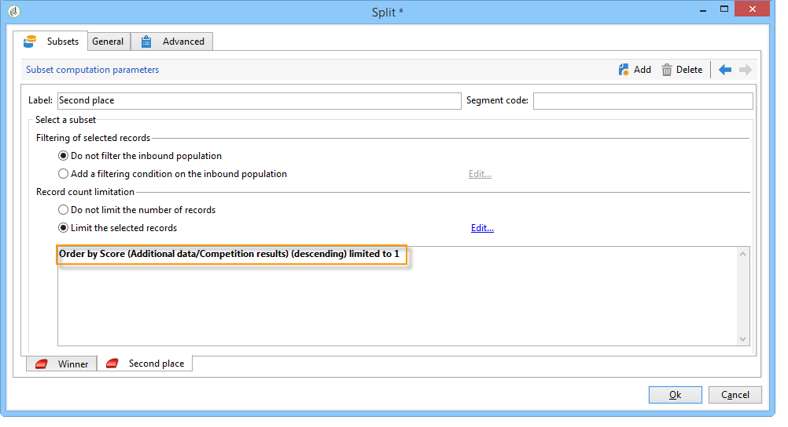

1. Le troisième sous-ensemble (**Perdants**) contient tous les autres destinataires. Dans l&#39;onglet **[!UICONTROL Général]**, cochez la case **[!UICONTROL Générer le complémentaire]** pour cibler tous les destinataires qui n&#39;ont pas obtenu les deux meilleurs scores.

   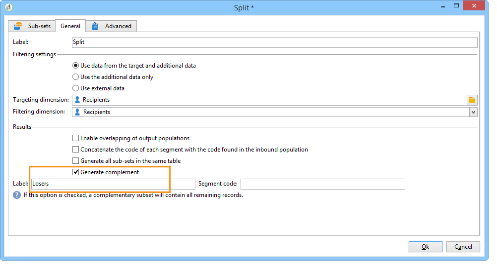

1. Pour chaque sous-ensemble, ajoutez une activité de type **[!UICONTROL Diffusion]**. Utilisez un modèle de diffusion différent pour chaque sous-ensemble.

   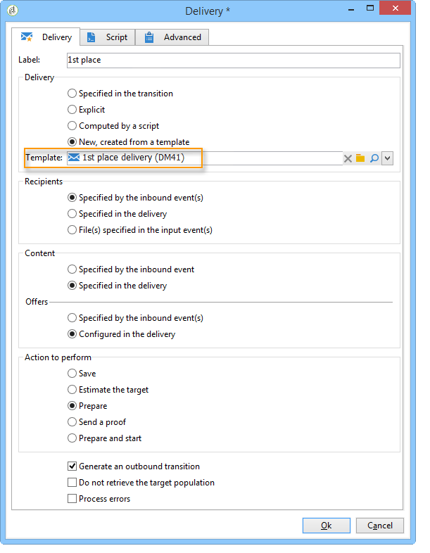
