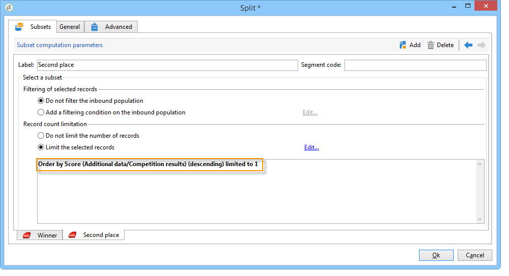

# Enrichir les données{#enriching-data}

## À propos de l&#39;enrichissement des données {#about-enriching-data}

Ce cas d’utilisation décrit les utilisations possibles de l’activité **[!UICONTROL Enrichissement]** dans un workflow de ciblage. Pour plus d’informations sur l’utilisation de l’activité **[!UICONTROL Enrichissement]**, voir la section : [Enrichissement](enrichment.md).

Vous trouverez également dans [cette section](email-enrichment-with-custom-date-fields.md) un cas pratique montrant comment enrichir une diffusion d’email avec des dates personnalisées.

Un jeu concours est proposé, par le biais d&#39;une application web, aux contacts de la base marketing. Les résultats du jeu concours sont récupérés dans la table **[!UICONTROL Résultats jeux]**. Cette table est liée à la table des contacts (**[!UICONTROL Destinataires]**). La table **[!UICONTROL Résultats jeux]** comporte les champs suivants :

* Nom du jeu (@game)
* Numéro de l&#39;essai (@trial)
* Score (@score)

Un même contact présent dans la table des **[!UICONTROL Destinataires]** peut être associé à plusieurs lignes dans la table **[!UICONTROL Résultats jeux]**. Le lien entre les deux tables est donc de type 1-n. Voici un exemple des logs de résultats pour un destinataire :

L&#39;objectif de ce cas d&#39;utilisation est d&#39;envoyer des diffusions personnalisées aux participants du dernier jeu concours en fonction du meilleur score qu&#39;ils ont obtenu au cours de leurs différents essais. Le participant qui a obtenu le meilleur score se voit offrir le 1er prix, celui qui a obtenu le second score reçoit un lot de consolation, et tous les autres reçoivent un message leur proposant de retenter leur chance lors du prochain jeu.

Pour réaliser ce cas d&#39;utilisation, nous avons créé le workflow de ciblage suivant :

Les étapes principales de création du workflow sont les suivantes :

1. Deux activités de type **[!UICONTROL Requête]** et une **[!UICONTROL Intersection]** sont ajoutées afin de cibler les nouveaux abonnés qui ont participé au dernier jeu concours.
1. L’activité **[!UICONTROL Enrichissement]** permet d’ajouter des données stockées dans le tableau **[!UICONTROL Résultats jeux]**. Le champ **[!UICONTROL Score]** sur lequel la personnalisation de la diffusion sera effectuée est ajouté au tableau de travail du workflow.
1. L’activité de type **[!UICONTROL Partage]**, permet de créer des sous-ensembles de destinataires selon le score qu’ils ont obtenu.
1. Pour chacun des sous-ensembles, une activité de **[!UICONTROL Diffusion]** est ajoutée.

## Étape 1 : Ciblage {#step-1--targeting}

La première requête permet de cibler les destinataires qui ont été ajoutés dans la base de données au cours des six derniers mois.

La seconde requête permet de cibler les destinataires ayant participé au dernier jeu.

Une activité de type **[!UICONTROL Intersection]** est ensuite ajoutée pour cibler les destinataires qui ont été ajoutés dans la base de données au cours des six derniers mois et qui ont participé au dernier jeu.

## Etape 2 : Enrichissement {#step-2--enrichment}

Dans cet exemple, vous allez découvrir comment personnaliser les diffusions en fonction du champ **[!UICONTROL Score]**, stocké dans le tableau **[!UICONTROL Résultats jeux]**. Ce tableau a une relation de type 1-n avec la tableau des destinataires. L’activité **[!UICONTROL Enrichissement]** permet d’ajouter au tableau de travail du workflow des données provenant d’un tableau associé à la dimension de filtrage.

1. Dans l’écran d’édition de l’activité d’enrichissement, sélectionnez **[!UICONTROL Ajouter des données]**, puis **[!UICONTROL Données liées]** à la dimension de filtrage, et cliquez sur **[!UICONTROL Suivant]**.

   

1. Choisissez ensuite l&#39;option **[!UICONTROL Données liées à la dimension de filtrage]**, sélectionnez la table **[!UICONTROL Résultats jeux]**, et cliquez sur **[!UICONTROL Suivant]**.

   

1. Saisissez un identifiant et un libellé, et choisissez l’option **[!UICONTROL Limiter le nombre de lignes]**, dans le champ **[!UICONTROL Données collectées]**. Dans le champ **[!UICONTROL Lignes à récupérer]**, choisissez la valeur « 1 ». Pour chaque destinataire, l’activité d’enrichissement ajoutera, à la table de travail du workflow, une seule ligne provenant de la table **[!UICONTROL Résultats jeux]**. Cliquez sur **[!UICONTROL Suivant]**.

   

1. Dans notre exemple, nous souhaitons récupérer le meilleur score du destinataire, mais uniquement sur le dernier jeu. Pour cela, ajoutez un filtre sur le champ **[!UICONTROL Nom du jeu]** pour exclure toutes les lignes correspondant aux jeux précédents. Cliquez sur **[!UICONTROL Suivant]**.

   

1. Dans l’écran **[!UICONTROL Tri]**, cliquez sur le bouton **[!UICONTROL Ajouter]**, sélectionnez le champ **[!UICONTROL Score]** et cochez la case dans la colonne **[!UICONTROL Descendant]** afin d’effectuer un tri descendant sur le champ **[!UICONTROL Score]**. Pour chaque destinataire, l’activité d’enrichissement ajoutera la ligne correspondant au meilleur score réalisé, sur le dernier jeu. Cliquez sur **[!UICONTROL Suivant]**. 

   

1. Dans l’écran **[!UICONTROL Données à ajouter]**, double-cliquez sur le champ **[!UICONTROL Score]**. Pour chaque destinataire, l’activité d’enrichissement ajoutera uniquement le champ **[!UICONTROL Score]**. Cliquez sur **[!UICONTROL Terminer]**.

   

Cliquez, avec le bouton droit de la souris sur la transition entrante de l’activité d’enrichissement, et sélectionnez **[!UICONTROL Afficher la cible]**. La table de travail contient les données suivantes :

Le schéma associé est le suivant :

Renouvelez cette opération sur la transition sortante de l’activité d’enrichissement. Vous pouvez constater que les données relatives au score des destinataires ont été ajoutées. Pour chaque destinataire, le score le plus élevé a bien été récupéré.

Le schéma correspondant a également été enrichi.

## Etape 3 : Partage et diffusions {#step-3--split-and-delivery}

Afin de répartir les destinataires en fonction de leur score, une activité de **[!UICONTROL Partage]** est ajoutée à la suite de l&#39;enrichissement.

1. Un premier sous-ensemble (**Gagnant**), a été défini pour inclure le destinataire ayant obtenu le meilleur score. Pour cela, définissez une limitation du nombre d&#39;enregistrements, appliquez un tri descendant sur le score, et limitez le nombre d&#39;enregistrements à 1.

   

1. Le second sous-ensemble (**Second**), inclut le destinataire ayant obtenu le second meilleur score. Le paramétrage est le même que pour le premier sous-ensemble.

   

1. Le troisième sous-ensemble (**Perdants**) contient tous les autres destinataires. Dans l&#39;onglet **[!UICONTROL Général]**, cochez la case **[!UICONTROL Générer le complémentaire]** pour cibler tous les destinataires qui n&#39;ont pas obtenu les deux meilleurs scores.

   

1. Pour chaque sous-ensemble, ajoutez une activité de type **[!UICONTROL Diffusion]**. Utilisez un modèle de diffusion différent pour chaque sous-ensemble.

   
