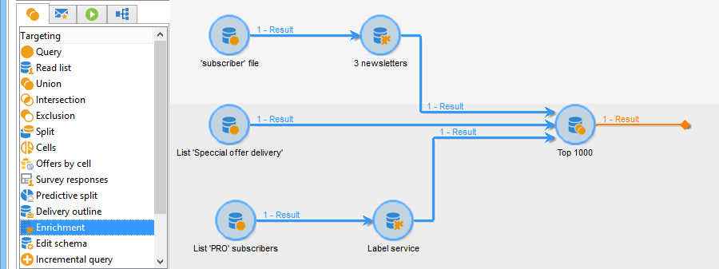
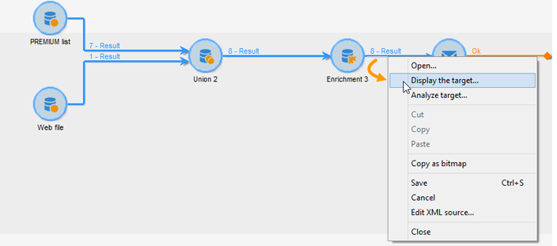

# Enrichissement{#enrichment}


L&#39;activité **[!UICONTROL Enrichissement]** permet d&#39;ajouter des informations à une liste de profils et des liens vers une table existante (créer une nouvelle jointure). Des critères de réconciliation avec des profils en base peuvent aussi être définis.



## Définitions {#definitions}

Pour utiliser l’activité d’enrichissement, il est important de connaître les différentes possibilités offertes lors de l’ajout de données.


L&#39;option **[!UICONTROL Données liées à la dimension de filtrage]** vous donne accès aux :

* Données de la dimension de filtrage : accès aux données de la table de travail.
* Données liées à la dimension de filtrage : accès aux données liées à la table de travail.


L&#39;option **[!UICONTROL Un lien]** permet de créer une jointure sur n&#39;importe quelle table de la base de données.


Il existe quatre types de liens :

* **[!UICONTROL Définir une collection]** : permet de définir un lien avec une cardinalité 1-N entre les tables.
* **[!UICONTROL Définir un lien dont la cible est toujours présente]** : permet de définir un lien avec une cardinalité 1-1 entre les tables. La condition de jointure doit être définie par un seul enregistrement dans la table cible.
* **[!UICONTROL Définir un lien dont la cible peut ne pas exister dans la base]** : permet de définir un lien avec une cardinalité 0-1 entre les tables. La condition de jointure doit être définie par 0 ou 1 enregistrement maximum dans la table cible.

  Cette option est configurée dans l&#39;onglet **[!UICONTROL Jointure Simple]**, accessible par le lien **[!UICONTROL Editer les données additionnelles]** de l&#39;activité **[!UICONTROL Enrichissement]**.

* **[!UICONTROL Définir un lien en recherchant une référence parmi plusieurs possibilités]** : ce type de lien définit une réconciliation vers un enregistrement unique. Adobe Campaign crée un lien vers une table cible en ajoutant une clef étrangère dans la table cible permettant de stocker une référence vers l&#39;enregistrement unique.

  Cette option est configurée dans l&#39;onglet **[!UICONTROL Réconciliation &amp; déduplication]**, accessible par le lien **[!UICONTROL Editer les données additionnelles]** de l&#39;activité **[!UICONTROL Enrichissement]**.

Les cas d’utilisation détaillant le fonctionnement des activités d’enrichissement dans leur contexte sont également disponibles dans les sections suivantes :

* [Enrichissement des emails avec des champs de date personnalisés](email-enrichment-with-custom-date-fields.md).
* [Enrichir des données ](enrich-data.md)
* [Créer une liste récapitulative](create-a-summary-list.md)

## Ajouter des informations {#adding-information}

Utilisez l&#39;activité **[!UICONTROL Enrichissement]** pour ajouter des données additionnelles à la table de travail du workflow : cette activité peut être utilisée en complément d&#39;une activité de requête.

Le paramétrage des colonnes additionnelles est présenté dans la section [Ajouter des données](query.md#adding-data).

Le champ **[!UICONTROL Ensemble principal]** permet de sélectionner la transition entrante : ce sont les données de la table de travail de cette activité qui seront enrichies.

Cliquez sur le lien **[!UICONTROL Ajouter des données]** et sélectionnez le type de données à ajouter. La liste des types de données proposés dépend des modules et options installés sur votre plateforme. Dans une configuration minimale, vous pouvez toujours ajouter des données liées à la dimension de filtrage et un lien.


Dans l&#39;exemple ci-dessous, la transition sortante sera enrichie avec les informations relatives à l&#39;âge des profils ciblés.


Cliquez avec le bouton droit sur la transition entrante de l’activité d’enrichissement pour visualiser les données avant l’étape d’enrichissement.


La table de travail contient les données suivantes et le schéma associé :


Renouvelez cette opération en sortie de l&#39;étape d&#39;enrichissement.



Vous pouvez constater que les données relatives à l&#39;âge des profils ont été ajoutées :


Le schéma correspondant a également été enrichi.

## Gérer les données additionnelles {#managing-additional-data}

Décochez l’option **[!UICONTROL Conserver toutes les données additionnelles de l’ensemble principal]** si vous ne souhaitez pas conserver les données additionnelles définies précédemment dans l’activité de requête. Dans ce cas, seules les colonnes additionnelles sélectionnées dans l’activité d’enrichissement seront ajoutées à la table de travail en sortie. Les informations supplémentaires ajoutées au niveau des activités en amont ne seront pas conservées. 


Les données et le schéma en sortie de l&#39;étape d&#39;enrichissement seront alors les suivants :


## Créer un lien {#creating-a-link}

Vous pouvez utiliser l’activité d’enrichissement pour créer un lien entre les données de travail et les données de la base Adobe Campaign : il s’agira d’un lien local au workflow entre les données entrantes.

Par exemple, si vous chargez les données d&#39;un fichier contenant le numéro de compte, le pays et l&#39;email des destinataires, vous devez créer un lien vers la table des pays afin de mettre à jour cette information dans leur profil.

Pour cela, les étapes sont les suivantes :

1. Collectez et chargez un fichier de type :

   ```
   Account number;Country;Email
   18D65;FRANCE;agnes@gmail.com
   243PP;RUSSIA;paul@gmail.com
   55H87;CROATIA;dave@gmail.com
   56U81;USA;susan@gmail.com
   853PI;ITALY;anna@gmail.com
   890LP;FRANCE;robert@gmail.com
   83TY2;SWITZERLAND;mike@gmail.com
   ```

1. Modifiez l’activité d’enrichissement et cliquez sur le lien **Ajouter des données…** pour créer une jointure avec la table des Pays.

   

1. Sélectionnez la variable **[!UICONTROL Définition de lien]** et cliquez sur l’option **[!UICONTROL Suivant]** bouton . Indiquez le type de lien à créer. Dans cet exemple, nous allons réconcilier le pays du destinataire du fichier avec un pays dans la liste des pays disponibles de la table dédiée de la base de données. Choisissez la **[!UICONTROL Définir un lien en recherchant une référence parmi plusieurs options]** . Sélectionnez le tableau des pays dans la **[!UICONTROL Schéma cible]** champ .

   

1. Sélectionnez enfin le ou les champs qui permettront d&#39;associer les valeurs du fichier source avec celles de la base de données.

   

En sortie de cette activité d’enrichissement, le schéma temporaire contiendra le lien vers la table des pays :


## Réconciliation des données {#data-reconciliation}

L&#39;activité d&#39;enrichissement peut être utilisée pour paramétrer la réconciliation des données, y compris une fois les données chargées dans la base. Dans ce cas, la variable **[!UICONTROL Réconciliation]** vous permet de définir le lien entre les données de la base Adobe Campaign et les données de la table de travail.

Sélectionnez l&#39;option **[!UICONTROL Identifier le document de ciblage à partir des données de travail]** et indiquez le schéma vers lequel vous souhaitez faire le lien et indiquez les conditions de jointure : pour cela, sélectionnez les champs à réconcilier dans les données de travail (**[!UICONTROL Expression source]**) et dans la dimension de ciblage (**[!UICONTROL Expression destination]**).

Vous pouvez utiliser un ou plusieurs critères de réconciliation.


Si plusieurs conditions de jointure sont indiquées, elles doivent TOUTES être vérifiées pour que le lien entre les données puisse se faire.

## Insérer une proposition d&#39;offre {#inserting-an-offer-proposition}

L’activité d’enrichissement vous permet d’ajouter des offres ou des liens vers des offres pour les destinataires d’une diffusion.

Pour plus d’informations sur l’activité d’enrichissement, consultez cette [section](enrichment.md).

Vous pouvez par exemple enrichir les données d&#39;une requête sur les destinataires, avant une diffusion.


Après avoir paramétré votre requête (voir cette [section](query.md)) :

1. Placez et ouvrez une activité d’enrichissement.
1. Dans l&#39;onglet **[!UICONTROL Enrichissement]**, sélectionnez **[!UICONTROL Ajouter des données]**.
1. Sélectionnez **[!UICONTROL Une proposition d&#39;offre]** dans les types de données à ajouter.

   

1. Indiquez un identifiant ainsi qu&#39;un libellé pour la proposition qui sera ajoutée.
1. Définissez la sélection de l&#39;offre. Deux options sont possibles :

   * **[!UICONTROL Rechercher la meilleure offre dans une catégorie]**: cochez cette option et définissez les paramètres d&#39;appel au moteur d&#39;offres (emplacement, catégorie ou thème(s), date de contact, nombre d&#39;offres à conserver). Le moteur calculera automatiquement la ou les offres à ajouter en fonction de ces paramètres. Nous vous recommandons de terminer l’une des opérations suivantes : **[!UICONTROL Catégorie]** ou le **[!UICONTROL Thème]** , plutôt que les deux en même temps.

     

   * **[!UICONTROL Une offre prédéfinie]** : cochez cette option et définissez un emplacement, une offre précise, ainsi qu&#39;une date de contact afin de directement paramétrer l&#39;offre que vous souhaitez ajouter, sans appeler le moteur d&#39;offres.

     

1. Paramétrez ensuite une activité de diffusion correspondant au canal de votre choix. Voir [Diffusions cross-canal](cross-channel-deliveries.md).

   Le nombre de propositions disponibles pour la prévisualisation dépend du paramétrage réalisé dans l’activité d’enrichissement et non d’un éventuel paramétrage directement dans la diffusion.

Pour spécifier des propositions d’offres, vous pouvez également choisir de référencer un lien vers une offre. Voir à ce sujet la section [Référencer un lien vers une offre](#referencing-a-link-to-an-offer).

## En référençant un lien vers une offre {#referencing-a-link-to-an-offer}

Vous avez également la possibilité de référencer un lien vers une offre dans une activité d’enrichissement.

Pour cela :

1. Dans l&#39;onglet **[!UICONTROL Enrichissement]** de l&#39;activité, sélectionnez **[!UICONTROL Ajouter des données]**.
1. Dans la fenêtre de sélection du type de données à ajouter, choisissez **[!UICONTROL Un lien]**.
1. Sélectionnez le type du lien que vous souhaitez établir ainsi que sa cible. Dans le cas présent, la cible est le schéma des offres.

   

1. Définissez la jointure entre les données de la table entrante dans l’activité d’enrichissement (ici la table des destinataires) et la table des offres. Vous pouvez par exemple associer un code offre à un destinataire.

   

1. Paramétrez ensuite une activité de diffusion correspondant au canal de votre choix. Pour plus d&#39;informations, consultez la section [Diffusions cross-canal](cross-channel-deliveries.md).

   >[!NOTE]
   >
   >Le nombre de propositions disponibles pour la prévisualisation dépend du paramétrage réalisé dans la diffusion.

## Stocker le rang et le poids des offres {#storing-offer-rankings-and-weights}

Par défaut, lorsque l&#39;activité d&#39;**enrichissement** est utilisée pour diffuser des offres, leur rang ainsi que leur poids ne sont pas stockés dans la table des propositions.

L&#39;activité **[!UICONTROL Moteur d&#39;offres]** stocke bien ces informations par défaut.

Cependant, il est possible de stocker ces informations de la manière suivante :

1. Créez un appel au moteur d’offre dans une activité d’enrichissement placée après une requête et avant une activité de diffusion.
1. Dans la fenêtre principale de l&#39;activité, sélectionnez **[!UICONTROL Editer les données additionnelles]**.

   

1. Ajoutez les colonnes **[!UICONTROL @rank]** pour le rang et **[!UICONTROL @weight]** pour le poids des offres.

   

1. Validez votre ajout et enregistrez votre workflow.

La diffusion stocke automatiquement le rang et le poids des offres. Ces informations sont visibles dans le **[!UICONTROL Offres]** .
