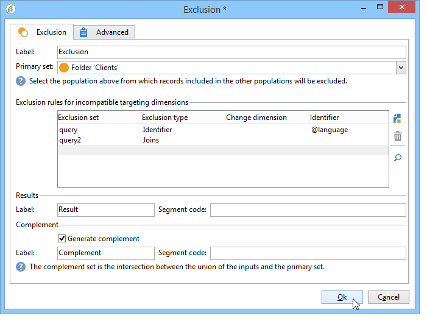
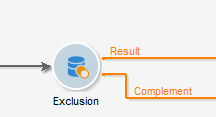
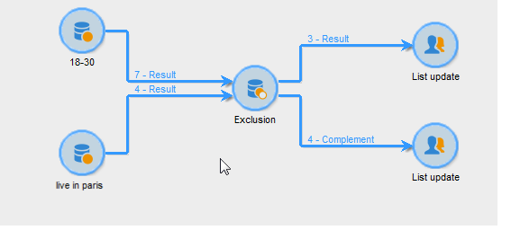

# Exclusion{#exclusion}

Une activité de type **Exclusion** crée une cible à partir d&#39;une cible principale dont on extrait une ou plusieurs autres cibles.

Pour paramétrer cette activité, vous devez saisir son libellé et sélectionner l&#39;ensemble principal : la population de l&#39;ensemble principal permet de construire le résultat. Les profils partagés par l’ensemble principal et au moins une des activités d’entrée seront exclus.

>[!NOTE]
>
>Pour plus d’informations sur la configuration et l’utilisation de l’activité d’exclusion, voir [Exclure une population (Exclusion)](targeting-workflows.md#excluding-a-population--exclusion-).

Cochez l&#39;option **[!UICONTROL Générer le complémentaire]** si vous souhaitez exploiter la population restante. Le complémentaire contiendra la population principale entrante, moins la population sortante. Une transition sortante supplémentaire sera alors ajoutée à l’activité, comme suit :

## Exemples d&#39;exclusion {#exclusion-examples}

L&#39;exemple suivant cherche à constituer une liste des destinataires dont l&#39;âge est compris entre 18 et 30 ans, mais en y excluant les habitants de Paris.

1. Insérez et ouvrez une activité de type **[!UICONTROL Exclusion]** suite à deux requêtes. La première requête cible les destinataires résidant à Paris. La deuxième requête cible les 18 à 30 ans.
1. Indiquez l&#39;ensemble principal. Ici, l&#39;ensemble principal est la requête **18-30 ans**. Les éléments appartenant au second ensemble seront exclus du résultat final.
1. Cochez l&#39;option **[!UICONTROL Générer le complémentaire]** si vous souhaitez exploiter les données qui restent après l&#39;exclusion. Dans ce cas, le complément est constitué de destinataires âgés de 18 à 30 ans qui vivent à Paris.
1. Validez la configuration des exclusions, puis insérez une activité de mise à jour de liste dans le résultat. Vous pouvez également insérer une mise à jour de liste supplémentaire dans le complémentaire si nécessaire.
1. Exécutez le workflow. Dans cet exemple, le résultat est constitué de destinataires âgés de 18 à 30 ans, mais ceux qui vivent à Paris sont exclus et envoyés au complémentaire.

   

## Paramètres d&#39;entrée {#input-parameters}

* tableName
* schéma

Chacun des événements entrants doit spécifier une cible définie par ces paramètres.

## Paramètres de sortie {#output-parameters}

* tableName
* schéma
* recCount

Ce triplet de valeurs identifie la cible résultant de l&#39;exclusion. **[!UICONTROL tableName]** est le nom de la table qui enregistre les identifiants de la cible, **[!UICONTROL schema]** est le schéma de la population (généralement nms:recipient) et **[!UICONTROL recCount]** est le nombre d’éléments dans la table.

La transition associée au complément possède les mêmes paramètres.
