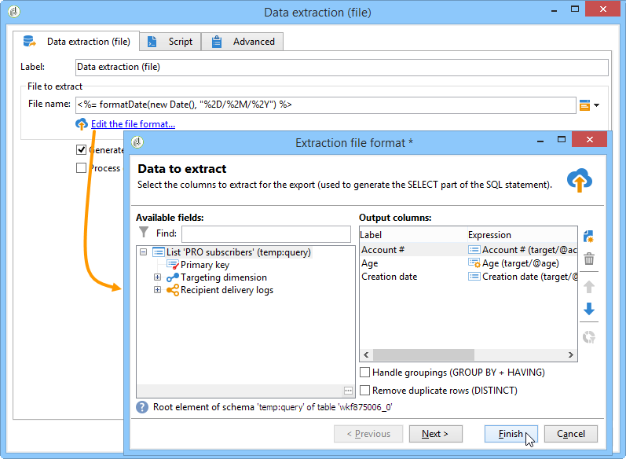
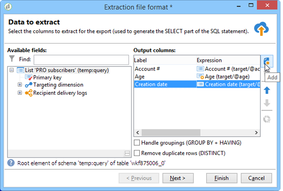
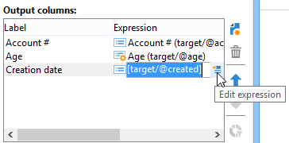
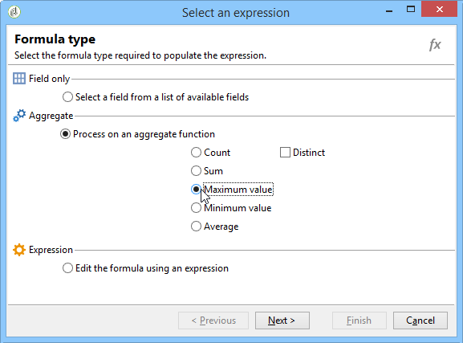
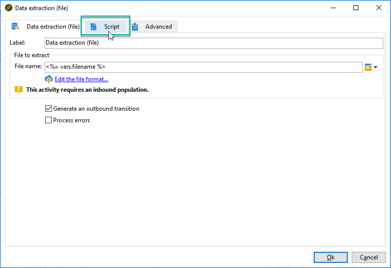

# Extraction (fichier){#extraction-file}

Vous pouvez extraire les données d&#39;une table de workflow dans un fichier externe en utilisant l&#39;activité **[!UICONTROL Extraction (fichier)]**.

>[!CAUTION]
>
>Cette activité doit toujours avoir une transition entrante qui contient les données à extraire.

Pour paramétrer l&#39;extraction des données, les étapes sont les suivantes :

1. Indiquez le nom du fichier de sortie : ce nom peut contenir des variables, insérées à partir du bouton de personnalisation situé à droite du champ.
1. Cliquez sur **[!UICONTROL Editer le format du fichier...]** pour sélectionner les données à extraire.

   

   L’option **[!UICONTROL Gérer les groupements (GROUP BY + HAVING)]** ajoute une étape supplémentaire afin de filtrer sur le résultat final de l’agrégat, par exemple sur tel type de bon de commande, sur les clientes et clients ayant passé plus de 10 commandes, etc.

1. Au besoin, vous pouvez ajouter de nouvelles colonnes dans le fichier de sortie, comme résultat de calculs ou de traitement sur les données. Pour ce faire, cliquez sur l’icône **[!UICONTROL Ajouter]**.

   

   Dans la ligne supplémentaire, cliquez sur l&#39;icône **[!UICONTROL Modifier l’expression]** pour définir le contenu de la nouvelle colonne.

   

   Vous accédez alors à la fenêtre de sélection. Cliquez sur **[!UICONTROL Sélection avancée]** pour choisir le processus à appliquer aux données.

   

   Sélectionnez la formule souhaitée dans la liste.

   

Vous pouvez définir un post-traitement à exécuter pendant l’extraction des données, ce qui vous permet de compresser ou de chiffrer les fichiers. Pour ce faire, la commande souhaitée doit être ajoutée dans l’onglet **[!UICONTROL Script]** de l’activité.

## Liste des fonctions d&#39;agrégats {#list-of-aggregate-functions}

Les fonctions d&#39;agrégat disponibles sont les suivantes :

* **[!UICONTROL Comptage]** pour compter toutes les valeurs non nulles du champ à agréger, y compris les valeurs en double (du champ agrégé),

  **[!UICONTROL Comptage distinct]** pour compter le nombre total de valeurs différentes et non nulles du champ à agréger (les valeurs en double sont éliminées avant le calcul),

* **[!UICONTROL Somme]** pour calculer la somme des valeurs d&#39;un champ numérique,
* **[!UICONTROL Minimum]** pour calculer le minimum des valeurs d&#39;un champ (numérique ou non),
* **[!UICONTROL Maximum]** pour calculer le maximum des valeurs d&#39;un champ (numérique ou non),
* **[!UICONTROL Moyenne]** pour calculer la moyenne des valeurs d&#39;un champ numérique.
