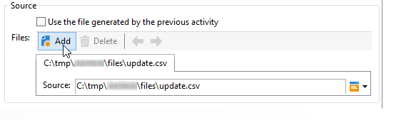

# Envoi de fichier{#file-transfer}

L&#39;activité **Transfert de fichier** permet de recevoir ou d&#39;envoyer des fichiers, de tester la présence de fichiers ou de répertorier les fichiers sur un serveur. Le protocole utilisé est le suivant : stockage Blob Azure, S3 (Amazon Simple Storage Service), FTP ou SFTP.
Avec la connexion SFTP, S3, ou stockage Blob Azure, vous pouvez également importer des données de segments vers Adobe Campaign avec la plateforme de données clientes en temps réel d&#39;Adobe. Pour plus d’informations, consultez cette [documentation](https://experienceleague.adobe.com/docs/experience-platform/destinations/catalog/email-marketing/adobe-campaign.html?lang=fr){target="_blank"}.

## Propriétés {#properties}

Utilisez la liste déroulante du champ **[!UICONTROL Action]** pour sélectionner l&#39;action de l&#39;activité.

Le paramétrage dépend de l&#39;action sélectionnée.

1. **Réception de fichier**

   Pour recevoir des fichiers stockés sur un serveur distant, sélectionnez l&#39;option **[!UICONTROL Réception de fichier]** dans le champ **[!UICONTROL Action]**. Vous devez en indiquer l&#39;URL dans le champ correspondant.

   

   Cochez **[!UICONTROL Utiliser un compte externe]** pour sélectionner un compte à partir du nœud de stockage Blob Azure, S3, FTP ou SFTP configuré dans le nœud **[!UICONTROL Administration > Plateforme > Comptes externes]** de l&#39;arborescence. Indiquez ensuite le répertoire sur le serveur contenant le ou les fichiers à télécharger.

   

1. **Transfert de fichier**

   Pour envoyer un fichier à un serveur, sélectionnez **[!UICONTROL Chargement de fichier]** dans le champ **[!UICONTROL Action]**. Vous devez spécifier le serveur cible dans la section **[!UICONTROL Serveur distant]** de l’éditeur. Les paramètres sont les mêmes que pour les fichiers entrants. Voir ci-dessus.

   Le fichier source peut provenir de l’activité précédente. Dans ce cas, l’option **[!UICONTROL Utiliser le fichier généré par l’activité précédente]** doit être sélectionnée.

   

   Cela peut également concerner un ou plusieurs autres fichiers. Pour les sélectionner, décochez l’option, puis cliquez sur **[!UICONTROL Insérer]**. Spécifiez le chemin d’accès du fichier à envoyer. Pour ajouter un autre fichier, cliquez à nouveau sur **[!UICONTROL Insérer]**. Désormais, les fichiers disposent chacun de leur propre onglet.

   

   Utilisez les flèches pour modifier l&#39;ordre des onglets. Il correspond à l&#39;ordre d&#39;envoi des fichiers au serveur.

   L&#39;option **[!UICONTROL Garder un historique des fichiers envoyés]** permet de conserver une trace des envois effectués. Cet historique est accessible dans le répertoire.

1. **Test d&#39;existence de fichier**

   Pour tester l’existence d’un fichier, sélectionnez l’option **[!UICONTROL Test d’existence de fichier]** dans le champ **[!UICONTROL Action]**. La configuration du serveur distant est la même que pour le téléchargement de fichiers. Pour plus d’informations, consultez cette [section](#properties).

   

1. **Listage des fichiers**

   Pour lister les fichiers, sélectionnez l’option **[!UICONTROL Listage de fichiers]** dans le champ **[!UICONTROL Action]**. La configuration du serveur distant est la même que pour la réception de fichiers. Pour plus d&#39;informations, consultez cette [section](#properties).

   L’option **[!UICONTROL Lister tous les fichiers]**, disponible lors de la sélection de l’action **[!UICONTROL Listage de fichiers]** permet de répertorier tous les fichiers présents sur le serveur dans la variable d’événement **vars.filenames**. Les noms des fichiers y sont séparés par les caractères `\n`.

Pour toutes les actions de transfert de fichiers, deux options peuvent être sélectionnées :

* L’option **[!UICONTROL Traiter l’absence de fichier]** ajoute une transition qui sera activée en cas d’absence de fichier dans le répertoire spécifié.
* L’option **[!UICONTROL Traiter les erreurs]** est présentée dans la section [Traiter les erreurs](monitor-workflow-execution.md#processing-errors).

Le lien **[!UICONTROL Paramètres avancés...]** permet d&#39;accéder aux options suivantes :

* **[!UICONTROL Effacer les fichiers source après leur transfert]**.

  Efface les fichiers sur le serveur distant. Si vous ne cochez pas cette option, veillez à surveiller manuellement la taille du contenu archivé dans le répertoire SFTP.

* **[!UICONTROL Utiliser SSL]**

  Permet d&#39;utiliser une connexion sécurisée via le protocole SSL lors des transferts de fichier.

* **[!UICONTROL Afficher les logs de la session]**

  Permet de récupérer les logs du stockage Blob Azure, S3, du transfert FTP ou SFTP et de les inclure dans les logs de workflow.

* **[!UICONTROL Désactiver le mode passif]**.

  Permet d&#39;indiquer le port de connexion à utiliser pour le transfert des données.

Le lien **[!UICONTROL Paramètres d’historisation des fichiers...]** permet d’accéder aux options présentées dans la section [Téléchargement Web](web-download.md) (étape **[!UICONTROL Historisation des fichiers]**).

## Paramètres d&#39;entrée {#input-parameters}

* filename

  Nom complet du fichier envoyé.

## Paramètres de sortie {#output-parameters}

* filename

  Nom complet du fichier reçu lorsque l&#39;option **[!UICONTROL Utiliser le fichier généré par l&#39;activité précédente]** est sélectionnée.
