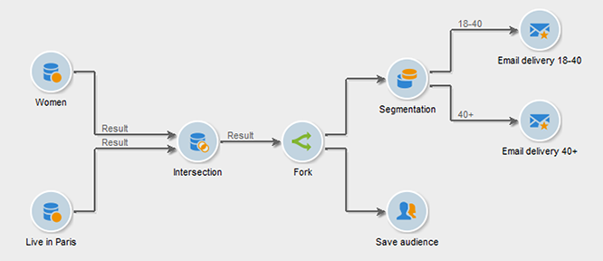

# Branchement{#fork}

Vous pouvez utiliser l’activité **[!UICONTROL Branchement]** pour créer plusieurs transitions sortantes et exécuter plusieurs activités indépendamment au sein d’un même workflow.

>[!IMPORTANT]
>
>Les transitions sortantes que vous ajoutez après une activité **[!UICONTROL Branchement]** ne s’exécutent pas simultanément. Ce comportement peut avoir un impact sur les performances du workflow. Utilisez l’activité **[!UICONTROL Branchement]** si vous devez exécuter plusieurs activités indépendamment. Vous pouvez éventuellement relier les activités sortantes avant la partie suivante du workflow.

Pour configurer une activité **[!UICONTROL Branchement]** et ses activités associées, procédez comme suit :

1. Ouvrez l’activité **[!UICONTROL Branchement]** et définissez le nom et le libellé des transitions sortantes.

   

1. Ouvrez chaque transition sortante et configurez-la.
1. Si vous le souhaitez, ajoutez une activité AND-join pour relier les transitions sortantes. [En savoir plus](and-join.md).

   La partie suivante du workflow s’exécute uniquement à la fin des transitions sortantes reliées.

## Exemple : segmentation

Dans cet exemple, différents e-mails sont envoyés à différents groupes de population. Une activité **[!UICONTROL Branchement]** est utilisée après une requête pour effectuer deux actions en parallèle :

* Enregistrer le résultat de la requête
* Segmenter le résultat pour envoyer plusieurs diffusions

  

Le workflow comprend les activités suivantes :

1. Activité **[!UICONTROL Requête]**

   Deux groupes de population sont sélectionnés : femmes et Parisiennes.

1. Activité **[!UICONTROL Intersection]**

   L’intersection des résultats de la requête, c’est-à-dire les femmes parisiennes, est sélectionnée.

1. Activité **[!UICONTROL Branchement]**

   La population calculée est enregistrée et, en parallèle, segmentée en deux groupes :

   1. Parisiennes de 18 à 40 ans
   1. Parisiennes de plus de 40 ans

1. Activité **[!UICONTROL Diffusion]**

   Un e-mail différent est envoyé à chaque groupe de population.

## Cas d’utilisation : envoyer un e-mail d’anniversaire

Un e-mail récurrent est envoyé à une liste de destinataires le jour de leur anniversaire. Une activité **[!UICONTROL Branchement]** est utilisée pour inclure les destinataires nés un 29 février sur une année bissextile. [En savoir plus](send-a-birthday-email.md) sur ce cas d’utilisation.

## Cas d’utilisation : automatiser le contenu avec un workflow

Vous pouvez ensuite configurer chaque transition sortante, puis les associer à l&#39;aide d&#39;une activité [Rendez-vous](and-join.md), si nécessaire. Ainsi, le reste du workflow ne s&#39;exécutera qu&#39;une fois les transitions sortantes de l&#39;activité **[!UICONTROL Branchement]** terminées.

## Rubriques connexes

* [Activité AND-join](and-join.md)
* [Cas d’utilisation : e-mail d’anniversaire](send-a-birthday-email.md)
