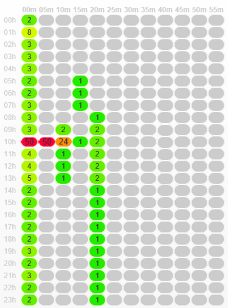

# Carte thermique des workflows {#workflow-heatmap}

La Carte thermique des workflows Campaign est une représentation graphique avec code-couleur de tous les workflows en cours d’exécution. Elle est disponible uniquement pour les **administrateurs de Campaign**.

## Prise en main de la Carte thermique des workflows {#about-the-workflow-heatmap}

En donnant un aperçu rapide du nombre de workflows simultanés, la carte thermique des workflows permet aux administrateurs de la plateforme Adobe Campaign de surveiller la charge de l&#39;instance et de planifier les workflows en conséquence.

Elle permet plus précisément aux administrateurs de la plateforme d’effectuer les opérations suivantes :

* afficher et analyser les workflows simultanés ;
* filtrer les workflows par durée pour déterminer ceux risquant de rencontrer des problèmes ;
* filtrer les activités par durée pour déterminer celles risquant de rencontrer des problèmes ;
* trouver facilement des workflows distincts et toutes les activités associées (avec leur durée) ;
* filtrer par type de workflow : [workflows techniques](technical-workflows.md) ou [workflows de campagne](campaign-workflows.md) ;
* rechercher un workflow spécifique à analyser.

>[!NOTE]
>
>Outre la **carte thermique des workflows**, vous pouvez créer un workflow qui vous permettra de surveiller le statut d’un ensemble de workflows et d’envoyer des messages récurrents aux superviseurs. Pour plus de détails, reportez-vous à la [section dédiée](workflow-supervision.md).

L’utilisation de la carte thermique des workflows demande une bonne maîtrise des concepts suivants : [Workflows](about-workflows.md), [Activités](activities.md) et [Bonnes pratiques relatives aux workflows](workflow-best-practices.md).

## Personnalisation de la Carte thermique des workflows {#using-the-heatmap}

>[!NOTE]
>
>Si aucune donnée n’est affichée dans la Carte thermique des workflows, cliquez sur le bouton **[!UICONTROL Charger les données]**.

1. Accédez à **[!UICONTROL Suivi]**, puis cliquez sur le lien **[!UICONTROL Carte thermique des workflows]** pour afficher la page **[!UICONTROL Carte thermique des workflows Campaign]**.

   

1. Cliquez sur le calendrier pour sélectionner un jour.

   Par défaut, la page affiche l&#39;activité des workflows pour le jour en cours. Vous pouvez le changer et sélectionner n&#39;importe quel jour précédent.

   >[!NOTE]
   > 
   >Par défaut, le fuseau horaire de la carte thermique des workflows est celui défini pour l&#39;utilisateur administrateur actuel. Vous pouvez vouloir le changer si, par exemple, vous ne vous trouvez pas dans la même zone géographique que les utilisateurs marketing avec lesquels vous travaillez.

1. Cliquez sur le bouton **[!UICONTROL Filtres]**.

   

1. Utilisez le curseur pour définir la durée minimale de 0 seconde à 1 heure. Vous pouvez ainsi rechercher uniquement des workflows exécutés pendant plus d&#39;un certain nombre de secondes ou de minutes.

   

1. Vous pouvez également sélectionner un workflow spécifique dans la liste déroulante **[!UICONTROL Workflows]**.

   

   >[!NOTE]
   >
   >Le filtre **[!UICONTROL Durée min.]** est appliqué. Si vous ne parvenez pas à trouver un workflow spécifique, réinitialisez la durée minimale à 0 afin que tous les workflows soient affichés dans la liste.

1. Vous pouvez également appliquer un filtre selon le **[!UICONTROL Type de workflow]** :

   * **[!UICONTROL Technique]** : seuls les [workflows techniques intégrés](technical-workflows.md) et les [workflows de gestion de données](targeting-workflows.md#data-management) s’affichent.
   * **[!UICONTROL Marketing]** : seuls les workflows associés à une campagne marketing, appelés [workflows de campagne](campaign-workflows.md), s&#39;affichent.

1. Pour rechercher un workflow spécifique par nom, vous pouvez également utiliser le champ **[!UICONTROL Filtre de nom de workflow]**.

1. Si vous avez édité certains workflows entre temps, cliquez sur le bouton **[!UICONTROL Recharger les données]** pour actualiser les données affichées dans la grille.

## Interprétation de la Carte thermique des workflows {#reading-the-heatmap}

La Carte thermique des workflows Campaign est une grille qui se lit naturellement en commençant en haut à gauche pour terminer en bas à droite. Il est possible de trouver les &quot;zones chaudes&quot; avec un code-couleur allant du vert au rouge.

* Les cellules d&#39;un rouge plus foncé correspondent aux périodes pendant lesquelles un grand nombre de workflows s&#39;exécutent simultanément.
* Les cellules grises correspondent aux périodes pendant lesquelles aucun workflow ne s&#39;exécute.

Pour découvrir comment le code-couleur est appliqué et comment parcourir la carte thermique, cliquez sur le bouton **[!UICONTROL Aide]**.

Chaque ligne représente une heure de la journée et chaque cellule, 5 minutes de cette heure.

La grille affiche tous les workflows exécutés à la même heure pour chacune de ces périodes de 5 minutes.

Dans l&#39;exemple suivant, trois workflows sont en cours d&#39;exécution (quelle que soit leur durée) entre 8h00 et 8h05 :

1. Cliquez sur une cellule en couleur pour afficher les détails de tous les workflows simultanés exécutés pendant cette période.

   

   Toutes les activités de chaque workflow sont répertoriées, avec leur durée.

1. Cliquez sur l&#39;identifiant ou le nom d&#39;un workflow pour l&#39;ouvrir directement.
1. Pour revenir à la vue **[!UICONTROL Carte thermique des workflows Campaign]**, cliquez sur le bouton **[!UICONTROL Accueil]**.

## Cas pratiques : utiliser la Carte thermique pour prendre des mesures {#use-cases--using-the-heatmap-to-take-actions}

La Carte thermique des workflows Campaign peut s&#39;avérer utile dans deux principaux scénarios.

### Réduction du nombre de workflows simultanés {#reducing-the-number-of-concurrent-workflows}

En tant qu&#39;administrateur de Campaign, la carte thermique des workflows peut vous aider à analyser la charge de l&#39;instance et à planifier les workflows existants ou nouveaux aux moments appropriés.

1. Dans la vue **[!UICONTROL Carte thermique des workflows Campaign]**, cliquez sur le bouton **[!UICONTROL Filtres]**.
1. Définissez la durée sur quelques secondes ou minutes.
1. Excluez les workflows les plus courts n&#39;étant pas significatifs en augmentant le filtre de durée.

   

1. Examinez les résultats pour analyser la charge de l&#39;instance, puis prenez les mesures adéquates :

   * Si vous rencontrez des problèmes de performances et si la grille contient une ou plusieurs cellules rouges, songez à modifier les heures de début de plusieurs workflows. Demandez aux utilisateurs marketing de déplacer manuellement les workflows des périodes surchargées (&quot;chaudes&quot;) vers des créneaux horaires moins chargés. Un niveau d&#39;activité stable devrait ainsi être maintenu tout au long de la journée.
   * Pour éviter les pics et la surcharge de l&#39;instance, examinez la carte thermique avant de planifier de nouveaux workflows et choisissez le meilleur horaire. Prenez en compte les créneaux horaires correspondant aux cellules grises ou vertes de la grille pour démarrer de nouveaux workflows.

### Recherche des workflows de longue exécution ayant un impact sur les performances {#finding-long-running-workflows-that-impact-performance}

En tant qu&#39;administrateur de Campaign, la carte thermique des workflows vous permet de trouver les workflows les plus longs pouvant ralentir l&#39;activité.

1. Dans la vue **[!UICONTROL Carte thermique des workflows Campaign]**, cliquez sur le bouton **[!UICONTROL Filtres]**.
1. Définissez la durée sur 1 heure.

   

1. Incluez d&#39;autres résultats en diminuant le filtre **[!UICONTROL Durée min.]**.
1. Examinez les résultats pour trouver les workflows les plus longs, susceptibles d&#39;avoir un impact plus important sur les ressources du serveur et de la base de données (CPU, RAM, réseau, IOPS, etc.).
1. Prenez les mesures adéquates :

   * Conseillez aux utilisateurs marketing de scinder les workflows les plus longs afin de réduire la durée de traitement.
   * Effectuez une analyse plus approfondie de workflows et d&#39;activités spécifiques (JavaScript, import, export, etc.) pour isoler les problèmes et les résoudre plus facilement.

## Utilisation de la Carte thermique pour une meilleure planification des workflows {#example--using-the-heatmap-to-improve-workflow-planning}

L&#39;exemple ci-dessous montre comment rendre la planification plus efficace et améliorer les performances grâce à l&#39;utilisation de la Carte thermique des workflows d&#39;Adobe Campaign.

Dans ce cas pratique, de nombreux utilisateurs se plaignent des performances des workflows. Vous devez rechercher ce qui ralentit l&#39;activité et comment résoudre le problème.

1. Accédez à **[!UICONTROL Suivi]**, puis cliquez sur le lien **[!UICONTROL Workflows]** pour afficher la page **[!UICONTROL Carte thermique des workflows Campaign]**.
1. Définissez le filtre **[!UICONTROL Durée min.]** sur 5 minutes.
1. Définissez le filtre **[!UICONTROL Type de workflow]** sur **[!UICONTROL Marketing]**.
1. Dans la grille de la carte thermique, notez les points suivants :

   

   * 50 workflows de campagne de longue durée (plus de 5 minutes) sont exécutés à 10h00.
   * La plupart d&#39;entre eux ont un statut en attente (par défaut, la limite de la simultanéité est définie sur 20).
   * Les workflows en attente doivent être redémarrés manuellement tous les jours.
   * Les performances sont faibles.

1. Au lieu d&#39;avoir 50 workflows commençant à 10h00, répartissez les heures de début de manière uniforme sur le reste de la journée.
1. Retournez dans la page **[!UICONTROL Carte thermique des workflows Campaign]**, puis cliquez sur le bouton **[!UICONTROL Recharger les données]**.
1. Notez maintenant les points suivants :

   

   * Seuls 18 workflows de campagne de longue durée s&#39;exécutent toujours à 10h00.
   * Aucun workflow n&#39;est en attente (la limite de la simultanéité est toujours définie sur 20).
   * Les heures de début des workflows sont uniformément réparties tout au long de la journée.
   * Aucun utilisateur ne se plaint de problèmes de performances.
