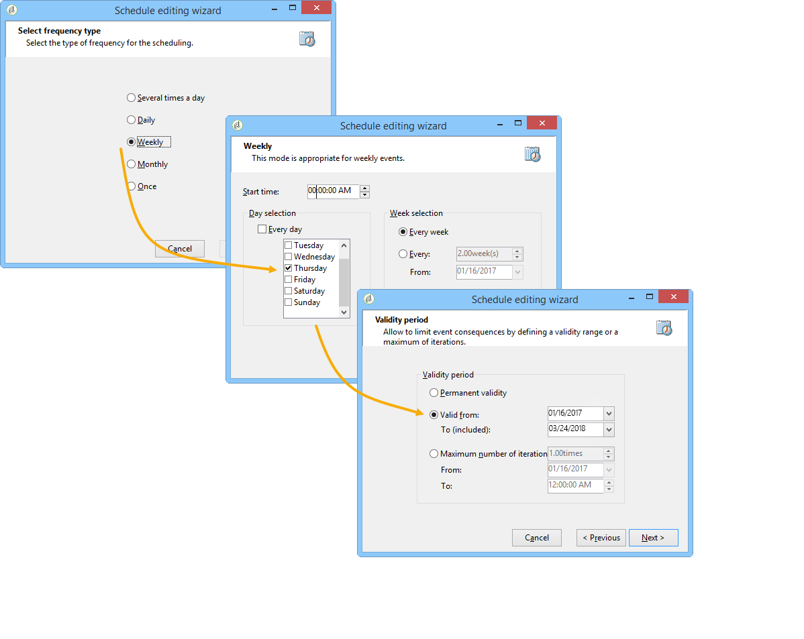
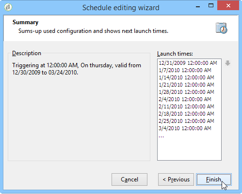
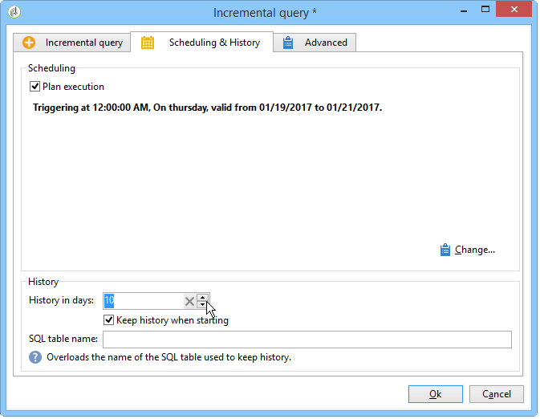

# Requête incrémentale{#incremental-query}

Une requête incrémentale permet de sélectionner périodiquement une cible selon un critère, mais d&#39;exclure les personnes qui ont déjà été ciblées sur ce critère les fois précédentes.

La population déjà ciblée est mémorisée par instance de workflow et par activité, c’est-à-dire que deux workflows démarrés à partir du même modèle ne partagent pas le même log. Toutefois, deux tâches basées sur la même requête incrémentale dans le même workflow utilisent le même log.

La requête est définie selon le même mode que pour les requêtes standard, mais son exécution est planifiée.

**Rubriques connexes :**

* [Cas pratique : mise à jour de la liste trimestrielle à l’aide d’une requête incrémentielle](quarterly-list-update.md)
* [Créer une requête](query.md#creating-a-query)

>[!CAUTION]
>
>Si le résultat d’une requête incrémentale est égal à **0** lors de l’une de ses exécutions, le workflow est mis en pause jusqu’à la prochaine exécution programmée de la requête. Les transitions et les activités qui suivent la requête incrémentale ne sont donc pas traitées avant l’exécution suivante.

Pour ce faire :

1. Dans l’onglet **[!UICONTROL Planification et historique]**, sélectionnez l’option **[!UICONTROL Planifier l’exécution]**. La tâche reste active une fois créée et ne sera déclenchée qu’aux heures spécifiées par le planning d’exécution de la requête. En revanche, si l&#39;option est désactivée, la requête est exécutée immédiatement **et une seule fois**.
1. Cliquez sur le bouton **[!UICONTROL Changer]**.

   Dans la fenêtre **[!UICONTROL Assistant d’édition d’un planning]** qui s’affiche, vous pouvez configurer le type de fréquence, la périodicité des événements et la période de validité des événements.

   

1. Cliquez sur **[!UICONTROL Terminer]** pour enregistrer le planning.

   

1. La section inférieure de l&#39;onglet **[!UICONTROL Planification &amp; Historique]** permet de sélectionner le nombre de jours d&#39;historique à prendre en compte.

   

   * **[!UICONTROL Jours d&#39;historique]**

     Les personnes destinataires déjà ciblées dans les exécutions précédentes peuvent être consignées dans un log selon un nombre de jours maximum à partir de celui où elles ont été ciblées. Si cette valeur est égale à zéro, les personnes destinataires ne sont jamais purgées du log.

   * **[!UICONTROL Conserver l&#39;historique au démarrage]**

     Cette option permet de ne pas effacer l&#39;historique lors de l&#39;activation de l&#39;activité.

   * **[!UICONTROL Nom de la table SQL]**

     Ce champ permet de surcharger la table SQL par défaut contenant les données d&#39;historique.

## Paramètres de sortie {#output-parameters}

* tableName
* schéma
* recCount

Ce jeu de trois valeurs identifie la population ciblée par la requête. **[!UICONTROL tableName]** est le nom de la table qui enregistre les identifiants de la cible, **[!UICONTROL schema]** est le schéma de la population (généralement nms:recipient) et **[!UICONTROL recCount]** est le nombre d’éléments dans la table.
