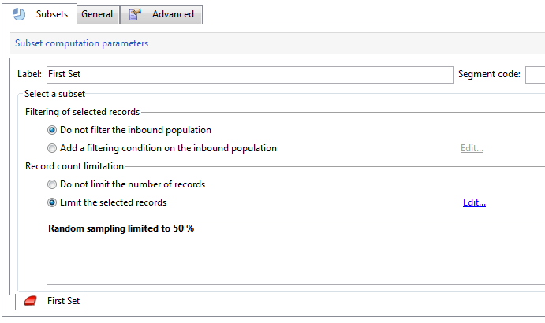

# Scripts et modèles JavaScript{#javascript-scripts-and-templates}


Les scripts vont permettre de calculer des valeurs, d&#39;échanger des données entre les différentes tâches du processus et d&#39;exécuter des opérations spécifiques à l&#39;aide d&#39;appels SOAP.

Les scripts sont omniprésents dans un diagramme de workflow :

* Toute activité possède un script d&#39;initialisation. Ce script est exécuté à l&#39;activation de l&#39;activité, il permet d&#39;initialiser des variables ou de modifier les propriétés de l&#39;activité.
* L&#39;activité &#39;Code JavaScript&#39; a pour seule fonction d&#39;exécuter un script.
* L&#39;activité &#39;Test&#39; évalue des expressions JavaScript pour activer la bonne transition.
* La plupart des champs de type texte sont des templates JavaScript : ils peuvent inclure des expressions JavaScript entre les caractères &lt;%= et %>. Ces champs proposent un bouton qui permet d&#39;accéder à une liste déroulante pour l&#39;aide à la saisie des expressions.

  

## Objets exposés {#objects-exposed}

Tout script JavaScript exécuté dans le contexte du workflow accède à une série d&#39;objets globaux supplémentaires.

* **instance** : représente le workflow en cours d’exécution. Le schéma de cet objet est **xtk:workflow**.
* **task** : représente les tâches en cours d’exécution. Le schéma de cet objet est **xtk:workflowTask**.
* **event** : représente les événements qui ont activé la tâche en cours d’exécution. Le schéma de cet objet est **xtk:workflowEvent**. Cet objet n’est pas initialisé pour les activités de type **AND-join** qui ont été activées à partir de plusieurs transitions.
* **events** : représente la liste des événements qui ont activé la tâche active. Le schéma de cet objet est **xtk:workflowEvent**. Ce tableau contient généralement un élément, mais il peut en contenir plusieurs pour les activités de type **AND-join** qui ont été activées en fonction de plusieurs transitions.
* **activity** : représente le modèle de la tâche en cours d’exécution. Le schéma de cet objet dépend du type d’activité. Cet objet peut être modifié par le script d’initialisation ; dans d’autres scripts, les modifications auront des effets indéterminés.

Les propriétés disponibles pour ces objets sont accessibles depuis le menu déroulant du bouton situé à droite de la barre d&#39;outils du script.

>[!CAUTION]
>
>Les propriétés de ces objets sont accessibles en lecture seule à l&#39;exception des sous-propriétés de la propriété vars.
>  
>La plupart de ces propriétés ne sont mises à jour qu&#39;après l&#39;exécution d&#39;une tâche élémentaire ou au moment de la passivation de l&#39;instance. Les valeurs lues ne correspondent pas nécessairement à l&#39;état en cours mais à l&#39;état précédent.

**Exemple**

Dans cet exemple et pour les exemples suivants, créez un workflow comprenant une activité **Code JavaScript** et une activité **Fin** comme sur le diagramme ci-dessous.


Double-cliquez sur l&#39;activité **Code JavaScript** et insérez le script suivant :

```
logInfo("Label: " + instance.label)
logInfo("Start date: " + task.creationDate)
```

La fonction **[!UICONTROL logInfo(message)]** ajoute un message dans le journal.

Cliquez sur **[!UICONTROL OK]** pour fermer l&#39;assistant de création, puis démarrez le workflow en utilisant les boutons d&#39;action en haut à droite de la liste des workflows. A la fin de l&#39;exécution, consultez le journal. Vous devez voir deux messages correspondant au script : l&#39;un affiche le libellé du workflow, l&#39;autre affiche la date d&#39;activation du script.

## Variables {#variables}

Les variables sont des propriétés libres des objets **[!UICONTROL instance]**, **[!UICONTROL task]** et **[!UICONTROL event]**. Les types JavaScript autorisés pour ces variables sont **[!UICONTROL string]**,**[!UICONTROL number]** et **[!UICONTROL Date]**.

### Les variables d&#39;instances {#instance-variables}

Les variables d’instances (**[!UICONTROL instance.vars.xxx]**) sont comparables à des variables globales. Elles sont partagées par toutes les activités.

### Les variables de tâches {#task-variables}

Les variables de tâches (**[!UICONTROL task.vars.xxx]**) sont comparables à des variables locales. Elles ne sont accessibles que par la tâche en cours. Ces variables sont utilisées par des activités persistantes pour conserver des données et sont parfois utilisées pour échanger des valeurs entre différents scripts d’une même activité.

### Les variables d&#39;événements {#event-variables}

Les variables d&#39;événements (**[!UICONTROL vars.xxx]**) permettent l&#39;échange de données entre les tâches élémentaires d&#39;un processus de workflow. Ces variables sont passées par la tâche qui a activé la tâche en cours. Il est possible de les modifier ou d&#39;en définir de nouvelles, elles sont ensuite transmises aux activités suivantes.

>[!CAUTION]
>
>Dans le cas d&#39;activités de type [AND-join](and-join.md), les variables sont fusionnées mais si une même variable est définie deux fois, il y a conflit et la valeur est indéterminée.

Les événements sont les variables les plus communément utilisées et doivent être préférées aux variables d&#39;instances.

Certaines variables d’événement sont modifiées ou lues par les différentes activités. Il s’agit de variables de type chaîne. Par exemple, un export définit la variable **[!UICONTROL vars.filename]** avec le nom complet du fichier qui vient d’être exporté. Toutes ces variables lues ou modifiées sont documentées dans [À propos des activités](activities.md), dans les sections **Paramètres d’entrée** et **Paramètres de sortie** des activités.

### Cas pratiques {#example}

>[!NOTE]
>
>Retrouvez d’autres cas d’utilisation de workflows dans [cette section](workflow-use-cases.md).

**Exemple 1**

Dans cet exemple, une variable d’instance est utilisée pour calculer dynamiquement le pourcentage de partage à appliquer à une population.

1. Créez un workflow et ajoutez une activité Début.

1. Ajoutez et configurez une activité de code JavaScript pour définir une variable d’instance.

   Par exemple: `instance.vars.segmentpercent = 10;`

   

1. Ajoutez une activité Requête et ciblez les destinataires en fonction de vos besoins.

1. Ajoutez une activité Partage et configurez-la pour effectuer un échantillonnage aléatoire de la population entrante. Le pourcentage d’échantillonnage ne dépend que de votre choix. Il est défini sur 50 % dans cet exemple.

   C’est ce pourcentage qui est mis à jour dynamiquement grâce à la variable d’instance définie précédemment.

   

1. Dans la section Script d’initialisation de l’onglet Avancé de l’activité Partage, définissez une condition JS. La condition JS sélectionne le pourcentage d’échantillonnage aléatoire de la première transition sortant de l’activité Partage et la met à jour vers une valeur définie par la variable d’instance créée précédemment.

   ```
   activity.transitions.extractOutput[0].limiter.percent = instance.vars.segmentpercent;
   ```

   

1. Assurez-vous que le complément est généré dans une transition distincte de l’activité Partage et ajoutez les activités Fin après chacune des transitions sortantes.

1. Enregistrez et exécutez le workflow. L’échantillonnage dynamique est appliqué en fonction de la variable d’instance.

   

**Exemple 2**

1. Reprenez le workflow de l&#39;exemple précédent et modifiez le script de l&#39;activité **Code JavaScript** avec le script suivant :

   ```
   instance.vars.foo = "bar1"
   vars.foo = "bar2"
   task.vars.foo = "bar3"
   ```

1. Ajoutez le script suivant au script d&#39;initialisation de l&#39;activité **Fin** :

   ```
   logInfo("instance.vars.foo = " + instance.vars.foo)
   logInfo("vars.foo = " + vars.foo)
   logInfo("task.vars.foo = " + task.vars.foo)
   ```

1. Démarrez le workflow, puis consultez le journal.

   ```
   Workflow finished
   task.vars.foo = undefined
   vars.foo = bar2
   instance.vars.foo = bar1
   Starting workflow (operator 'admin')
   ```

Cet exemple montre que l&#39;activité suivant **Code JavaScript** accède aux variables d&#39;instances et aux variables d&#39;événements, mais les variables de tâches ne sont pas accessibles en dehors de celles-ci (&#39;undefined&#39;).

### Appeler une variable d&#39;instance dans une requête {#calling-an-instance-variable-in-a-query}

Lorsque vous avez défini une variable d&#39;instance dans une activité, vous pouvez la réutiliser dans une requête du workflow.

Ainsi, pour appeler la variable **instance.vars.xxx = &quot;yyy&quot;** dans un filtre, saisissez **$(instance/vars/xxx)**.

Par exemple :

1. Créez une variable d&#39;instance qui définit le nom interne d&#39;une diffusion via l&#39;activité **[!UICONTROL Code JavaScript]** : **instance.vars.deliveryIN = &quot;DM42&quot;**.

   

1. Créez une requête dont les dimensions de ciblage et de filtrage sont les destinataires. Dans les conditions, indiquez que vous souhaitez trouver tous les destinataires auxquels la diffusion spécifiée par la variable a été envoyée.

   Pour rappel, ces informations sont stockées dans les logs de diffusion.

   Pour faire référence à la variable d&#39;instance dans la colonne **[!UICONTROL Valeur]**, saisissez **$(instance/vars/@deliveryIN)**.

   Le workflow retournera les destinataires à qui la diffusion DM42 a été envoyée.

   

## Fonctions avancées {#advanced-functions}

En plus des fonctions JavaScript standard, d&#39;autres fonctions spécifiques sont disponibles pour manipuler les fichiers, lire ou modifier des données dans la base ou encore ajouter des messages dans le journal.

### Journal {#journal}

**[!UICONTROL logInfo(message)]** a déjà été présenté dans les exemples précédents. Cette fonction ajoute un message d&#39;information au journal.

**[!UICONTROL logError(message)]** ajoute un message d&#39;erreur au journal. Le script interrompt son exécution et le workflow passe en état d&#39;erreur (par défaut, l&#39;instance sera mise en pause).

## Script d&#39;initialisation {#initialization-script}

Vous pouvez modifier une propriété d&#39;une activité au moment de l&#39;exécution sous certaines conditions.

La plupart des propriétés des activités peuvent être calculées dynamiquement, soit en utilisant un template JavaScript, soit parce que les propriétés du workflow permettent explicitement de calculer la valeur par un script.

Néanmoins, pour d&#39;autres propriétés, vous devez utiliser le script d&#39;initialisation. Ce script est évalué avant d&#39;exécuter la tâche. La variable **[!UICONTROL activity]** référence l&#39;activité correspondant à la tâche. Les propriétés de cette activité peuvent être modifiées et n&#39;affecteront que cette tâche.

**Rubriques connexes**
[Exemples de code JavaScript dans les workflows](javascript-in-workflows.md)
