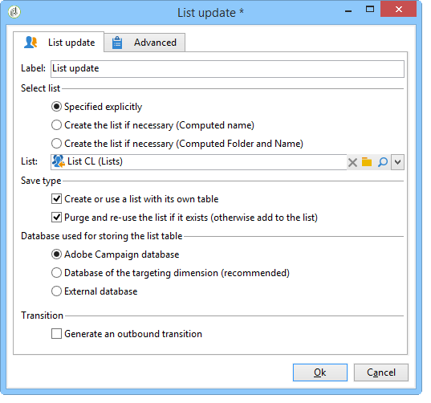
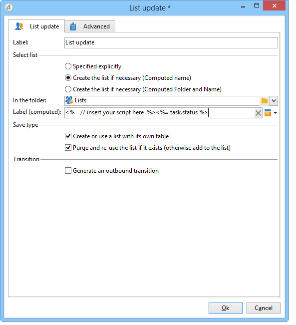
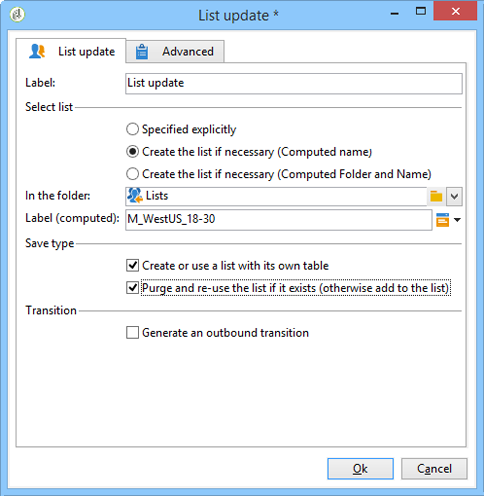

# Mise à jour de liste{#list-update}

Une activité de type **Mise à jour de liste** enregistre la population spécifiée par la transition dans une liste de destinataires.

La liste peut être sélectionnée parmi les listes existantes.

Il peut également être créé à l’aide des options **[!UICONTROL Créer la liste si nécessaire (Nom calculé)]** et **[!UICONTROL Créer la liste si nécessaire (Dossier calculé et Nom)]**. Ces options vous permettent de sélectionner le libellé de votre choix pour créer une liste, puis le dossier dans lequel il sera enregistré. Le libellé peut également être généré automatiquement en insérant des champs dynamiques ou un script. Les différents champs dynamiques sont disponibles dans le menu pop-up situé à droite du libellé.

Si la liste existe déjà, les destinataires seront ajoutés au contenu existant, sauf si vous cochez l&#39;option **[!UICONTROL Purger la liste si elle existe (sinon l&#39;ajouter à la liste)]** . Dans ce cas, le contenu de la liste est supprimé avant la mise à jour.

Si vous souhaitez que la liste créée ou mise à jour utilise une autre table que la table des destinataires, cochez l&#39;option **[!UICONTROL Créer ou utiliser une liste ayant sa propre table]**.

Pour utiliser cette option, les tables spécifiques concernées doivent avoir été configurées dans votre instance Adobe Campaign.

Généralement, la sauvegarde d&#39;une cible dans une liste marque la fin d&#39;un workflow. Par défaut, l&#39;activité **[!UICONTROL Mise à jour de liste]** n&#39;a donc pas de transition sortante. Cochez l&#39;option **[!UICONTROL Générer une transition sortante]** pour en ajouter une.

 [Découvrez comment créer une liste de destinataires à partir de l‘Explorateur dans une vidéo](#video)

## Exemple : mise à jour de liste {#example--list-update}

Dans l&#39;exemple suivant, l&#39;activité de mise à jour de liste suit une requête qui cible les hommes de plus de 30 ans résidant en France. La liste sera initialement créée à partir des résultats de la requête. Elle est ensuite mise à jour chaque fois qu’elle est lancée à partir du workflow. Il peut, par exemple, être utilisé régulièrement pour des offres promotionnelles ciblées de campagnes.

1. Placez une activité de type **[!UICONTROL Mise à jour de liste]** directement à la suite d&#39;une requête puis ouvrez-la pour pouvoir l&#39;éditer.

   Pour plus d&#39;informations sur la création d&#39;une requête dans un workflow, consultez la section [Requête](query.md).

1. Choisissez éventuellement un libellé pour l&#39;activité.
1. Sélectionnez l&#39;option **[!UICONTROL Créer la liste si besoin (Nom calculé)]** afin d&#39;indiquer que la liste sera créée lors de la première exécution du workflow, puis mise à jour lors des exécutions suivantes.
1. Sélectionnez le dossier dans lequel vous souhaitez enregistrer la liste.
1. Saisissez un libellé pour la liste. Vous pouvez insérer des champs dynamiques pour générer automatiquement le nom à partir de la liste. Dans cet exemple, la liste porte le même nom que la requête pour identifier facilement son contenu.
1. Laissez l&#39;option **[!UICONTROL Purger la liste si elle existe (sinon la complète)]** sélectionnée afin de supprimer les destinataires ne correspondant plus aux critères de ciblage et d&#39;y insérer les nouveaux.
1. Laissez également l&#39;option **[!UICONTROL Créer ou utiliser une liste ayant sa propre table]** sélectionnée.
1. Laissez l&#39;option **[!UICONTROL Générer une transition sortante]** désélectionnée.
1. Cliquez sur **[!UICONTROL Ok]** puis lancez l&#39;exécution du workflow.

   

   La liste de destinataires correspondante est alors créée ou mise à jour.

## Paramètres d&#39;entrée {#input-parameters}

* tableName
* schéma

Identifie la population à sauvegarder dans le groupe.

## Paramètres de sortie {#output-parameters}

* groupId : Identifiant du groupe.

## Tutoriel vidéo {#video}

Cette vidéo montre comment créer une liste de destinataires à partir de l’Explorateur.

>[!VIDEO](https://video.tv.adobe.com/v/30599?captions=fre_fr)

D’autres vidéos pratiques sur Campaign sont disponibles [ici](https://experienceleague.adobe.com/docs/campaign-learn/tutorials/getting-started/introduction-to-adobe-campaign.html?lang=fr){target="_blank"}.