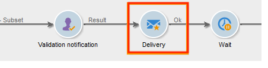
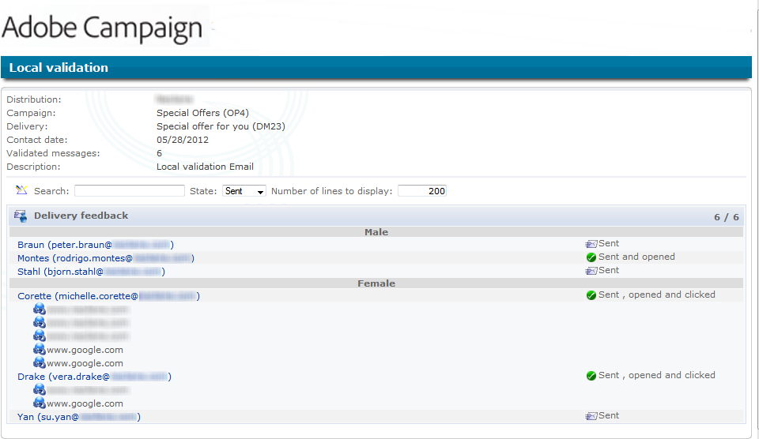

# Utilisation de l’activité de validation en local{#using-the-local-approval-activity}

Intégrée à un workflow de ciblage, l&#39;activité **[!UICONTROL Validation en local]** permet de mettre en place un processus de validation des destinataires avant l&#39;envoi de la diffusion.

>[!CAUTION]
>
>Pour utiliser cette fonction, vous devez acquérir le module Distributed Marketing, qui est une option de Campaign. Vérifiez votre contrat de licence.

Pour réaliser ce cas d&#39;utilisation, nous avons créé le workflow de ciblage suivant :

Les étapes principales du processus de validation en local sont les suivantes :

1. La population issue du ciblage peut être limitée à partir d&#39;une activité de type **[!UICONTROL Partage]** utilisant un modèle de répartition de données.

   

1. L&#39;activité **[!UICONTROL Validation en local]** prend ensuite le relai et envoie un email de notification à chaque responsable local. L&#39;activité se met ensuite en attente et chaque responsable local valide les destinataires qui lui sont assignés.

1. Lorsque la date limite de validation est atteinte, le workflow reprend. Dans notre exemple, l&#39;activité **[!UICONTROL Diffusion]** démarre et la diffusion est envoyée aux cibles validées.

   >[!NOTE]
   >
   >Une fois le délai d&#39;attente passé, les destinataires qui n&#39;ont pas été validés ne sont pas pris en compte dans le ciblage.

   

1. Quelques jours plus tard, la seconde activité de type **[!UICONTROL Validation en local]** envoie un email de notification à chaque responsable local lui indiquant les actions effectuées par ses contacts (clics, ouvertures, etc.).

## Étape 1 : créer le modèle de répartition de données {#step-1--creating-the-data-distribution-template-}

Le modèle de répartition de données permet de limiter la population issue du ciblage selon un groupement de données, tout en permettant d&#39;affecter chaque valeur à un responsable local. Dans cet exemple, nous avons défini le champ **[!UICONTROL Domaine de l’adresse e-mail]** comme champ de répartition et affecté un domaine à chaque responsable local

Pour plus d’informations sur la création d’un modèle de distribution de données, voir [Limiter le nombre d&#39;enregistrements des sous-ensembles par répartition de données](split.md#limiting-the-number-of-subset-records-per-data-distribution).

1. Pour créer le modèle de répartition de données, positionnez-vous sur le noeud **[!UICONTROL Ressources > Gestion de campagne > Répartition de données]**, et cliquez sur le bouton **[!UICONTROL Nouveau]**.

   

1. Sélectionnez l&#39;onglet **[!UICONTROL Général]**.

   

1. Renseignez le **[!UICONTROL Libellé]** et le **[!UICONTROL Contexte de répartition]**. Dans notre exemple, nous avons sélectionné le schéma de ciblage **[!UICONTROL Destinataire]** et le champ **[!UICONTROL Domaine de l&#39;email]** comme champ de répartition. La liste de destinataires sera répartie par domaine.
1. Dans le champ **[!UICONTROL Type de répartition]**, sélectionnez la manière dont sera exprimée la valeur de limitation de la cible dans l&#39;onglet **[!UICONTROL Distribution]**. Ici, nous avons choisi **[!UICONTROL Pourcentage]**.
1. Dans le champ **[!UICONTROL Stockage des validations]**, renseignez le schéma de stockage des validations correspondant au schéma de ciblage utilisé. Ici, nous allons utiliser le schéma de stockage par défaut : **[!UICONTROL Validation en local des destinataire]**.
1. Cliquez ensuite sur le lien **[!UICONTROL Paramètres avancés]**.

   

1. Laissez cochée l&#39;option **[!UICONTROL Valider les messages ciblés]** afin que tous les destinataires soient pré-sélectionnés dans la liste de destinataires à valider.
1. Dans le champ **[!UICONTROL Libellé de la diffusion]**, nous avons laissé l&#39;expression par défaut (compute string de la diffusion). Le libellé standard de la diffusion sera utilisé dans la notification de retour.
1. Dans le champ **[!UICONTROL Champ de groupement]**, nous avons choisi le champ **[!UICONTROL Genre]** comme champ de regroupement pour l&#39;affichage des destinataires dans les notifications de validation et de retour.
1. Dans la section **[!UICONTROL Edition des messages ciblés]**, nous avons sélectionné l&#39;application web **[!UICONTROL Edition des destinataires]** et le paramètre **[!UICONTROL recipientId]**. Dans les notifications de validation et de retour, les destinataires seront cliquables et pointeront vers l&#39;URL de l&#39;application web. Le paramètre additionnel de l&#39;url sera **[!UICONTROL recipientId]**.
1. Cliquez ensuite sur l&#39;onglet **[!UICONTROL Distribution]**. Pour chaque domaine, renseignez les champs suivants :

   

   * **[!UICONTROL Valeur]** : saisissez la valeur du nom de domaine.
   * **[!UICONTROL Pourcentage / Fixe]** : saisissez, pour chaque domaine, la limite de destinataires auxquels vous souhaitez envoyer la diffusion. Dans notre exemple, nous avons choisi de limiter l&#39;envoi à 10% pour chaque domaine.
   * **[!UICONTROL Libellé]** : saisissez le libellé du domaine qui apparaîtra dans les notifications de validation et de retour.
   * **[!UICONTROL Groupe ou opérateur]** : sélectionnez l&#39;opérateur ou le groupe d&#39;opérateurs affecté au domaine.

     >[!CAUTION]
     >
     >Vérifiez que les opérateurs disposent des droits adéquats.

## Étape 2 : créer le workflow de ciblage {#step-2--creating-the-targeting-workflow}

Pour réaliser ce cas d&#39;utilisation, nous avons créé le workflow de ciblage suivant :

Les activités suivantes ont été ajoutées :

* deux activités **[!UICONTROL Requête]**,
* une activité **[!UICONTROL Intersection]**,
* une activité **[!UICONTROL Partage]**,
* une activité **[!UICONTROL Validation en local]**,
* une activité **[!UICONTROL Diffusion]**,
* une activité **[!UICONTROL Attente]**,
* une seconde activité **[!UICONTROL Validation en local]**,
* une activité **[!UICONTROL Fin]**.

### Requêtes, Intersection et Partage {#queries--intersection-and-split}

Le ciblage en amont est composé de deux requêtes, une intersection et un partage. La population issue du ciblage peut être limitée à l&#39;aide de l&#39;activité **[!UICONTROL Partage]** utilisant un modèle de répartition de données.

Pour plus d’informations sur la configuration d’une activité de partage, voir [Partage](split.md). La création d’un modèle de distribution de données est détaillée dans [Limiter le nombre d&#39;enregistrements des sous-ensembles par répartition de données](split.md#limiting-the-number-of-subset-records-per-data-distribution).

Si vous ne souhaitez pas limiter la population issue de la requête, il n&#39;est pas nécessaire d&#39;utiliser les activités **[!UICONTROL Requête]**, **[!UICONTROL Intersection]** et **[!UICONTROL Partage]**. Dans ce cas, renseignez le modèle de répartition de données dans la première activité de type **[!UICONTROL Validation en local]**.

1. Dans la section **[!UICONTROL Limitation du nombre d&#39;enregistrements]**, sélectionnez l&#39;option **[!UICONTROL Limiter les enregistrements sélectionnés]** et cliquez sur le lien **[!UICONTROL Editer]**.

   

1. Sélectionnez l&#39;option **[!UICONTROL Conserver les premiers suite à un tri]** et cliquez sur le bouton **[!UICONTROL Suivant]**.

   

1. Dans la section **[!UICONTROL Colonnes de tri]**, ajoutez le champ sur lequel le tri est effectué. Dans notre exemple, nous avons choisi le champ **[!UICONTROL Email]**. Cliquez sur **[!UICONTROL Suivant]**.

   

1. Sélectionnez l’option **[!UICONTROL Par répartition de données]**, puis sélectionnez le modèle de distribution créé précédemment (voir [Etape 1 : création du modèle de répartition de données](#step-1--creating-the-data-distribution-template-)) et cliquez sur **[!UICONTROL Terminer]**.

   

Dans le modèle de répartition, nous avons choisi de limiter la population à 10% par valeur de groupement, ce qui correspond bien aux valeurs affichés dans le workflow (340 en entrée et 34 en sortie).

### Notification de validation {#approval-notification}

L&#39;activité **[!UICONTROL Validation en local]** permet d&#39;envoyer une notification à chaque responsable local.

Pour plus d’informations sur le paramétrage de l’activité **[!UICONTROL Validation en local]**, voir la section [Validation en local](local-approval.md).

Les champs à renseigner sont les suivants :

1. Dans la section **[!UICONTROL Action à effectuer]**, sélectionnez l&#39;option **[!UICONTROL Notification pour la validation de la cible]**.
1. Dans la section **[!UICONTROL Contexte de répartition]**, sélectionnez l&#39;option **[!UICONTROL Spécifié par la transition]**.

   Si vous ne souhaitez pas limiter la population ciblée, sélectionnez ici l&#39;option **[!UICONTROL Explicite]** et renseignez le modèle de répartition créé précédemment dans le champ **[!UICONTROL Répartition des données]**.

1. Dans la section **[!UICONTROL Notification]**, sélectionnez le modèle de diffusion ainsi que l&#39;objet qui seront utilisés pour l&#39;e-mail de notification. Dans notre exemple, nous avons choisi le modèle par défaut : **[!UICONTROL Notification de validatione locale]**.
1. Dans la section **[!UICONTROL Planning d’approbation]**, nous avons laissé le délai d’approbation par défaut (3 jours) et ajouté un rappel. La diffusion partira donc 3 jours après le début de l’approbation. Une fois le délai d’approbation atteint, les personnes destinataires qui n’ont pas été approuvées ne sont pas prises en compte dans le ciblage.

Un e-mail de notification est envoyé par l&#39;activité **[!UICONTROL Validation en local]** aux superviseurs locaux.

### Attente {#wait}

L&#39;activité d&#39;attente permet de retarder le démarrage de la seconde activité de validation en local qui enverra la notification de retour de diffusion. Dans le champ **[!UICONTROL Durée]**, nous avons saisi la valeur **[!UICONTROL 5j]** (5 jours). Les actions effectuées par les destinataires au cours des 5 jours suivant l&#39;envoi de la diffusion seront prises en compte pour la notification de retour.

### Notification de retour {#feedback-notification}

La seconde activité **[!UICONTROL Validation en local]** permet d&#39;envoyer une notification de retour de diffusion à chaque responsable local.

Les champs à renseigner sont les suivants.

1. Dans la section **[!UICONTROL Action à effectuer]**, sélectionnez l&#39;option **[!UICONTROL Rapport de retour de diffusion]**.
1. Dans la section **[!UICONTROL Diffusion]**, sélectionnez l&#39;option **[!UICONTROL Spécifiée par la transition]**.
1. Dans la section **[!UICONTROL Notification]**, sélectionnez le modèle de diffusion ainsi que l&#39;objet qui seront utilisés pour l&#39;email de notification.

Une fois le délai défini dans l&#39;activité d&#39;attente passé, la seconde activité de type **[!UICONTROL Validation en local]** envoie à chaque responsable local l&#39;email de notification suivant :

### Tracking des validations par l&#39;administrateur {#approval-tracking-by-the-administrator}

A chaque démarrage de l&#39;activité de validation en local, une tâche de validation est créée. L&#39;administrateur a la possibilité de contrôler chacune de ces tâches de validation.

Dans le workflow de ciblage de votre opération, cliquez sur l&#39;onglet **[!UICONTROL Tâches de validation en local]**.

Vous pouvez également accéder à la liste des tâches de validation en local à partir de l&#39;onglet **[!UICONTROL Tâches de validation]** du modèle de répartition de données.

Sélectionnez la tâche que vous souhaitez suivre et cliquez sur le bouton **[!UICONTROL Détail]**. L&#39;onglet **[!UICONTROL Général]** de la tâche de validation en local vous permet de visualiser les informations générales de la tâche. Vous avez également la possibilité de modifier, si besoin, la limite de validation ainsi que la date de rappel.

Cet onglet affiche les informations suivantes :

* le libellé de la tâche ainsi que son identifiant
* le modèle de répartition utilisé
* le nombre de messages ciblés
* le workflow et l&#39;opération liés
* le planning de la tâche.

L&#39;onglet **[!UICONTROL Distribution]** de la tâche vous permet de visualiser les logs de validation, leur statut, le nombre de messages ciblés, la date de validation et l&#39;opérateur qui a validé.

Sélectionnez un log de validation et cliquez sur le bouton **[!UICONTROL Détail]** pour afficher ses détails. L&#39;onglet **[!UICONTROL Général]** du log de validation en local vous permet de visualiser les informations générales du log. Vous avez également la possibilité de modifier le statut de la validation.

Cet onglet affiche les informations suivantes :

* la tâche de validation liée
* le statut de la validation (**[!UICONTROL Validé]** ou **[!UICONTROL En attente]**)
* le modèle de répartition utilisé
* le responsable local qui a validé et la date de validation
* le nombre de messages ciblés et validés.

L&#39;onglet **[!UICONTROL Ciblés]** du log de validation affiche la liste des destinataires ciblés et leur statut de validation. Vous avez la possibilité de modifier ce statut si besoin.

