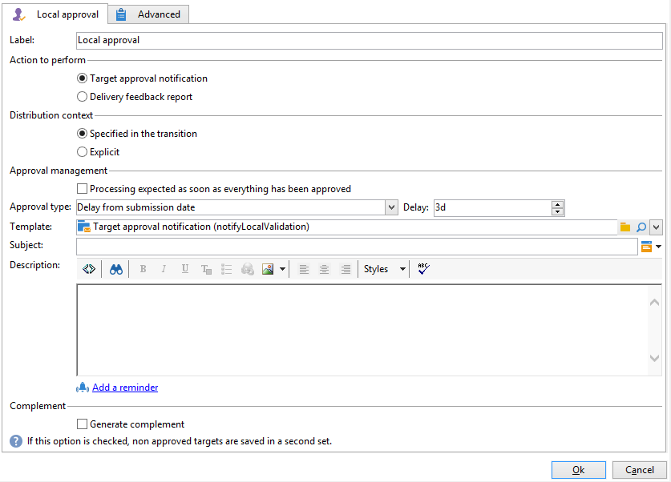
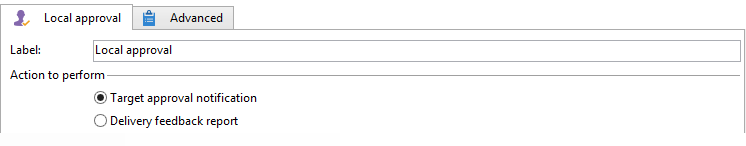
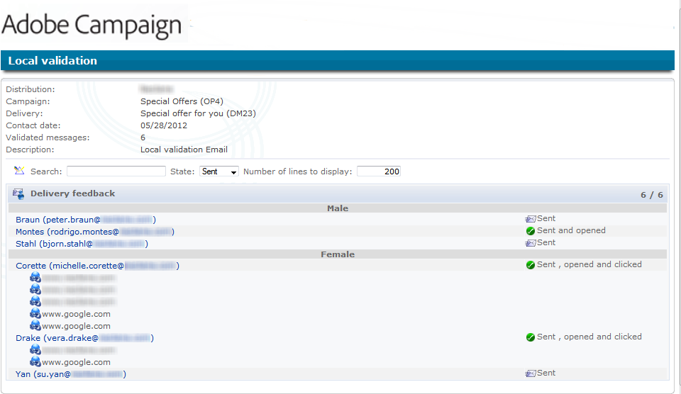
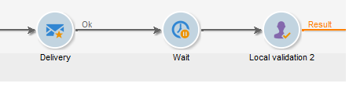
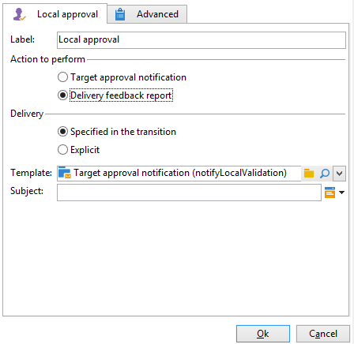
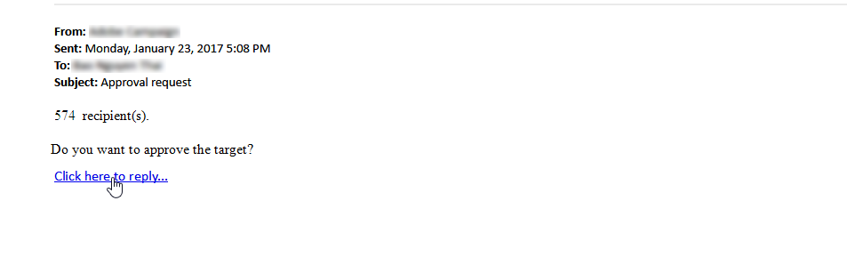
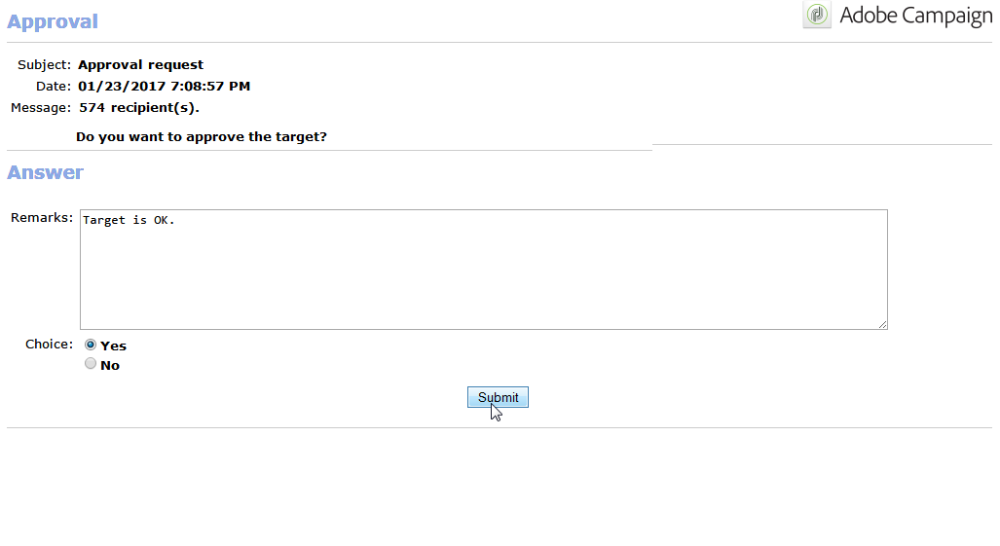

# Validation en local{#local-approval}

Intégrée à un workflow de ciblage, l&#39;activité **[!UICONTROL Validation en local]** permet de mettre en place un processus de validation des destinataires avant l&#39;envoi d&#39;une diffusion.

>[!CAUTION]
>
>Pour utiliser cette activité, vous devez avoir acheté le module Marketing distribué , qui est une option de Campaign. Veuillez vérifier votre contrat de licence.

Pour un exemple de l’activité **[!UICONTROL Validation en local]** avec un modèle de distribution, consultez la section [Utiliser l’activité Validation en local](local-approval-activity.md).

Renseignez tout d&#39;abord libellé de l&#39;activité et le champ **[!UICONTROL Action à effectuer]** :

* Sélectionnez l&#39;option **[!UICONTROL Notification pour la validation de la cible]** pour envoyer un email de notification aux responsables locaux, avant la diffusion, afin qu&#39;ils valident les destinataires qui leur sont assignés.

* **Requête incrémentale** : permet d&#39;effectuer une requête et d&#39;en planifier l&#39;exécution. Pour plus d&#39;informations, consultez la section [Requête incrémentale](incremental-query.md).

  

## Notification pour la validation de la cible {#target-approval-notification}

Dans ce cas, l&#39;activité **[!UICONTROL Validation en local]** se place entre le ciblage en amont et la diffusion :

Les champs à renseigner dans le cas d&#39;une notification pour la validation de la cible sont les suivants :

* **[!UICONTROL Contexte de répartition]** : sélectionnez l&#39;option **[!UICONTROL Spécifié par la transition]** si vous utilisez une activité de type **[!UICONTROL Partage]** pour limiter la population ciblée. Dans ce cas, le modèle de répartition est renseigné dans l&#39;activité de partage. Si vous ne limitez pas la population ciblée, sélectionnez ici l’option **[!UICONTROL Explicite]** et renseignez le modèle de répartition dans le champ **[!UICONTROL Répartition des données]**.

  Pour plus d’informations sur la création d’un modèle de distribution de données, voir [Limiter le nombre d&#39;enregistrements des sous-ensembles par répartition de données](split.md#limiting-the-number-of-subset-records-per-data-distribution).

* **[!UICONTROL Gestion de la validation :]**

   * Sélectionnez le modèle de diffusion et l’objet qui seront utilisés pour l’e-mail de notification. Un modèle par défaut est disponible : **[!UICONTROL Notification de validation locale]**. Vous pouvez également ajouter une description qui apparaîtra au-dessus des listes de personnes destinataires dans les notifications d’approbation et de commentaires.
   * Indiquez le **[!UICONTROL Type de validation]** correspondant à la date limite de validation (date ou date limite à partir du début de la validation). A cette date, le workflow recommence et les destinataires qui n&#39;ont pas été validés ne sont pas pris en compte dans le ciblage. Une fois les notifications envoyées, l&#39;activité est mise en file d&#39;attente afin que les responsables locaux puissent valider leurs contacts.

     >[!NOTE]
     >
     >Par défaut, lorsque la validation débute, l&#39;activité est mise en attente pendant trois jours.

     Vous pouvez également ajouter un ou plusieurs rappels pour informer les personnes responsables locales que l’échéance approche. Pour ce faire, cliquez sur le lien **[!UICONTROL Ajouter un rappel]**.

* **[!UICONTROL Complémentaire]** : L&#39;option **[!UICONTROL Générer le complémentaire]** permet de générer un second ensemble contenant toutes les cibles non validées.

  >[!NOTE]
  >
  >Par défaut, cette option est désactivée.

## Rapport de retour de diffusion {#delivery-feedback-report}

Dans ce cas, l&#39;activité **[!UICONTROL Validation en local]** se place après la diffusion :

Les champs à renseigner dans le cas d&#39;un rapport de retour de diffusion sont les suivants :

* Sélectionnez l’option **[!UICONTROL Spécifié dans la transition]** si la diffusion a été saisie au cours d’une activité précédente. Sélectionnez **[!UICONTROL Explicite]** pour définir la diffusion dans l’activité d’approbation locale.
* Sélectionnez le modèle de diffusion et l’objet de l’e-mail de notification. Il existe un modèle par défaut : **[!UICONTROL Notification de validation locale]**.

## Exemple : validation de la diffusion d&#39;un workflow {#example--approving-a-workflow-delivery}

Cet exemple montre comment configurer un processus de validation pour une diffusion de workflow. Pour plus d’informations sur la création de workflows de diffusion, voir la section [Exemple : workflow de diffusion](delivery.md#example--delivery-workflow).

Pour valider une diffusion, un opérateur ou une opératrice peut utiliser la page web dont l’URL est fournie dans l’e-mail envoyé ou valider directement à partir de la console cliente.

* Validation Web

  L&#39;email envoyé aux opérateurs du groupe Administrateur permet de valider la cible de la diffusion. Le message utilise le texte défini et l&#39;expression JavaScript est remplacée par la valeur calculée (dans ce cas, &#39;574&#39;)

  Pour valider la diffusion, cliquez sur le lien correspondant et connectez-vous à la console cliente Adobe Campaign.

  

  Sélectionnez votre choix et cliquez sur le bouton **[!UICONTROL Soumettre]**.

  

* Approbation à partir de la console cliente

  Dans l&#39;arborescence, le nœud **[!UICONTROL Administration > Exploitation > Objets créés automatiquement > Validations en attente]** contient la liste des tâches à valider par l&#39;opérateur actuellement connecté. La liste doit afficher une ligne. Double-cliquez sur cette ligne pour répondre. La fenêtre suivante s’affiche :

Sélectionnez **Oui**, puis cliquez sur **[!UICONTROL Approuver]**. Un message vous informera que la réponse a été enregistrée.

Revenez sur l’écran des workflows : au bout de quelques dizaines de secondes, le diagramme se présente comme suit :

Le workflow a exécuté la tâche **[!UICONTROL Agir sur une diffusion]**, ce qui revient dans ce cas à lancer la diffusion précédemment créée. Le workflow s’est terminé sans erreur.
