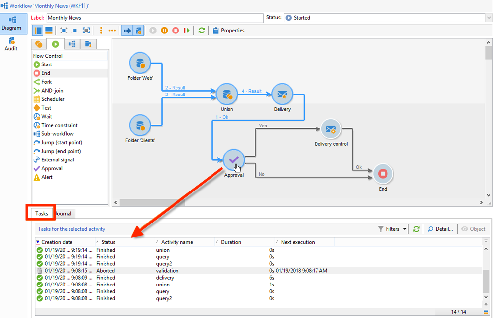
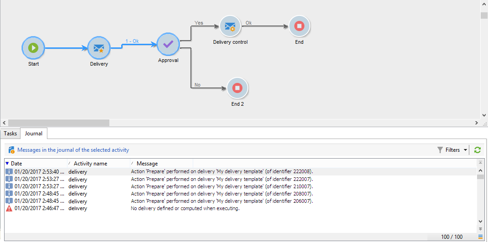

# Surveiller l’exécution des workflows {#monitoring-workflow-execution}


Cette section présente des informations sur la manière de surveiller l’exécution de vos workflows.

Vous trouverez également dans [cette section](workflow-supervision.md#supervising-workflows) un exemple de création d’un workflow qui permet de surveiller l’état d’un ensemble de workflows en pause, arrêtés ou en erreur.

En outre, les administrateurs de l’instance peuvent utiliser le **journal d’audit** pour vérifier les activités et les dernières modifications apportées aux workflows, c’est-à-dire l’état de vos workflows. Voir à ce sujet la section  .

D&#39;autres moyens de surveiller les différents processus de Campaign sont présentés dans la section .

## Afficher la progression {#displaying-progress}

Vous pouvez suivre l&#39;exécution en affichant la progression à partir de l&#39;icône correspondante de la barre d&#39;outils.

L&#39;icône **[!UICONTROL Afficher la progression]** permet de matérialiser à l&#39;écran l&#39;exécution, l&#39;état et le résultat des activités.


Lorsque cette option est sélectionnée, les activités exécutées apparaissent en bleu, les activités en attente clignotent, les avertissements sont affichés en orange et les erreurs en rouge. Cette option affiche également le résultat des activités sur leur transition sortante, suivi du libellé du résultat tel qu&#39;il a été défini dans les propriétés de l&#39;activité et de la durée du traitement, lorsqu&#39;elle est supérieure à une seconde.


## Afficher le journal {#displaying-logs}

Le journal contient l&#39;historique de l&#39;exécution du workflow. Il mémorise les actions effectuées par les opérateurs, les opérations réalisées et les erreurs d&#39;exécution. Vous pouvez :

* Sélectionner l&#39;onglet **[!UICONTROL Suivi]** du détail. Cette liste affiche tous les messages du workflow.

   

* Filtrer les messages dans le journal par activité. Pour cela, cliquez sur le bouton **[!UICONTROL Afficher les tâches et le journal]** de la barre d&#39;outils située au-dessus du diagramme afin de faire apparaître les onglets **[!UICONTROL Journal]** et **[!UICONTROL Tâches]** sous le diagramme. Sélectionnez une activité pour visualiser tous les messages liés à cette activité. Cette liste affiche également tous les messages lorsqu&#39;aucune activité n&#39;est sélectionnée.

   

   >[!NOTE]
   >
   >Cliquez sur l&#39;arrière-plan du diagramme pour tout désélectionner.

* Visualiser uniquement les messages associés à une tâche particulière. Pour cela, sélectionnez l&#39;onglet **[!UICONTROL Tâches]** puis cliquez sur une activité du diagramme pour limiter la liste à une activité particulière. Double-cliquez sur une tâche pour afficher toutes les informations ; le dernier onglet de la fenêtre permet d&#39;afficher le journal.

   

   Le **[!UICONTROL Détails...]** permet d&#39;afficher toutes les informations complémentaires relatives à l&#39;exécution de l&#39;activité. Vous pouvez par exemple visualiser l&#39;opérateur validant et le cas échéant le commentaire qu&#39;il a saisi lors de la validation.

>[!NOTE]
>
>Le journal n&#39;est pas purgé lors d&#39;un redémarrage. Tous les messages sont conservés. Si vous ne voulez pas conserver les messages d&#39;une exécution précédente, vous devez purger l&#39;historique.

Le journal affiche la liste chronologique des messages d&#39;exécution des activités du workflow de ciblage.

* Journal d&#39;une opération de ciblage

   Lorsqu&#39;une opération de ciblage a été exécutée, cliquez sur l&#39;onglet **[!UICONTROL Suivi]** pour consulter la trace de l&#39;exécution.

   

   Tous les messages de l&#39;opération sont affichés: les opérations réalisées et les avertissements ou les erreurs d&#39;exécution.

* Journal d&#39;une activité

   Vous pouvez également visualiser le journal de l&#39;exécution et le détail d&#39;exécution de chaque activité. Pour cela, deux méthodes sont possibles :

   1. Sélectionnez l&#39;activité visée et cliquez sur l&#39;icône **[!UICONTROL Afficher les tâches et le journal]**.

      

      La section inférieure du diagramme affiche alors deux onglets : Journal et Tâches.

      La sélection d&#39;une activité sur le diagramme agit comme un filtre sur le journal et la liste des tâches.

      

   1. Cliquez sur l&#39;activité visée avec le bouton droit de la souris et choisissez **[!UICONTROL Afficher le journal]**.

      

      Le journal est alors affiché dans une fenêtre distincte.

## Purger l&#39;historique {#purging-the-logs}

L&#39;historique d&#39;un workflow n&#39;est pas purgé automatiquement : tous les messages sont conservés par défaut. Vous pouvez purger l&#39;historique depuis le menu **[!UICONTROL Fichier > Action]** ou en cliquant sur le bouton **[!UICONTROL Actions]** situé dans la barre d’outils au-dessus de la liste. Choisissez **[!UICONTROL Purge de l’historique]**. es options disponibles dans le menu **[!UICONTROL Actions]** sont détaillées dans la section [Barre d’outils des actions](start-a-workflow.md).


## Tables de travail et schémas des workflows {#worktables-and-workflow-schema}

Le workflow véhicule des tables de travail qui peuvent être manipulées via certaines activités. Adobe Campaign permet, via les activités de Data Management, de transformer, renommer, enrichir, les colonnes des tables de travail du workflow, par exemple pour les aligner sur la nomenclature en fonction des besoins du client, collecter des informations complémentaires sur le co-titulaire d&#39;un contrat, etc.

Il est également possible de créer des liens entre des dimensions de travail différentes, et de définir des changements de dimension, par exemple pour chaque contrat enregistré dans la base, s&#39;adresser au titulaire principal et utiliser les données relatives au(x) co-titulaire(s) dans les informations additionnelles.

Les tables de travail du workflow sont automatiquement supprimées lorsque le workflow est passif. Si vous souhaitez conserver une table de travail, enregistrez-la dans une liste via l’activité **[!UICONTROL Mise à jour de liste]** (voir [Mise à jour de liste](list-update.md)).

## Gérer les erreurs {#managing-errors}

Lorsqu’une erreur se produit, le workflow se met en pause et l’activité qui était en cours d’exécution lorsque l’erreur s’est produite clignote alors en rouge. Dans la vue d’ensemble du workflow, sous l’onglet **[!UICONTROL Supervision]** et le lien **[!UICONTROL Workflows]**, vous pouvez afficher les workflows avec des erreurs uniquement, comme illustré ci-dessous.


Dans l&#39;Explorateur Adobe Campaign, la liste des workflows affiche par défaut une colonne **[!UICONTROL En échec]**.


Lorsqu&#39;un workflow est en erreur, le ou les opérateurs appartenant au groupe de supervision du workflow sont avertis par email, sous réserve que leur adresse email soit renseignée dans leur profil. Ce groupe est sélectionné dans le champ **[!UICONTROL Superviseur(s)]** des propriétés du workflow.


Le contenu de la notification est paramétré dans le modèle par défaut **[!UICONTROL Notification du responsable d&#39;un workflow]** : ce modèle est sélectionné dans l&#39;onglet **[!UICONTROL Exécution]** des propriétés du workflow. La notification indique le nom du workflow en erreur et la tâche concernée.

Exemple de notification :


Le lien permet d&#39;accéder en Web à la console Adobe Campaign et, après connexion, d&#39;agir sur le workflow en erreur.


Vous pouvez paramétrer le workflow pour qu&#39;il ne se mette pas en pause et continue son exécution en cas d&#39;erreur. Pour cela, éditez les **[!UICONTROL Propriétés]** du workflow et, dans la section **[!UICONTROL Gestion des erreurs]**, sélectionnez l&#39;option **[!UICONTROL Ignorer]** dans le champ **[!UICONTROL En cas d&#39;erreur]**. Vous pouvez alors indiquer le nombre d&#39;erreurs consécutives qui peuvent être ignorées avant que le processus ne soit suspendu.

Dans ce cas, la tâche en erreur est abandonnée. Ce mode est particulièrement adapté aux workflows conçus pour retenter l&#39;opération ultérieurement (actions périodiques).


>[!NOTE]
>
>Vous pouvez appliquer ce paramétrage unitairement au niveau des activités. Pour cela, éditer les propriétés de l&#39;activité et sélectionnez le mode de gestion des erreurs dans l&#39;onglet **[!UICONTROL Avancé]**.

Pour plus d’informations sur la résolution des problèmes d’exécution des workflows, reportez-vous à la section .

## Traiter les erreurs {#processing-errors}

Au niveau des activités, l&#39;option **[!UICONTROL Traiter les erreurs]** fait apparaître une transition particulière qui sera activée si une erreur est générée. Dans ce cas, le workflow ne passe pas en état d&#39;erreur et continue son exécution.

Les erreurs prises en compte sont les erreurs du système de fichiers (impossible de déplacer un fichier, impossible d&#39;accéder au répertoire, etc.).

Cette option ne traite pas les erreurs liées au paramétrage de l&#39;activité, c&#39;est-à-dire des valeurs invalides. Les erreurs liées à un mauvais paramétrage n&#39;activeront pas cette transition (répertoire inexistant, etc.).

Si un workflow est en mise en pause (manuellement ou automatiquement suite à une erreur), le bouton **[!UICONTROL Démarrer]** permet de reprendre l&#39;exécution du workflow là où elle s&#39;est arrêtée. L&#39;activité en erreur (ou en pause) sera de nouveau exécutée. Les activités précédentes ne sont pas exécutées de nouveau.

Pour exécuter à nouveau toutes les activités du worfklow, utilisez le bouton **[!UICONTROL Redémarrer]**.

Si vous effectuez des modifications sur les activités déjà exécutées, elles ne sont pas prises en compte lorsque l&#39;exécution du workflow reprend.

Si vous effectuez des modifications sur les activités non exécutées, elles sont prises en compte lorsque l&#39;exécution du workflow reprend.

Si vous effectuez des modifications sur l&#39;activité en pause, elles peuvent ne pas être correctement prises en compte lors de la reprise du workflow.

Si possible, il est recommandé de le relancer complètement après avoir effectué des modifications.

## Supervision de l&#39;instance {#instance-supervision}

La page **[!UICONTROL Supervision de l&#39;instance]** permet de visualiser l&#39;activité du serveur Adobe Campaign et de consulter la liste des workflows et des diffusions en échec.

Pour accéder à cette page, allez dans l’onglet **[!UICONTROL Supervision]** et cliquez sur le lien **[!UICONTROL Vue générale]**.


Pour afficher la liste de tous les workflows, cliquez sur le lien **[!UICONTROL Workflows]**. Utilisez la liste déroulante pour afficher les workflows de la plateforme selon leur état.


Lorsqu&#39;un workflow est en erreur, cliquez sur le lien pour l&#39;ouvrir et visualiser le journal.


## Empêcher les exécutions multiples simultanées {#preventing-simultaneous-multiple-executions}

Il peut arriver que plusieurs exécutions opèrent en même temps sur un même workflow. Dans certains cas, ce processus doit être empêché.

Par exemple, il se peut qu&#39;un planificateur déclenche l&#39;exécution du workflow une fois par heure, mais parfois, l&#39;exécution du workflow dans son ensemble dure plus d&#39;une heure. Il peut être préférable de passer l&#39;exécution si le workflow est déjà en cours d&#39;exécution.

En cas de présence d&#39;une activité signal au début du workflow,il peut être préférable de passer le signal si le workflow est déjà en cours d&#39;exécution.

Le principe général est le suivant :


La solution consiste à utiliser une variable d&#39;instance. Les variables d&#39;instance sont partagées par toutes les exécutions parallèles des workflows.

Voici un workflow de test simple :


Le **[!UICONTROL Planificateur]** déclenche un évènement toutes les minutes. L&#39;activité **[!UICONTROL Test]** suivante va tester la variable d&#39;instance **isRunning** pour décider si l&#39;exécution doit se poursuivre ou non :


>[!NOTE]
>
>**isRunning** est un nom de variable choisi pour cet exemple. Il ne s&#39;agit pas d&#39;une variable native.

L&#39;activité qui suit le **[!UICONTROL Test]** dans la branche **oui** doit configurer la variable d&#39;instance dans son **Script d&#39;initialisation** :

```
instance.vars.isRunning = true
```

La dernière activité de la branche **oui** doit rétablir le statut faux de la variable dans son **Script d&#39;initialisation** :

```
instance.vars.isRunning = false
```

Notez que :

* La valeur actuelle de la variable d&#39;instance est visible dans l&#39;onglet **Variables** des **Propriétés** du workflow.
* Les variables d&#39;instance sont remise à zéro lorsqu&#39;un workflow est redémarré.
* Dans JavaScript, une valeur non définie est considérée comme fausse dans un test, ce qui permet de tester la variable d&#39;instance avant même de l&#39;avoir initiée.
* Il est possible de surveiller les activités non traitées par ce mécanisme en ajoutant une consigne d&#39;enregistrement au script d&#39;initialisation de la fin « non ».

   ```
   logInfo("Workflow already running, parallel execution not allowed.");
   ```

Cette section présente un cas d’utilisation : [Coordonner les mises à jour des données](coordinate-data-updates.md).

## Maintenance de la base de données {#database-maintenance}

Les workflows utilisent beaucoup de tables de travail qui occupent de l&#39;espace et finissent par ralentir l&#39;ensemble de la plateforme s&#39;ils ne sont pas maintenus. Pour plus d&#39;informations sur la maintenance des bases de données, voir cette .

Le workflow **Nettoyage de la base** (cleanup), accessible à partir du noeud **Administration > Exploitation > Workflows techniques**, permet de supprimer les données obsolètes afin d&#39;éviter une croissance exponentielle de la base. Le workflow se déclenche de manière automatique sans intervention de l&#39;utilisateur. Reportez-vous à  .

Vous pouvez également créer des workflows techniques spécifiques pour purger les données inutiles qui occupent de l’espace. Voir et [section](#purging-the-logs).

## Gérer les workflows en pause {#handling-of-paused-workflows}

Par défaut, si un workflow est en pause, ses tables de travail ne sont jamais purgées. Depuis le build 8880, les workflows ayant été dans un état « en pause » pendant trop longtemps sont automatiquement arrêtés et leurs tables de travail sont purgées. Ce comportement est déclenché comme suit :

* Les workflows qui sont en pause depuis plus de 7 jours apparaissent sous la forme d&#39;un avertissement dans le tableau de bord de supervision (et l&#39;API de supervision) et une notification est envoyée au groupe des superviseurs.
* Cela se produit chaque semaine, lorsque le workflow technique **[!UICONTROL cleanupPausedWorkflows]** est déclenché. Pour plus d’informations sur le workflow, consultez [cette section](delivery.md).
* Après 4 notifications (un mois en pause par défaut), le workflow est arrêté de manière inconditionnelle. Un journal s’affiche dans le workflow après son arrêt. Les tables sont purgées lors de la prochaine exécution du workflow **[!UICONTROL de nettoyage]**

Ces périodes peuvent être configurées à l&#39;aide de l&#39;option NmsServer_PausedWorkflowPeriod.

Les superviseurs de workflow sont avertis. Le créateur et le dernier utilisateur ayant modifié le workflow sont également informés. Les administrateurs ne reçoivent pas les notifications.

## Filtrer des workflows en fonction de leur état{#filtering-workflows-status}

L’interface de Campaign Classic vous permet de surveiller l’état d’exécution de tous les workflows de votre instance à l’aide de **vues** prédéfinies. Pour accéder à ces vues, ouvrez le nœud **[!UICONTROL Administration]** / **[!UICONTROL Audit]** / **[!UICONTROL Statut des workflows]**.

Les vues disponibles sont les suivantes :

* **[!UICONTROL En cours d’exécution]** : répertorie tous les workflows en cours d’exécution.
* **[!UICONTROL En pause]** : répertorie tous les workflows en pause.
* **[!UICONTROL Échec]** : répertorie tous les workflows en échec.
* ** ).


Par défaut, ces vues sont accessibles dans le dossier **[!UICONTROL Audit]**. Vous pouvez toutefois les recréer à l’emplacement de votre choix dans l’arborescence des dossiers. De cette manière, ils seront accessibles aux utilisateurs standard sans droit d’administration.

Pour cela :

1. Cliquez avec le bouton droit sur le dossier dans lequel vous souhaitez ajouter la vue.
1. Dans **[!UICONTROL Ajouter un dossier]** / **[!UICONTROL Administration]**, sélectionnez la vue à ajouter.
1. Une fois le dossier ajouté à l&#39;arborescence, veillez à le configurer en tant que vue afin qu&#39;il affiche tous les workflows, quel que soit leur dossier d&#39;origine. Pour plus d&#39;informations sur la configuration des vues, reportez-vous à la section .

En outre, vous pouvez configurer des dossiers de filtres qui vous permettront de filtrer la liste des workflows en fonction de leur état d’exécution. Pour cela :

1. Accédez à un dossier de type workflow, puis sélectionnez le menu **[!UICONTROL Filtres]**/**[!UICONTROL Filtres avancés]**.
1. Configurez le filtre de sorte que le champ **[!UICONTROL @status]** du workflow soit égal à l’état de votre choix.
1. Enregistrez le filtre et attribuez-lui un nom. Il sera alors directement disponible dans la liste des filtres.


Pour plus d’informations, consultez les sections suivantes :
