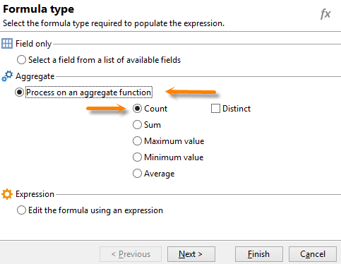
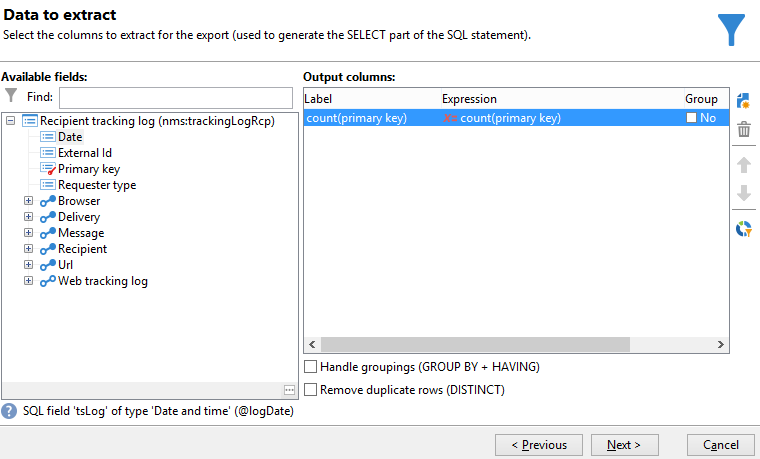
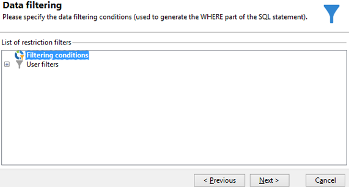

# Informations sur la diffusion de requêtes {#querying-delivery-information}

## Nombre de clics pour une diffusion spécifique {#number-of-clicks-for-a-specific-delivery}

Dans cet exemple, vous allez rechercher le nombre de clics des destinataires, sur une diffusion spécifique. Ces clics sont rapportés grâce aux logs de tracking des destinataires, sur une période donnée. Le destinataire va être identifié au moyen de son adresse email. Cette requête utilise la table **[!UICONTROL Logs de tracking des destinataires]**.

* Quelle table doit-on sélectionner ?

   La table des logs de tracking des destinataires (**[!UICONTROL nms:trackingLogRcp]**).

* Quels sont les champs à sélectionner en colonne de sortie ?

   Clé primaire (avec comptage) et Email.

* En fonction de quels critères seront filtrées les informations ?

   En fonction d&#39;une période précise et en fonction d&#39;un élément du libellé de diffusion.

Pour réaliser cet exemple, les étapes sont les suivantes :

1. Ouvrez le **[!UICONTROL Requêteur générique]** et sélectionnez le schéma **[!UICONTROL Logs de tracking des destinataires]**.

   

1. Dans la fenêtre **[!UICONTROL Données à extraire]**, vous allez créer un agrégat afin de collecter les informations. Pour cela, ajoutez la clé primaire (située au-dessous de l&#39;élément principal **[!UICONTROL Logs de tracking des destinataires]**) : c&#39;est sur ce champ **[!UICONTROL Clé primaire]** qu&#39;est effectué le comptage des logs de tracking. L&#39;expression éditée sera **[!UICONTROL x=count(clé primaire)]**. Elle va associer la somme des différents logs de tracking à une seule adresse email.

   Pour cela :

   * Cliquez sur l&#39;icône **[!UICONTROL Ajouter]**, située à droite du champ **[!UICONTROL Colonnes de sortie]**. Dans la fenêtre **[!UICONTROL Type de formule]**, cliquez sur **[!UICONTROL Editer la formule à partir d&#39;une expression]** puis sur **[!UICONTROL Suivant]**. Dans la fenêtre **[!UICONTROL Champ à sélectionner]**, cliquez sur **[!UICONTROL Sélection avancée]**.

      

   * Dans la fenêtre **[!UICONTROL Type de formule]**, réalisez un traitement sur la fonction d&#39;agrégat. Ce traitement sera le comptage d&#39;une clé primaire.

      Sélectionnez **[!UICONTROL Traitement sur une fonction d&#39;agrégat]** dans le champ **[!UICONTROL Agrégat]**. Cliquez sur l&#39;option **[!UICONTROL Comptage]**.

      

      Cliquez sur **[!UICONTROL Suivant]**.

   * Sélectionnez le champ **[!UICONTROL Clé primaire (@id)]**. La colonne de sortie **[!UICONTROL count (clé primaire)]** est paramétrée.

      

1. Sélectionnez l&#39;autre champ à afficher en colonne de sortie. Dans **[!UICONTROL Champs disponibles]**, ouvrez le noeud **[!UICONTROL Destinataire (recipient)]** puis choisissez le champ **[!UICONTROL Email (@email)]**. Cochez **[!UICONTROL Oui]** dans la case **[!UICONTROL Grouper]** afin de regrouper les logs de tracking par adresse email : ce regroupement rattache chaque log à son destinataire.

   

1. Paramétrez le tri de vos colonnes pour que les destinataires les plus actifs (ceux qui ont le plus de logs de tracking) s&#39;affichent en premier. Pour cela, cochez **[!UICONTROL Oui]** dans la colonne **[!UICONTROL Tri descendant]**.

   

1. Vous devez ensuite filtrer sur les logs qui vous intéressent, c&#39;est-à-dire ceux récents de moins de 15 jours et relatifs à des diffusions portant sur les Soldes.

   Pour cela :

   * Paramétrez les conditions de filtrage des données en sélectionnant **[!UICONTROL Critères de filtrage]**. Cliquez sur **[!UICONTROL Suivant]**.

      

   * Récupérez les logs de tracking d&#39;une diffusion spécifique et sur une période donnée. Pour cela, utilisez trois conditions de filtrage : deux conditions de date pour situer la période recherchée entre 15 jours avant la date courante et la veille de la date courante, et une autre condition pour restreindre la recherche à une diffusion particulière.

      Dans la fenêtre **[!UICONTROL Elément de la cible]**, paramétrez la date à partir de laquelle les logs de tracking sont pris en compte. Cliquez sur **[!UICONTROL Ajouter]**. Une ligne de condition s&#39;affiche. Editez la colonne **[!UICONTROL Expression]** en cliquant sur la fonction **[!UICONTROL Editer l&#39;expression]**. Dans la fenêtre **[!UICONTROL Champ à sélectionner]**, choisissez **[!UICONTROL Date (@logDate)]**.

      

      Sélectionnez l&#39;opérateur **[!UICONTROL supérieur à]** et dans la colonne **[!UICONTROL Valeur]**, cliquez sur le bouton **[!UICONTROL Editer l&#39;expression]**. Dans la fenêtre **[!UICONTROL Type de formule]**, sélectionnez **[!UICONTROL Traitement sur les dates]** puis dans **[!UICONTROL Date courante moins n jours]**, saisissez la valeur &quot;15&quot;.

      Cliquez sur **[!UICONTROL Terminer]**.

      

   * Pour sélectionner la date de fin de la recherche des logs de tracking, créez une deuxième condition en cliquant sur **[!UICONTROL Ajouter]**. Dans la colonne **[!UICONTROL Expression]**, choisissez de nouveau le champ **[!UICONTROL Date (@logDate)]**.

      Sélectionnez l&#39;opérateur **[!UICONTROL inférieur à]**. Dans la colonne **[!UICONTROL Valeur]**, cliquez sur le bouton **[!UICONTROL Editer l&#39;expression]**. Pour le traitement sur les dates, de la fenêtre **[!UICONTROL Type de formule]**, saisissez la valeur &quot;1&quot; dans **[!UICONTROL Date courante moins n jours]**.

      Cliquez sur **[!UICONTROL Terminer]**.

      

      L&#39;intervalle de temps est configuré. La troisième condition de filtrage est à paramétrer : elle permettra d&#39;identifier la diffusion sur laquelle porte la recherche.

   * Cliquez sur la fonction **[!UICONTROL Ajouter]** pour créer une autre condition de filtrage. Cliquez sur **[!UICONTROL Editer l&#39;expression]** dans la colonne **[!UICONTROL Expression]**. Dans la fenêtre **[!UICONTROL Champ à sélectionner]**, choisissez le champ **[!UICONTROL Libellé]** du noeud **[!UICONTROL Diffusion]**.

      Cliquez sur **[!UICONTROL Terminer]**.

      

      Recherchez une diffusion dont l&#39;intitulé contient le terme &quot;soldes&quot;. Vous ne connaissez plus le libellé exact de la diffusion recherchée, choisissez donc l&#39;opérateur **[!UICONTROL contient]**. Dans la colonne **[!UICONTROL Valeur]**, entrez le terme &quot;soldes&quot;.

      

1. Dans la fenêtre **[!UICONTROL Formatage des données]**, cliquez sur **[!UICONTROL Suivant]** : aucun formatage n&#39;est nécessaire dans notre exemple.
1. Dans la fenêtre **[!UICONTROL Prévisualisation des données]**, cliquez sur **[!UICONTROL Lancer la prévisualisation des données]** afin d&#39;obtenir le nombre de logs de tracking de chaque destinataire sur la diffusion.

   Le résultat des logs de tracking est présenté dans un ordre descendant.

   

   Le nombre de logs le plus élevé pour un utilisateur est de 11 sur cette diffusion. 6 utilisateurs différents ont ouvert l&#39;email de diffusion ou cliqué sur un lien de l&#39;email.

## Destinataires n&#39;ayant ouvert aucune diffusion {#recipients-who-did-not-open-any-delivery}

Dans cet exemple, nous voulons filtrer les destinataires n&#39;ayant pas ouvert d&#39;email au cours des 7 derniers jours.

Pour réaliser cet exemple, les étapes sont les suivantes :

1. Placez une activité **[!UICONTROL Requête]** dans un workflow, puis ouvrez-la.
1. Cliquez sur **[!UICONTROL Edition de la requête]** et définissez les dimensions de ciblage et de filtrage sur **[!UICONTROL Destinataires]**.

   

1. Sélectionnez **[!UICONTROL Critères de filtrage]**, puis cliquez sur **[!UICONTROL Suivant]**.
1. Cliquez sur le bouton **[!UICONTROL Ajouter]** et sélectionnez **[!UICONTROL Logs de tracking]**.
1. Définissez l&#39;**[!UICONTROL Opérateur]** de l&#39;expression **[!UICONTROL Logs de tracking]** sur **[!UICONTROL n&#39;existent pas tel que]**.

   

1. Ajoutez une autre expression. Sélectionnez **[!UICONTROL Type]** dans la catégorie **[!UICONTROL URL]**.
1. Définissez ensuite son **[!UICONTROL Opérateur]** sur **[!UICONTROL égal à]** et sa **[!UICONTROL Valeur]** sur **[!UICONTROL Ouverte]**.

   

1. Ajoutez une autre expression et sélectionnez **[!UICONTROL Date]**. L&#39;**[!UICONTROL Opérateur]** doit être défini sur **[!UICONTROL plus tard que]**.

   

1. Pour définir la valeur sur les 7 derniers jours, cliquez sur le bouton **[!UICONTROL Editer l&#39;expression]** dans le champ **[!UICONTROL Valeur]**.
1. Dans la catégorie **[!UICONTROL Fonction]**, sélectionnez **[!UICONTROL Date courante moins n jours]** et ajoutez le nombre de jours à cibler. Dans le cas présent, nous voulons cibler les 7 derniers jours.

   

Votre transition sortante contiendra les destinataires n&#39;ayant pas ouvert d&#39;email au cours des 7 derniers jours.

Si, au contraire, vous souhaitez filtrer les destinataires ayant ouvert au moins un email, votre requête doit être la suivante. Notez que, dans ce cas, la **[!UICONTROL Dimension de filtrage]** doit être définie sur **[!UICONTROL Logs de tracking (destinataires)]**.

## Destinataires ayant ouvert une diffusion {#recipients-who-have-opened-a-delivery}

L&#39;exemple suivant montre comment cibler les profils ayant ouvert une diffusion au cours des 2 dernières semaines :

1. Pour cibler les profils ayant ouvert une diffusion, vous devez utiliser les logs de tracking. Ils sont stockés dans une table liée : vous devez donc d&#39;abord sélectionner cette table dans la liste déroulante du champ **[!UICONTROL Dimension de filtrage]**, comme ci-dessous :

   

1. Au niveau des conditions de filtrage, cliquez sur l&#39;icône **[!UICONTROL Editer l&#39;expression]** de la condition affichée en sous-arborescence des logs de tracking. Choisissez le champ **[!UICONTROL Date]**.

   

   Cliquez sur **[!UICONTROL Terminer]** pour valider la sélection.

   Afin de ne récupérer que les logs de tracking postérieurs aux 15 derniers jours, vous devez sélectionner l&#39;opérateur **[!UICONTROL Supérieur à]**.

   

   Puis cliquez sur l&#39;icône **[!UICONTROL Editer l&#39;expression]** de la colonne **[!UICONTROL Valeur]** afin de définir la formule de calcul à appliquer. Sélectionnez la formule **[!UICONTROL Date courante moins n jours]** et saisissez la valeur 15 ans le champ correspondant.

   

   Cliquez sur le bouton **[!UICONTROL Terminer]** de la fenêtre de formule. Dans la fenêtre de filtrage, cliquez sur l&#39;onglet **[!UICONTROL Aperçu]** pour vérifier les conditions de ciblage.

   

## Filtrage du comportement des destinataires après une diffusion {#filtering-recipients--behavior-folllowing-a-delivery}

Dans un workflow, les boîtes **[!UICONTROL Requête]** et **[!UICONTROL Partage]** permettent de sélectionner un comportement, suite à une précédente diffusion. Cette sélection se fait à partir du filtre **[!UICONTROL Destinataire d&#39;une diffusion]**.

* But de l&#39;exemple

   Dans un workflow de diffusion, plusieurs méthodes permettent de suivre une première communication par email. Ce type d&#39;opération est réalisé à partir de la boîte **[!UICONTROL Partage]**.

* Contexte

   Une diffusion &quot;Offre sports d&#39;été&quot; est envoyée. Quatre jours après l&#39;envoi, deux autres diffusions sont renvoyées. L&#39;une est &quot;Offre sports nautiques&quot;, l&#39;autre est une relance de la première diffusion &quot;Offre sports d&#39;été&quot;.

   La diffusion &quot;Offre sports nautiques&quot; est envoyée aux destinataires qui ont cliqué sur la thématique &quot;sports nautiques&quot; dans la première diffusion. Ces clics montrent l&#39;intérêt des destinataires. Ils peuvent donc être orientés vers des offres similaires. En revanche, les destinataires qui n&#39;ont pas cliqué dans l&#39;email &quot;Offre sports d&#39;été&quot; sont relancés avec le même contenu.

Les étapes suivantes indiquent comment paramétrer la boîte **[!UICONTROL Partage]** en y intégrant deux comportements différents :

1. Insérez la boîte **[!UICONTROL Partage]** dans le workflow. Elle va répartir les destinataires de la première diffusion vers une des deux diffusions suivantes. Cette répartition est faite en fonction des critères de filtrage liés aux comportements des destinataires dans la première diffusion.

   

1. Ouvrez la boîte **[!UICONTROL Partage]**. Dans l&#39;onglet **[!UICONTROL Général]**, entrez un libellé : &quot;**Partage selon Comportement**&quot; par exemple.

   

1. Dans l&#39;onglet **[!UICONTROL Sous-ensembles]**, définissez la première branche de partage. Par exemple, donnez le libellé &quot;**Ayant cliqué**&quot; pour cette branche.
1. Sélectionnez l&#39;option **[!UICONTROL Ajouter une condition de filtrage sur la population entrante]**. Cliquez sur **[!UICONTROL Editer]**.
1. Dans la fenêtre **[!UICONTROL Dimension de ciblage et de filtrage]**, double-cliquez sur le filtre **[!UICONTROL Destinataires d&#39;une diffusion]**.

   

1. Dans la fenêtre **[!UICONTROL Elément de la cible]**, sélectionnez le comportement à appliquer sur cette branche : **[!UICONTROL Les destinataires ayant cliqué (email)]**.

   En dessous, sélectionnez l&#39;option **[!UICONTROL Diffusion spécifiée par la transition]**. Cette fonctionnalité va automatiquement récupérer les personnes ciblées lors de la première diffusion.

   Il s&#39;agira donc de la diffusion &quot;Offre sports nautiques&quot;.

   

1. Définissez la seconde branche. Cette branche va inclure l&#39;email de relance avec le même contenu que dans la première diffusion. Dans l&#39;onglet **[!UICONTROL Sous-ensembles]**, cliquez sur **[!UICONTROL Ajouter]** afin de la créer.

   

1. Un sous-onglet supplémentaire s&#39;affiche. Nommez-le &quot;**N&#39;ayant pas cliqué**&quot;.
1. Cliquez sur **[!UICONTROL Ajouter une condition de filtrage sur la population entrante]**. Cliquez ensuite sur **[!UICONTROL Editer...]**

   

1. Cliquez sur **[!UICONTROL Destinataires d&#39;une diffusion]** dans la fenêtre **[!UICONTROL Dimension de ciblage et de filtrage]**.
1. Dans la fenêtre **[!UICONTROL Elément de la cible]**, sélectionnez le comportement **[!UICONTROL Les destinataires n&#39;ayant pas cliqué (email)]**. Sélectionnez l&#39;option **[!UICONTROL Diffusion spécifiée par la transition]** comme pour la première branche.

   La boîte **[!UICONTROL Partage]** est maintenant paramétrée.

   

Voici la liste des différents comportements proposés par défaut :

* **[!UICONTROL Tous les destinataires,]**
* **[!UICONTROL Les destinataires des messages envoyés avec succès,]**
* **[!UICONTROL Les destinataires ayant ouvert ou cliqué (email),]**
* **[!UICONTROL Les destinataires ayant cliqué (email),]**
* **[!UICONTROL Les destinataires des messages en échec,]**
* **[!UICONTROL Les destinataires n&#39;ayant ni ouvert ni cliqué (email),]**
* **[!UICONTROL Les destinataires n&#39;ayant pas cliqué (email).]**

   
