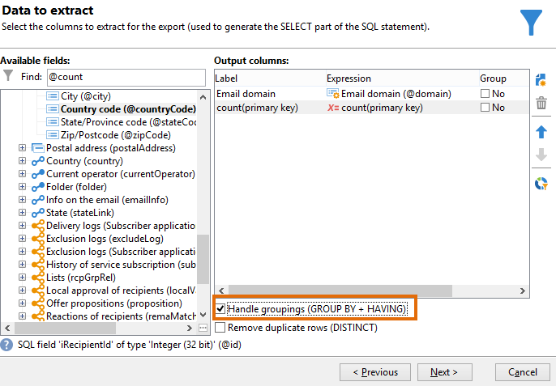
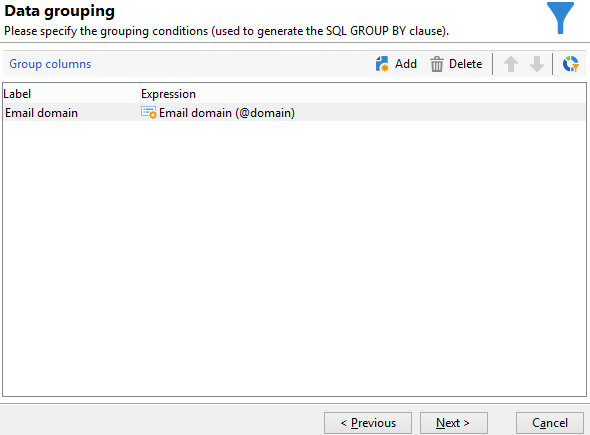

# Requête avec gestion des regroupements {#querying-using-grouping-management}

Vous allez effectuer une requête pour retrouver les domaines d&#39;email ciblés plus de 30 fois au cours de diffusions précédentes.

* Quelle table doit-on sélectionner ?

  La table des destinataires (nms:recipient).

* Quels sont les champs à sélectionner en colonne de sortie ?

  Domaine de l&#39;email et clé primaire (avec un comptage).

* Groupement des données ?

  En fonction du domaine d&#39;email avec un comptage des clés primaires supérieures à 30. Cette opération s&#39;effectue avec l&#39;option **[!UICONTROL Group by + Having]**. **[!UICONTROL Group by + Having]** sert à effectuer un groupement (&quot;group by&quot;) et une sélection de ce qui a été groupé (&quot;having&quot;).

Pour réaliser cet exemple, les étapes sont les suivantes :

1. Ouvrez le **[!UICONTROL Requêteur générique]** et choisissez la table des Destinataires (**nms:recipient**).

   

1. Dans le **[!UICONTROL Données à extraire]** , sélectionnez la **[!UICONTROL Domaine d’e-mail]** et **[!UICONTROL clé de Principal]** champs. Exécuter un comptage sur le **[!UICONTROL clé de Principal]** champ .

1. Sélectionnez l&#39;option **[!UICONTROL Gérer les groupements (GROUP BY + HAVING)]**.

   

1. Dans le **[!UICONTROL Tri]** trier les domaines d’e-mail par ordre décroissant. Pour ce faire, cochez **[!UICONTROL Oui]** dans le **[!UICONTROL Tri descendant]** colonne. Cliquez sur **[!UICONTROL Suivant]**.

   

1. In **[!UICONTROL Filtrage des données]**, sélectionnez **[!UICONTROL Conditions de filtrage]**. Accéder à **[!UICONTROL Éléments de la cible]** fenêtre et clic **[!UICONTROL Suivant]**.
1. Dans la fenêtre **[!UICONTROL Groupement des données]**, sélectionnez le **[!UICONTROL Domaine de l&#39;email]** en cliquant sur **[!UICONTROL Ajouter]**.

   C&#39;est dans cette fenêtre que s&#39;opère le regroupement (GROUP BY) : cette fenêtre ne s&#39;affiche que si l&#39;option **[!UICONTROL Gérer les groupements (GROUP BY + HAVING)]** a été sélectionnée.

   

1. Dans la fenêtre **[!UICONTROL Condition de groupement]**, indiquez un comptage de la clé primaire supérieur à 30. Ainsi, seuls les domaines d&#39;email ciblés plus de 30 fois seront retournés en résultat.

   Cette fenêtre s&#39;affiche si la case **[!UICONTROL Gérer les groupements (GROUP BY + HAVING)]** a été cochée au préalable : c&#39;est là que le résultat du groupement est filtré (HAVING).

   

1. Dans la fenêtre **[!UICONTROL Formatage des données]**, cliquez sur **[!UICONTROL Suivant]** : aucun formatage n&#39;est nécessaire dans cet exemple.
1. Dans la fenêtre de prévisualisation des données, cliquez sur **[!UICONTROL Lancer la prévisualisation des données]** : ici, neuf domaines d&#39;emails différents ciblés plus de 30 fois sont retournés en résultat.

   
