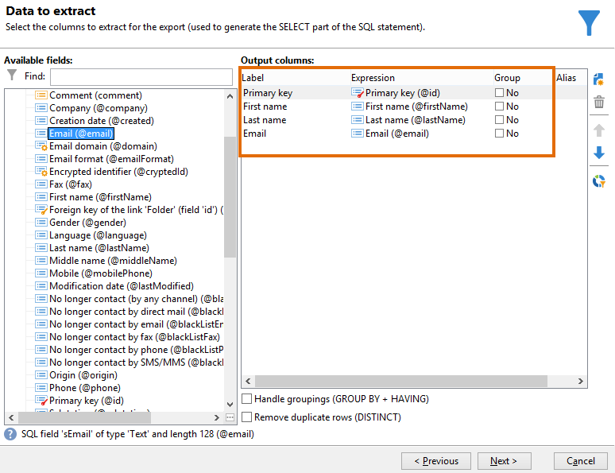
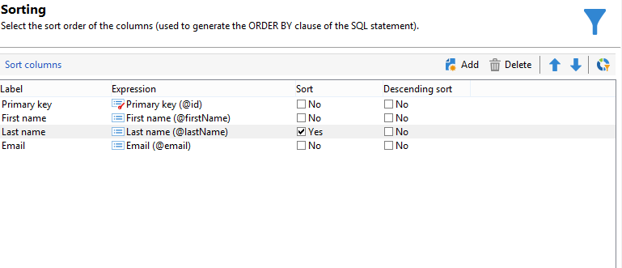
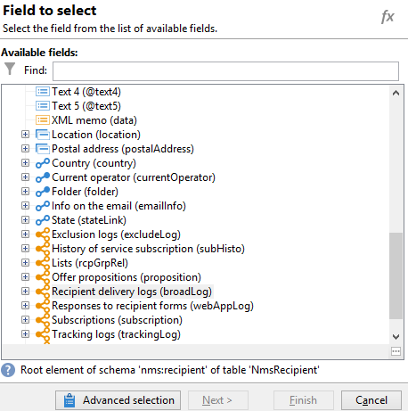
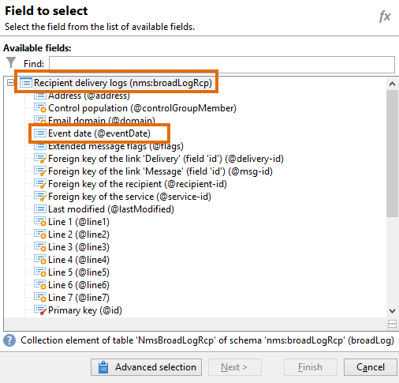
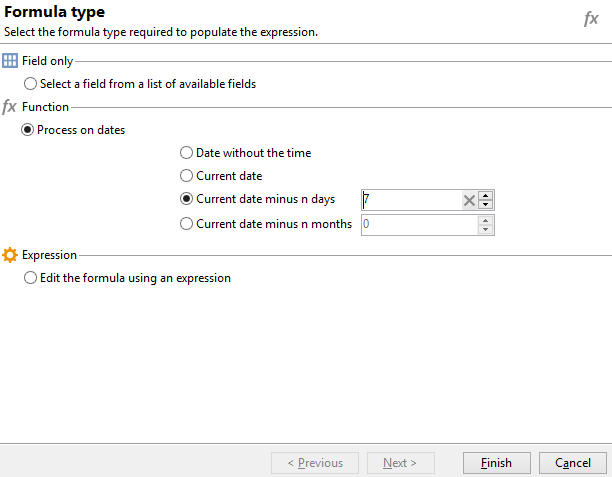
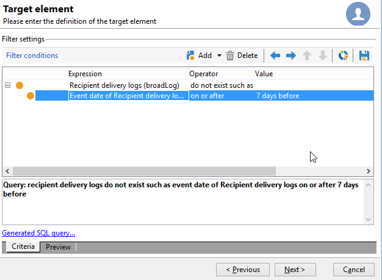
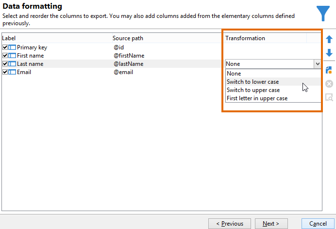
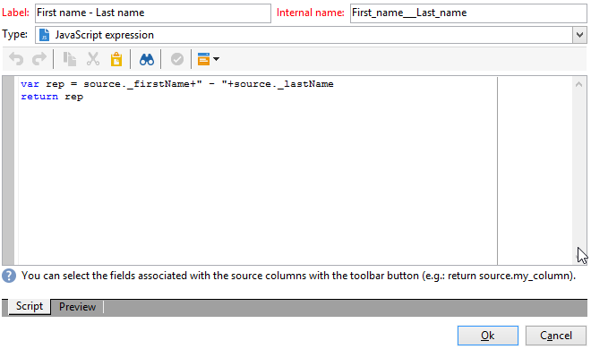
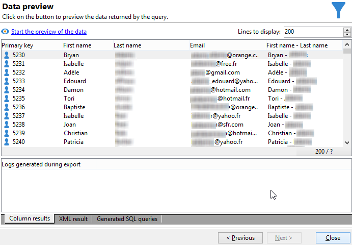

# Requête avec une relation multiple-à-multiple {#querying-using-a-many-to-many-relationship}


Dans cet exemple, nous allons récupérer les destinataires qui n&#39;ont pas été contactés au cours des 7 derniers jours. Cette requête concerne toutes les diffusions.

Cet exemple montre également comment configurer un filtre associé au choix d&#39;un élément de collection (ou d&#39;un nœud orange). Les éléments de collection sont disponibles dans la fenêtre **[!UICONTROL Champ à sélectionner]**.

* Quelle table doit-on sélectionner ?

  La table des destinataires (**nms:recipient**)

* Quels sont les champs à sélectionner en colonne de sortie ?

  Clé primaire, Nom, Prénom et Email.

* En fonction de quels critères seront filtrées les informations ?

  En fonction des logs de diffusion des destinataires. Ils remontent jusqu&#39;à 7 jours avant la date du jour.

Les étapes sont les suivantes :

1. Ouvrez le Requêteur générique et sélectionnez l’**[!UICONTROL Table des destinataires (nms:recipient)]**.
1. Dans la fenêtre **[!UICONTROL Données à extraire]**, sélectionnez les champs **[!UICONTROL Clé primaire]**, **[!UICONTROL Prénom]**, **[!UICONTROL Nom]** et **[!UICONTROL Email]**.

   

1. Dans la fenêtre de tri, ordonnez les noms alphabétiquement.

   

1. Dans la fenêtre **[!UICONTROL Filtrage des données]**, choisissez **[!UICONTROL Critères de filtrage]**.
1. Dans la fenêtre **[!UICONTROL Élément cible]**, la condition de filtrage permettant d&#39;extraire les profils sans log de tracking pour les 7 derniers jours implique deux étapes. L’élément à sélectionner est un lien n-n.

   * Tout d&#39;abord, sélectionnez l&#39;élément de collection (noeud orange) **[!UICONTROL Logs de diffusion des destinataires (broadlog)]** pour la première colonne **[!UICONTROL Valeur]**.

     

     Sélectionnez l’opérateur **[!UICONTROL n’existe pas en tant que]**. Il n’est pas nécessaire de sélectionner une deuxième valeur sur cette ligne.

   * Le contenu de la seconde condition de filtrage découle directement du choix de la première. Ici, le champ **[!UICONTROL Date de l&#39;événement]** est directement proposé dans la table **[!UICONTROL Logs de diffusion des destinataires]** car un lien s&#39;opère vers cette table.

     

     Sélectionnez **[!UICONTROL Date de l&#39;événement]** avec l&#39;opérateur **[!UICONTROL supérieur ou égal à]**. Sélectionnez la valeur **[!UICONTROL DaysAgo (7)]**. Pour cela, cliquez sur **[!UICONTROL Editer l&#39;expression]** dans le champ **[!UICONTROL Valeur]**. Dans la fenêtre **[!UICONTROL Type de formule]**, sélectionnez **[!UICONTROL Traitement sur les dates]** puis **[!UICONTROL Date courante moins n jours]** et saisissez la valeur &quot;7&quot;.

     

     La condition de filtrage est paramétrée.

     

1. Dans la fenêtre **[!UICONTROL Formatage des données]**, modifiez la casse des noms : ils doivent s&#39;afficher en majuscules. Cliquez sur la ligne du **[!UICONTROL Nom]** dans la colonne **[!UICONTROL Transformation]** et choisissez **[!UICONTROL Passer en majuscules]** dans le menu déroulant.

   

1. Utilisez la fonction **[!UICONTROL Ajouter un champ calculé]** pour insérer une colonne dans la fenêtre de prévisualisation des données.

   Dans cet exemple, ajoutez un champ calculé qui regroupe le prénom et le nom des destinataires dans une seule colonne. Cliquez sur **[!UICONTROL Ajouter un champ calculé]**. Dans la fenêtre **[!UICONTROL Définition d&#39;un champ calculé d&#39;export]**, saisissez un libellé et un nom interne puis choisissez le type **[!UICONTROL Expression JavaScript]**. Entrez l&#39;expression ci-dessous :

   ```
   var rep = source._firstName+" - "+source._lastName
   return rep
   ```

   

   Cliquez sur **[!UICONTROL OK]**. La fenêtre **[!UICONTROL Formatage des données]** est paramétrée.

   Pour plus d&#39;informations sur l&#39;ajout de champs calculés, consultez cette section.

1. Le résultat s’affiche dans la fenêtre **[!UICONTROL Aperçu des données]**. Les destinataires qui n&#39;ont pas été contactés au cours des 7 derniers jours sont affichés par ordre alphabétique. Les noms sont affichés en majuscules et la colonne contenant les noms et prénoms a été créée.

   
