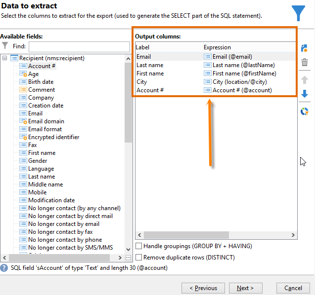
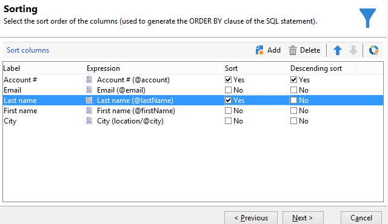
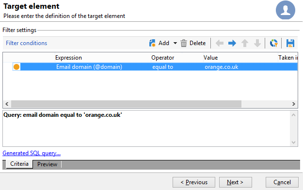
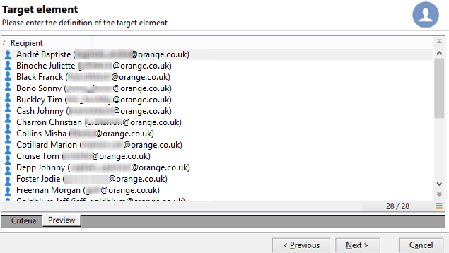
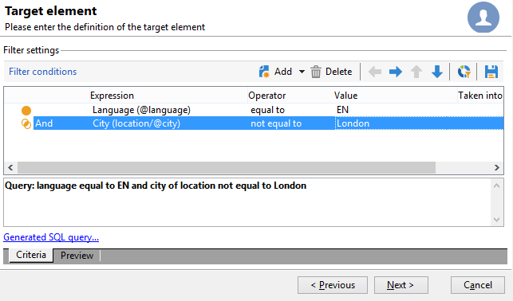
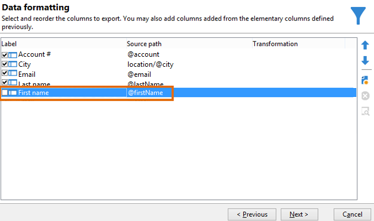
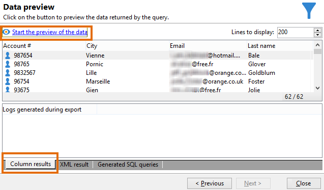
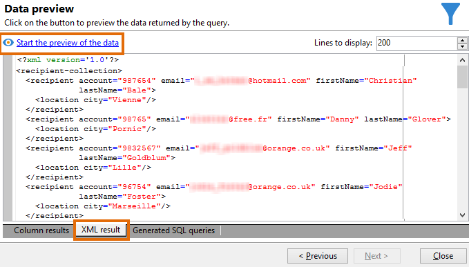
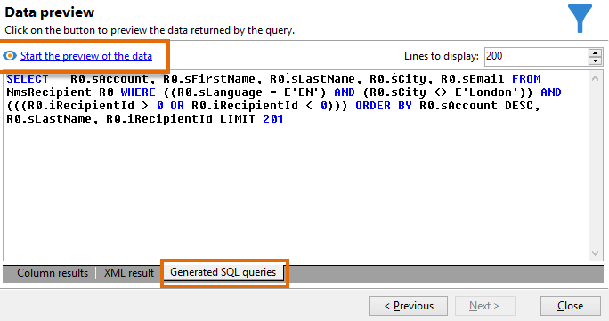

# Requête de la table des destinataires {#querying-recipient-table}

Dans cet exemple, vous allez récupérer les noms et emails des destinataires dont le domaine d&#39;email est &quot;free.fr&quot; et non domiciliés à Paris.

* Quelle table doit-on sélectionner ?

  Table des personnes destinataires (nms:recipient).

* Champs à sélectionner en colonnes de sortie.

  Email, Nom, Ville et Numéro de compte.

* En fonction de quels critères seront filtrés les destinataires ?

  En fonction de la ville de résidence et du domaine d&#39;email.

* Y a-t-il tri ?

  Oui, en fonction du **[!UICONTROL N° de compte]** et du **[!UICONTROL Nom]**.

Pour réaliser cet exemple, les étapes sont les suivantes :

1. Cliquez sur **[!UICONTROL Outils > Requêteur générique...]** et choisissez le tableau **Destinataires** (**nms:recipient**) . Cliquez sur **[!UICONTROL Suivant]**.
1. Sélectionnez : **[!UICONTROL Nom]**, **[!UICONTROL Prénom]**, **[!UICONTROL Email]**, **[!UICONTROL Ville]** et **[!UICONTROL Numéro de compte]**. Ces champs sont alors ajoutés à **[!UICONTROL Colonnes de sortie]**. Cliquez sur **[!UICONTROL Suivant]**.

   

1. Triez les colonnes pour les afficher dans le bon ordre. Ici, nous voulons trier les numéros de compte par ordre décroissant et les noms par ordre alphabétique. Cliquez sur **[!UICONTROL Suivant]**.

   

1. Dans la fenêtre **[!UICONTROL Filtrage des données]**, affinez votre recherche en sélectionnant **[!UICONTROL Critères de filtrage]**. Cliquez sur **[!UICONTROL Suivant]**.
1. La fenêtre **[!UICONTROL Elément de la cible]** sert à renseigner les paramètres de filtrage.

   Définissez la condition de filtrage suivante : les destinataires ont un domaine d’e-mail correspondant à « free.fr ». Pour cela, sélectionnez **Domaine d&#39;e-mail (@email)** dans la colonne **[!UICONTROL Expression]** et choisissez **égal à** dans la colonne **[!UICONTROL Opérateur]**. Enfin, renseignez « free.fr » dans la colonne **[!UICONTROL Valeur]**.

   

1. Si nécessaire, cliquez sur le bouton **[!UICONTROL Répartition des valeurs]** pour visualiser une répartition selon le domaine d&#39;email des prospects. Un pourcentage est disponible pour chaque domaine d&#39;e-mail de la base de données. Les domaines autres que « orange.co.uk » sont affichés jusqu’à ce que le filtre soit appliqué.

   Le résumé de la requête s&#39;affiche au bas de la fenêtre, soit : **Domaine de l&#39;email égal à &#39;free.fr&#39;**.

1. Cliquez sur l&#39;onglet **[!UICONTROL Aperçu]** pour avoir une première idée du résultat de la requête. Seuls les destinataires avec des domaines d&#39;email &quot;free.fr&quot; sont affichés.

   

1. Modifiez la requête pour obtenir des contacts non domiciliés à Paris.

   Sélectionnez **[!UICONTROL Ville (location/@city)]** dans la colonne **[!UICONTROL Expression]**, l&#39;opérateur **[!UICONTROL différent de]** et saisissez **[!UICONTROL Paris]** dans l&#39;autre colonne **[!UICONTROL Valeur]**.

   

1. Vous accédez alors à la fenêtre **[!UICONTROL Formatage des données]**. Vérifiez l’ordre des colonnes. Déplacez la colonne « Ville » vers le haut sous la colonne « Numéro de compte ».

   Décochez la ligne &quot;Prénom&quot; pour ne plus l&#39;afficher en résultat.

   

1. Dans la fenêtre **[!UICONTROL Aperçu des données]**, cliquez sur **[!UICONTROL Démarrer l&#39;aperçu des données]**. Cette fonction calcule le résultat de la requête.

   L&#39;onglet **[!UICONTROL Résultat en colonnes]** vous présente le résultat de la requête en colonnes.

   Le résultat affiche tous les destinataires avec un domaine d’e-mail « orange.co.uk » qui ne vivent pas à Londres. La colonne « Prénom » n’est pas affichée, car elle n’a pas été cochée lors de l’étape précédente. Les numéros de compte sont triés par ordre décroissant.

   

   L&#39;onglet **[!UICONTROL Résultat XML]** montre le résultat au format XML.

   

   L’onglet **[!UICONTROL Requêtes SQL générées]** vous présente le résultat de la requête en langage SQL.

   
