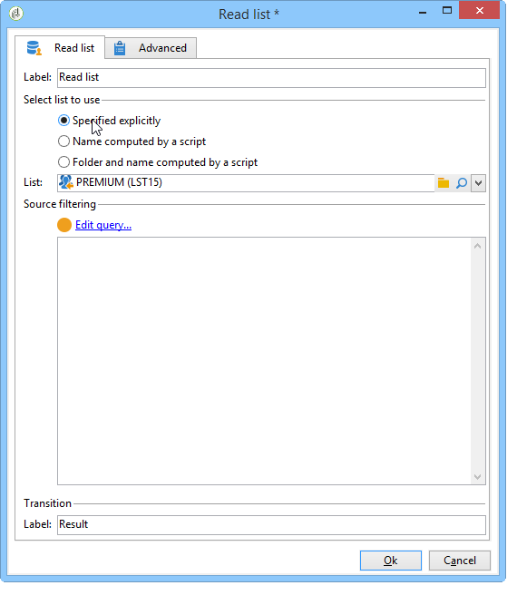

# Lecture de liste{#read-list}

Les données traitées dans un workflow peuvent provenir de listes dont les données ont été préparées et structurées au préalable (lors d&#39;une segmentation antérieure ou d&#39;un chargement de fichier).

L&#39;activité **[!UICONTROL Lecture de liste]** permet de copier les données d&#39;une liste dans une table de travail du workflow, comme les données issues d&#39;une requête. Elles sont alors accessibles tout au long du workflow.

La liste à traiter peut être spécifiée explicitement, calculée par un script ou localisée dynamiquement, selon les options sélectionnées et les paramètres définis dans l&#39;activité **[!UICONTROL Lecture de liste]**.

Si la liste n&#39;est pas spécifiée explicitement, vous devez indiquer une liste qui sera utilisée comme modèle pour connaître sa structure.

Une fois la sélection de la liste paramétrée, vous pouvez ajouter un filtre en utilisant l&#39;option **[!UICONTROL Éditer la requête]** afin de ne conserver qu&#39;une partie de la population pour la suite du workflow.

>[!CAUTION]
>
>Pour pouvoir créer un filtre dans une activité de lecture de liste, la liste concernée doit être de type &quot;fichier&quot;.

Les listes peuvent être créées directement dans Adobe Campaign à partir du lien **[!UICONTROL Profils et Cibles > Listes]** de la page d&#39;accueil. Elles peuvent également être créées dans un workflow en utilisant l&#39;activité **[!UICONTROL Mise à jour de liste]**.

**Exemple : exclure une liste d&#39;adresses d&#39;un envoi**

L&#39;exemple suivant permet d&#39;utiliser une liste d&#39;adresses emails à exclure de la cible d&#39;une diffusion par email.

Les profils contenus dans le dossier **NvxContacts** doivent être ciblés par une action de diffusion. Les adresses emails à exclure de la cible sont stockées dans une liste externe. Dans notre exemple, seule l&#39;information relative aux adresses emails est nécessaire à l&#39;exclusion.

1. La requête de sélection du dossier **NvxContact** doit permettre de charger l&#39;adresse email des profils sélectionnés, ceci afin de permettre le rapprochement avec les informations contenues dans la liste.

   

1. Ici, la liste est stockée dans le dossier **Externes** et son libellé est calculé.

   

1. Afin d&#39;exclure de la cible principale les adresses emails de la liste externe, vous devez paramétrer l&#39;activité d&#39;exclusion et indiquer que le dossier **NvxContacts** contient les données à conserver. Les données communes entre cet ensemble et tout autre ensemble en entrée de l&#39;activité d&#39;exclusion seront supprimées de la cible.

   

   Les règles d&#39;exclusion sont paramétrées dans la section centrale de l&#39;éditeur. Cliquez sur le bouton **[!UICONTROL Ajouter]** pour définir le type d&#39;exclusion à appliquer.

   Vous pouvez définir plusieurs exclusions, selon le nombre de transitions en entrée de l&#39;activité.

1. Dans le champ **[!UICONTROL Ensemble exclu]**, sélectionnez l&#39;activité **[!UICONTROL Lecture de liste]** : ce sont les données contenues dans cette activité qui sont à exclure de l&#39;ensemble principal.

   Dans notre exemple, il s’agit d’une exclusion sur jointure : les données contenues dans la liste seront réconciliées avec celles de l’ensemble principal via le champ qui contient l’adresse e-mail. Pour paramétrer la jointure, sélectionnez **[!UICONTROL Jointures]** dans le champ **[!UICONTROL Changement de dimension]**.

   

1. Sélectionnez ensuite le champ correspondant à l&#39;adresse email dans les deux ensembles (Source et Destination). Les colonnes seront alors associées et les destinataires dont l&#39;adresse email figure dans la liste d&#39;adresses importée seront exlcus de la cible.
