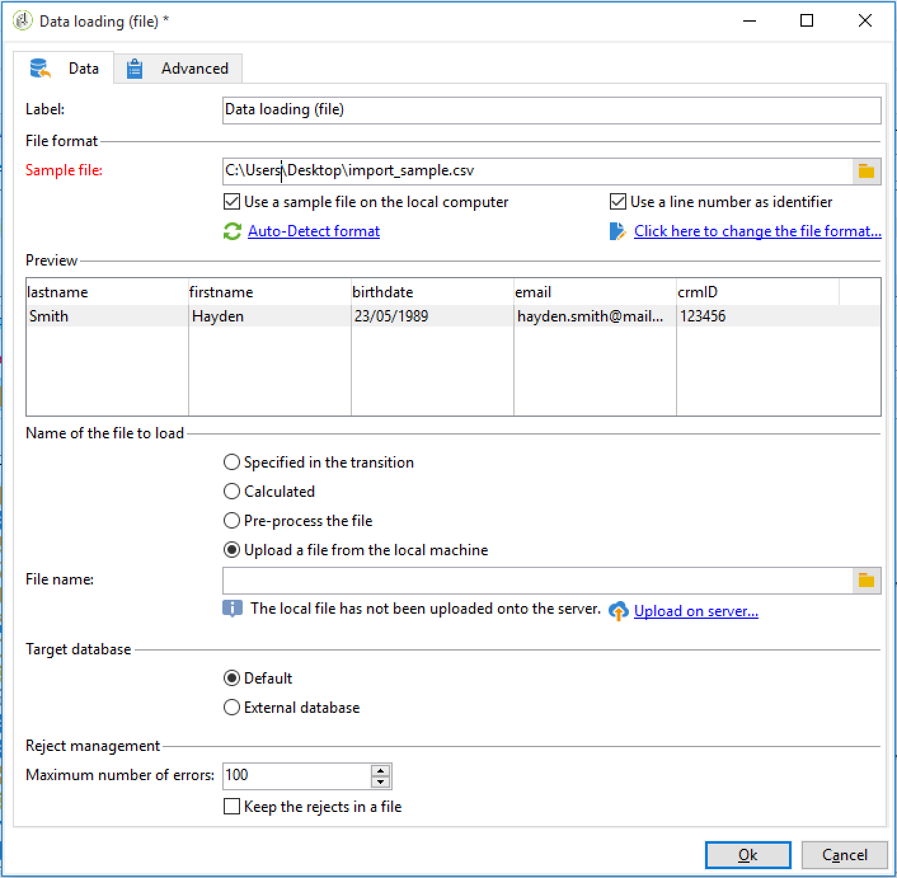

# Configuration d’un workflow d’import récurrent {#setting-up-a-recurring-import}


L&#39;utilisation d&#39;un modèle de workflow est une bonne pratique si vous devez importer régulièrement des fichiers de structure identique.

Cet exemple montre comment pré-paramétrer un workflow qui pourra être réutilisé pour importer des profils en provenance d&#39;un CRM dans la base de données Adobe Campaign. Pour plus d&#39;informations sur tous les paramétrages possibles pour chaque activité, reportez-vous à cette [section](activities.md).

1. Créez un nouveau modèle de workflow à partir de **[!UICONTROL Ressources > Modèles > Modèles de workflow]**.
1. Ajoutez les activités suivantes :

   * **[!UICONTROL Chargement (fichier)]** : définissez la structure attendue du fichier contenant les données à importer.
   * **[!UICONTROL Enrichissement]** : réconciliez les données importées avec les données se trouvant dans la base de données.
   * **[!UICONTROL Partage]** : créez des filtres pour traiter les enregistrements différemment selon qu&#39;ils aient pu ou non être réconciliés.
   * **[!UICONTROL Déduplication]** : dédupliquez les données du fichier entrant avant son import dans la base de données.
   * **[!UICONTROL Mise à jour de données]** : mettez la base de données à jour avec les profils importés.

   

1. Configurez l&#39;activité **[!UICONTROL Chargement (fichier)]** :

   * Définissez la structure attendue en téléchargeant un fichier exemple. Le fichier exemple ne doit contenir que quelques lignes mais toutes les colonnes nécessaires pour l&#39;import. Vérifiez et éditez le format du fichier pour vous assurer que le type de chaque colonne est paramétré correctement : texte, date, nombre entier, etc.
Par exemple :

     ```
     lastname;firstname;birthdate;email;crmID
     Smith;Hayden;23/05/1989;hayden.smith@mailtest.com;123456
     ```

   * Dans la section **[!UICONTROL Nom du fichier à charger]**, sélectionnez **[!UICONTROL Télécharger un fichier présent sur le poste local]** et laissez le champ vide. A chaque fois qu&#39;un nouveau workflow sera créé à partir de ce modèle, vous pourrez préciser ici le fichier souhaité (tant qu&#39;il correspond à la structure définie).

     Toutes les options sont utilisables, mais il faut modifier le modèle en conséquence. Par exemple, en sélectionnant **[!UICONTROL Spécifié par la transition]**, vous pouvez ajouter une activité **[!UICONTROL Transfert de fichier]** devant pour récupérer le fichier à importer à partir d&#39;un serveur FTP/SFTP. Avec la connexion S3 ou SFTP, vous pouvez également importer des données de segments vers Adobe Campaign avec la plateforme de données clientes en temps réel d’Adobe. Voir à ce propos cette [documentation](https://experienceleague.adobe.com/docs/experience-platform/destinations/catalog/email-marketing/adobe-campaign.html?lang=fr).

     

1. Configurez l&#39;activité **[!UICONTROL Enrichissement]**. Dans ce contexte, le but de cette activité est d&#39;identifier les données entrantes.

   * Dans l&#39;onglet **[!UICONTROL Enrichissement]**, sélectionnez **[!UICONTROL Ajouter des données]** et définissez un lien entre les données importées et la dimension de ciblage des destinataires. Dans cet exemple, le champ personnalisé **Identifiant dans le CRM** permet de créer la condition de jointure. Utilisez le champ ou la combinaison de champs nécessaire tant que l&#39;identification des enregistrements uniques reste possible.
   * Dans l&#39;onglet **[!UICONTROL Réconciliation]**, laissez l&#39;option **[!UICONTROL Identifier le document de ciblage à partir des données de travail]** décochée.

   

1. Configurez l&#39;activité de **[!UICONTROL Partage]** pour récupérer les destinataires réconciliés dans une transition, et les destinataires qui n&#39;ont pas pu être réconciliés mais qui disposent de suffisamment de données dans une autre transition.

   La transition des destinataires réconciliés peut alors être utilisée pour mettre à jour la base de données. La transition des destinataires inconnus peut servir à créer de nouvelles entrées de destinataires dans la base de données si un ensemble d&#39;informations minimum est disponible dans le fichier.

   Les destinataires ne pouvant pas être réconciliés et ne disposant pas de suffisamment de données sont sélectionnés dans une transition sortante complémentaire et peuvent être exportés dans un fichier séparé ou tout simplement ignorés.

   * Dans l&#39;onglet **[!UICONTROL Général]** de l&#39;activité, sélectionnez **[!UICONTROL Utiliser les données additionnelles uniquement]** comme paramètre de filtrage et vérifiez que la **[!UICONTROL Dimension de ciblage]** est paramétrée automatiquement sur **[!UICONTROL Enrichissement]**.

     Cochez l&#39;option **[!UICONTROL Générer le complémentaire]** pour voir si des enregistrements n&#39;ont pas pu être intégrés dans la base de données. Le cas échéant, vous pourrez alors appliquer d&#39;autres traitements aux données complémentaires : export de fichier, mise à jour de liste, etc.

   * Dans le premier sous-ensemble de l&#39;onglet **[!UICONTROL Sous-ensembles]**, ajoutez une condition de filtrage sur la population entrante pour sélectionner uniquement les enregistrements pour lesquels la clé primaire du destinataire est différente de 0. De cette manière les données du fichier réconciliées avec les destinataires de la base de données sont sélectionnées dans ce sous-ensemble.

     

   * Ajoutez un second sous-ensemble pour sélectionner les enregistrements non réconciliés disposant de suffisamment de données pour être intégrés dans la base de données. Par exemple : adresse email, prénom et nom de famille.

     Les sous-ensembles sont traités dans l&#39;ordre dans lequel ils ont été créés, ce qui veut dire que lorsque ce second sous-ensemble est traité, tous les enregistrements qui existent déjà dans la base de données sont déjà sélectionnés dans le premier sous-ensemble.

     

   * Tous les enregistrement qui ne sont pas sélectionnés dans les deux premiers sous-ensembles sont sélectionnés dans le **[!UICONTROL Complémentaire]**.

1. Configurez l&#39;activité **[!UICONTROL Mise à jour de données]** située après la première transition sortante de l&#39;activité **[!UICONTROL Partage]** paramétrée précédemment.

   * Sélectionnez **[!UICONTROL Mise à jour]** comme **[!UICONTROL Type d&#39;opération]**, puisque la transition entrante contient uniquement des destinataires déjà présents dans la base de données.
   * Dans la section **[!UICONTROL Identification des enregistrements]**, sélectionnez **[!UICONTROL En utilisant des clés de réconciliation]** et définissez une clé entre la dimension de ciblage et le lien créé dans l&#39;**[!UICONTROL Enrichissement]**. Dans cet exemple, le champ personnalisé **Identifiant dans le CRM** est utilisé.
   * Dans la section **[!UICONTROL Champs à mettre à jour]**, indiquez les champs de la dimension des destinataires à mettre à jour avec la valeur de la colonne correspondante du fichier. Si les noms des colonnes du fichier sont identiques ou presque identiques aux noms des champs de la dimension des destinataires, utilisez le bouton baguette magique pour réconcilier les différents champs automatiquement.

     

1. Configurez l&#39;activité **[!UICONTROL Déduplication]** située après la transition contenant les destinataires non réconciliés :

   * Sélectionnez **[!UICONTROL Editer la configuration]** et paramétrez la dimension de ciblage sur le schéma temporaire généré à partir de l&#39;activité **[!UICONTROL Enrichissement]** du workflow.

     

   * Dans cet exemple, le champ email est utilisé pour trouver les profils uniques. Vous pouvez utiliser n&#39;importe quel champ dont vous êtes sûr qu&#39;il est rempli et qu&#39;il fait partie d&#39;une combinaison unique.
   * Dans l&#39;écran **[!UICONTROL Méthode de déduplication]**, sélectionnez **[!UICONTROL Paramètres avancés]** et cochez l&#39;option **[!UICONTROL Désactiver le filtrage automatique des enregistrements d&#39;identifiant 0]** pour veiller à ce que les enregistrements dont la clé primaire est égale à 0 (normalement, tous les enregistrements de cette transition) sont exclus.

   

1. Configurez l&#39;activité **[!UICONTROL Mise à jour de données]** située après l&#39;activité **[!UICONTROL Déduplication]** paramétrée précédemment.

   * Sélectionnez **[!UICONTROL Insertion]** comme **[!UICONTROL Type d&#39;opération]** comme la transition entrante contient uniquement des destinataires non présents dans la base de données.
   * Dans la section **[!UICONTROL Identification des enregistrements]**, sélectionnez **[!UICONTROL En utilisant directement la dimension de ciblage]** et choisissez la dimension **[!UICONTROL Destinataires]**.
   * Dans la section **[!UICONTROL Champs à mettre à jour]**, indiquez les champs de la dimension des destinataires à mettre à jour avec la valeur de la colonne correspondante du fichier. Si les noms des colonnes du fichier sont identiques ou presque identiques aux noms des champs de la dimension des destinataires, utilisez le bouton baguette magique pour réconcilier les différents champs automatiquement.

     

1. Après la troisième transition de l&#39;activité **[!UICONTROL Partage]**, ajoutez une activité **[!UICONTROL Extraction (fichier)]** et une activité **[!UICONTROL Transfert de fichier]** si vous souhaitez conserver une trace des données non intégrées dans la base de données. Paramétrez ces activités afin d&#39;exporter la colonne dont vous avez besoin et de transférer le fichier sur un serveur FTP ou SFTP, où vous pourrez le récupérer.
1. Ajoutez une activité **[!UICONTROL Fin]** et enregistrez le modèle de workflow.

Le modèle est à présent utilisable et disponible pour chaque nouveau workflow. Il suffira alors de spécifier le fichier contenant les données à importer dans l&#39;activité **[!UICONTROL Chargement (fichier)]**.


