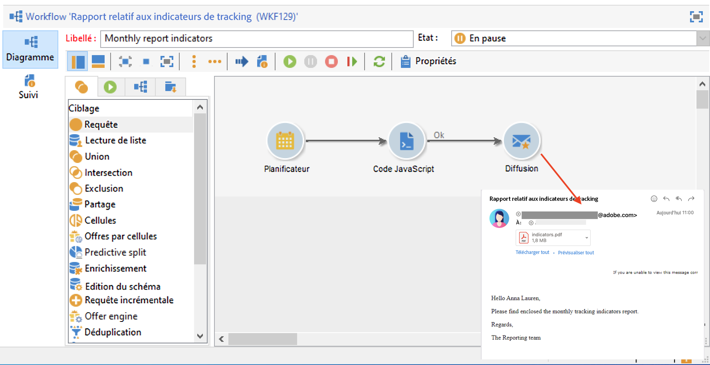
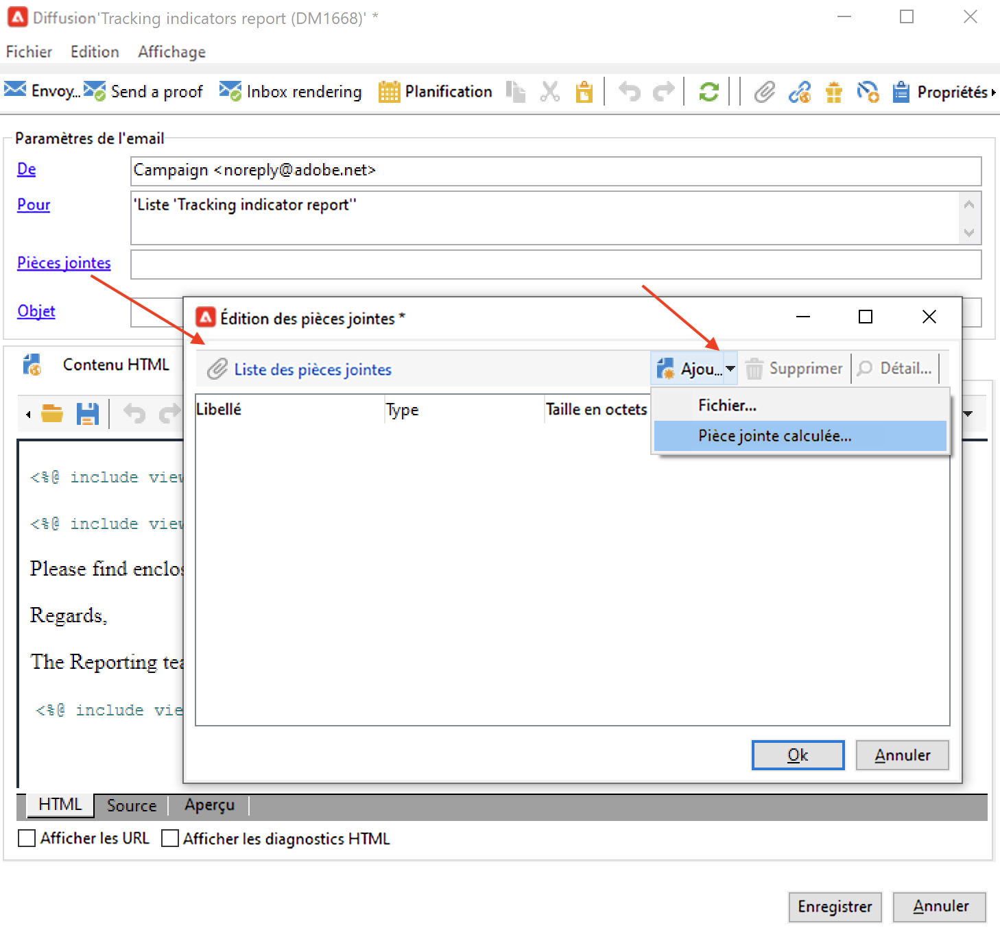
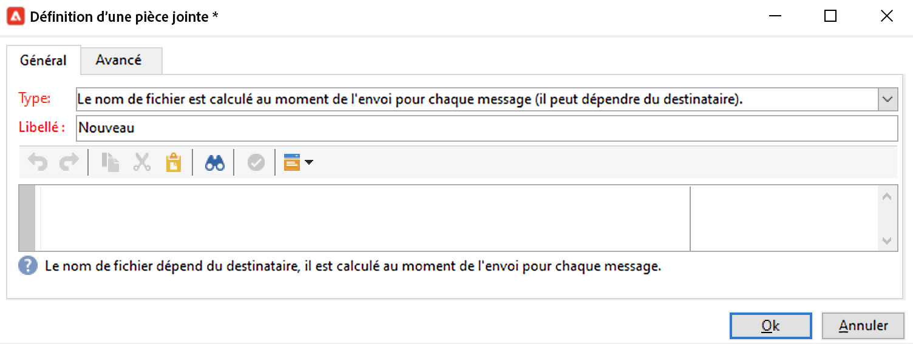
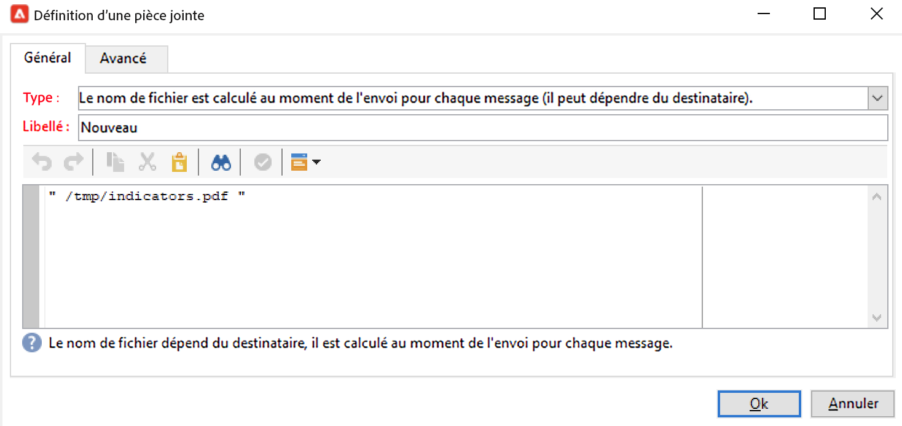
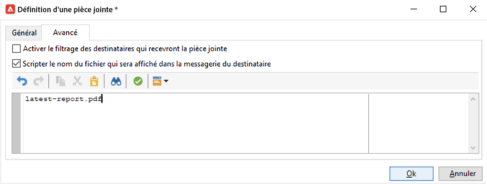
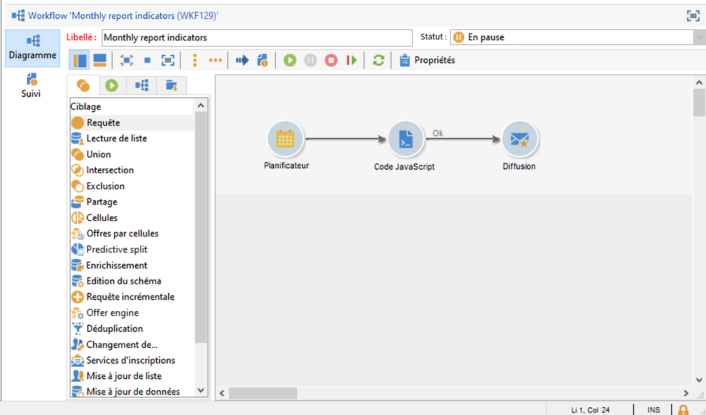
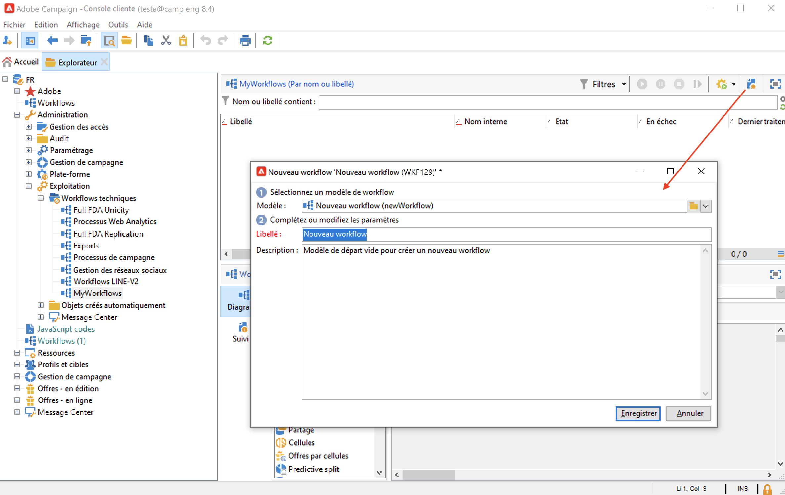
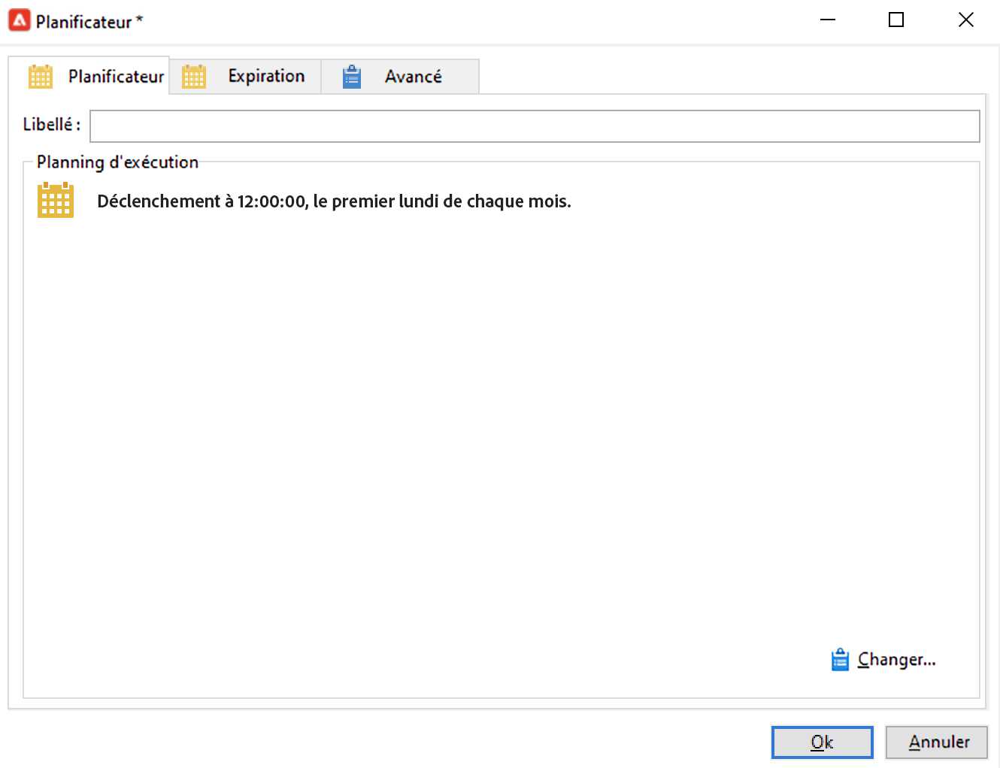
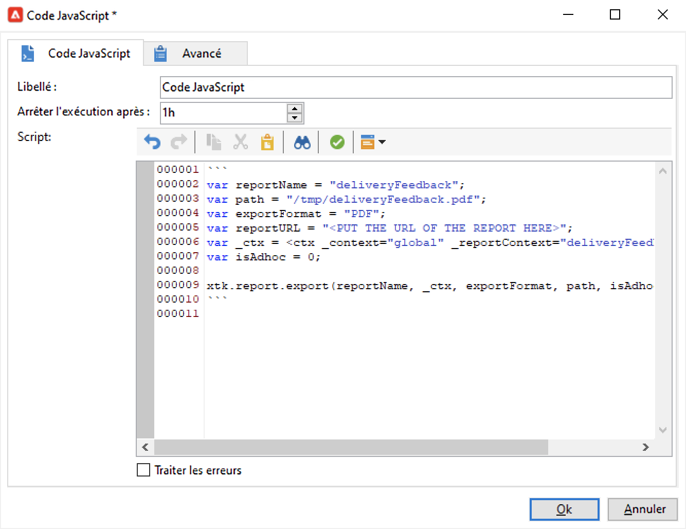
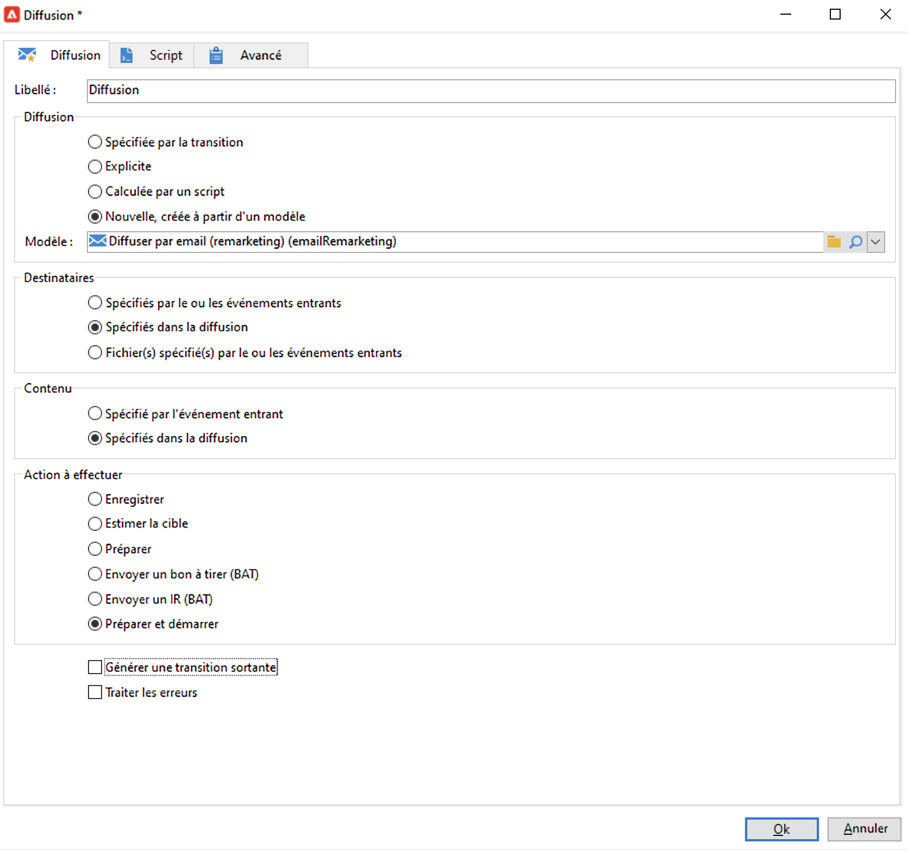

# Envoi d’un rapport à une liste{#send-a-report-to-a-list}

Ce cas pratique présente comment générer, chaque mois, le rapport d&#39;usine **[!UICONTROL Indicateurs de tracking]** au format PDF et l&#39;envoyer à une liste de destinataires.



Les étapes principales de mise en oeuvre de ce cas pratique sont les suivantes :

* Créez une liste de destinataires pour ce rapport. [En savoir plus](#step-1--create-the-recipient-list).
* Créez un modèle de diffusion qui crée une diffusion à chaque exécution du workflow. [En savoir plus](#step-2--create-the-delivery-template).
* Créez un workflow qui génère le rapport au format PDF et l’envoie à la liste des destinataires. [En savoir plus](#step-3--create-the-workflow).

## Étape 1 : créer la liste de destinataires {#step-1--create-the-recipient-list}

Pour créer la liste des destinataires ciblés, procédez comme suit :

1. Accédez à l’onglet **[!UICONTROL Profils et cibles]**, puis cliquez sur le lien **[!UICONTROL Listes]**.
1. Cliquez sur le bouton **[!UICONTROL Créer]**.
1. Sélectionnez **[!UICONTROL Nouvelle liste]** et créez une liste de destinataires à laquelle envoyer le rapport.

Pour plus d’informations sur la création de listes, consultez [cette section](../../v8/audiences/create-audiences.md).

## Étape 2 : créer le modèle de diffusion {#step-2--create-the-delivery-template}

Pour créer un modèle de diffusion, procédez comme suit :

1. Dans l’explorateur Adobe Campaign, accédez au nœud **[!UICONTROL Ressources > Modèles > Modèles de diffusion]** et dupliquez le modèle intégré **[!UICONTROL Diffuser par email]**.

   Pour plus d’informations sur la création d’un modèle de diffusion, consultez [cette section](../../v8/send/create-templates.md).

1. Renseignez les différents paramètres du modèle : le libellé, la cible (la liste de destinataires précédemment créée), l’objet et le contenu.

   Chaque fois que le workflow est exécuté, le rapport des **[!UICONTROL Indicateurs de tracking]** est mis à jour. Reportez-vous à l’[Étape 3 : créer le workflow](#step-3--creating-the-workflow) pour plus de détails.

1. Pour inclure la dernière version du rapport dans la diffusion, vous devez ajouter une **[!UICONTROL Pièce jointe calculée]** :

   * Cliquez sur le lien **[!UICONTROL Pièces jointes]**, puis sur la flèche en regard du bouton **[!UICONTROL Ajouter]**. Sélectionnez **[!UICONTROL Pièce jointe calculée...]**.

     

   * Dans la liste déroulante **[!UICONTROL Type]**, sélectionnez la dernière option : **[!UICONTROL Le nom de fichier est calculé au moment de l’envoi pour chaque message (il peut dépendre du destinataire)]**.

     

     La valeur renseignée dans le champ **[!UICONTROL Libellé]** n’apparaîtra pas dans la diffusion finale.

   * Dans la zone de texte, saisissez le chemin d’accès et le nom du fichier.

     

     >[!CAUTION]
     >
     >Le chemin d’accès et le nom doivent être identiques à ceux saisis dans l’activité de type **[!UICONTROL Code JavaScript]** du workflow. Reportez-vous à l’[Étape 3 : créer le workflow](#step-3--creating-the-workflow) pour plus de détails.

   * Sélectionnez l’onglet **[!UICONTROL Avancé]** et cochez la case **[!UICONTROL Scripter le nom du fichier qui sera affiché dans la messagerie du destinataire]**. Dans la zone de texte, saisissez le nom de la pièce jointe dans la diffusion finale.

     

## Étape 3 : créer le workflow {#step-3--creating-the-workflow}

Créez le workflow suivant pour ce cas d’utilisation.



Trois activités interviennent dans ce workflow :

* Une activité **[!UICONTROL Planificateur]**, qui exécute le workflow une fois par mois ;
* Une activité **[!UICONTROL Code JavaScript]**, qui génère le rapport au format PDF ;
* Une activité **[!UICONTROL Diffusion]**, qui référence le modèle de diffusion créé précédemment.

Pour créer ce workflow, procédez comme suit :

1. Accédez au nœud **[!UICONTROL Administration > Exploitation > Workflows techniques]** de l’explorateur Campaign. Créez ensuite un dossier pour stocker vos workflows.
1. Créez un workflow.

   

1. Ajoutez tout d&#39;abord une activité de type **[!UICONTROL Planificateur]** et configurez-la pour que le workflow s&#39;exécute le premier lundi de chaque mois.

   

   Pour plus d&#39;informations sur la configuration du planificateur, consultez la section [Planificateur](scheduler.md).

1. Ajoutez ensuite une activité de type **[!UICONTROL Code JavaScript]**.

   

   Dans la zone d&#39;édition, saisissez le code suivant :

   ```sql
   var reportName = "indicators";
   var path = "/tmp/indicators.pdf";
   var exportFormat = "PDF";
   var reportURL = "<PUT THE URL OF THE REPORT HERE>";
   var _ctx = <ctx _context="global" _reportContext="deliveryFeedback" />
   var isAdhoc = 0;
   
   xtk.report.export(reportName, _ctx, exportFormat, path, isAdhoc);
   ```


   Renseignez les variables suivantes :

   * **var reportName** : saisissez, entre guillemets, le nom interne du rapport. Dans notre exemple, le nom interne du rapport **Indicateur de tracking** est &quot;deliveryFeedback&quot;.
   * **var path** : saisissez le chemin de sauvegarde du fichier (« tmp »), le nom que vous souhaitez lui donner (« deliveryFeedback ») et son extension (« .pdf »). Ici, nous avons utilisé le nom interne comme nom de fichier. Les valeurs doivent être comprises entre guillemets et séparées par le caractère « + ».

     >[!CAUTION]
     >
     >Le fichier doit être enregistré sur le serveur. Vous devez saisir le même chemin d’accès et le même nom que ceux renseignés sous l’onglet **[!UICONTROL Général]** de la fenêtre de modification de la pièce jointe calculée, comme indiqué [ici](#step-2--create-the-delivery-template).

   * **var exportFormat** : saisissez le format d&#39;export du fichier (&quot;PDF&quot;).
   * **var _ctx** (contexte) : dans notre exemple, nous utilisons le rapport **[!UICONTROL Indicateurs de tracking]** dans son contexte global.

1. Ajoutez enfin une activité de **[!UICONTROL Diffusion]** et choisissez les options suivantes :

   

   * **[!UICONTROL Diffusion]** : sélectionnez **[!UICONTROL Nouvelle, créée depuis un modèle]**, et sélectionnez le modèle de diffusion créé précédemment.
   * Pour les champs **[!UICONTROL Destinataires]** et **[!UICONTROL Contenu]**, sélectionnez **[!UICONTROL Spécifiés dans la diffusion]**.
   * **[!UICONTROL Action à effectuer]** : sélectionnez **[!UICONTROL Préparer et démarrer]**.
   * Décochez les options **[!UICONTROL Générer une transition sortante]** et **[!UICONTROL Traiter les erreurs]**.

1. Enregistrez les modifications apportées et lancez le workflow. Le message est envoyé à la liste de destinataires chaque premier lundi du mois, avec le rapport en pièce jointe.
