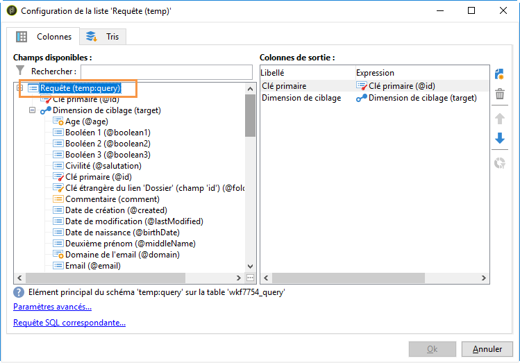

# Envoi d’alertes personnalisées aux opérateurs{#sending-personalized-alerts-to-operators}


Dans cet exemple, nous souhaitons envoyer à un opérateur une alerte qui contiendra le nom des profils qui ont ouvert une newsletter, sans toutefois cliquer sur le lien qu&#39;il contient.

Les champs de prénom et nom des profils sont liés à la dimension de ciblage **[!UICONTROL Destinataires]**, alors que l&#39;activité **[!UICONTROL Alerte]** est liée à la dimension de ciblage **[!UICONTROL Opérateur]**. En conséquence, aucun champ n&#39;est disponible entre les deux dimensions de ciblage pour effectuer une réconciliation, récupérer les champs de prénom et nom, et les afficher dans l&#39;activité Alerte.

Le processus créé un workflow comme ci-dessous :

1. Utilisez une activité **[!UICONTROL Requête]** sur les données de la cible.
1. Ajoutez une activité **[!UICONTROL Code JavaScript]** dans le workflow afin d&#39;enregistrer la population de la requête dans la variable d&#39;instance.
1. Utilisez une activité **[!UICONTROL Test]** pour vérifier la population.
1. Utilisez une activité **[!UICONTROL Alerte]** pour envoyer une alerte à un opérateur, selon le résultat de l&#39;activité **[!UICONTROL Test]**.


## Enregistrer la population dans la variable d&#39;instance {#saving-the-population-to-the-instance-variable}

Ajoutez le code ci-dessous dans l&#39;activité **[!UICONTROL Code JavaScript]**.

```
var query = xtk.queryDef.create(  
    <queryDef schema="temp:query" operation="select">  
      <select>  
       <node expr="[target/recipient.@firstName]"/>  
       <node expr="[target/recipient.@lastName]"/>  
      </select>  
     </queryDef>  
  );  
  var items = query.ExecuteQuery();
```

Assurez-vous que le code JavaScript correspond à vos informations de workflow :

* Le tag **[!UICONTROL queryDef schema]** devrait correspondre au nom de la dimension de ciblage utilisée dans l&#39;activité de requête.
* Le tag **[!UICONTROL node expr]** devrait correspondre au nom des champs que vous voulez récupérer.


Pour récupérer ces informations, procédez comme suit :

1. Cliquez avec le bouton droit sur la transition sortante à partir de l’activité **[!UICONTROL Requête]**, puis sélectionnez **[!UICONTROL Afficher la cible]**.

   

1. Cliquez avec le bouton droit sur la liste, puis sélectionnez **[!UICONTROL Configurer la liste]**.

   

1. Les noms des champs et de la dimension de ciblage de la requête s&#39;affichent dans la liste

   

## Tester le comptage de la population {#testing-the-population-count}

Ajoutez le code ci-dessous dans l&#39;activité **[!UICONTROL Test]** pour vérifier si la population ciblée contient au moins 1 profil.

```
var.recCount>0
```


## Configurer l&#39;alerte {#setting-up-the-alert}

Maintenant que la population a été ajoutée dans la variable d&#39;instance avec les champs souhaités, vous pouvez ajouter ces informations dans l&#39;activité **[!UICONTROL Alerte]**.

Pour ce faire, ajoutez le code ci-dessous dans l&#39;onglet **[!UICONTROL Source]** :

```
<ul>
<%
var items = new XML(instance.vars.items)
for each (var item in items){
%>
<li><%= item.target.@firstName %> <%= item.target.@lastName %></li>
<%
} %></ul>
```

>[!NOTE]
>
>La commande **[!UICONTROL &lt;%= item.target.recipient.@fieldName %>]** vous permet d&#39;ajouter l&#39;un des champs qui ont été enregistrés dans la variable d&#39;instance via l&#39;activité **[!UICONTROL Code JavaScript]**.\
>Vous pouvez ajouter autant de champs que vous le souhaitez, dès lors qu&#39;ils ont été insérés dans le code JavaScript.


