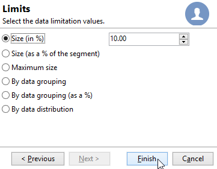
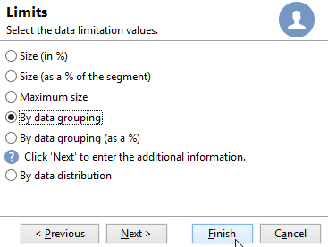
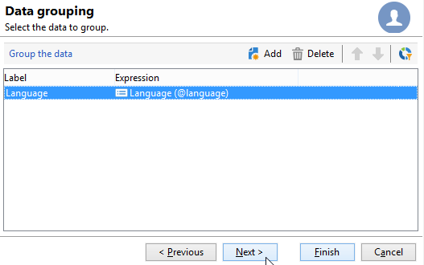

# Partage{#split}

Une activité de type **Partage** permet de partitionner une cible en plusieurs sous-ensembles. La cible est construite avec tous les résultats reçus : toutes les activités antérieures doivent donc être terminées pour que cette activité soit exécutée.

Cette activité ne fait pas l&#39;union des populations entrantes. Si plusieurs transitions arrivent sur une activité de partage, il est recommandé d’insérer une activité **[!UICONTROL Union]** avant.

>[!NOTE]
>
>Les opérations de partage ne peuvent pas être effectuées pour les tables qui ont des sources différentes. Pour le réaliser, vous devez ajouter une activité d’**Enrichissement** avant l’activité **Partage**.

* Consultez un exemple d&#39;utilisation de l&#39;activité de partage dans [cette section](targeting-workflows.md#create-subsets-using-the-split-activity).
* Un exemple d&#39;utilisation de l&#39;activité de Partage pour segmenter la cible en différentes populations à l&#39;aide des conditions de filtrage est présenté dans [cette section](cross-channel-delivery-workflow.md).
* Un exemple d&#39;utilisation d&#39;une variable d&#39;instance dans une activité de Partage est présenté dans [cette section](javascript-scripts-and-templates.md).

Pour paramétrer cette activité, vous devez définir le contenu et le libellé des sous-ensembles souhaités dans l&#39;onglet **[!UICONTROL Sous-ensembles]**, puis choisir la dimension de ciblage dans l&#39;onglet **[!UICONTROL Général]**.

## Créer des sous-ensembles {#create-subsets}

Pour créer un sous-ensemble :

1. Saisissez un libellé dans le champ correspondant et sélectionnez le mode de filtrage à appliquer.
1. Pour filtrer la population entrante, sélectionnez l&#39;option **[!UICONTROL Ajouter une condition de filtrage]** et cliquez sur le lien **[!UICONTROL Editer...]**.

   Sélectionnez le type de filtre à appliquer aux données pour qu&#39;elles soient incluses dans cet ensemble.

   Le mode de fonctionnement est le même que pour une activité de type **Requête**.

   >[!NOTE]
   >
   >Vous pouvez filtrer les données contenues dans deux bases externes (FDA) maximum.

1. Définissez éventuellement un nombre maximum d&#39;enregistrements à extraire de la cible pour créer le sous-ensemble. Pour cela, cochez l’option **[!UICONTROL Limiter les enregistrements sélectionnés]** et cliquez sur le lien **[!UICONTROL Éditer...]**.

   Un assistant vous permet de choisir le mode de sélection des enregistrements de ce sous-ensemble. [En savoir plus](#limit-the-number-of-subset-records).

   

1. Si vous le souhaitez, **ajoutez d&#39;autres sous-ensembles** en utilisant le bouton **[!UICONTROL Ajouter]**.

   

   >[!NOTE]
   >
   >Si l&#39;option **[!UICONTROL Permettre le recouvrement des populations de sortie]** n&#39;est pas cochée, les sous-ensembles sont créés dans l&#39;ordre des onglets. Utilisez les flèches situées dans la section supérieure droite de cette fenêtre pour les déplacer. Ainsi, si le premier sous-ensemble récupère 70% de la population initiale, le sous-ensemble suivant n&#39;appliquera ses critères de sélection qu&#39;aux 30% restants, etc.

   Pour chaque sous-ensemble créé, une transition sortante sera ajoutée à l&#39;activité de partage.

   

   Vous pouvez choisir de ne générer qu&#39;une seule transition sortante (et identifier les ensembles par exemple au travers du code segment) : pour cela, sélectionnez l&#39;option **[!UICONTROL Générer tous les sous-ensembles dans la même table]** dans l&#39;onglet **[!UICONTROL Général]**.

   S&#39;il est renseigné, le code segment de chaque sous-ensemble est automatiquement stocké dans une colonne additionnelle. Cette colonne sera accessible parmi les champs de personnalisation, au niveau des diffusions.

## Limiter le nombre d&#39;enregistrements des sous-ensembles {#limit-the-number-of-subset-records}

Si vous ne souhaitez pas utiliser l&#39;ensemble de la population d&#39;un sous-ensemble, vous avez la possibilité d&#39;en limiter le nombre d&#39;enregistrements.

1. Dans la fenêtre d&#39;édition du sous-ensemble, cochez l&#39;option **[!UICONTROL Limiter les enregistrements sélectionnés]** et cliquez sur le lien **[!UICONTROL Editer...]**.
1. Sélectionnez le type de limitation de votre choix :

   * **[!UICONTROL Activer le tirage aléatoire]** : cette option applique un tirage aléatoire aux enregistrements. Le tirage aléatoire appliqué dépend du moteur de base de données.
   * **[!UICONTROL Conserver les premiers suite à un tri]** : cette option permet de définir une limitation suivant un ou plusieurs ordres de tri. Si vous choisissez le champ **[!UICONTROL Age]** comme critère de tri, et que vous définissez ensuite une limite de 100, seuls les 100 destinataires les moins âgés seront conservés.
   * **[!UICONTROL Conserver les premiers suite à un tri (critères, aléatoire)]** : cette option regroupe les deux options précédentes. Elle permet de définir une limitation suivant un ou plusieurs ordres de tri puis d&#39;appliquer une sélection aléatoire sur les premiers enregistrements dans le cas où certains enregistrements ont des valeurs égales pour les critères choisis.

     Par exemple, si vous choisissez le champ **[!UICONTROL Age]** comme critère de tri, et que vous définissez ensuite une limite de 100, mais que les 2000 destinataires les plus jeunes en base ont tous 18 ans, alors 100 destinataires seront sélectionnés aléatoirement parmi ces 2000.

   

1. Si vous choisissez de définir des critères de tri, une étape supplémentaire vous permet de définir les colonnes et l&#39;ordre de tri.

   

1. Choisissez ensuite la méthode de limitation des données.

   

   Vous avez le choix entre les différentes méthodes suivantes :

   * **[!UICONTROL Taille (en %)]** : un pourcentage d&#39;enregistrements. Par exemple, le paramétrage ci-dessus extraira 10% de la population totale.

     Le pourcentage porte sur la population initiale, non sur le résultat de l&#39;activité.

   * **[!UICONTROL Taille (en % du segment)]** : un pourcentage d&#39;enregistrements portant uniquement sur le sous-ensemble et non sur la population initiale.
   * **[!UICONTROL Taille maximale]** : un nombre maximum d&#39;enregistrements.
   * **[!UICONTROL Par groupement de données]** : vous pouvez effectuer une limitation du nombre d&#39;enregistrements en fonction des valeurs d&#39;un champ précis de la population entrante. [En savoir plus](#limit-the-number-of-subset-records-by-data-grouping).
   * **[!UICONTROL Par groupement de données (%)]** : vous pouvez effectuer une limitation du nombre d&#39;enregistrements en fonction des valeurs d&#39;un champ précis de la population entrante, sous la forme d&#39;un pourcentage. [En savoir plus](#limit-the-number-of-subset-records-by-data-grouping).
   * **[!UICONTROL Par répartition de données]** : si vos champs de groupement comportent un trop grand nombre de valeurs ou que vous souhaitez éviter de ressaisir les valeurs à chaque nouvelle activité de partage, Adobe Campaign vous offre la possibilité d&#39;effectuer une limitation **[!UICONTROL Par répartition de données]** (module optionnel Distributed Marketing). [En savoir plus](#limit-the-number-of-subset-records-per-data-distribution).

1. Cliquez sur **[!UICONTROL Terminer]** pour valider les critères de sélection des enregistrements. Le paramétrage défini est alors affiché dans la fenêtre centrale de l&#39;éditeur.

## Limiter le nombre d&#39;enregistrements des sous-ensembles par groupement de données {#limit-the-number-of-subset-records-by-data-grouping}

Vous pouvez effectuer une limitation du nombre d&#39;enregistrements par groupement de données. Cette limitation peut être effectuée à l&#39;aide d&#39;une valeur fixe ou d&#39;un pourcentage.

Par exemple, si vous choisissez le champ **[!UICONTROL Langue]** comme champ de groupement, vous pourrez définir une limite d&#39;enregistrements pour chaque langue.

1. Lors de la sélection des valeurs de limitation de données, sélectionnez **[!UICONTROL Par groupement de données]** ou **[!UICONTROL Par groupement de données (en %)]** et cliquez sur **[!UICONTROL Suivant]**.

   

1. Sélectionnez ensuite le ou les champs de groupement (par exemple, le champ **[!UICONTROL Langue]**) et cliquez sur le bouton **[!UICONTROL Suivant]**.

   

1. Définissez enfin les valeurs de limitation des groupements de données (à l&#39;aide de valeurs fixes ou de pourcentages selon la méthode de groupement sélectionnée auparavant). Pour définir la même limite pour toutes les valeurs, par exemple si vous souhaitez limiter à 10 le nombre d&#39;enregistrements pour chaque langue, sélectionnez l&#39;option **[!UICONTROL Tous les groupements de données ont la même taille]**. Pour définir une limite différente pour chaque valeur, sélectionnez l&#39;option **[!UICONTROL Limitations par valeur de groupement]**. Vous pourrez choisir une limite différente pour l&#39;anglais, le français, etc.

   

1. Cliquez sur **[!UICONTROL Terminer]** pour valider la limitation et revenir à l&#39;édition de l&#39;activité de partage.

## Limiter le nombre d&#39;enregistrements des sous-ensembles par répartition de données {#limit-the-number-of-subset-records-per-data-distribution}

Si vos champs de groupement contiennent un trop grand nombre de valeurs ou si vous souhaitez éviter de réinitialiser les valeurs pour chaque nouvelle activité de partage, Adobe Campaign vous permet de créer une limite par répartition de données. Lors de la sélection de la section [valeurs de limitation des données](#create-subsets), choisissez l&#39;option **[!UICONTROL Par répartition de données]** et sélectionnez un modèle dans le menu déroulant. La création d&#39;un modèle de répartition de données est illustrée ci-dessous.

Un exemple d’utilisation de l&#39;activité **[!UICONTROL Validation en local]** avec un modèle de répartition est présenté sur [cette page](local-approval-activity.md).

>[!CAUTION]
>
>Cette fonctionnalité n&#39;est disponible qu&#39;avec le [composant additionnel Marketing distribué](../distributed-marketing/about-distributed-marketing.md). Veuillez vérifier votre contrat de licence.

Le modèle de répartition de données permet de limiter le nombre d&#39;enregistrements à partir d&#39;une liste de valeurs de groupement. Les étapes de création d&#39;un modèle de répartition de données sont les suivantes :

1. Pour créer le modèle de répartition de données, positionnez-vous sur le noeud **[!UICONTROL Ressources > Gestion de campagne > Répartition de données]**, et cliquez sur le bouton **[!UICONTROL Nouveau]**.

   

1. L&#39;onglet **[!UICONTROL Général]** permet de renseigner le libellé ainsi que le contexte d&#39;exécution de la répartition (dimension de ciblage, champ de répartition).

   

   Les champs à renseigner sont les suivants :

   * **[!UICONTROL Libellé]** : libellé du modèle de répartition.
   * **[!UICONTROL Dimension de ciblage]** : renseignez le schéma de ciblage sur lequel la répartition de données sera appliquée, par exemple **[!UICONTROL Destinataire]**. Ce schéma doit toujours être compatible avec les données utilisées dans le workflow de ciblage.
   * **[!UICONTROL Champ de répartition]** : choisissez un champ depuis la dimension de ciblage. Par exemple, si vous sélectionnez le champ **[!UICONTROL Domaine de l&#39;email]**, la liste de destinataires sera répartie par domaine.
   * **[!UICONTROL Type de répartition]** : sélectionnez la manière dont sera exprimée la valeur de limitation de la cible dans l&#39;onglet **[!UICONTROL Distribution]** : **[!UICONTROL Pourcentage]** ou **[!UICONTROL Fixe]**.
   * **[!UICONTROL Stockage des validations]** : si vous utilisez une activité [Validation en local](local-approval.md) dans votre workflow de ciblage, indiquez le schéma dans lequel seront stockés les résultats de validation. Vous devez spécifier un schéma de stockage pour chaque schéma de ciblage. Si vous utilisez le schéma de ciblage **[!UICONTROL Destinataires]**, saisissez le schéma de stockage par défaut **[!UICONTROL Validation en local d&#39;un destinataire]**.

     Il n&#39;est pas nécessaire de renseigner le champ **[!UICONTROL Stockage des validations]** dans le cas d&#39;une simple limitation par groupement de données, sans validation en local.

1. Si vous utilisez une activité [Validation en local](local-approval.md), renseignez ensuite les **[!UICONTROL Paramètres avancés]** du modèle de distribution :

   

   Les champs à renseigner sont les suivants :

   * **[!UICONTROL Valider les messages ciblés]** : cochez cette option si vous souhaitez que tous les destinataires soient pré-sélectionnés dans la liste de destinataires à valider. Si cette option est décochée, aucun destinataire ne sera pré-sélectionné.

     >[!NOTE]
     >
     >Cette option est cochée par défaut.

     

   * **[!UICONTROL Libellé de la diffusion]** : permet de définir une expression pour afficher le libellé de la diffusion dans la notification de retour. L&#39;expression par défaut renseigne le libellé standard de la diffusion (compute string). Vous avez la possibilité de modifier cette expression.

     

   * **[!UICONTROL Champ de groupement]** : ce champ permet de définir le groupement utilisé pour l&#39;affichage des destinataires dans les notifications de validation et de retour.

     

   * **[!UICONTROL Interface web]** : permet de lier une application web à la liste des destinataires. Dans la notification de validation et de retour, chaque destinataire sera cliquable et sera associé à l&#39;application web sélectionnée. Le champ **[!UICONTROL Paramètres]** (par exemple, **[!UICONTROL recipientId]**) permet de renseigner le paramètre additionnel qui sera utilisé dans l&#39;URL de l&#39;application web.

1. L&#39;onglet **[!UICONTROL Répartition]** permet de définir la liste des valeurs de répartition.

   

   * **[!UICONTROL Valeur]** : saisissez les valeurs de répartition.
   * **[!UICONTROL Pourcentage/Fixe]** : renseignez la limite d&#39;enregistrements (fixe ou en pourcentage) associée à chaque valeur.

     Cette colonne est définie par le champ **[!UICONTROL Type de répartition]** de l&#39;onglet **[!UICONTROL Général]**.

   * **[!UICONTROL Libellé]** : saisissez le libellé associé à chaque valeur.
   * **[!UICONTROL Groupe ou opérateur]** : si vous utilisez une activité [Validation en local](local-approval.md), sélectionnez l&#39;opérateur ou le groupe d&#39;opérateurs affecté à chaque valeur de distribution.

     Il n&#39;est pas nécessaire de renseigner le champ **[!UICONTROL Groupe ou opérateur]** dans le cas d&#39;une simple limitation par groupement de données, sans validation en local.

     >[!CAUTION]
     >
     >Vérifiez que les opérateurs disposent de l&#39;autorisation nécessaire.

## Paramètres de filtrage {#filtering-parameters}

Cliquez sur l&#39;onglet **[!UICONTROL Général]** pour saisir le libellé de l&#39;activité. Sélectionnez les dimensions de ciblage et de filtrage de ce partage. Au besoin, vous pouvez modifier ces dimensions pour tel ou tel sous-ensemble.

Cochez l&#39;option **[!UICONTROL Générer le complémentaire]** si vous souhaitez exploiter la population restante. Le complémentaire est la cible entrante, moins l&#39;union des sous-ensembles. Une transition sortante supplémentaire sera alors ajoutée à l&#39;activité, comme suit :

Pour que cette option fonctionne correctement, les données en entrée doivent posséder une clé primaire.

Par exemple si les données sont lues directement depuis une base de données externe telle que Netezza (qui ne supporte pas la notion d&#39;index) via une activité de **[!UICONTROL Chargement (SGBD)]**, le complémentaire généré par l&#39;activité de **[!UICONTROL Partage]** sera incorrect.

Pour éviter cela, vous pouvez placer une activité d&#39;**[!UICONTROL Enrichissement]** juste avant l&#39;activité de **[!UICONTROL Partage]**. Dans l&#39;activité d&#39;**[!UICONTROL Enrichissement]**, cochez l&#39;option **[!UICONTROL Conserver toutes les données additionnelles de l&#39;ensemble principal]** et indiquez en données additionnelles les colonnes que vous souhaitez utiliser pour configurer les filtres de l&#39;activité de **[!UICONTROL Partage]**. Les données de la transition entrante de l&#39;activité de **[!UICONTROL Partage]** sont alors stockées dans une table temporaire en local sur le serveur Adobe Campaign et le complémentaire peut être généré correctement.

L&#39;option **[!UICONTROL Permettre le recouvrement des populations de sortie]** permet de gérer les populations qui appartiennent à plusieurs sous-ensembles :

* Lorsque la case est décochée, l’activité de partage assure qu’une personne destinataire ne sera pas présente dans plusieurs transitions en sortie, même si elle vérifie les critères de plusieurs sous-ensembles. Il sera dans la cible du premier onglet dont les critères sont vérifiés.
* Lorsque la case est cochée, les personnes destinataires peuvent apparaître dans plusieurs sous-ensembles si elles sont associées aux bons critères de filtrage. Adobe Campaign vous recommande d’utiliser des critères exclusifs.

## Paramètres d&#39;entrée {#input-parameters}

* tableName
* schema

Chacun des événements entrants doit spécifier une cible définie par ces paramètres.

## Paramètres de sortie {#output-parameters}

* tableName
* schema
* recCount

Ce triplet de valeurs identifie la cible résultant de l&#39;exclusion. **[!UICONTROL tableName]** est le nom de la table qui mémorise les identifiants de la cible, **[!UICONTROL schema]** est le schéma de la population (habituellement nms:recipient) et **[!UICONTROL recCount]** est le nombre d’éléments dans la table.

La transition associée au complémentaire possède les mêmes paramètres.
