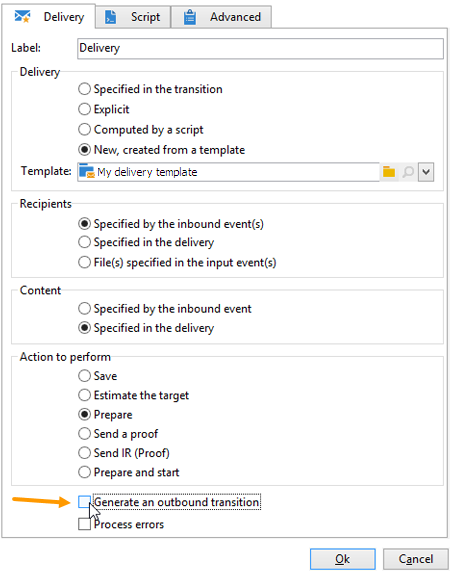

# Début et Fin{#start-and-end}

Les activités **[!UICONTROL Début]** et **[!UICONTROL Fin]** permettent de marquer graphiquement le début et la fin d’un workflow. Elles n’ont pas d’impact fonctionnel et sont donc facultatives.

* **[!UICONTROL Début]**

  L&#39;exécution d&#39;un workflow démarre par les activités sans transition entrante et les activités de type Début.

  

* **[!UICONTROL Fin]**

  Vous pouvez paramétrer l’activité **[!UICONTROL Fin]** afin qu’elle interrompe toutes les tâches en cours. Pour cela, double-cliquez sur l’activité pour afficher ses propriétés et cochez l’option correspondante.

  

  Les données de la table de travail sont automatiquement supprimées lorsque l’activité de fin est activée. Si cela n’est pas nécessaire, et pour éviter des charges inutiles, vous pouvez désactiver la transition à la sortie de la dernière activité. Par exemple, si aucun traitement n’est planifié au niveau d’une sortie de diffusion, désélectionnez l’option correspondante, comme dans l’exemple ci-dessous :

  
