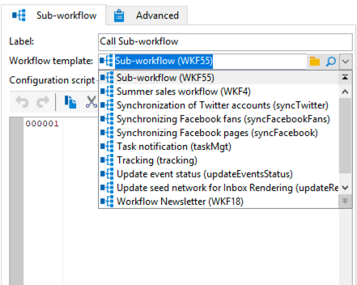
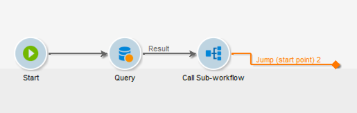
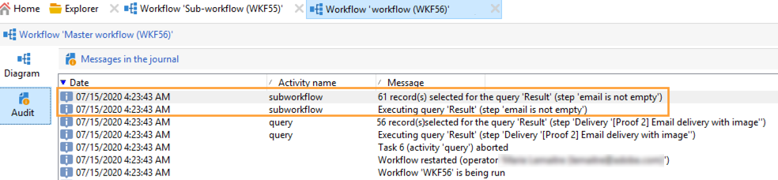

# Sous-workflow{#sub-workflow}

L’activité **[!UICONTROL Sous-workflow]** permet de déclencher l’exécution d’un autre workflow et de récupérer le résultat. Cette activité permet d’utiliser des workflows complexes tout en utilisant une interface simplifiée.

Vous pouvez appeler plusieurs sous-workflows au sein d’un même workflow. Les sous-workflows sont exécutés de manière synchrone.

Dans l’exemple ci-dessous, un workflow principal appelle un sous-workflow à l’aide de sauts. Pour plus d’informations sur les objets graphiques de type saut, voir [cette section](jump-start-point-and-end-point.md).

1. Créez un workflow que vous allez utiliser en tant que sous-workflow dans un autre workflow.
1. Insérez une activité **[!UICONTROL Saut (arrivée)]** avec une priorité de 1 au début du workflow. Si vous avez plusieurs sauts de type « arrivée », Adobe Campaign utilisera celui associé au plus petit nombre.
1. Insérez une activité **[!UICONTROL Saut (départ)]** avec une priorité de 2 à la fin du workflow. Si vous avez plusieurs sauts de type « départ », Adobe Campaign utilisera celui associé au plus grand nombre.

   

   >[!NOTE]
   >
   >Si l’activité de sous-workflow référence un workflow comportant plusieurs activités **[!UICONTROL Saut]**, l’exécution du sous-workflow s’effectue entre le saut de type « arrivée » dont le nombre est le plus petit et le saut de type « départ » dont le nombre est le plus grand.
   >
   >Pour que le sous-workflow soit exécuté correctement, vous devez avoir un seul saut de type « arrivée » avec le nombre le plus petit et un seul saut de type « départ » avec le nombre le plus grand.

1. Finalisez et enregistrez ce « sous-workflow ».
1. Créez un workflow principal.
1. Insérez une activité **[!UICONTROL Sous-workflow]** et ouvrez-la.
1. Sélectionnez le workflow que vous souhaitez utiliser dans la liste déroulante **[!UICONTROL Modèle de workflow]**.

   

1. Vous pouvez également ajouter un script de paramétrage pour modifier le fonctionnement du workflow référencé.
1. Cliquez sur **[!UICONTROL OK]**. Vous créez ainsi automatiquement une transition sortante avec le libellé de l’activité **[!UICONTROL Saut (départ)]** du workflow sélectionné.

   

1. Exécutez le workflow.

Une fois exécuté, le workflow qui a été appelé en tant que sous-workflow reste à l’état **[!UICONTROL En édition]**, ce qui a les implications suivantes :

* Vous ne pouvez pas cliquer avec le bouton droit sur les transitions pour afficher la cible.
* Le nombre de populations intermédiaires ne peut pas être affiché.
* Les logs de sous-workflow s’affichent dans le workflow principal.

  

>[!NOTE]
>
>Si une erreur se produit dans le sous-workflow, le workflow principal est interrompu et une copie du sous-workflow est créée.

## Paramètres d&#39;entrée (optionnel) {#input-parameters--optional-}

* tableName
* schéma

Chacun des événements entrants doit spécifier une cible définie par ces paramètres.

## Paramètres de sortie {#output-parameters}

* tableName
* schéma
* recCount

Ce jeu de trois valeurs identifie la population ciblée par la requête. **[!UICONTROL tableName]** est le nom de la table qui enregistre les identifiants de la cible, **[!UICONTROL schema]** est le schéma de la population (généralement nms:recipient) et **[!UICONTROL recCount]** est le nombre d’éléments dans la table.

* targetSchema : cette valeur correspond au schéma de la table de travail. Ce paramètre est valide pour toutes les transitions avec **[!UICONTROL tableName]** et **[!UICONTROL schema]**.
