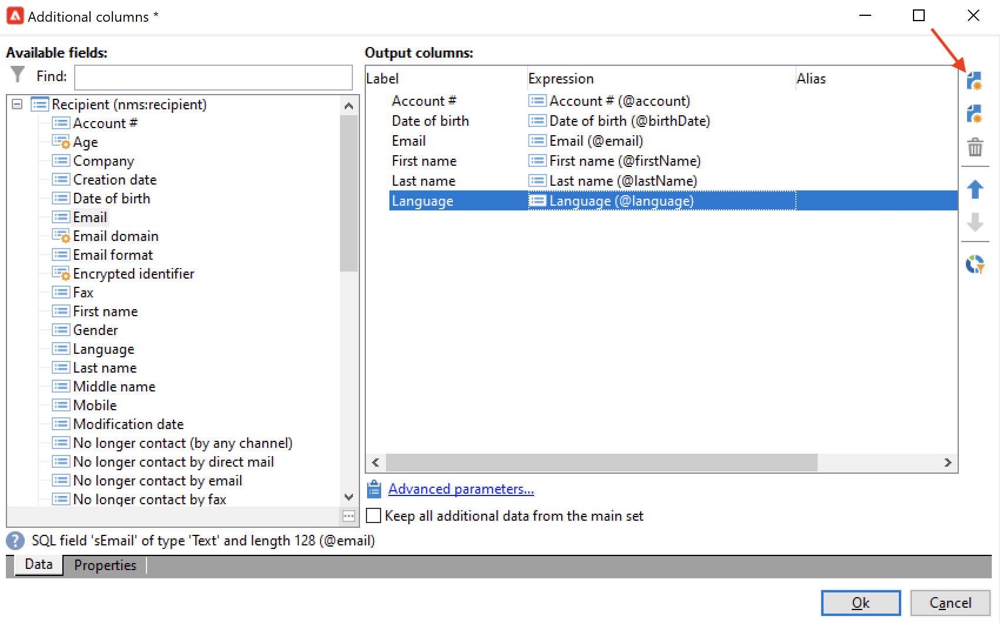
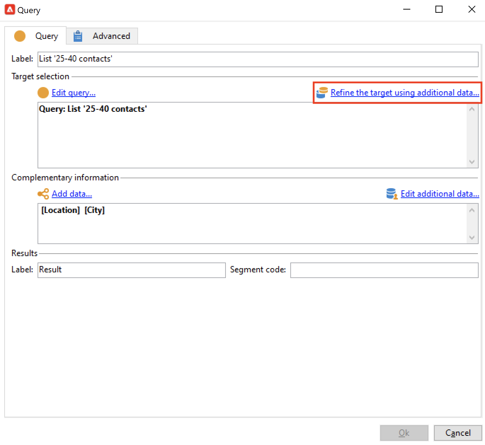
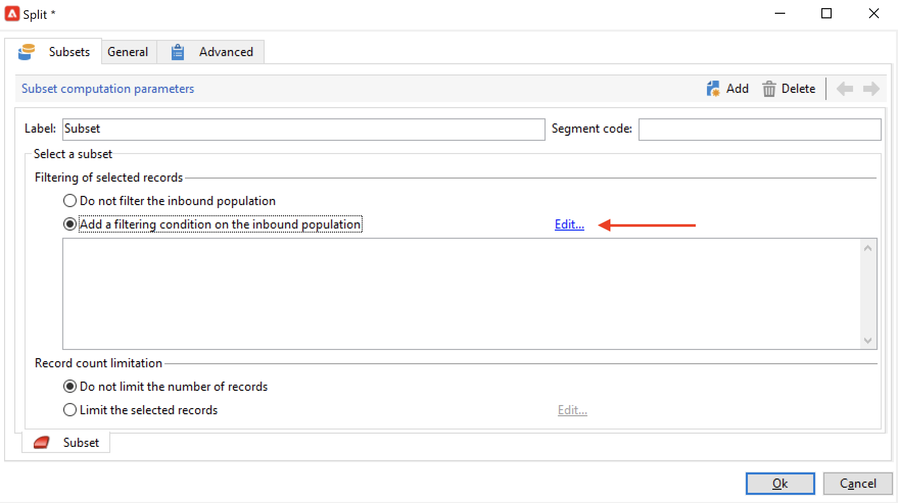

# Créer un workflow de ciblage{#target-data}

Le workflow peut être utilisé pour interroger la base de données et segmenter vos données. Le module de workflow de campagne est un outil puissant permettant d&#39;exécuter des activités de gestion des données, d&#39;extraire, d&#39;enrichir et de transformer des données, de gérer des audiences et d&#39;affiner les populations.

Un workflow de ciblage permet de construire une ou plusieurs cibles de diffusion. Vous pouvez créer des requêtes, définir des unions ou des exclusions sur des critères précis, ajouter une planification, à l&#39;aide des activités de workflows. Le résultat de ce ciblage peut être automatiquement transféré dans une liste qui pourra ensuite constituer la cible d&#39;actions de diffusion.

En complément de ces activités, les options de Data Management permettent de manipuler les données et d&#39;accéder à des fonctionnalités avancées pour répondre à des problématiques de ciblage complexes. Voir à ce sujet la section [Data Management](targeting-workflows.md#data-management).

Toutes ces activités sont regroupées dans le premier onglet du workflow.

>[!NOTE]
>
>Les activités de ciblage sont présentées dans [cette section](activities.md).

Les workflows de ciblage peuvent être créés et édités à partir du noeud **[!UICONTROL Profils et Cibles > Traitements > Workflows de ciblage]** de l&#39;arborescence Adobe Campaign ou à partir du menu **[!UICONTROL Profils et Cibles > Workflows de ciblage]** de la page d&#39;accueil.

Les workflows de ciblage qui s&#39;inscrivent dans le contexte d&#39;une opération sont stockés avec tous les workflows des opérations.

## Étapes essentielles pour créer un workflow de ciblage {#implementation-steps-}

Les étapes de création d’un workflow de ciblage sont détaillées dans les sections suivantes :

1. **Identification** des données dans la base de données : consultez la section [Création de requêtes](#create-queries).
1. **Préparation** des données pour répondre aux besoins des diffusions : consultez la section [Enrichissement et modification des données](#enrich-and-modify-data).
1. **Utilisation** des données pour effectuer des mises à jour ou dans une diffusion : consultez la section [Mise à jour de la base de données](use-workflow-data.md#update-the-database).

Les résultats de tous les enrichissements et manipulations effectués lors du ciblage sont stockés pour être accessibles dans les champs de personnalisation, notamment pour les utiliser dans la création de messages personnalisés. Pour plus d’informations, consultez la section [Données de la cible](use-workflow-data.md#target-data).

## Dimension de ciblage et dimension de filtrage {#targeting-and-filtering-dimensions}

Lors des opérations de segmentation des données, la dimension de ciblage est associée à une dimension de filtrage. La dimension de ciblage permet de définir la population ciblée par l&#39;opération : destinataires, titulaires d&#39;un contrat, opérateur, abonnés, etc. La dimension de filtrage permet de sélectionner la population selon certains critères : détention d&#39;un contrat, inscription à une newsletter, etc.

Par exemple, pour sélectionner les clients détenteur d&#39;une assurance-vie depuis plus de 5 ans, vous pouvez choisir la dimension de ciblage **Clients** et la dimension de filtrage **Détention d&#39;un contrat**. Vous pourrez ensuite définir les conditions de filtrage dans l&#39;activité de requête.

Lors de la sélection d&#39;une dimension de ciblage, seules les dimensions de filtrage compatibles sont proposées dans l&#39;interface.

Ces deux dimensions doivent être liées. Ainsi, le contenu de la liste **[!UICONTROL Dimension de filtrage]** dépend de la dimension de ciblage indiquée dans le premier champ.

Par exemple, pour les destinataires (**recipient**), les dimensions de filtrage disponibles seront les suivantes :

Tandis que pour les **visiteurs**, la liste proposera les dimensions de filtrage suivantes :

## Créer des requêtes {#create-queries}

### Travailler avec les données additionnelles {#select-data}

Une activité **[!UICONTROL Requête]** permet de sélectionner des données de base pour créer la population cible. Pour plus d&#39;informations, consultez [cette section](query.md#create-a-query).

Les activités suivantes peuvent également servir à lancer des requêtes et à affiner les données de la base de données : [Requête incrémentale](incremental-query.md), [Lecture de liste](read-list.md).

Il est possible de collecter des données supplémentaires pour les transférer et les traiter tout au long du cycle de vie du workflow. Pour en savoir plus à ce sujet, consultez les sections [Ajouter des données](query.md#add-data) et [Modifier les données additionnelles](#edit-additional-data).

### Modification des données additionnelles {#edit-additional-data}

Une fois que des données additionnelles ont été ajoutées, vous pouvez les éditer ou les utiliser pour affiner la cible définie dans l&#39;activité de requête.

Le lien **[!UICONTROL Editer les données additionnelles...]** permet de visualiser les données qui ont été ajoutées et éventuellement de les modifier ou d&#39;en ajouter de nouvelles.

Pour ajouter des données aux colonnes de sortie définies précédemment, sélectionnez-les dans la liste des champs disponibles. Pour créer une colonne de sortie, cliquez sur l’icône **[!UICONTROL Ajouter]**, puis sélectionnez le champ et cliquez sur **[!UICONTROL Modifier une expression]**.

Cliquez sur le bouton **Sélection avancée**.

Indiquez le mode de calcul du champ à ajouter, par exemple un agrégat.

L&#39;option **[!UICONTROL Ajouter un sous-élément]** permet d&#39;adjoindre des données calculées à la collection. Vous pouvez ainsi sélectionner des données additionnelles issues de la collection ou définir des calculs d&#39;agrégats sur les éléments de la collection.

Les sous-éléments seront représentés en sous-arborescence de la collection à laquelle ils sont associés.

Les collections s’affichent dans le sous-onglet **[!UICONTROL Collections]**. Vous pouvez filtrer les éléments collectés en cliquant sur l’icône **[!UICONTROL Détail]** de la collection sélectionnée. L’assistant de filtrage permet de sélectionner les données collectées et de définir les conditions de filtrage à appliquer aux données de la collection.

### Affiner une cible en utilisant les données supplémentaires {#refine-the-target-using-additional-data}

Les données supplémentaires collectées peuvent permettre d’affiner le filtrage des données de la base. Pour ce faire, cliquez sur le lien **[!UICONTROL Affiner la cible en utilisant les données supplémentaires...]** pour surfiltrer les données ajoutées.

### Homogénéisation des données {#homogenize-data}

Dans les activités de type **[!UICONTROL Union]** ou **[!UICONTROL Intersection]**, vous pouvez choisir de ne conserver que les données additionnelles communes afin d&#39;homogénéiser les données. Dans ce cas, la table de travail temporaire en sortie de cette activité ne contiendra que les données additionnelles présentes dans tous les ensembles en entrée.

### Réconcilier avec les données supplémentaires {#reconciliation-with-additional-data}

Lors des phases de réconciliation des données (dans les activités **[!UICONTROL Union]**, **[!UICONTROL Intersection]**, etc.), il est possible de sélectionner les colonnes à utiliser pour la réconciliation des données parmi les colonnes additionnelles. Pour cela, paramétrez une réconciliation sur une sélection de colonnes et indiquez l&#39;ensemble principal. Sélectionnez ensuite les colonnes dans la section inférieure de la fenêtre, comme dans l&#39;exemple ci-dessous :

Sélectionnez une expression et confirmez.

### Création de sous-ensembles {#create-subsets}

L&#39;activité de **[!UICONTROL Partage]** permet de créer des sous-ensembles sur des critères définis au travers de requêtes d’extraction. Pour chaque sous-ensemble, lorsque vous modifiez une condition de filtrage sur la population, vous accédez à l’activité de requête standard et pouvez ainsi définir les conditions de segmentation de la cible.

Vous pouvez diviser une cible en plusieurs sous-ensembles en utilisant uniquement les données supplémentaires comme conditions de filtrage, ou en complément des données de la cible. Vous pouvez également utiliser des données externes si vous avez acheté l’option **Federated Data Access**.

Pour plus d&#39;informations, consultez [cette section](#create-subsets-using-the-split-activity).

## Données de segment {#segment-data}

### Réunion de plusieurs cibles (Union) {#combine-several-targets--union-}

L&#39;activité d&#39;union permet de regrouper le résultat de plusieurs activités dans une même transition. Les ensembles ne doivent pas nécessairement être homogènes.

Les options de réconciliation des données sont les suivantes :

* **[!UICONTROL Uniquement les clés]**

  Cette option peut être utilisée si les populations en entrée sont homogènes.

* **[!UICONTROL Toutes les colonnes communes]**

  Cette option permet de réconcilier les données à partir de toutes les colonnes communes aux différentes populations de la cible.

  Adobe Campaign identifie les colonnes d&#39;après leur nom. Un niveau de tolérance minimal est accepté : par exemple, une colonne &#39;Email&#39; pourra être reconnue comme identique à une colonne &#39;@email&#39;.

* **[!UICONTROL Une sélection de colonnes]**

  Sélectionnez cette option pour définir la liste des colonnes sur lesquelles sera appliquée la réconciliation des données.

  Sélectionnez d&#39;abord l&#39;ensemble principal (celui qui contient les données sources), puis les colonnes à utiliser pour la jointure.

  

  >[!CAUTION]
  >
  >Lors de la réconciliation des données, les populations ne sont pas dédoublonnées.

  Vous pouvez limiter la taille de la population à un nombre donné d&#39;enregistrements. Pour cela, cochez l&#39;option correspondante et indiquez le nombre d&#39;enregistrements à conserver.

  Indiquez également l&#39;ordre de priorité des populations entrantes : la section inférieure de la fenêtre liste les transitions entrantes de l&#39;activité d&#39;union et vous permet de les ordonner en utilisant les flèches bleues situées à droite de la fenêtre.

  Les enregistrements conservés seront issus d&#39;abord de la population de première transition entrante de la liste, puis, si le nombre maximum n&#39;est pas atteint, ils seront issus de la population de la deuxième transition entrante, etc.

  

### Extraction des données communes (Intersection) {#extract-joint-data--intersection-}

L&#39;intersection permet de ne récupérer que les lignes communes aux populations des transitions entrantes. Cette activité doit être configurée comme l&#39;activité d&#39;union.

Il est par ailleurs possible de ne conserver qu&#39;une sélection de colonnes ou seulement les colonnes communes entre les populations entrantes.

L’activité d’intersection est présentée dans la section [Intersection](intersection.md).

### Exclusion dʼune population (Exclusion) {#exclude-a-population--exclusion-}

L’activité d’exclusion permet d’exclure d’une population cible les éléments d’une autre cible. La dimension de ciblage en sortie de cette activité sera celle de l’ensemble principal.

Le cas échéant, vous pouvez manipuler les tableaux entrants. En effet, pour exclure une cible d’une autre dimension, cette cible doit être replacée dans la même dimension de ciblage que la cible principale. Pour ce faire, cliquez sur le bouton **[!UICONTROL Ajouter]** et indiquez les conditions de modification des dimensions.

La réconciliation des données se fait au choix par identifiant, changement d&#39;axe ou jointure.

### Création de sous-ensembles à lʼaide de lʼactivité Partage {#create-subsets-using-the-split-activity}

L&#39;activité **[!UICONTROL Partage]** est une activité standard qui permet de créer autant d&#39;ensembles que nécessaires à partir d&#39;une ou plusieurs dimensions de filtrage et de générer en sortie une transition par sous-ensemble ou une transition unique.

Les données additionnelles véhiculées par la transition entrante peuvent être utilisées dans les critères de filtrage.

Pour la configurer, vous devez d&#39;abord sélectionner des critères :

1. Dans votre workflow, placez une activité de type **[!UICONTROL Partage]**.
1. Dans l&#39;onglet **[!UICONTROL Général]**, sélectionnez l&#39;option souhaitée : **[!UICONTROL Utiliser les données de la cible et les données additionnelles]**, **[!UICONTROL Utiliser les données additionnelles uniquement]** ou **[!UICONTROL Utiliser des données externes]**.
1. Si l&#39;option **[!UICONTROL Utiliser les données de la cible et les données additionnelles]** est sélectionnée, la dimension de ciblage permet d&#39;utiliser toutes les données véhiculées par la transition entrante.

   

   Lors de la création des sous-ensembles, ce sont les paramètres de filtrage définis ci-avant qui sont utilisés.

   Pour définir les conditions de filtrage, sélectionnez l&#39;option **[!UICONTROL Ajouter une condition de filtrage sur la population entrante]** et cliquez sur le lien **[!UICONTROL Editer...]**. Indiquez ensuite les critères de filtrage pour la création de ce sous-ensemble.

   

   Un exemple d&#39;utilisation des conditions de filtrage dans l&#39;activité **[!UICONTROL Partage]** pour segmenter la cible en différentes populations est présenté dans [cette section](cross-channel-delivery-workflow.md).

   Le champ **[!UICONTROL Libellé]** permet d&#39;associer un nom au sous-ensemble que vous venez de créer. Ce nom sera celui de la transition sortante correspondante.

   Vous pouvez également associer un code segment au sous-ensemble afin de l&#39;identifier et l&#39;utiliser pour cibler la population de ce sous-ensemble.

   Au besoin, vous pouvez modifier les dimensions de ciblage et de filtrage individuellement pour chaque sous-ensemble à créer. Pour ce faire, modifiez la condition de filtrage du sous-ensemble et cochez la case **[!UICONTROL Utiliser une dimension de filtrage spécifique]**.

   

1. Si l&#39;option **[!UICONTROL Utiliser les données additionnelles uniquement]** est sélectionnée, seules les données additionnelles sont proposées pour réaliser le filtrage des sous-ensembles.

1. Si l&#39;option **Federated Data Access** est activée, l&#39;option **[!UICONTROL Utiliser des données externes]** permet d&#39;exploiter les données d&#39;une base externe déjà paramétrée ou de créer une connexion à une base de données.

Nous devons ensuite ajouter de nouveaux sous-ensembles :

1. Cliquez sur le bouton **[!UICONTROL Ajouter]** et définissez les critères de filtrage.

   

1. Définissez la dimension de filtrage dans l&#39;onglet **[!UICONTROL Général]** de l&#39;activité (voir ci-dessus). Elle est appliquée par défaut à tous les sous-ensembles.

   

1. Au besoin, vous pouvez modifier la dimension de filtrage individuellement pour chaque sous-ensemble. Ainsi, vous pouvez, à partir de la même activité de partage, construire un ensemble avec toutes les personnes titulaires d’un contrat Gold, un autre avec toutes les personnes destinataires ayant cliqué dans la dernière newsletter et un troisième regroupant les personnes de 18 à 25 ans ayant effectué un achat en magasin dans les 30 derniers jours. Pour ce faire, sélectionnez l’option **[!UICONTROL Utiliser une dimension de filtrage spécifique]** et sélectionnez le contexte de filtrage des données.

Une fois les sous-ensembles créés, par défaut, l&#39;activité de partage propose en sortie autant de transitions que de sous-ensembles :

Vous pouvez regrouper tous ces sous-ensembles dans une seule transition de sortie. Dans ce cas, le lien vers les sous-ensembles respectifs sera visible dans le code segment, par exemple. Pour ce faire, sélectionnez l’option **[!UICONTROL Générer tous les sous-ensembles dans le même tableau]**.

Vous pourrez par exemple positionner une seule activité de diffusion et personnaliser le contenu de cette diffusion en fonction du code segment de chacun des ensembles de destinataires.

Vous pouvez également créer des sous-ensembles à l’aide de l’activité **[!UICONTROL Cellules]**. Pour plus d&#39;informations, consultez la section [Cellules](cells.md).

### Utilisation des données ciblées {#using-targeted-data}

Une fois les données identifiées et préparées, elles peuvent être utilisées dans les contextes suivants :

* Vous pouvez mettre à jour les données de la base suite à la manipulation des données dans les différentes étapes du workflow.

  Pour plus d&#39;informations, consultez la section [Mise à jour de données](update-data.md).

* Vous pouvez également actualiser le contenu de listes existantes.

  Pour plus d&#39;informations, consultez la section [Mise à jour de liste](list-update.md).

* Vous pouvez préparer ou démarrer des diffusions directement dans le workflow.

  Voir à ce propos les sections [Diffusion](delivery.md), [Agir sur une diffusion](delivery-control.md) et [Diffusion au fil de l’eau](continuous-delivery.md).

## Data Management {#data-management}

Dans Adobe Campaign, le Data Management regroupe un ensemble d&#39;activités qui permettent de répondre à des problématiques complexes de ciblage en proposant des outils plus efficaces et plus souples. Il est ainsi possible de mettre en place une gestion cohérente de toutes les communications vers un contact, en utilisant les informations liées à ses contrats, ses abonnements, sa réactivité aux diffusions, etc. Le Data Management permet de suivre le cycle de vie des données lors des opérations de segmentation, notamment :

* simplifier et optimiser les processus de ciblage, y compris en incluant des données qui n&#39;ont pas été modélisées dans le datamart (création de nouvelles tables : extension locale à chaque workflow de ciblage, en fonction de son paramétrage).
* conserver et véhiculer des calculs intermédiaires, notamment dans les phases de construction des cibles ou pour l&#39;administration des bases de données.
* accéder aux bases externes (optionnel) : prise en compte de bases de données hétérogènes dans le processus de ciblage.

Pour réaliser ces opérations, Adobe Campaign propose :

* Activités de collecte de données : [Transfert de fichier](file-transfer.md), [Chargement (fichier)](data-loading-file.md), [Chargement (SGBD)](data-loading-rdbms.md), [Mise à jour de données](update-data.md). Cette première étape de la collecte des données les prépare pour permettre leur traitement dans d’autres activités. Plusieurs paramètres doivent être surveillés afin de s’assurer que le workflow s’exécute correctement et donne les résultats attendus. Par exemple, lorsque vous importez des données, la clé primaire (Pkey) de ces données doit être unique pour chaque enregistrement.
* Les activités de ciblage enrichies avec des options de Data Management : [Requête](query.md), [Union](union.md), [Intersection](intersection.md), [Partage](split.md). Il est ainsi possible de paramétrer une union ou une intersection entre des données de plusieurs dimensions de ciblage différentes, sous réserve qu’une réconciliation des données soit possible.
* Activités de transformation des données : [Enrichissement](enrichment.md), [Changement de dimension](change-dimension.md).

>[!CAUTION]
>
>Dans les workflows, dans le cas où deux tables sont liées, la suppression d&#39;un élément de la table source n&#39;entraîne pas la suppression de ses données liées.
>  
>Par exemple, la suppression d&#39;un destinataire via un workflow n&#39;entraînera pas la suppression de ses historiques de diffusion. En revanche, la suppression d&#39;un destinataire directement dans le dossier &#39;Destinataires&#39; de l&#39;arborescence entraînera bien la suppression de toutes les données liées à ce dernier.

### Enrichissement et modification des données {#enrich-and-modify-data}

En complément de la dimension de ciblage, la dimension de filtrage permet de préciser la nature des données collectées. Consultez [cette section](targeting-workflows.md#targeting-and-filtering-dimensions).

Les données identifiées et collectées peuvent être enrichies, regroupées et manipulées afin d&#39;optimiser la construction de la cible. Pour ce faire, en plus des activités de manipulation de données présentées dans [cette section](#segmen-data), utilisez les méthodes suivantes :

* L’activité **[!UICONTROL Enrichissement]** permet d’ajouter momentanément des colonnes à un schéma et d’ajouter des informations à certains éléments. Elle est présentée dans la section [Enrichissement](enrichment.md) du référentiel des activités.
* L’activité **[!UICONTROL Edition du schéma]** permet de modifier la structure d’un schéma. Elle est présentée dans la section [Edition du schéma](edit-schema.md) du référentiel des activités.
* L’activité **[!UICONTROL Changement de dimension]** permet de modifier la dimension de ciblage pendant le cycle de construction de la cible. Elle est présentée dans la section [Changement de dimension](change-dimension.md).
