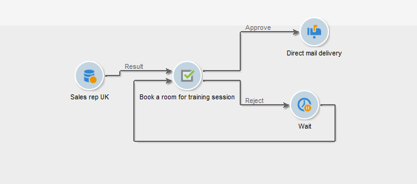

# Tâche{#task}

Dans un workflow de campagne, l&#39;activité **[!UICONTROL Tâche]** permet de définir deux scénarios : un premier si la tâche est complétée et un second si la tâche n&#39;est pas complétée (si elle est manuellement indiquée comme non complétée ou si elle expire).

L’option **[!UICONTROL Ressources]** permet de définir plusieurs opérateurs ainsi qu’un planning de validation de la tâche. Le rejet par la personne chargée de la validation n’entraîne pas le rejet de la tâche elle-même.
