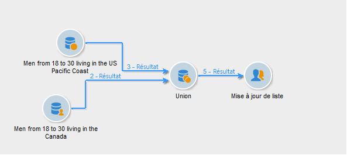

# Union{#union}

Une **[!UICONTROL union]** permet de regrouper les résultats de plusieurs activités entrantes dans une même cible. La cible est créée avec tous les résultats reçus : toutes les activités antérieures doivent donc être terminées afin que l&#39;union soit exécutée.

>[!NOTE]
>
>Pour plus d&#39;informations sur la configuration et l&#39;utilisation de l&#39;activité **[!UICONTROL Union]**, consultez [cette page](targeting-workflows.md#combining-several-targets--union-).

## Exemple d&#39;union {#union-example}

Dans l&#39;exemple suivant, les résultats de deux requêtes sont réunis afin de mettre à jour une liste. Les deux requêtes ciblent des destinataires. Les résultats sont donc basés sur la même table.

1. Insérez une activité de type **[!UICONTROL Union]** directement après les deux requêtes et avant une activité de mise à jour de liste puis ouvrez-la.
1. Indiquez éventuellement un libellé.
1. Sélectionnez la méthode de réconciliation **[!UICONTROL Uniquement les clés]** dans la mesure où dans cet exemple, les populations issues des requêtes contiennent des données homogènes.
1. Si vous avez ajouté des données additionnelles au niveau des requêtes, vous pouvez éventuellement choisir de ne conserver que celles qui sont communes.
1. Si vous souhaitez limiter la taille de la population finale, cochez l&#39;option **[!UICONTROL Limiter la taille de la population générée]**.

   Définissez cette dernière en indiquant le nombre de destinataires maximal et en choisissant la requête dont la population sera prioritaire.

1. Validez l&#39;activité **[!UICONTROL Union]** puis configurez l&#39;activité [Mise à jour de liste](list-update.md).
1. Lancez le workflow. Le nombre de résultats s&#39;affiche et la liste définie au niveau de l&#39;activité de mise à jour de liste est créée ou mise à jour. Cette dernière contient l&#39;ensemble des destinataires des deux requêtes ou le nombre défini à l&#39;étape précédente, le cas échéant.

   

## Paramètres d&#39;entrée {#input-parameters}

* tableName
* schema

Chacun des événements entrants doit spécifier une cible définie par ces paramètres.

## Paramètres de sortie {#output-parameters}

* tableName
* schema
* recCount

Ce triplet de valeurs identifie la cible résultant de l&#39;union. **[!UICONTROL tableName]** est le nom de la table qui mémorise les identifiants de la cible, **[!UICONTROL schema]** est le schéma de la population (habituellement nms:recipient) et **[!UICONTROL recCount]** est le nombre d’éléments dans la table.
