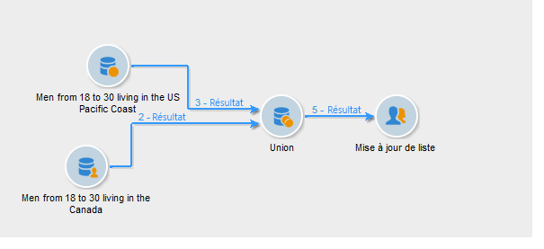

# Union{#union}

Une **[!UICONTROL Union]** regroupe le résultat de plusieurs activités entrantes dans une cible unique. La cible est créée avec tous les résultats reçus : toutes les activités antérieures doivent donc être terminées pour que l&#39;union soit exécutée.

>[!NOTE]
>
>Pour plus d&#39;informations sur la configuration et l&#39;utilisation de l&#39;activité **[!UICONTROL Union]**, consultez [cette page](targeting-workflows.md#combining-several-targets--union-).

## Exemple d&#39;union {#union-example}

Dans l’exemple suivant, les résultats de deux requêtes ont été combinés afin de mettre à jour la liste. Les deux requêtes ciblent les destinataires. Les résultats sont donc basés sur le même tableau.

1. Insérez une activité de type **[!UICONTROL Union]** directement après les deux requêtes et avant une activité de mise à jour de liste puis ouvrez-la.
1. Indiquez éventuellement un libellé.
1. Sélectionnez la méthode de réconciliation **[!UICONTROL Uniquement les clés]** dans la mesure où dans cet exemple, les populations issues des requêtes contiennent des données homogènes.
1. Si vous avez ajouté des données additionnelles au niveau des requêtes, vous pouvez éventuellement choisir de ne conserver que celles qui sont communes.
1. Si vous souhaitez limiter la taille de la population finale, cochez l&#39;option **[!UICONTROL Limiter la taille de la population générée]**.

   Définissez cette dernière en indiquant le nombre de destinataires maximal et en choisissant la requête dont la population sera prioritaire.

1. Validez l&#39;activité **[!UICONTROL Union]** puis configurez l&#39;activité [Mise à jour de liste](list-update.md).
1. Démarrez le workflow. Le nombre de résultats s&#39;affiche et la liste définie dans l&#39;activité de mise à jour de liste est créée ou mise à jour. Cette liste contient l&#39;ensemble des destinataires pour les deux requêtes ou, le cas échéant, le nombre défini à l&#39;étape précédente.

   

## Paramètres d&#39;entrée {#input-parameters}

* tableName
* schéma

Chacun des événements entrants doit spécifier une cible définie par ces paramètres.

## Paramètres de sortie {#output-parameters}

* tableName
* schéma
* recCount

Ce triplet de valeurs identifie la cible résultant de l&#39;union. **[!UICONTROL tableName]** est le nom de la table qui enregistre les identifiants de la cible, **[!UICONTROL schema]** est le schéma de la population (généralement nms:recipient) et **[!UICONTROL recCount]** est le nombre d’éléments dans la table.
