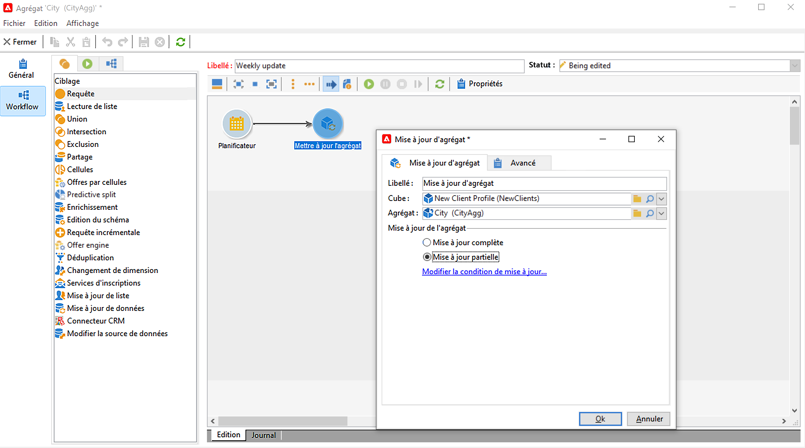
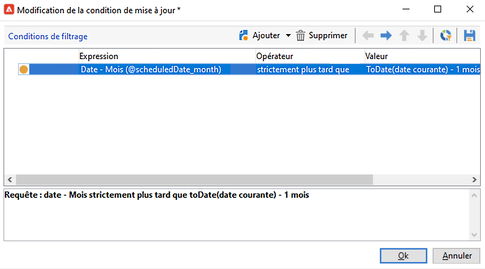

# Mise à jour d’agrégat{#update-aggregate}

Agrégats définis dans [cubes](../../v8/reporting/gs-cubes.md) à des fins de création de rapports, peut être mis à jour avec une activité spécifique. A **[!UICONTROL Workflow]** est disponible lors de la configuration de l’agrégat.

En savoir plus sur les cubes et les agrégats dans [cette section](../../v8/reporting/customize-cubes.md#calculate-and-use-aggregates).

Pour mettre à jour un agrégat, éditez le **[!UICONTROL Mise à jour d&#39;agrégat]** et sélectionnez le cube et l&#39;agrégat à mettre à jour.

Vous pouvez configurer un **Mise à jour complète** ou **Mise à jour partielle**.

Par défaut, une mise à jour complète est exécutée lors de chaque calcul. Pour activer une mise à jour partielle, sélectionnez l&#39;option et définissez les conditions de mise à jour.

Il est recommandé d’ajouter une **[!UICONTROL Planificateur]** pour paramétrer la fréquence des mises à jour des calculs.
