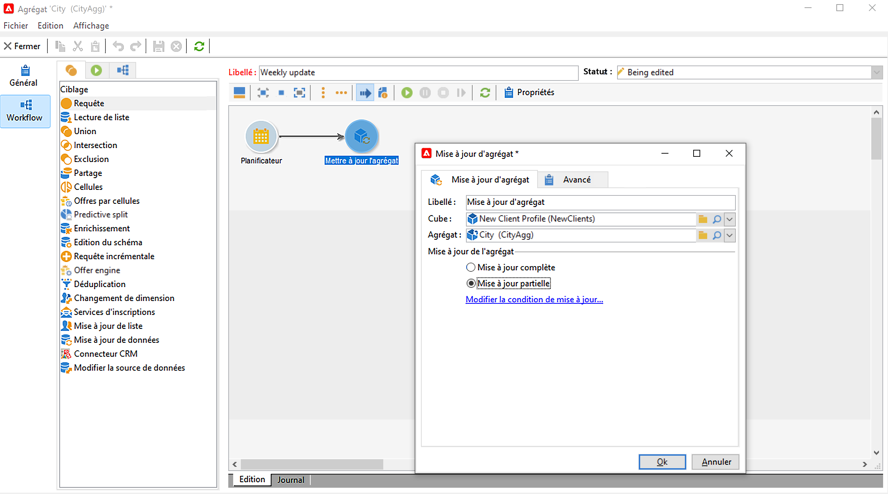
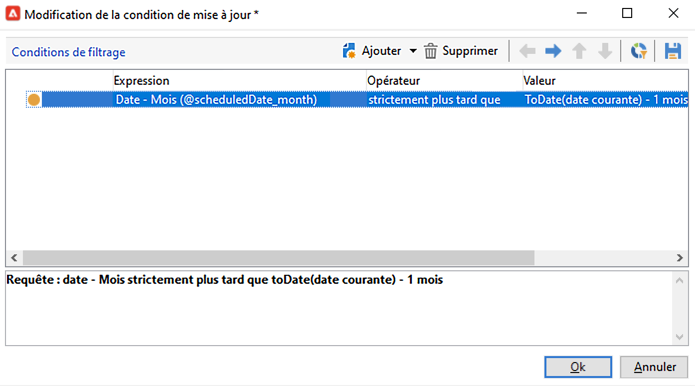

# Mettre à jour l’agrégat{#update-aggregate}

Les agrégats définis dans les [cubes](../../v8/reporting/gs-cubes.md) à des fins de création de rapports, peuvent être mis à jour avec une activité spécifique. Un onglet **[!UICONTROL Workflow]** est disponible lors de la configuration de l’agrégat.

En savoir plus sur les cubes et les agrégats dans [cette section](../../v8/reporting/customize-cubes.md#calculate-and-use-aggregates).

Pour mettre à jour un agrégat, modifiez l’activité **[!UICONTROL Mettre à jour l’agrégat]** et sélectionnez le cube ainsi que l’agrégat à mettre à jour.

Vous pouvez configurer une **Mise à jour complète** ou une **Mise à jour partielle**.

Par défaut, une mise à jour complète est exécutée lors de chaque calcul. Pour activer une mise à jour partielle, sélectionnez l’option éponyme et définissez les conditions de mise à jour.

Il est recommandé d’ajouter une activité **[!UICONTROL Planificateur]** pour définir la fréquence de mise à jour des calculs.
