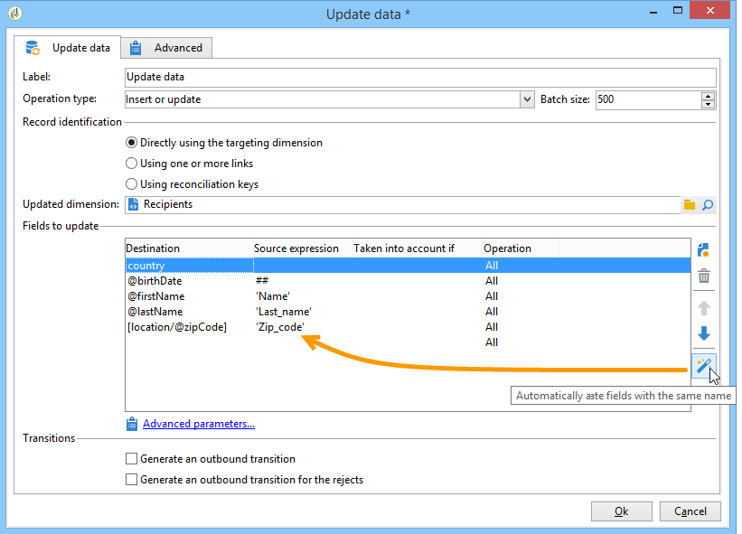

# Mise à jour de données{#update-data}

Une activité de type **Mise à jour de données** permet de mettre à jour en masse les champs de la base de données.

## Type d&#39;opération {#operation-type}

Le champ **[!UICONTROL Type d&#39;opération]** permet de choisir le traitement à réaliser sur les données de la base :

* **[!UICONTROL Ajouter ou mettre à jour]** : ajouter des données ou les mettre à jour si elles ont déjà été ajoutées auparavant.
* **[!UICONTROL Ajouter]** : ajouter des données uniquement.
* **[!UICONTROL Mettre à jour]** : mettre à jour des données uniquement.
* **[!UICONTROL Mettre à jour et fusionner les collections]** : mettre à jour les données et choisir un enregistrement principal, puis lier les éléments liés aux duplicatas de cet enregistrement principal. Les duplicatas peuvent ensuite être supprimés sans créer d’éléments orphelins attachés.
* **[!UICONTROL Supprimer]** : supprimer des données.

Le champ **[!UICONTROL Taille des mises à jours]** permet de sélectionner le nombre d&#39;éléments de la transition entrante qui seront mis à jour. Par exemple, si vous indiquez 500, les 500 premiers enregistrements traités seront mis à jour.

## Identification des enregistrements {#record-identification}

Indiquez comment identifier les enregistrements dans la base de données :

* Si les données en entrée correspondent à une dimension de ciblage existante, sélectionnez l&#39;option **[!UICONTROL En utilisant directement la dimension de ciblage]** et sélectionnez-la dans le champ **[!UICONTROL Dimension mise à jour]**.

   Vous pouvez afficher les champs de la dimension sélectionnée à l&#39;aide du bouton en forme de loupe **[!UICONTROL Editer ce lien]**.

* Dans le cas contraire, indiquez un ou plusieurs liens qui permettront d&#39;identifier les données dans la base ou utilisez directement des clés de réconciliation.

## Sélection des champs à mettre à jour {#selecting-the-fields-to-be-updated}

Utilisez l&#39;icône **[!UICONTROL Associer automatiquement les champs de même nom]** pour que Adobe Campaign identifie automatiquement les champs à mettre à jour.

Vous pouvez également utiliser l&#39;icône **[!UICONTROL Ajouter]** pour sélectionner manuellement les champs de la base de données à mettre à jour.

Sélectionnez tous les champs à mettre à jour et, au besoin, ajoutez des conditions pour que cette mise à jour soit réalisée. Pour cela, utilisez la colonne **[!UICONTROL Prise en compte si]**. Les conditions sont appliquées les unes après les autres, dans l&#39;ordre de la liste. Utilisez les flèches situées à droite pour modifier l&#39;ordre des mises à jour.

Vous pouvez utiliser plusieurs fois le même champ de destination.

Dans le cadre d&#39;une opération de type **[!UICONTROL Ajouter ou mettre à jour]**, vous pouvez sélectionner individuellement, pour chaque champ, l&#39;opération à appliquer. Pour cela, sélectionner la valeur souhaitée dans la colonne **[!UICONTROL Opération]**.

Les champs **[!UICONTROL modifiedDate]**, **[!UICONTROL modifiedBy]**, **[!UICONTROL createdDate]** et **[!UICONTROL createdBy]** sont automatiquement mis à jour lors d&#39;une mise à jour de données, sauf si leur gestion est explicitement paramétrée dans le tableau de mise à jour des champs.

La mise à jour des enregistrements n&#39;est réalisée que pour les enregistrements pour lesquels au moins une différence a été détectée. Si les valeurs sont les mêmes, aucune mise à jour n&#39;est effectuée.

Le lien **[!UICONTROL Paramètres avancés]** permet de spécifier des options supplémentaires pour le traitement des données mises à jour ainsi que pour la gestion des doublons. Vous pouvez ainsi :

* **[!UICONTROL Désactiver la gestion automatique des clés]**.
* **[!UICONTROL Désactiver l&#39;audit]**.
* **[!UICONTROL Vider la valeur destination si la valeur source est vide (NULL)]**. Cette option est cochée par défaut.
* **[!UICONTROL Mettre à jour toutes les colonnes dont les noms correspondent]**.
* Préciser les conditions de prise en compte des éléments de la source à l&#39;aide d&#39;une expression dans le champ **[!UICONTROL Prise en compte]**.
* Préciser les conditions de prise en compte des doublons à l&#39;aide d&#39;une expression. Si vous cochez l&#39;option **[!UICONTROL Ignorer les enregistrements concernant la même cible]**, seul le premier de la liste des expressions sera pris en compte.

**[!UICONTROL Générer une transition sortante]**

Crée une transition sortante qui sera activée à la fin de l&#39;exécution. Généralement, la mise à jour marque la fin d&#39;un workflow de ciblage et l&#39;option n&#39;est donc pas activée par défaut.

**[!UICONTROL Générer une transition sortante pour les rejets]**

Crée une transition sortante contenant les enregistrements n&#39;ayant pas pu être traités correctement lors de la mise à jour (par exemple en cas de doublon). Généralement, la mise à jour marque la fin d&#39;un workflow de ciblage et l&#39;option n&#39;est donc pas activée par défaut.

## Mise à jour et fusion des collections {#updating-and-merging-collections}

La mise à jour des données et la fusion des collections permet de mettre à jour les données contenues dans un enregistrement à l&#39;aide de données provenant d&#39;un ou plusieurs enregistrements secondaires, afin de n&#39;en conserver qu&#39;un seul si vous le souhaitez. Ces mises à jour sont gérées par un ensemble de règles.

>[!NOTE]
>
>Cette option permet également de traiter les références aux enregistrements secondaires des tables de travail des workflows (targetWorkflow), des diffusions (targetDelivery) et des listes (targetList). Le cas échéant, ces liens apparaissent dans la liste de sélection des champs et collections.

1. Sélectionnez le type d&#39;opération **[!UICONTROL Mettre à jour et fusionner les collections]**.

   

1. Indiquez par ordre de priorité les liens permettant d&#39;identifier l&#39;enregistrement principal. Les liens disponibles varient en fonction de la transition entrante.

   

1. Indiquez les collections à déplacer vers l&#39;enregistrement primaire et les champs à mettre à jour.

   Renseignez également les règles s&#39;appliquant à ces derniers lorsqu&#39;un ou plusieurs enregistrements secondaires sont identifiés. Pour cela, vous pouvez vous aider de l&#39;outil de construction d&#39;expressions. Pour plus d&#39;informations, reportez-vous à .Par exemple, en indiquant que c&#39;est la valeur mise à jour le plus récemment parmi les différents enregistrements qui doit être conservée.

   Indiquez ensuite les conditions de prise en compte de la règle.

   Indiquez enfin le type de mise à jour à effectuer. Vous pouvez par exemple choisir de supprimer les enregistrements secondaires après la mise à jour des données.

   Vous pouvez par exemple paramétrer la fusion de collections contenant des données hétérogènes telles que la liste des abonnements d&#39;un destinataire. Grâce aux règles, vous pouvez ainsi créer de nouveaux historiques d&#39;abonnements à partir des abonnements des enregistrements secondaires, ou encore déplacer la liste des abonnements d&#39;un enregistrement secondaire vers l&#39;enregistrement primaire.

1. Indiquez éventuellement l&#39;ordre dans lequel vous souhaitez que les enregistrements secondaires soient traités, en sélectionnant **[!UICONTROL Paramètres avancés]** > **[!UICONTROL Doublons]**.

   

Les données des enregistrements secondaires sont associées à l&#39;enregistrement principal si les règles définies sont applicables. En fonction du type de mise à jour sélectionné, les enregistrements secondaires peuvent être supprimés.

## Exemple : mise à jour de données suite à un enrichissement {#example--update-data-following-an-enrichment}

La section [Etape 2 : Ecriture des données enrichies dans la table « Achats »](create-a-summary-list.md#step-2--writing-enriched-data-to-the--purchases--table) du cas d&#39;utilisation qui détaille la création d&#39;une liste de récapitulation offre un exemple de mise à jour de données après une activité d&#39;enrichissement.

## Paramètres d&#39;entrée {#input-parameters}

* tableName
* schema

Chacun des événements entrants doit spécifier une cible définie par ces paramètres.
