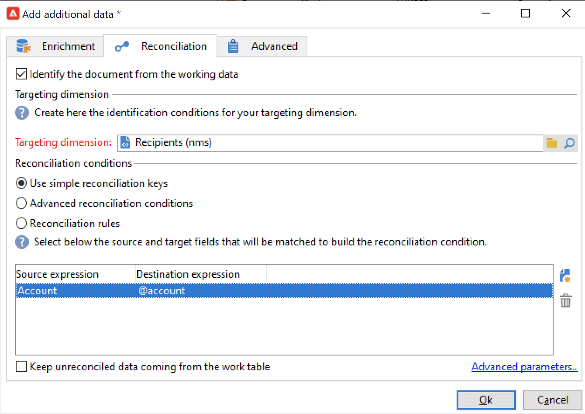

# Utiliser les données d&#39;un workflow{#how-to-use-workflow-data}

Vous pouvez utiliser des activités de workflow pour effectuer plusieurs tâches. Vous trouverez ci-dessous des exemples d&#39;utilisation pour mettre à jour la base de données en créant des listes, gérer les abonnements, envoyer des messages par le biais d&#39;un workflow ou enrichir vos diffusions et leurs audiences.

Un ensemble de cas d&#39;utilisation de workflows est disponible dans [cette section](workflow-use-cases.md).

## Cycle de vie des données {#data-life-cycle}

### Table de travail temporaire du workflow {#work-table}

Dans un workflow, les données véhiculées d&#39;une activité à l&#39;autre sont stockées dans une table de travail temporaire.

Ces données peuvent être affichées et analysées à partir du bouton droit de la souris sur la transition visée.


Sélectionnez pour cela le menu correspondant :

* **[!UICONTROL Afficher la cible...]**

   Ce menu affiche les données disponibles sur la population cible.

   

   Vous pouvez accéder à la structure de la table de travail dans l&#39;onglet **[!UICONTROL Schéma]**.

   

   Pour plus d&#39;informations, consultez [cette section](monitor-workflow-execution.md#worktables-and-workflow-schema).

* **[!UICONTROL Analyser la cible...]**

   Ce menu donne accès à l&#39;assistant d&#39;analyse descriptive, qui permet de produire des statistiques et des rapports sur les données de la transition.

   Pour en savoir plus à ce sujet, consultez la [documentation de Campaign Classic v7](https://experienceleague.adobe.com/docs/campaign-classic/using/reporting/analyzing-populations/about-descriptive-analysis.html?lang=fr){target="_blank"}.

Les données de la cible sont purgées au fur et à mesure de l&#39;exécution du workflow. Seule la dernière table de travail est accessible. Vous pouvez paramétrer le workflow pour que toutes les tables de travail restent accessibles. Pour cela, cochez l&#39;option **[!UICONTROL Conserver le résultat des populations intermédiaires entre deux exécutions]** dans les propriétés du workflow.


>[!CAUTION]
>
>Ne cochez **jamais** cette option dans un workflow de **production**. Elle sert à analyser les résultats et est conçue uniquement à des fins de test. Elle ne doit donc être utilisée que dans les environnements de développement ou d&#39;évaluation.


### Utiliser les données de la cible {#target-data}

Les données stockées dans la table de travail temporaire du workflow sont disponibles pour les tâches de personnalisation. Les données peuvent être utilisées dans la variable [champs de personnalisation](../../v8/send/personalization-fields.md).

Vous pouvez par exemple utiliser les données collectées à travers une liste dans une diffusion. Pour ce faire, utilisez la syntaxe suivante :

```
%= targetData.FIELD %
```

Les éléments de personnalisation de type **[!UICONTROL Extension de la cible]** (targetData) ne sont pas disponibles dans les workflows de ciblage. Ainsi, la cible de la diffusion doit être construite dans le workflow et spécifiée dans la transition entrante de la diffusion.

Dans l&#39;exemple suivant, vous allez collecter une liste d&#39;informations sur des clients, qui sera utilisée dans un e-mail personnalisé. Les étapes sont les suivantes :

1. Créez un workflow afin de collecter les informations, les réconcilier avec celles de la base puis lancer une diffusion.

   

1. Dans notre exemple, le contenu du fichier est le suivant :

   ```
   Music,First name,Last name,Account,CD/DVD,Card
   Pop,David,BLAIR,4323,CD,0
   Rock,Daniel,ARCARI,3222,DVD,1
   Disco,Uma,ALTON,0488,DVD,0
   Jazz,Paul,BOLES,6475,CD,1
   Jazz,David,BOUKHARI,0841,DVD,1
   [...]
   ```

   Pour charger le fichier, configurez l&#39;activité **[!UICONTROL Chargement (fichier)]** comme indiqué ci-dessous :

   

1. Paramétrez l&#39;activité **[!UICONTROL Enrichissement]** afin de réconcilier les données collectées avec celles de la base de données Adobe Campaign. Ici, la clé de réconciliation est le numéro de compte :

   

1. Configurez ensuite la **[!UICONTROL Diffusion]** : elle est créée depuis un modèle et les destinataires sont ceux spécifiés par la transition entrante.

   

   >[!CAUTION]
   >
   >Seules les données contenues dans la transition peuvent être utilisées pour personnaliser la diffusion. Les champs de personnalisation de type **targetData** ne sont disponibles que pour la population en entrée de l&#39;activité **[!UICONTROL Diffusion]**.

1. Dans le modèle de diffusion, utilisez les champs collectés dans le workflow.

   Pour cela, insérez des champs de personnalisation de type **[!UICONTROL Extension de la cible]**.

   

   Ici, nous allons insérer le genre musical favori du client, ainsi que le type de support privilégié (CD ou DVD), tels qu&#39;ils sont indiqués dans le fichier collecté via le workflow.

   En complément, nous ajouterons une promotion réservée aux porteurs de la carte de fidélité, soit ceux pour lesquels la valeur &#39;Carte&#39; est égale à 1.

   

   Les données de type **[!UICONTROL Extension de la cible]** (targetData) sont insérées dans les diffusions selon les mêmes caractéristiques que tous les champs de personnalisation. Elles peuvent ainsi par exemple être utilisées dans l&#39;objet du message, les libellés des liens ou les liens eux-mêmes, etc.


## Mettre à jour la base de données {#update-the-database}

Toutes les données collectées peuvent être utilisées pour mettre à jour la base de données, ou dans des diffusions. Par exemple, vous pouvez enrichir les possibilités de personnalisation du contenu des messages (inclure le nombre de contrats dans le message, indiquer le panier moyen pour l&#39;année écoulée, etc.) ou affiner le ciblage des populations (adresser un message aux co-titulaires d&#39;un contrat, cibler les 1 000 meilleurs abonnés aux services en ligne, etc.). Ces données peuvent également être exportées ou archivées dans une liste.

### Mettre à jour les listes  {#list-updates}

Les données de la base Adobe Campaign et les listes existantes peuvent être mises à jour via deux activités dédiées :

* L&#39;activité **[!UICONTROL Mise à jour de liste]** permet de stocker les tables de travail dans une liste de données.

   Vous pouvez sélectionner une liste existante ou la créer. Dans ce cas, le nom et éventuellement le dossier d&#39;enregistrement sont calculés.

   

   Pour plus d&#39;informations, consultez la section [Mise à jour de liste](list-update.md).

* L&#39;activité **[!UICONTROL Mise à jour de données]** permet de mettre à jour en masse les champs de la base de données.

   Pour plus d’informations, consultez la section [Mise à jour de données](update-data.md).

### Gérer les abonnements {#subscription-management}

Pour comprendre comment abonner et désabonner des destinataires à un service d&#39;information via un workflow, consultez la section [Services d&#39;abonnement](subscription-services.md).
