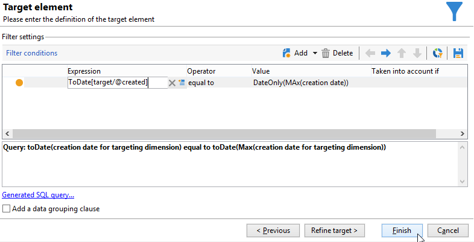

# Utilisation d’agrégats{#using-aggregates}

Ce cas pratique présente l&#39;identification automatique des derniers destinataires ajoutés dans la base.

Pour cela, la date de création des destinataires dans la base est comparée à la dernière date connue à laquelle un destinataire a été créé à l&#39;aide d&#39;un agrégat. Tous les destinataires créés le même jour seront ainsi sélectionnés.

Pour parvenir à effectuer un filtre du type **Date de création = max (Date de création)** sur les destinataires, il est nécessaire de passer par un workflow afin de réaliser les étapes suivantes :

1. Récupérez les destinataires de la base de données à l&#39;aide d&#39;une requête de base. Pour plus d&#39;informations sur cette étape, consultez [Créer une requête](query.md#creating-a-query).
1. Calculer la dernière date connue de création d&#39;un destinataire via le résultat de la fonction d&#39;agrégation **max (Date de création)**.
1. Lier chaque destinataire au résultat de la fonction d&#39;agrégation dans un même schéma.
1. Filtrer les destinataires à l&#39;aide de l&#39;agrégat via le schéma édité.

## Etape 1 : calculer le résultat de l&#39;agrégat {#step-1--calculating-the-aggregate-result}

1. Créez une requête. Ici, le but est de calculer la dernière date de création connue parmi la totalité des destinataires de la base. La requête ne contient donc pas de filtre.
1. Sélectionnez **[!UICONTROL Ajouter des données]**.
1. Dans les fenêtres successives, sélectionnez **[!UICONTROL Données liées à la dimension de filtrage]** puis **[!UICONTROL Données de la dimension de filtrage]**.
1. Dans le **[!UICONTROL Données à ajouter]** , ajoutez une colonne qui calcule la valeur maximale pour la variable **Date de création** dans la table des destinataires. Vous pouvez utiliser l’éditeur d’expression ou saisir **max(@created)** directement dans un champ de la **[!UICONTROL Expression]** colonne . Cliquez ensuite sur le bouton **[!UICONTROL Terminer]** bouton .

   

1. Cliquez sur **[!UICONTROL Modification des données additionnelles]** then **[!UICONTROL Paramètres avancés...]**. Vérifiez les **[!UICONTROL Désactiver l&#39;ajout automatique des clés primaires de la dimension de ciblage]** .

   Cette option permet de ne pas renvoyer tous les destinataires comme résultat et de ne conserver que les données explicitement ajoutées. Dans le cas présent, il s&#39;agit de la dernière date à laquelle un destinataire a été créé.

   Laissez l&#39;option **[!UICONTROL Supprimer les doublons (DISTINCT)]** cochée.

## Etape 2 : lier les destinataires et le résultat de la fonction d&#39;agrégation {#step-2--linking-the-recipients-and-the-aggregation-function-result}

Afin de lier la requête portant sur les destinataires à la requête servant au calcul de la fonction d&#39;agrégation, il est nécessaire d&#39;utiliser une activité d&#39;édition du schéma.

1. Définissez la requête portant sur les destinataires comme ensemble principal.
1. Dans l&#39;onglet **[!UICONTROL Liens]**, ajoutez un nouveau lien et renseignez la fenêtre qui s&#39;ouvre de la manière suivante :

   * Sélectionnez le schéma temporaire correspondant à l&#39;agrégat. Les données de ce schéma seront ajoutées aux membres de l&#39;ensemble principal.
   * Sélectionnez **[!UICONTROL Utiliser une jointure simple]** afin d&#39;associer le résultat de l&#39;agrégat à chaque destinataire de l&#39;ensemble principal.
   * Indiquez enfin que le lien est un **[!UICONTROL Lien simple de type 11]**.

   

Le résultat de la fonction d&#39;agrégation est ainsi lié à chaque destinataire.

## Etape 3 : filtrer les destinataires à l&#39;aide de l&#39;agrégat  {#step-3--filtering-recipients-using-the-aggregate-}

Une fois le lien établi, le résultat de l&#39;agrégat et les destinataires font partie du même schéma temporaire. Il est alors possible de réaliser un filtrage sur ce schéma afin d&#39;effectuer la comparaison entre la date de création des destinataires et la dernière date de création connue, représentée par la fonction d&#39;agrégation. Ce filtrage est réalisé grâce à une activité de partage.

1. Dans l&#39;onglet **[!UICONTROL Général]**, sélectionnez **Destinataires** comme dimension de ciblage et **Edition du schéma** comme dimension de filtrage (afin de filtrer sur le schéma de la transition entrante de l&#39;activité).
1. Dans l&#39;onglet **[!UICONTROL Sous-ensembles]**, sélectionnez **[!UICONTROL Ajouter une condition de filtrage sur la population entrante]** puis cliquez sur **[!UICONTROL Editer...]**.
1. Via l&#39;éditeur d&#39;expression, ajoutez un critère d&#39;égalité entre la date de création des destinataires et la date de création calculée par l&#39;agrégat.

   Les champs de type date de la base de données sont généralement enregistrés à la milliseconde près. Il faut alors étendre ces derniers à la journée entière afin de ne pas récupérer seulement des destinataires créés à la même milliseconde.

   Pour cela, utilisez la fonction **ToDate** disponible via l&#39;éditeur d&#39;expression, qui convertit les dates et heures en dates simples.

   Les expressions à utiliser pour le critère sont donc :

   * **[!UICONTROL Expression]**: `toDate([target/@created])`.
   * **[!UICONTROL Valeur]** : `toDate([datemax/expr####])`, où expr#### correspond à l&#39;alias de l&#39;agrégat défini dans la requête de la fonction d&#39;agrégation.

   

Le résultat de l&#39;activité de partage correspond ainsi aux destinataires créés le même jour que la dernière date de création connue.

Vous pouvez par la suite ajouter d&#39;autres activités telle qu&#39;une mise à jour de liste ou une diffusion afin de compléter votre workflow.
