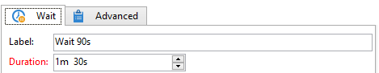

# Attente{#wait}

Une activité **Attente** active sa transition après un délai compris entre quelques secondes et plusieurs mois. Une tâche d’attente ne bloque pas l’exécution des autres tâches ; le workflow peut exécuter des tâches en parallèle alors que cette tâche est en attente.

L&#39;éditeur permet de saisir le libellé et la durée d&#39;attente, comme dans l&#39;exemple ci-dessous :

Dans le champ **[!UICONTROL Durée]**, la valeur peut être exprimée dans l’unité de votre choix (en fonction des paramètres régionaux définis pour l’opérateur ou l’opératrice) :

* Si les paramètres régionaux ne sont pas spécifiés : **s** pour les secondes, **m** pour les minutes, **h** pour les heures, **j** pour les jours, **y** pour les années. Lors de la validation, la valeur est automatiquement convertie dans l’unité la plus lisible.

  L&#39;unité par défaut est le jour (**j**).

* Tandis que si, par exemple, les paramètres régionaux sont définis sur &#39;Français&#39; : **s** pour les secondes, **mn** pour les minutes, **h** pour les heures, **j** pour les jours, **m** pour les mois, **a** pour les années. Lors de la validation, la valeur est automatiquement traduite dans l&#39;unité la plus lisible, comme dans l&#39;exemple ci-dessus : **90s** a été traduit en **1mn 30s**.

  L&#39;unité par défaut est le jour (**j**).
