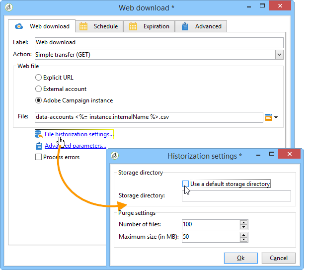

# Téléchargement Web{#web-download}

L&#39;activité **Téléchargement web** permet de lancer le téléchargement d&#39;un fichier sur une URL explicite, un compte externe ou une instance Adobe Campaign. Le protocole HTTP est utilisé. Il peut s’agir d’un téléchargement GET ou POST.

## Propriétés {#properties}

1. **Sélection du fichier web**

   Pour indiquer le fichier à télécharger, vous pouvez saisir son URL, utiliser le compte HTTP externe où le fichier est stocké ou charger le fichier à partir d’une instance Adobe Campaign. Les paramètres disponibles sont détaillés ci-dessous :

   * Pour saisir directement l&#39;URL du fichier à télécharger, sélectionnez l&#39;option **[!UICONTROL URL explicite]** et indiquez l&#39;URL dans le champ correspondant. Cette URL peut être construite avec des données variables.

     

   * Pour utiliser un **[!UICONTROL Compte externe]**, sélectionnez le compte dans la liste déroulante et indiquez le fichier à télécharger.

     Les comptes externes sont configurés à partir du nœud **[!UICONTROL Administration > Plateforme > Comptes externes]** de l’arborescence d’Adobe Campaign. Les paramètres du compte peuvent être modifiés à l’aide de l’icône **[!UICONTROL Modifier le lien]**.

     

   * Pour télécharger le fichier depuis l&#39;instance Adobe Campaign, choisissez l&#39;option **[!UICONTROL Instance Adobe Campaign]**.

     

1. **Historisation des fichiers**

   Le lien **[!UICONTROL Paramètres d&#39;historisation des fichiers...]** permet d&#39;indiquer le répertoire de stockage des fichiers et la fréquence de purge de ce répertoire.

   

   Les options disponibles sont les suivantes :

   * **[!UICONTROL Utiliser un répertoire de stockage par défaut]** : le fichier est toujours déplacé avant d’être traité. Si cette option est cochée, le fichier est déplacé dans le répertoire de stockage par défaut (le répertoire **vars** du dossier d’installation d’Adobe Campaign). Pour spécifier un répertoire de stockage, décochez la case et saisissez le chemin de celui-ci dans le champ **[!UICONTROL Répertoire de stockage]**.
   * **[!UICONTROL Nombre de fichiers]** : saisissez le nombre maximal de fichiers à conserver dans le répertoire de stockage.
   * **[!UICONTROL Taille maximale (en Mo)]** : saisissez la capacité maximale du répertoire de stockage (en méga octets).

   Chaque fichier est conservé pendant 24 heures avant d&#39;être soumis aux règles de purge définies. La purge a lieu juste avant le début de l&#39;activité et ne prend donc pas en compte le fichier de workflow en cours.

   Les fichiers sont supprimés en fonction de leur âge (du plus ancien au plus récent). Les fichiers les plus anciens sont purgés jusqu’à ce que les deux règles de purge soient vérifiées. Par conséquent, si une limite de 100 fichiers est définie, cela signifie que le répertoire de stockage contiendra toujours les 100 fichiers les plus récents avant le début du workflow, ainsi que ceux en cours de traitement dans le workflow en cours.

   Si vous ne souhaitez pas définir de limite pour les options **[!UICONTROL Nombre de fichiers]** et **[!UICONTROL Taille maximale (en Mo)]**, saisissez la valeur 0.

1. **Paramètres avancés**

   Le lien **[!UICONTROL Paramètres avancés...]** permet d&#39;indiquer les options supplémentaires ci-dessous :

   * **[!UICONTROL Suivre les redirections]** : la redirection de fichier permet d’utiliser des remplacements pour diriger les entrées ou les sorties de données vers un périphérique d’un différent type.
   * **[!UICONTROL Ajouter des en-têtes HTTP au fichier]** : dans certains cas, vous pouvez ajouter des en-têtes HTTP supplémentaires à un fichier. Le plus souvent, ces en-têtes sont utilisés pour fournir des informations supplémentaires à des fins de résolution de problèmes, pour le [partage de ressources entre origines multiples (CORS)](https://developer.mozilla.org/fr/docs/Web/HTTP/CORS) ou pour définir des directives de mise en cache spécifiques.
   * **[!UICONTROL Ignorer le code de retour HTTP]** : les codes de retour HTTP, également appelés codes d’état HTTP, indiquent le résultat d’une requête HTTP.

   

   L&#39;option **[!UICONTROL Traiter les erreurs]** est présentée dans la section [Traiter les erreurs](monitor-workflow-execution.md#processing-errors).

## Paramètres de sortie {#output-parameters}

* filename : Nom complet du fichier téléchargé.
