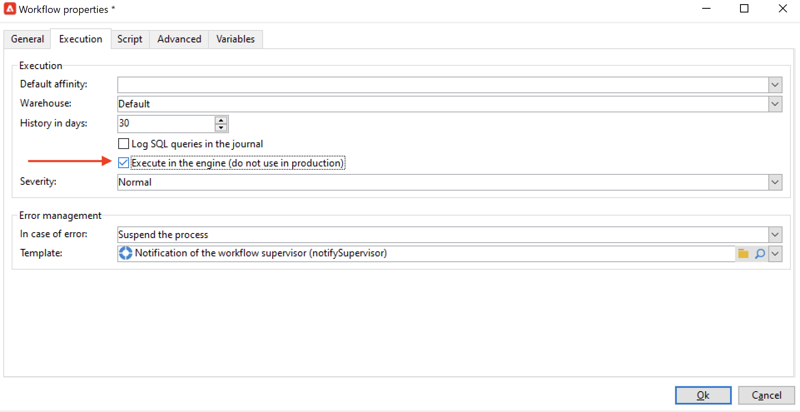

# Bonnes pratiques relatives aux workflows{#workflow-best-practices}

Vous trouverez ci-dessous des instructions générales pour optimiser les performances des workflows Campaign, améliorer la conception de vos workflows et sélectionner les paramètres appropriés.

## Dossiers des workflows {#workflow-folders}

Adobe conseille de créer les workflows dans un dossier dédié.

Si le workflow a un impact sur l’ensemble de la plateforme (processus de nettoyage, par exemple), vous pouvez ajouter un sous-dossier au dossier intégré **[!UICONTROL Workflows techniques]**.

## Attribution d’un nom au workflow {#workflow-naming}

Pour trouver plus facilement les workflows qui ne fonctionnent pas de la manière attendue et résoudre les problèmes, Adobe recommande d&#39;attribuer aux workflows des libellés et des noms adéquats. Renseignez également le champ de description du workflow pour que l&#39;opérateur puisse facilement comprendre son objectif.

Si le workflow fait partie d&#39;un processus impliquant d&#39;autres workflows, vous pouvez saisir un libellé explicite, en utilisant par exemple des chiffres pour classer les workflows (par libellé).

Par exemple :

* 001 - Import - Import des destinataires
* 002 - Import - Import des ventes
* 003 - Import - Import des détails sur les ventes
* 010 - Export - Export des logs de diffusion
* 011 - Export - Export des logs de tracking

## Niveau de criticité d’un workflow {#workflow-severity}

Vous pouvez configurer le niveau de criticité d&#39;un workflow dans l&#39;onglet **[!UICONTROL Exécution]** des propriétés du workflow :

* Normal
* Production
* Critique

Si vous indiquez cette information lors de la création d&#39;un workflow, vous déterminerez le niveau de priorité du processus configuré.

Cette option n&#39;a aucun impact fonctionnel sur les workflows autres que les workflows d&#39;opération.

Les workflows d&#39;opération (créés dans le cadre d&#39;une opération/campagne) avec un niveau de priorité plus élevé sont exécutés en premier si l&#39;opération comprend plusieurs processus qui sont supposés s&#39;exécuter simultanément. Par défaut, seuls 10 processus peuvent s&#39;exécuter simultanément dans une opération, selon l&#39;option NmsOperation_LimitConcurrency. Par exemple, si une opération contient 25 workflows, ceux avec une priorité plus élevée seront exécutés dans le premier pool de 10 processus.

## Surveillance des workflows {#workflow-monitoring}

Vous devez surveiller tous les workflows planifiés s&#39;exécutant dans des environnement de production afin d&#39;être averti en cas d&#39;erreur.

Dans les propriétés d&#39;un workflow, sélectionnez un groupe de responsables : le groupe **[!UICONTROL Superviseurs de workflow]** par défaut ou un groupe personnalisé. Vérifiez qu&#39;un opérateur au moins appartient à ce groupe et qu&#39;il dispose d&#39;une adresse email.

Avant de commencer la construction d’un workflow, pensez à définir les superviseurs. Ceux-ci seront avertis par email lorsqu’un workflow sera en erreur. Pour plus d&#39;informations, consultez la section [Gérer les erreurs](monitor-workflow-execution.md#managing-errors).

Vérifiez régulièrement l’onglet **[!UICONTROL Supervision]** pour connaître le statut des workflows actifs. Pour plus d&#39;informations, consultez la section [Supervision de l’instance](monitor-workflow-execution.md#instance-supervision).

La carte thermique des workflows permet aux administrateurs de la plateforme Adobe Campaign de surveiller la charge sur l’instance et de planifier les workflows en conséquence. Voir à ce sujet [Surveillance des workflows](heatmap.md).

## Activities {#using-activities}

>[!CAUTION]
>
>Vous pouvez copier et coller des activités dans un même workflow. Toutefois, nous vous déconseillons de copier et coller des activités dans différents workflows. Certains paramètres associés à des activités telles que Diffusions et Planificateur peuvent entraîner des conflits et des erreurs lors de l&#39;exécution du workflow de destination. Nous vous recommandons plutôt de **dupliquer** les workflows. Pour plus d&#39;informations, voir la section [Duplication des workflows](build-a-workflow.md#duplicate-workflows).

### Attribution d&#39;un nom à une activité {#name-of-the-activity}

Lors du développement de votre workflow, toutes les activités seront dotées d&#39;un nom, tout comme les objets Adobe Campaign. Bien que ce nom soit généré par l&#39;outil, il est recommandé d&#39;attribuer à une activité un nom explicite lors de sa configuration. Si vous le faites plus tard, le workflow peut être interrompu si les activités utilisent le nom d&#39;activités précédentes et la mise à jour des noms risque d&#39;être difficile.

Le nom d&#39;une activité figure dans l&#39;onglet **[!UICONTROL Avancé]**. Ne conservez pas le nom **[!UICONTROL query]**, **[!UICONTROL query1]** ou **[!UICONTROL query11]**. Attribuez à une activité un nom explicite comme **[!UICONTROL querySubscribedRecipients]**. Ce nom apparaît dans le journal et les logs SQL, le cas échéant, et permet de déboguer le workflow lors de sa configuration.

### Premières et dernières activités {#first-and-last-activities}

* Commencez toujours votre workflow par une activité **[!UICONTROL Début]** ou une activité **[!UICONTROL Planificateur]**. Lorsque cela est pertinent, vous pouvez également utiliser une activité **[!UICONTROL Signal externe]**.
* Lors de la construction de votre workflow, n&#39;utilisez qu&#39;une seule **** activité Planificateur par branche. Si une même branche d&#39;un workflow comporte plusieurs planificateurs (liés les uns aux autres), le nombre de tâches à exécuter sera multiplié de manière exponentielle, ce qui surchargerait considérablement la base. Cette règle s’applique également à toutes les activités comportant un onglet **[!UICONTROL Planification &amp; historique]**. En savoir plus sur la [planification](scheduler.md).

   

* Utilisez des activités **[!UICONTROL Fin]** dans tous vos workflows. Cela permet à Adobe Campaign de libérer l’espace temporaire utilisé pour réaliser les calculs dans les workflows. Voir à ce sujet la section [Début et Fin](start-and-end.md).

### Code JavaScript dans une activité {#javascript-within-an-activity}

Vous souhaiterez peut-être ajouter du code JavaScript lors de l&#39;initialisation d&#39;une activité de workflow. Vous pouvez le faire dans l&#39;onglet **[!UICONTROL Avancé]** d&#39;une activité.

Pour repérer plus facilement le workflow, il est conseillé d&#39;utiliser deux tirets avant et après le libellé de l&#39;activité, comme dans l&#39;exemple suivant : -- Mon libellé --.

### Signal {#signal}

La plupart du temps, vous ne saurez pas d&#39;où vient l&#39;appel d&#39;un signal. Pour éviter ce problème, utilisez le champ **[!UICONTROL Commentaire]** de l&#39;onglet **[!UICONTROL Avancé]** de l&#39;activité de signal pour documenter l&#39;origine attendue d&#39;un signal pour l&#39;activité en question.

## Mises à jour des workflows {#workflow-update}

Un workflow de production ne doit pas être directement mis à jour. À moins que le processus consiste à créer une opération avec des modèles de workflow, les processus doivent être d&#39;abord testés dans un environnement de développement. Après validation, le workflow peut être déployé et démarré en production.

Effectuez tous les tests dans les environnements de développement ou d’évaluation, et non dans les environnements de production, où les performances ne peuvent pas être garanties.

Les workflows archivés peuvent être conservés sur des plateformes de développement ou de test, dans un dossier Archivé. Un environnement de production doit en revanche rester aussi propre que possible. Les anciens workflows doivent être supprimés de l&#39;environnement de production s&#39;ils sont inactifs.

## Exécution et performance {#execution-and-performance}

### Logs {#logs}

Méthode JavaScript **[!UICONTROL logInfo()]** est une solution pour déboguer un workflow. Toutefois, il doit être utilisé avec précaution, en particulier pour les activités qui sont fréquemment exécutées : il peut surcharger les journaux et augmenter considérablement la taille de la table des journaux.

### Conserver les populations intermédiaires

Le **Conserver le résultat des populations intermédiaires entre deux exécutions** conserve les tables temporaires entre deux exécutions d’un workflow.

Elle est disponible dans les propriétés du workflow. **[!UICONTROL Général]** et peut être utilisé à des fins de développement et de test pour surveiller les données et vérifier les résultats. Vous pouvez utiliser cette option dans les environnements de développement, mais ne l’utilisez jamais dans les environnements de production. Le fait de conserver des tables temporaires peut entraîner une augmentation significative de la taille de la base de données et, par la suite, l’atteinte de la limite de taille. De plus, cela ralentira la sauvegarde.

Seules les tables de travail de la dernière exécution du workflow sont conservées. Celles des exécutions précédentes sont purgées par le workflow de **[!UICONTROL nettoyage]** qui s&#39;exécute tous les jours.

>[!CAUTION]
>
>Cette option doit **never** être archivé dans un **production** workflow. Elle sert à analyser les résultats et est conçue uniquement à des fins de test. Elle ne doit donc être utilisée que dans les environnements de développement ou d’évaluation.

### Enregistrer les requêtes SQL

Le **Enregistrer les requêtes SQL dans le journal** est disponible dans la variable **[!UICONTROL Exécution]** de propriétés de workflow. Cette option consigne toutes les requêtes SQL des différentes activités et permet de voir ce qui est réellement exécuté par la plateforme. Toutefois, cette option ne doit être utilisée que **temporairement** pendant le développement et **non activé en production**.

La bonne pratique consiste à purger les journaux lorsqu’ils ne sont plus nécessaires. L’historique d’un workflow n’est pas purgé automatiquement : tous les messages sont conservés par défaut. Vous pouvez purger l’historique depuis le menu **[!UICONTROL Fichier > Actions]** ou en cliquant sur le bouton Actions situé dans la barre d’outils au-dessus de la liste. Choisissez Purge de l’historique.
Pour savoir comment purger les logs, consultez cette [documentation](start-a-workflow.md).

### Planification des workflows {#workflow-planning}

D’autres bonnes pratiques doivent être appliquées à la planification de l’exécution de vos workflows afin d’éviter tout problème :

* Maintenez un niveau d’activité stable tout au long de la journée et évitez les pics pour empêcher l’instance de surcharger. Pour ce faire, répartissez les heures de début des workflows de manière uniforme tout au long de la journée.
* Planifiez le chargement des données au cours de la nuit de façon à réduire les conflits entre les données.
* Les workflows longs peuvent avoir une incidence sur les ressources du serveur et de la base de données. Fractionnez les workflows les plus longs pour réduire le temps de traitement.
* Pour réduire les temps d’exécution globaux, remplacez les activités exigeant beaucoup de temps par des activités simplifiées et plus rapides.
* Évitez d’exécuter plus de 20 workflows simultanément. Lorsque trop de workflows sont exécutés en même temps, votre plateforme peut être surchargée et devenir instable.

### Exécution des workflows {#workflow-execution}

Améliorez la stabilité de votre instance en mettant en oeuvre les bonnes pratiques suivantes :

* **Ne planifiez pas l’exécution d’un workflow à une fréquence supérieure à toutes les 15 minutes**, car cela peut nuire aux performances générales du système et créer des blocs dans la base de données.

* **Évitez de laisser les workflows en pause**. Si vous créez un workflow temporaire, vérifiez quʼil pourra se terminer correctement et quʼil ne restera pas dans un état **[!UICONTROL en pause]**, car il vous obligerait à conserver les tables temporaires, ce qui augmenterait la taille de la base de données. Affectez des superviseurs dans les propriétés du workflow pour envoyer une alerte en cas d’échec ou de suspension d’un workflow par le système.

   Pour éviter que les workflows soient dans un état en pause :

   * Vérifiez vos workflows régulièrement pour vous assurer qu&#39;il n&#39;y a pas d&#39;erreurs inattendues.
   * Faites en sorte que vos workflows soient aussi simples que possible, en fractionnant par exemple les workflows volumineux en plusieurs workflows différents. Vous pouvez utiliser des activités **[!UICONTROL Signal externe]** pour déclencher leur exécution selon celle d&#39;autres workflows.
   * Évitez de conserver dans vos workflows des activités désactivées contenant des flux. Cette situation conduit à maintenir des threads ouverts et de nombreuses tables temporaires qui consomment beaucoup d’espace. Ne conservez pas, dans vos workflows, des activités se trouvant dans les états **[!UICONTROL Ne pas activer]** ou **[!UICONTROL Activer, mais ne pas exécuter]**.

* **Arrêtez les workflows qui ne sont pas utilisés**. En continuant à s’exécuter, ils maintiennent les connexions avec la base de données.

* **N’utilisez l’arrêt inconditionnel quʼavec une extrême parcimonie**. Cette action ne doit pas être appliquée régulièrement. Une fermeture incorrecte des connexions générées par les workflows vers la base de données nuit aux performances.

* **N’effectuez pas plusieurs demandes d’arrêt sur le même workflow**. L’arrêt d’un workflow suit un processus asynchrone : la demande est enregistrée, puis le ou les serveurs de workflow annulent les opérations en cours. L’arrêt d’une instance de workflow peut donc prendre du temps, surtout si le workflow est exécuté sur plusieurs serveurs, car chacun d’eux doit alors prendre le contrôle pour annuler les tâches en cours. Pour éviter tout problème, attendez que l’opération d’arrêt soit terminée et évitez d’arrêter un workflow à de multiples reprises.

### Option exécuter dans le moteur {#execute-in-the-engine-option}

Dans un environnement de production, évitez d&#39;exécuter des workflows dans le moteur. Lorsque la variable **[!UICONTROL Exécuter dans le moteur]** est cochée dans la variable **[!UICONTROL Propriétés du workflow]**, le workflow est prioritaire et tous les autres workflows sont arrêtés par le moteur de workflow tant que celui-ci n&#39;est pas terminé.

