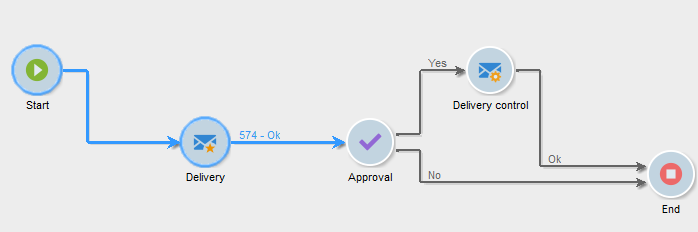

# Cycle de vie d&#39;un workflow {#workflow-life-cycle}

Le cycle de vie d&#39;un workflow comporte trois grandes étapes.

* **En édition**

  Il s’agit de la phase de conception initiale : lorsqu’un nouveau workflow est créé, son statut est « En cours d’édition ». Le workflow n’est pas encore pris en charge par le serveur et peut être modifié sans risque.

* **Démarré**

  Une fois la phase de conception terminée, le workflow peut être démarré. Au cours de cette phase, l’instance est gérée par le serveur et les tâches individuelles sont exécutées. Le workflow peut toujours être modifié avec certaines précautions.

* **Terminé**

  Un workflow est terminé lorsqu&#39;il n&#39;a plus de tâche en cours ou lorsqu&#39;un opérateur a arrêté explicitement l&#39;instance.

Par exemple, dans le workflow ci-dessous, les activités **Début** et **Diffusion** sont entourées tandis que l’activité **Validation** clignote.

Cela signifie que les deux premières activités ont été exécutées avec succès et que la validation est en cours, c&#39;est-à-dire que l&#39;activité est créée mais pas encore complétée.

Les caractères **574 -Ok** affichés au-dessus de la transition suivant l’activité **Diffusion** signifient que la préparation de la diffusion a ciblé 574 personnes destinataires et que l’opération s’est terminée correctement. Ces informations, ajoutées sur les transitions au moment de l’exécution, sont calculées par les activités traitant des données.

Le workflow est donc démarré et attend la décision d&#39;un opérateur du groupe spécifié dans l&#39;activité **Validation**. Les opérateurs et opératrices du groupe ayant une adresse e-mail ou un numéro de mobile renseigné reçoivent une notification.

Pour plus d&#39;informations sur la manière de surveiller vos workflows, voir [cette section](monitor-workflow-execution.md).
