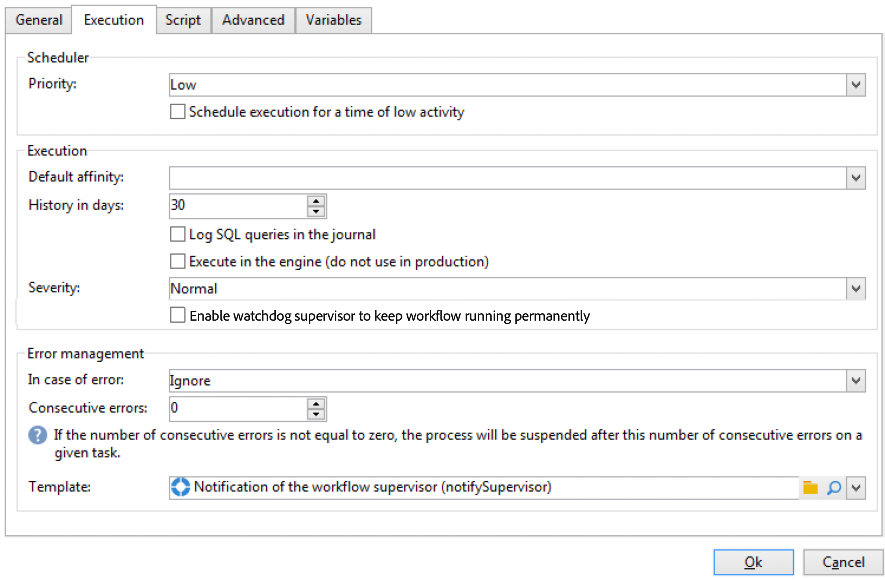
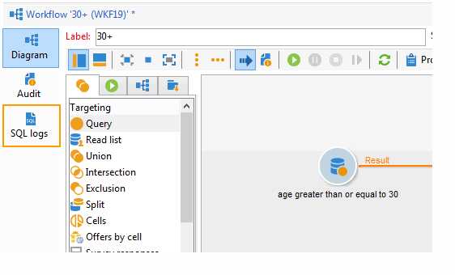
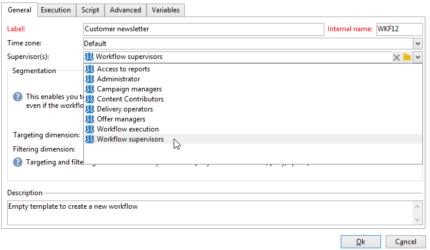

# Propriétés d&#39;exécution{#workflow-properties}

## Onglet Exécution {#execution-tab}

L&#39;onglet **[!UICONTROL Exécution]** de la fenêtre **[!UICONTROL Propriétés]** d&#39;un workflow est organisée en 3 sections :

### Planificateur {#scheduler}

Cette section n’apparaît que dans les workflows de campagne.

* **[!UICONTROL Priorité]**

  Le moteur de workflow traite les workflows à exécuter selon le critère de priorité défini dans ce champ. Par exemple, tous les workflows de priorité **[!UICONTROL moyenne]** sont exécutés avant ceux de priorité **[!UICONTROL faible]**.

* **[!UICONTROL Différer l’exécution vers une plage horaire de faible activité]**

  Cette option reporte le démarrage du workflow à une période moins chargée. Certains workflows peuvent être coûteux en termes de ressources pour le moteur de base de données. Nous recommandons de planifier l’exécution pendant une période de faible activité (la nuit, par exemple). Les plages horaires de faible activité sont définies dans le workflow technique **[!UICONTROL Traitements sur les campagnes]**.

### Exécution {#execution}

* **[!UICONTROL Affinité par défaut]**

  Si votre installation comprend plusieurs serveurs de workflow, utilisez ce champ pour choisir l’ordinateur sur lequel le workflow sera exécuté. Si la valeur définie dans ce champ n’existe sur aucun serveur, le workflow restera en attente.

* **[!UICONTROL Jours d&#39;historique]**

  Les tables de travail de la base de données conservent un historique des exécutions (tâches, événements, log). Définissez ici le nombre de jours d’archives que vous voulez conserver pour ce workflow : les processus de nettoyage supprimera une fois par jour les archives plus anciennes. Si la valeur de ce champ est zéro, l’archive ne sera jamais supprimée.

* **[!UICONTROL Enregistrer les requêtes SQL dans le journal]**

  Cette fonctionnalité est réservée aux utilisateurs et utilisatrices avancés. Elle concerne les workflows qui contiennent des activités de ciblage (requête, union, intersection, etc.). Lorsque cette option est cochée, les requêtes SQL envoyées à la base de données lors de l’exécution du workflow sont affichées dans Adobe Campaign : cela signifie que vous pouvez les analyser afin d’optimiser les requêtes ou de diagnostiquer les problèmes.

  Les requêtes sont affichées dans un onglet **[!UICONTROL Logs SQL]** ajouté au workflow (sauf pour les workflows de campagne) et à l’activité **[!UICONTROL Propriétés]** lorsque l’option est activée. L’onglet **[!UICONTROL Audit]** comprend également des requêtes SQL.

  

* **[!UICONTROL Exécuter dans le moteur]**

  Cette option ne peut être utilisée qu’à des fins de débogage et jamais en production. Lorsqu’elle est activée, le workflow devient prioritaire et tous les autres workflows sont arrêtés tant que celui-ci n’est pas terminé.

* **[!UICONTROL Activer le superviseur de surveillance pour que le workflow continue à fonctionner en permanence.]**

  Cette option force le redémarrage automatique des workflows en cas d’erreur. Lorsqu’elle est activée, le redémarrage vérifie toutes les 30 secondes le statut du workflow et le redémarre si nécessaire. Pour ajuster l’intervalle de 30 secondes, vous pouvez créer l’option technique `XtkWorkflow_WatchdogRestartTimerTimeout` et utiliser un type de données entier pour spécifier le délai souhaité.

  >[!NOTE]
  >
  >* Cette option est disponible à partir de la version 8.6.4.
  >
  >* Cette option est destinée aux utilisateurs et utilisatrices de niveau avancé et ne doit être activée que pour les **workflows techniques**.
  >
  >* Cette option est activée par défaut pour les workflows de réplication centralisée disponibles dans un [déploiement Entreprise (FFDA)](../../v8/architecture/enterprise-deployment.md). [En savoir plus](../../v8/architecture/replication.md)

### Gestion des erreurs {#error-management}

* **[!UICONTROL Résolution des problèmes]**

  Ce champ vous permet de définir les actions à effectuer si une tâche de workflow rencontre une erreur. Deux options sont disponibles :

  * **[!UICONTROL Arrêter le processus]** : le workflow est automatiquement mis en pause. Sinon, le statut du workflow devient **[!UICONTROL Échec]**. Une fois le problème résolu, redémarrez le workflow à l’aide des boutons **[!UICONTROL Démarrer]** ou **[!UICONTROL Redémarrer]**.
  * **[!UICONTROL Ignorer]** : le statut de la tâche qui a déclenché l’erreur passe à **[!UICONTROL Échec]**, mais le workflow conserve le statut **[!UICONTROL Démarré]**. Cette configuration est pertinente dans le cas de tâches récurrentes : si la branche comporte un planificateur, celui-ci démarrera normalement à la prochaine exécution du workflow.

* **[!UICONTROL Erreurs consécutives]**

  Ce champ est disponible lorsque la valeur **[!UICONTROL Ignorer]** est sélectionnée dans le champ **[!UICONTROL En cas d’erreur]**. Vous pouvez indiquer le nombre d’erreurs qui peuvent être ignorées avant l’arrêt du processus. Une fois ce nombre atteint, le statut du workflow passe à **[!UICONTROL Échec]**. Si la valeur de ce champ est 0, le workflow ne sera jamais arrêté, quel que soit le nombre d’erreurs.

* **[!UICONTROL Template]**

  Dans ce champ, choisissez le modèle de notification à envoyer au groupe de supervision du workflow lorsque celui-ci passe sur **[!UICONTROL En échec]**.

  Les opérateurs et opératrices recevront un e-mail, à l’adresse indiquée dans leur profil, le cas échéant. Pour définir les responsable des workflows, accédez au champ **[!UICONTROL Personnes chargées de la supervision]** de l’onglet **[!UICONTROL Général]** des propriétés.

  

  Le modèle par défaut **[!UICONTROL Notification du responsable d’un workflow]** comprend un lien qui permet d’accéder via le Web à la console cliente Adobe Campaign et, après connexion, d’agir sur le workflow en erreur.

  Vous pouvez créer un modèle personnalisé dans **[!UICONTROL Administration > Gestion de campagne > Modèles des diffusions techniques]**.
