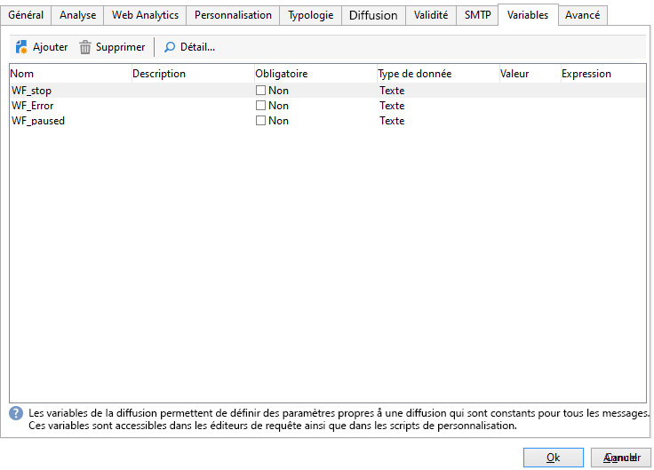
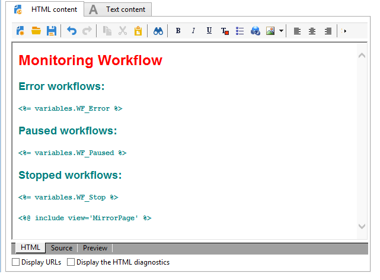
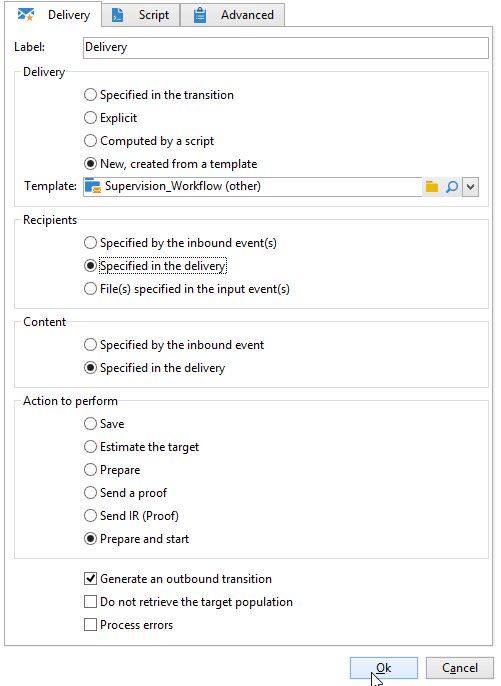
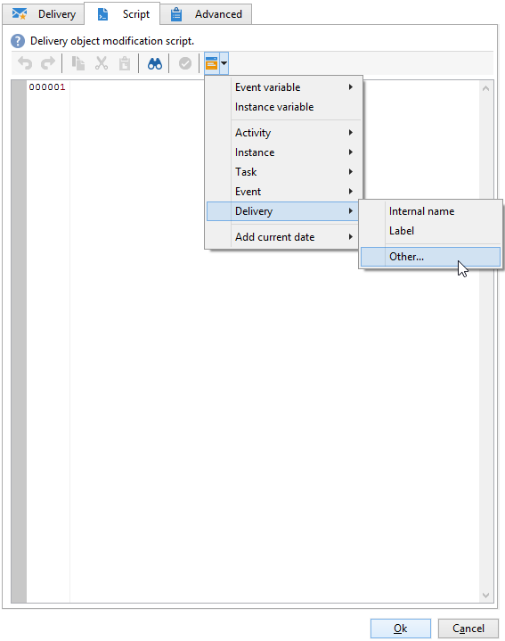

# Cas d’utilisation : supervision de vos workflows{#supervising-workflows}

Ce cas pratique détaille la création d&#39;un workflow qui permet de suivre le statut d&#39;un ensemble de workflows dont l&#39;état est &quot;en pause&quot;, &quot;stoppé&quot; ou &quot;en erreur&quot;.

Son objectif est le suivant :

* Utiliser un workflow pour suivre un groupe de workflows métiers.
* Envoyer un message à un superviseur via une activité &quot;diffusion&quot;.

Pour suivre le statut d&#39;un ensemble de workflows, vous devez procéder comme suit :

1. Créer le Workflow de suivi.
1. Ecrire le JavaScript permettant de déterminer les workflows ayant le statut en erreur, en pause ou stoppé.
1. Créer l&#39;activité **[!UICONTROL Test]**.
1. Préparer le modèle de diffusion.

>[!NOTE]
>
>Outre le workflow, la **carte thermique des workflows Campaign** vous permet d’analyser dans le détail les workflows en cours d’exécution. Voir à ce sujet la [section dédiée](heatmap.md).
>
>Pour plus d’informations sur la **surveillance de l’exécution des workflows**, consultez [cette section](monitor-workflow-execution.md).

## Etape 1: Création du workflow de suivi {#step-1--creating-the-monitoring-workflow}

Le dossier de workflows que nous allons suivre est le dossier **&quot;CustomWorkflows&quot;** stocké dans le noeud : **Administration > Exploitation > Workflows Techniques**. Ce dossier contient un ensemble de workflows métiers.

Le **workflow de suivi** est stocké à la racine du dossier Workflows Techniques. Le libellé utilisé est **&quot;Suivi&quot;**.

Le schéma suivant montre l&#39;ordonnancement des activités :


Ce workflow se compose de :

* une activité **&quot;Début&quot;**.
* une activité **&quot;Code JavaScript&quot;** responsable de l&#39;analyse du dossier de workflows métiers.
* une activité **&quot;Test&quot;** pour lancer une diffusion vers le superviseur ou relancer le workflow.
* une activité **&quot;Diffusion&quot;** responsable de la mise en forme du message.
* une activité **&quot;Attente&quot;** contrôlant l&#39;intervalle de temps entre les itérations du workflow.

## Etape 2: Ecriture du JavaScript {#step-2--writing-the-javascript}

La première partie du code JavaScript correspond à **une requête (queryDef)** permettant d&#39;identifier les workflows ayant un statut &quot;pause&quot; (@state == 13), &quot;erreur&quot; (@failed == 1) ou &quot;stoppé&quot; (@state == 20).

Le **nom interne** du dossier de workflow à suivre est donné dans la condition suivante :

```
<condition boolOperator="AND" expr="[folder/@name] = 'Folder20'" internalId="1"/>
```

```
var strError = "";
var strPaused = "";
var strStop = "";

var queryWkfError = xtk.queryDef.create(
  <queryDef schema="xtk:workflow" operation="select">
    <select>
      <node expr="@internalName"/>
      <node expr="@state"/>
      <node expr="@label"/>
      <node expr="@failed"/>
      <node expr="@state"/>   
    </select>
    <where id="12837805386">
      <condition boolOperator="AND" expr="[folder/@name] = 'Folder20'" internalId="1"/>
        <condition boolOperator="AND" internalId="2">
          <condition boolOperator="OR" expr="@state = 20" internalId="3"/>
          <condition expr="@state = 13" internalId="4"/>
        </condition>  
    </where>
  </queryDef>
);
var ndWkfError = queryWkfError.ExecuteQuery(); 
```

La deuxième partie du code JavaScript permet **d&#39;afficher un message pour chaque workflow** en fonction du statut remonté lors de la requête.

>[!NOTE]
>
>Les chaînes créées doivent être chargées dans les variables d&#39;événements du workflow.

```
for each ( var wkf in ndWkfError.workflow ) 
{
  if ( wkf.@state == 13 )  // Status 13 = paused
  {
    if ( wkf.@failed == 1 )
      strError += "<li>Workflow '" + wkf.@internalName + "' with the label '" + wkf.@label + "'</li>";
    else
      strPaused += "<li>Workflow '" + wkf.@internalName + "' with the label '" + wkf.@label + "'</li>";
  }
  
  if ( wkf.@state == 20 )  // Status 20 = stop
    strStop += "<li>Workflow '" + wkf.@internalName + "' with the label '" + wkf.@label + "'</li>";
}

vars.strWorkflowError = strError;
vars.strWorkflowPaused = strPaused;
vars.strWorkflowStop = strStop;
```

## Etape 3: Création de l&#39;activité &#39;Test&#39; {#step-3--creating-the--test--activity}

L&#39;activité &quot;Test&quot; permet de déterminer si une diffusion doit être envoyée ou bien si le workflow de suivi doit recommencer un cycle en se positionnant sur l&#39;activité &quot;Attente&quot;.

Une diffusion est envoyée au superviseur **si au moins une des trois variables d&#39;événements &quot;vars.strWorkflowError&quot;, &quot;vars.strWorkflowPaused&quot;, &quot;vars.strWorkflowStop&quot; est non nulle.**


L&#39;activité &quot;Attente&quot; peut être paramétrée pour relancer le workflow de suivi à intervalle régulier. Pour ce cas pratique, **la durée d&#39;attente est fixée à une heure**.


## Etape 4: Préparation de la diffusion {#step-4--preparing-the-delivery}

L&#39;activité &quot;Diffusion&quot; est basée sur un **modèle de diffusion** stocké dans le noeud **Ressources > Modèles > Modèles de diffusion**.

Ce modèle doit comporter :

* **l&#39;adresse mail du superviseur**.
* **un contenu HTML** permettant d&#39;insérer du texte personnalisé.

   

   Les trois variables déclarées (WF_Stop, WF_Paused, WF_Error) correspondent aux trois variables d&#39;événements du workflow.

   Ces variables doivent être déclarées dans l&#39;onglet **Variables** des propriétés du modèles de diffusion.

   Afin de récupérer **le contenu des variables d&#39;événements du workflow**, il est nécessaire de déclarer des variables propres à la diffusion qui seront initialisées avec les valeurs retournées par le code JavaScript.

   Le contenu de modèle de diffusion est le suivant :

   

Une fois le modèle crée et validé, vous devez configurer l&#39;activité **Diffusion** pour:

* lier l&#39;activité &quot;Diffusion&quot; avec le modèle de diffusion précédemment crée.
* lier les variables d&#39;événements du workflow avec les variables propres au modèle de diffusion.

En double cliquant sur l&#39;activité **Diffusion**, choisissez les options suivantes :

* Diffusion : sélectionnez **Nouvelle, créée depuis un modèle**, et sélectionnez le modèle de diffusion créé précédemment.
* Pour les champs **Destinataires et Contenu**, sélectionnez **Spécifiés dans la diffusion**.
* Action à effectuer : sélectionnez **Préparer et démarrer**.
* Décochez l&#39;option **Traiter les erreurs**.

   

* Dans l&#39;onglet **Script** de l&#39;activité **Diffusion**, ajoutez trois variables de type **chaîne de caractères** via le sélecteur de champs de personnalisation

   

   

   Les trois variables déclarées sont :

   ```
   delivery.variables._var[0].stringValue = vars.strWorkflowError;
   delivery.variables._var[1].stringValue = vars.strWorkflowPaused;
   delivery.variables._var[2].stringValue = vars.strWorkflowStop; 
   ```

Une fois ce workflow de suivi lancé, il envoie un résumé aux destinataires.
