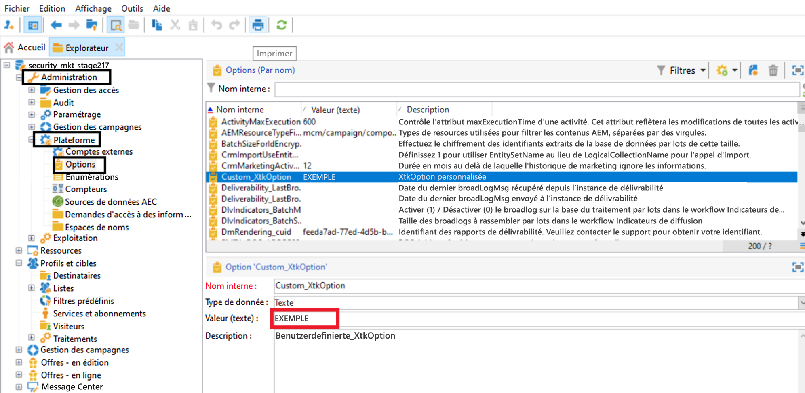
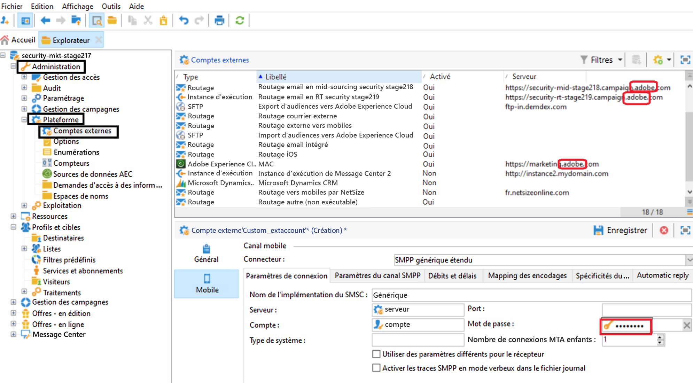

# Remarque technique : Guide de rotation des informations d’identification {#ac-customer-credentials}

En tant que client, vous devez remplacer vos informations d’identification par un nouvel ensemble périodiquement afin d’atténuer le risque de compromis.

## Informations d’identification des options Adobe Campaign {#ac-options-credentials}

Depuis l’Explorateur Adobe Campaign, le noeud **Administration > Plateforme > Options** vous permet d’apporter des modifications aux options Adobe Campaign. Si vous avez stocké des informations d’identification ici, veillez à les faire pivoter.

## Identifiants du compte externe {#ac-accounts-credentials}

Le noeud **Administration > Plateforme > Comptes externes** vous permet d’apporter des modifications aux comptes externes Adobe Campaign.

Effectuez une rotation de toutes vos informations d’identification enregistrées dans les comptes externes.

>[!CAUTION]
>
>**Ne modifiez pas les informations d’identification gérées de l’Adobe.** Les comptes externes ayant un serveur lié à `adobe` ne doivent pas être modifiés.

Pour les opérateurs techniques `mc*` (ex : mc1, mc2, etc.) et `Interaction*` (ex : interaction1, interaction2, etc.) spécifiques, l&#39;une des deux approches ci-dessous peut être suivie :

1. Adobe peut modifier les informations d’identification de ces opérateurs et les partager avec vous. Notez que toutes les intégrations utilisant ces opérateurs cesseront de fonctionner jusqu’à ce que les informations d’identification de ces opérateurs soient mises à jour de votre côté.

1. Adobe peut créer des opérateurs **new** correspondant à chaque opérateur existant et les partager avec vous. Adobe supprimera toutes les occurrences des anciens opérateurs une fois que vous aurez choisi ces nouveaux opérateurs.

## Clé privée/certificat Mobile Services  {#ac-key-credentials}

Pour la rotation des clés privées et du certificat associés aux services mobiles, reportez-vous aux liens ci-dessous.

* Pour Android, reportez-vous à [cette documentation](https://experienceleague.adobe.com/en/docs/campaign-classic/using/sending-messages/sending-push-notifications/configure-the-mobile-app/configuring-the-mobile-application-android){target="_blank"}.
Accédez à la section **Créer l’application mobile Android > Configurer la version d’API** .

* Pour iOS, reportez-vous à [cette documentation](https://experienceleague.adobe.com/en/docs/campaign-classic/using/sending-messages/sending-push-notifications/configure-the-mobile-app/configuring-the-mobile-application){target="_blank"}.
Accédez à la section **Créer une application mobile iOS->Mode d’authentification** .

## Clés GPG {#ac-gpg-credentials}

Pour la rotation des clés GPG, les étapes suivantes doivent être suivies :

1. Décryptez les données existantes à l’aide de la clé existante. [En savoir plus](https://experienceleague.adobe.com/en/docs/control-panel/using/instances-settings/gpg-keys-management#decrypting-data){target="_blank"}.

1. Créez une nouvelle paire de clés GPG. Pour en savoir plus sur la gestion des clés GPG, consultez [cette documentation](https://experienceleague.adobe.com/en/docs/control-panel/using/instances-settings/gpg-keys-management#decrypting-data){target="_blank"}.

1. Remplacez l’utilisation de clés GPG existante dans tous les workflows par la clé nouvellement créée.

1. Supprimez la clé GPG existante.