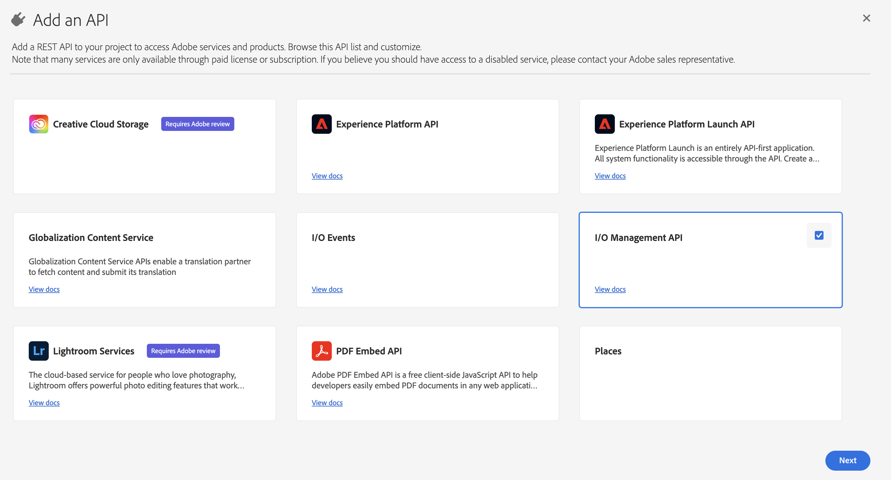

# Migration des opérateurs et opératrices techniques Campaign vers Adobe Developer Console {#migrate-tech-users-to-ims}

Dans le cadre des efforts visant à renforcer le processus de sécurité et d&#39;authentification, à partir de Campaign v8.5, le processus d&#39;authentification vers Campaign v8 est en cours d&#39;amélioration. Les opérateurs techniques peuvent désormais utiliser la variable [Adobe Identity Management System (IMS)](https://helpx.adobe.com/fr/enterprise/using/identity.html){target="_blank"} to connect to Campaign. Learn more about the new server to server authentication process in [Adobe Developer Console documentation](https://developer.adobe.com/developer-console/docs/guides/authentication/ServerToServerAuthentication/){target="_blank"}.

Un opérateur ou une opératrice technique est un profil utilisateur de Campaign qui a été explicitement créé pour l’intégration de l’API. Cet article décrit les étapes à suivre pour migrer un opérateur technique vers un compte technique via la console Adobe Developer.


## Cela vous concerne-t-il ?{#ims-impacts}

Si vous effectuez des appels d&#39;API depuis un système externe à Campaign vers l&#39;instance Campaign Marketing ou l&#39;instance Real Time Message Center, vous devez migrer le ou les opérateurs techniques vers un ou plusieurs comptes techniques via la console Adobe Developer, comme décrit ci-dessous.

Cette modification s’applique à partir de Campaign v8.5.


## Processus de migration {#ims-migration-procedure}

Suivez les étapes ci-dessous pour créer un ou plusieurs comptes techniques dans la console Adobe Developer, puis utilisez ces comptes nouvellement créés pour pouvoir modifier les méthodes d’authentification de tous vos systèmes externes qui effectuent des appels d’API dans Adobe Campaign.

Voici un aperçu des étapes :

* Création d’un projet dans la console Adobe Developer
* Affectation des API appropriées au projet nouvellement créé
* Octroi des profils de produit Campaign nécessaires au projet
* Mise à jour de vos API pour utiliser les informations d’identification du compte technique nouvellement créées
* Supprimer les opérateurs techniques hérités de votre instance Campaign

### Prérequis pour la migration{#ims-migration-prerequisites}

Pour pouvoir créer les comptes techniques qui remplacent les opérateurs techniques, la condition préalable à la validation des profils de produit Campaign appropriés dans le Admin Console pour toutes les instances Campaign doit être remplie. Vous pouvez en savoir plus sur les profils de produit dans Adobe Console dans [Documentation de la console Adobe Developer](https://developer.adobe.com/developer-console/docs/guides/projects/){target="_blank"}.

Pour les appels API dans les instances Message Center, un profil de produit doit avoir été créé lors de la mise à niveau vers Campaign v8.5 ou de la mise en service de l&#39;instance. Ce profil de produit est nommé :

`campaign - <your campaign instance> - messagecenter`

Si vous avez déjà utilisé l’authentification IMS pour l’accès des utilisateurs à Campaign, les profils de produit requis pour les appels API doivent déjà exister dans le Admin Console. Si vous utilisez un groupe d’opérateurs personnalisé dans Campaign pour les appels d’API vers l’instance Marketing, vous devez créer ce profil de produit dans le Admin Console.

Dans d’autres cas, vous devez contacter votre gestionnaire de transition d’Adobe afin que les équipes techniques d’Adobe puissent migrer vos groupes d’opérateurs existants et vos droits nommés vers les profils de produit dans le Admin Console.


### Étape 1 - Création de votre projet Campaign dans la console Adobe Developer {#ims-migration-step-1}

Les intégrations sont créées dans le cadre d’un **Projet** dans Adobe Developer Console. En savoir plus sur les projets dans la [documentation d’Adobe Developer Console](https://developer.adobe.com/developer-console/docs/guides/projects/){target="_blank"}.

Vous pouvez utiliser n’importe quel projet précédemment créé par vous ou créer un nouveau projet. Les étapes de création d’un projet sont détaillées dans la [documentation d’Adobe Developer Console](https://developer.adobe.com/developer-console/docs/guides/getting-started/){target="_blank"}. Vous trouverez ci-dessous les étapes clés

<!--
For this migration, you must add below APIs in your project: **I/O Management API** and **Adobe Campaign**.

-->

Pour créer un projet, cliquez sur **Créer un projet** dans l’écran principal de la console Adobe Developer.


Vous pouvez utiliser la variable **Modifier le projet** pour renommer ce projet.


### Étape 2 - Ajout d’API à votre projet {#ims-migration-step-2}

Dans l’écran du projet nouvellement créé, ajoutez les API nécessaires pour pouvoir utiliser ce projet comme compte technique pour vos appels d’API à Adobe Campaign.

Pour ajouter des API à votre projet, procédez comme suit :

1. Cliquez sur **Ajouter une API** pour sélectionner les API à ajouter à votre projet.
   
1. Sélectionnez l’API Adobe Campaign et ajoutez-la à votre projet en cochant la case située dans le coin supérieur droit de la carte Adobe Campaign qui s’affiche lorsque vous pointez sur la carte.
   
1. Cliquez sur **Suivant** au bas de l’écran.

### Etape 3 - Sélection du type d&#39;authentification  {#ims-migration-step-3}

Dans le **Configuration de l’API** sélectionnez le type d’authentification nécessaire. **OAuth serveur à serveur** L’authentification est requise pour ce projet. Assurez-vous qu’il est sélectionné et cliquez sur **Suivant** au bas de l’écran.


<!--
Once your project is created in the Adobe Developer Console, add an API that uses Server-to-Server authentication. Learn how to set up the OAuth Server-to-Server credential in [Adobe Developer Console documentation](https://developer.adobe.com/developer-console/docs/guides/authentication/ServerToServerAuthentication/implementation/){target="_blank"}.

When the API has been successfully connected, you can access the newly generated credentials including Client ID and Client Secret, as well as generate an access token.-->

### Étape 4 - Sélection des profils de produits {#ims-migration-step-4}

Comme décrit dans la section Conditions préalables , vous devez attribuer les profils de produit appropriés à utiliser par le projet. Dans cette étape, vous devez sélectionner le ou les profils de produit à utiliser par le compte technique en cours de création.

Si ce compte technique est utilisé pour effectuer des appels API vers l’instance Message Center, veillez à sélectionner l’Adobe de création de profil de produit qui se termine par `messagecenter`.

Pour les appels API aux instances marketing, sélectionnez le profil de produit correspondant à l’instance et le groupe d’opérateurs.

Une fois les profils de produit nécessaires sélectionnés, cliquez sur **Enregistrer l’API configurée** au bas de l’écran.

<!--
You can now add your Campaign product profile to the project, as detailed below:

1. Open the Adobe Campaign API.
1. Click the **Edit product profiles** button

    

1. Assign all the relevant Product Profiles to the API, for example 'messagecenter', and save your changes.
1. Browse to the **Credential details** tab of your project, and copy the **Technical Account Email** value.-->

### Étape 5 - Ajout de l’API de gestion I/O à votre projet {#ims-migration-step-5}


Dans l’écran du projet, cliquez sur le bouton **[!UICONTROL + Ajouter au projet]** et choisissez **[!UICONTROL API]** dans le coin supérieur gauche de l’écran pour pouvoir ajouter l’API de gestion I/O à ce projet.


Dans le **Ajout d’une API** écran, faites défiler l’écran vers le bas pour trouver **API de gestion I/O** carte. Sélectionnez-le en cochant la case qui s’affiche lorsque vous passez la souris sur la carte. Cliquez ensuite sur **Suivant** au bas de l’écran.




Dans le **Configuration de l’API** , l’authentification OAuth serveur à serveur existe déjà. Cliquez sur **Enregistrer l’API configurée** au bas de l’écran.


Vous revenez alors à l’écran Projet dans l’API de gestion I/O du projet nouvellement créé. Cliquez sur le nom du projet dans le chemin de navigation en haut de l’écran pour revenir à la page principale Détails du projet.


### Étape 6 - Vérification de la configuration du projet {#ims-migration-step-6}

Vérifiez votre projet pour vous assurer qu’il ressemble à ce qui suit avec la méthode **API de gestion I/O** et **API ADOBE CAMPAIGN** visible dans la section Produits et services et **OAuth serveur à serveur** dans la section Informations d’identification .


### Étape 7 : valider votre configuration {#ims-migration-step-7}

Pour tester la connexion, procédez comme décrit dans la section [Guide des informations d’identification de la console Adobe Developer](https://developer.adobe.com/developer-console/docs/guides/authentication/ServerToServerAuthentication/implementation/#generate-access-tokens){target="_blank"} pour générer un jeton d’accès et copier la commande Sample cURL fournie. Vous pouvez créer un appel de savon à l’aide de ces informations d’identification afin de tester que vous pouvez vous authentifier et vous connecter correctement à la ou aux instances Adobe Campaign. Nous vous recommandons d’effectuer cette validation avant d’apporter toutes les modifications aux intégrations d’API tierces.

### Étape 8 - Mise à jour des intégrations d’API tierces {#ims-migration-step-8}

Vous devez maintenant mettre à jour les intégrations d’API qui appellent dans Adobe Campaign pour utiliser le compte technique nouvellement créé.

Pour plus d’informations sur les étapes d’intégration de l’API, y compris un exemple de code pour une intégration fluide, reportez-vous à la section [Documentation d’authentification de la console Adobe Developer](https://developer.adobe.com/developer-console/docs/guides/authentication/ServerToServerAuthentication/){target="_blank"}.

Vous trouverez ci-dessous des exemples d’appels SOAP indiquant les appels avant et après la migration pour les systèmes tiers.

Une fois le processus de migration réalisé et validé, les appels Soap sont mis à jour comme indiqué ci-dessous :


* Avant la migration: le jeton d’accès au compte technique n’était pas pris en charge.

  ```sql
  POST /nl/jsp/soaprouter.jsp HTTP/1.1
  Host: localhost:8080
  Content-Type: application/soap+xml;
  SOAPAction: "nms:rtEvent#PushEvent"
  charset=utf-8
  
  <?xml version="1.0" encoding="utf-8"?>  <soapenv:Envelope xmlns:soapenv="http://schemas.xmlsoap.org/soap/envelope/" xmlns:urn="urn:nms:rtEvent">
  <soapenv:Header/>
  <soapenv:Body>
      <urn:PushEvent>
          <urn:sessiontoken>SESSION_TOKEN</urn:sessiontoken>
          <urn:domEvent>
              <!--You may enter ANY elements at this point-->
              <rtEvent type="type" email="name@domain.com"/>
          </urn:domEvent>
      </urn:PushEvent>
  </soapenv:Body>
  </soapenv:Envelope>
  ```

* Après la migration : le jeton d’accès au compte technique est pris en charge. Le jeton d’accès doit être fourni dans l’en-tête `Authorization` comme jeton du porteur. L’utilisation du jeton de session doit être ignorée ici, comme illustré dans l’exemple d’appel SOAP ci-dessous.

  ```sql
  POST /nl/jsp/soaprouter.jsp HTTP/1.1
  Host: localhost:8080
  Content-Type: application/soap+xml;
  SOAPAction: "nms:rtEvent#PushEvent"
  charset=utf-8
  Authorization: Bearer <IMS_Technical_Token_Token>
  
  <?xml version="1.0" encoding="utf-8"?>  <soapenv:Envelope xmlns:soapenv="http://schemas.xmlsoap.org/soap/envelope/" xmlns:urn="urn:nms:rtEvent">
  <soapenv:Header/>
  <soapenv:Body>
      <urn:PushEvent>
          <urn:sessiontoken></urn:sessiontoken>
          <urn:domEvent>
              <!--You may enter ANY elements at this point-->
              <rtEvent type="type" email="name@domain.com"/>
          </urn:domEvent>
      </urn:PushEvent>
  </soapenv:Body>
  </soapenv:Envelope>
  ```


### Etape 9 - (facultative) Mettre à jour l&#39;opérateur du compte technique dans la console cliente Campaign {#ims-migration-step-9}

Cette étape est facultative et disponible uniquement dans la ou les instances marketing, et non dans une instance Message Center. Si des autorisations de dossiers spécifiques ou des droits nommés ont été définis pour l’opérateur technique, et non par le ou les groupes d’opérateurs attribués. Vous devez maintenant mettre à jour l’utilisateur de compte technique nouvellement créé dans le Admin Console pour accorder les autorisations de dossier ou les droits nommés requis.

Notez que l’utilisateur du compte technique n’existera PAS dans Adobe Campaign tant qu’au moins un appel API n’aura pas été effectué vers l’instance Campaign, à ce moment-là IMS créera l’utilisateur dans Campaign. Si vous ne parvenez pas à localiser les utilisateurs techniques dans Campaign, vérifiez que vous avez bien réussi à envoyer un appel API comme indiqué [à l’étape 7](#ims-migration-step-7).

1. Pour appliquer les modifications nécessaires au nouvel utilisateur du compte technique, localisez-les dans la console cliente Campaign par adresse électronique. Cette adresse électronique a été créée lors des étapes Création et authentification du projet ci-dessus.

   Vous pouvez localiser cette adresse électronique en cliquant sur la variable **OAuth serveur à serveur** dans le **Informations d’identification** du projet.

   

   Dans l’écran Informations d’identification, faites défiler l’écran vers le bas pour localiser le **courrier électronique du compte technique**, puis cliquez sur le bouton **Copier** bouton .

   

1. Vous devez maintenant mettre à jour l’opérateur ou l’opératrice technique nouvellement créé(e) dans la console cliente Adobe Campaign. Vous devez appliquer les autorisations de dossier des opérateurs et opératrices techniques existants au nouvel opérateur ou à la nouvelle opératrice technique.

   Pour mettre à jour cet opérateur ou cette opératrice, procédez comme suit :

   1. Dans l’explorateur de la console cliente Campaign, accédez à **Administration > Gestion des accès > Opérateurs**.
   1. Accédez à l’opérateur ou opératrice technique existant(e) utilisé(e) pour les API.
   1. Accédez aux autorisations de dossier et vérifiez les droits.
   1. Appliquez les mêmes autorisations à l’opérateur ou opératrice technique nouvellement créé(e). L’adresse e-mail de cet opérateur ou de cette opératrice est la valeur de l’**e-mail du compte technique** copiée précédemment.
   1. Enregistrez vos modifications.


>[!CAUTION]
>
>Le nouvel opérateur ou la nouvelle opératrice technique doit avoir effectué au moins un appel API à ajouter à la console cliente Campaign.
>

### Étape 10 - Supprimer l’ancien opérateur technique d’Adobe Campaign {#ims-migration-step-10}

Une fois que vous avez migré tous les systèmes tiers pour utiliser le nouveau compte technique avec authentification IMS, vous pouvez supprimer l&#39;ancien opérateur technique de la console cliente Campaign.

Pour ce faire, connectez-vous à la console cliente Campaign, en accédant à **Administration > Gestion des accès > Opérateurs** et rechercher les anciens utilisateurs techniques et les supprimer.
