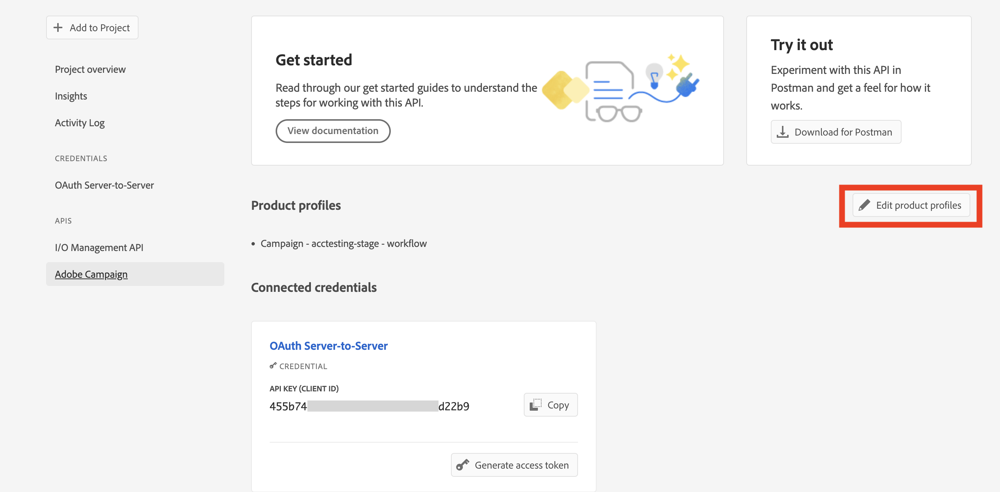

# Migration des opérateurs et opératrices techniques Campaign vers Adobe Developer Console {#migrate-tech-users-to-ims}

Campaign v8.5 et les versions ultérieures apportent des améliorations au processus d’authentification de Campaign v8. Les opérateurs ou opératrices techniques doivent utiliser [Adobe Identity Management System (IMS)](https://helpx.adobe.com/fr/enterprise/using/identity.html){target="_blank"} pour se connecter à Campaign. Un opérateur ou une opératrice technique est un profil utilisateur de Campaign qui a été explicitement créé pour l’intégration de l’API. Cet article décrit les étapes à suivre pour migrer un opérateur ou une opératrice technique vers un compte technique sur Adobe Developer Console.

## Qu’est-ce qui a changé ?{#ims-changes}

Les utilisateurs et utilisatrices standard de Campaign peuvent déjà se connecter à la console Adobe Campaign à l’aide de leur Adobe ID, via le système IMS (Adobe Identity Management System). Dans le cadre des mesures visant à renforcer la sécurité et le processus d’authentification, l’application cliente Adobe Campaign appelle désormais les API Campaign directement à l’aide du jeton de compte technique IMS.

Pour en savoir plus sur le nouveau processus d’authentification serveur à serveur, consultez la [documentation d’Adobe Developer Console](https://developer.adobe.com/developer-console/docs/guides/authentication/ServerToServerAuthentication/){target="_blank"}.

Cette modification s’applique à partir de Campaign v8.5 et sera **obligatoire** à partir de Campaign v8.6.


## Cela vous concerne-t-il ?{#ims-impacts}

Si vous utilisez des API Campaign, vous devez migrer vos opérateurs ou opératrices techniques vers Adobe Developer Console, comme indiqué ci-dessous.

## Migrer vers Adobe Developer Console{#ims-migration-procedure}

Chaque opérateur et opératrice technique doit avoir au moins un compte technique.

Les étapes clés sont les suivantes :

1. Créez tout d’abord le compte technique correspondant à l’opérateur ou à l’opératrice technique. Imaginons le nouveau compte technique (TA1) pour l’opérateur/opératrice technique (TO1).
1. Suivez les étapes détaillées ci-dessous pour le compte technique TA1.
   L’[Étape 4](#ims-migration-step-4) est facultative et n’est requise que si l’opérateur ou l’opératrice technique dispose d’autorisations de dossier spécifiques.
1. Migrez l’intégralité de l’implémentation de l’intégration de l’API Campaign vers le compte technique TA1 nouvellement créé.
1. Une fois que toutes les API/intégrations destinées aux clientes et clients sont entièrement fonctionnelles sur TA1, remplacez l’opérateur/opératrice technique TO1 par le compte technique TA1.

### Conditions préalables{#ims-migration-prerequisites}

Avant de commencer le processus de migration, contactez votre la personne responsable de la gestion de votre transition Adobe afin que les équipes techniques d’Adobe puissent migrer vos groupes d’opérateurs et opératrices existants et vos droits nommés vers Adobe Identity Management System (IMS).

### Étape 1 : créer/mettre à jour votre projet Campaign dans Adobe Developer Console{#ims-migration-step-1}

Les intégrations sont créées dans le cadre d’un **Projet** dans Adobe Developer Console. En savoir plus sur les projets dans la [documentation d’Adobe Developer Console](https://developer.adobe.com/developer-console/docs/guides/projects/){target="_blank"}.

Vous pouvez utiliser n’importe quel projet précédemment créé par vous ou créer un nouveau projet. Les étapes de création d’un projet sont détaillées dans la [documentation d’Adobe Developer Console](https://developer.adobe.com/developer-console/docs/guides/getting-started/){target="_blank"}.

Dans le cadre de cette migration, vous devez ajouter les API suivantes dans votre projet : **I/O Management** et **Adobe Campaign**.


### Étape 2 : ajouter une API à votre projet à l’aide de l’authentification de serveur à serveur{#ims-migration-step-2}

Une fois votre projet créé dans Adobe Developer Console, ajoutez une API qui nécessite une authentification de serveur à serveur. Découvrez comment configurer les informations d’identification de serveur à serveur OAuth dans la [documentation d’Adobe Developer Console](https://developer.adobe.com/developer-console/docs/guides/authentication/ServerToServerAuthentication/implementation/){target="_blank"}.

Une fois la connexion à l’API établie, vous pouvez accéder aux informations d’identification nouvellement générées, y compris l’identifiant et le secret client, ainsi que générer un jeton d’accès.

### Étape 3 : ajouter le profil de produit au projet{#ims-migration-step-3}

Vous pouvez maintenant ajouter votre profil de produit Campaign au projet, comme décrit ci-dessous :

1. Ouvrez l’API Adobe Campaign.
1. Cliquez sur le bouton **Modifier les profils de produit**.

   

1. Affectez tous les profils de produit pertinents à l’API, par exemple « messagecenter » et enregistrez vos modifications.
1. Accédez à l’onglet **Informations d’identification** de votre projet, puis copiez la valeur du champ **E-mail du compte technique**.

### Étape 4 : mettre à jour l’opérateur ou opératrice technique dans la console cliente {#ims-migration-step-4}

Cette étape n’est nécessaire que si des autorisations de dossiers spécifiques ou des droits nommés ont été définis pour cet opérateur ou cette opératrice – et non via son groupe.

Vous devez maintenant mettre à jour l’opérateur ou l’opératrice technique nouvellement créé(e) dans la console cliente Adobe Campaign. Vous devez appliquer les autorisations de dossier des opérateurs et opératrices techniques existants au nouvel opérateur ou à la nouvelle opératrice technique.
Pour mettre à jour cet opérateur ou cette opératrice, procédez comme suit :

1. Dans l’explorateur de la console cliente Campaign, accédez à **Administration > Gestion des accès > Opérateurs**.
1. Accédez à l’opérateur ou opératrice technique existant(e) utilisé(e) pour les API.
1. Accédez aux autorisations de dossier et vérifiez les droits.
1. Appliquez les mêmes autorisations à l’opérateur ou opératrice technique nouvellement créé(e). L’adresse e-mail de cet opérateur ou de cette opératrice est la valeur de l’**e-mail du compte technique** copiée précédemment.
1. Enregistrez vos modifications.


>[!CAUTION]
>
>Le nouvel opérateur ou la nouvelle opératrice technique doit avoir effectué au moins un appel API à ajouter à la console cliente Campaign.
>

<!--

>[!CAUTION]
>
>After updating the authentication type for the technical operator, all API integrations with this technical operator will stop working. You must [update your API integrations](#ims-migration-step-6). 

To update the technical operator authentication mode to IMS, follow these steps:

1. From Campaign Client Console explorer, browse to the **Administration > Access Management > Operators**.
1. Edit the existing technical operator used for APIs.
1. Replace the **Name (login)** of this technical operator by the technical account email retrieved earlier.
1. Browse to the **Edit** button on the top left beside **File**, and select **Edit the XML source**.
1. Update the authentication mode to `ims`, as follows:

    ```javascript
    <operator 
    ...
        <access authenticationType="ims" ...
        ...
        </access>
    ...
    </operator>
    ```

1. Save your changes.

You can also update the technical operator programmatically, using SQL scripts or Campaign APIs. These modes help you automate the steps which update operator's name with associated Technical account email address and/or authentication type. 

* Use the following **SQL Script** to replace operator's name with associated email:

    ```sql
    UPDATE xtkoperator
    SET sauthenticationtype = 'ims',
            sname = '{email}'
    WHERE sname = '{name}' AND itype = 0;
    ```

* Use the following `queryDef.ExecuteQuery` **Campaign API** to fetch id of an operator for given technical operator:

    ```javascript
    <?xml version="1.0" encoding="utf-8"?>
    <soap:Envelope xmlns:soap="http://schemas.xmlsoap.org/soap/envelope/">
        <soap:Body>
            <ExecuteQuery xmlns="urn:xtk:queryDef">
                <sessiontoken>{session_token}</sessiontoken>
                <entity>
                    <queryDef schema="xtk:operator" operation="select">
                        <select>
                            <node expr="@id"/>
                        </select>
                        <where>
                            <condition expr="@name='{name}'"/>
                            <condition expr="@type=0"/>
                        </where>
                    </queryDef>
                </entity>
            </ExecuteQuery>
        </soap:Body>
    </soap:Envelope>
    ```

* Use the following `session.Write` **Campaign API** to update name with given technical account email address:

    ```javascript
    <?xml version="1.0" encoding="utf-8"?>
    <soap:Envelope xmlns:soap="http://schemas.xmlsoap.org/soap/envelope/">
        <soap:Body>
            <Write xmlns="urn:xtk:session">
                <sessiontoken>{session_token}</sessiontoken>
                <domDoc xsi:type='ns:Element' SOAP-ENV:encodingStyle='http://xml.apache.org/xml-soap/literalxml'>
                    <operator _operation="update" id="{id}" name="{email}" xtkschema="xtk:operator">
                        <access authenticationType="ims" />
                    </operator>
                </domDoc>
            </Write>
        </soap:Body>
    </soap:Envelope>
    ```
-->

### Étape 5 : valider votre configuration {#ims-migration-step-5}

Pour tester la connexion, procédez comme décrit dans la section [Guide des informations d’identification d’Adobe Developer Console](https://developer.adobe.com/developer-console/docs/guides/authentication/ServerToServerAuthentication/implementation/#generate-access-tokens){target="_blank"} pour générer un jeton d’accès et copier la commande Sample cURL fournie.


### Étape 6 : mettre à jour les intégrations d’API tierces {#ims-migration-step-6}

Vous devez mettre à jour les intégrations d’API avec vos systèmes tiers.

Pour plus d’informations sur les étapes d’intégration des API, y compris un exemple de code pour une intégration fluide, consultez la section [Documentation sur l’authentification d’Adobe Developer Console](https://developer.adobe.com/developer-console/docs/guides/authentication/ServerToServerAuthentication/){target="_blank"}.


### Étape 7 : supprimer l’ancien opérateur ou l’ancienne opératrice technique {#ims-migration-step-7}


Après la migration de l’ensemble de l’intégration du code API/personnalisé avec l’utilisateur ou utilisatrice du compte technique. Vous pouvez supprimer l’ancien opérateur ou l’ancienne opératrice technique de la console cliente Campaign.

### Exemples d’appels Soap{#ims-migration-samples}

Une fois le processus de migration réalisé et validé, les appels Soap sont mis à jour comme indiqué ci-dessous :

* Avant la migration: le jeton d’accès au compte technique n’était pas pris en charge.

  ```sql
  POST /nl/jsp/soaprouter.jsp HTTP/1.1
  Host: localhost:8080
  Content-Type: application/soap+xml;
  SOAPAction: "nms:rtEvent#PushEvent"
  charset=utf-8
  
  <?xml version="1.0" encoding="utf-8"?>  <soapenv:Envelope xmlns:soapenv="http://schemas.xmlsoap.org/soap/envelope/" xmlns:urn="urn:nms:rtEvent">
  <soapenv:Header/>
  <soapenv:Body>
      <urn:PushEvent>
          <urn:sessiontoken>SESSION_TOKEN</urn:sessiontoken>
          <urn:domEvent>
              <!--You may enter ANY elements at this point-->
              <rtEvent type="type" email="name@domain.com"/>
          </urn:domEvent>
      </urn:PushEvent>
  </soapenv:Body>
  </soapenv:Envelope>
  ```

* Après la migration : le jeton d’accès au compte technique est pris en charge. Le jeton d’accès doit être fourni dans l’en-tête `Authorization` comme jeton du porteur. L’utilisation du jeton de session doit être ignorée ici, comme illustré dans l’exemple d’appel SOAP ci-dessous.

  ```sql
  POST /nl/jsp/soaprouter.jsp HTTP/1.1
  Host: localhost:8080
  Content-Type: application/soap+xml;
  SOAPAction: "nms:rtEvent#PushEvent"
  charset=utf-8
  Authorization: Bearer <IMS_Technical_Token_Token>
  
  <?xml version="1.0" encoding="utf-8"?>  <soapenv:Envelope xmlns:soapenv="http://schemas.xmlsoap.org/soap/envelope/" xmlns:urn="urn:nms:rtEvent">
  <soapenv:Header/>
  <soapenv:Body>
      <urn:PushEvent>
          <urn:sessiontoken></urn:sessiontoken>
          <urn:domEvent>
              <!--You may enter ANY elements at this point-->
              <rtEvent type="type" email="name@domain.com"/>
          </urn:domEvent>
      </urn:PushEvent>
  </soapenv:Body>
  </soapenv:Envelope>
  ```
