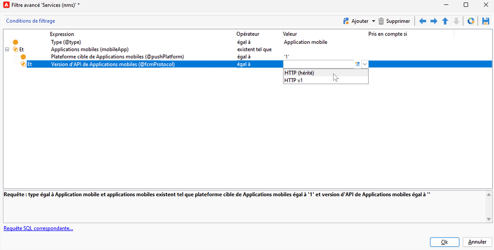
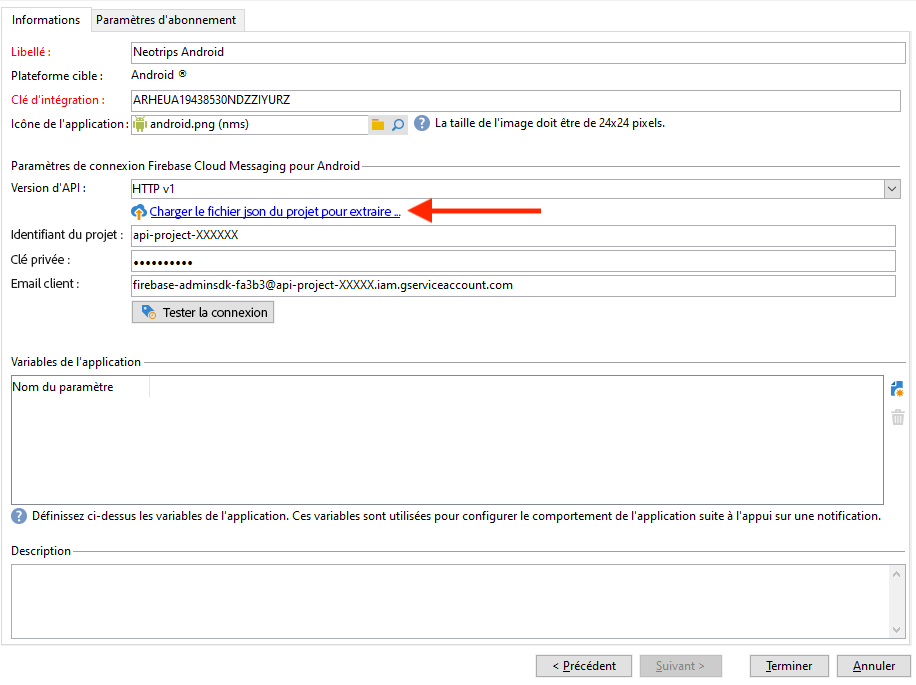
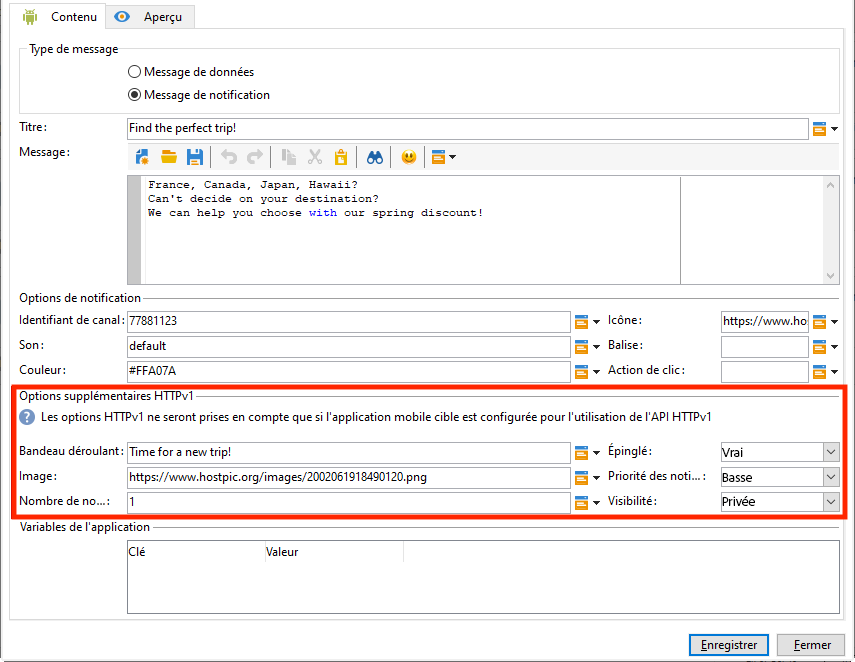

# Modifications à venir du canal de notification push {#push-upgrade}

Vous pouvez utiliser Campaign pour envoyer des notifications push sur les appareils Android. Pour ce faire, Campaign repose sur des services d’abonnement spécifiques. Certaines modifications importantes apportées au service Android FCM (Firebase Cloud Messaging) seront publiées en 2024 et auront une incidence sur votre mise en œuvre d’Adobe Campaign. Il se peut que la configuration de vos services d’abonnement pour les notifications push Android doive être mise à jour pour prendre en charge cette modification.

## Qu’est-ce qui a changé ? {#fcm-changes}

Dans le cadre des efforts constants de Google pour améliorer ses services, les API FCM héritées seront abandonnées le **20 juin 2024**. Pour en savoir plus sur le protocole HTTP Firebase Cloud Messaging, consultez la [documentation de Google Firebase](https://firebase.google.com/docs/cloud-messaging/http-server-ref){target="_blank"}.

Adobe Campaign Classic v7 et Adobe Campaign v8 prennent déjà en charge les dernières API pour envoyer des notifications push. Cependant, certaines anciennes implémentations dépendent toujours des API héritées. Ces implémentations doivent être mises à jour.

## Cela vous concerne-t-il ? {#fcm-impact}

Si votre implémentation actuelle prend en charge les services d’abonnement se connectant à FCM à l’aide des API héritées, cela vous concerne. La migration vers les dernières API est obligatoire pour éviter toute interruption de service. Dans ce cas, les équipes Adobe vous contacteront.

Pour vérifier si cela vous concerne, vous pouvez filtrer vos **services et abonnements** selon le filtre ci-dessous :

* Si l’un de vos services de notification push actifs utilise l’API **HTTP (héritée)**, votre configuration sera directement affectée par cette modification. Vous devez passer en revue vos configurations actuelles et migrer vers les API les plus récentes, comme décrit ci-dessous.

* Si votre configuration utilise exclusivement l’API **HTTP v1** pour les notifications push Android, vous êtes déjà en conformité et aucune autre action ne sera requise de votre part.

## Migrer vers Adobe Developer Console {#fcm-migration-procedure}

### Conditions préalables {#fcm-migration-prerequisites}

* Pour Campaign Classic v7, la prise en charge de HTTP v1 a été ajoutée à la version 20.3.1. Si votre environnement s’exécute sur une ancienne version, une condition préalable à la migration vers HTTP v1 est de mettre à niveau votre environnement vers la [dernière version de Campaign Classic](https://experienceleague.adobe.com/docs/campaign-classic/using/release-notes/latest-release.html?lang=fr){target="_blank"}. Pour Campaign v8, HTTP v1 est pris en charge par toutes les versions et aucune mise à niveau n’est nécessaire.

* Le fichier JSON du compte du service SDK Firebase Admin Android est nécessaire pour que l’application mobile soit déplacée vers HTTP v1. Découvrez comment obtenir ce fichier dans la [documentation de Google Firebase](https://firebase.google.com/docs/admin/setup#initialize-sdk){target="_blank"}.

* Pour les déploiements hybrides, hébergés et Managed Services, en plus de la procédure de migration ci-dessous, contactez Adobe pour mettre à jour votre serveur d’exécution en temps réel (RT) Le serveur de midsourcing n’est pas affecté.

* En tant qu’utilisateur ou utilisatrice On-Premise de Campaign Classic v7, vous devez mettre à niveau les serveurs d’exécution Marketing et en temps réel. Le serveur de midsourcing n’est pas affecté.

### Procédure de migration {#fcm-migration-steps}

Pour migrer votre environnement vers HTTP v1, procédez comme suit :

1. Accédez à votre liste de **services et abonnements**.
1. Répertoriez toutes les applications mobiles à l’aide de la version d’API **HTTP (héritée)**.
1. Pour chacune de ces applications mobiles, définissez la **version d’API** sur **HTTP v1**.
1. Cliquez sur le lien **[!UICONTROL Charger le fichier JSON du projet pour extraire les détails du projet…]** pour charger directement votre fichier clé JSON.

   Vous pouvez également saisir manuellement les informations suivantes :

   * **[!UICONTROL Identifiant du projet]**
   * **[!UICONTROL Clé privée]**
   * **[!UICONTROL Email client]**

   

1. Cliquez sur **[!UICONTROL Tester la connexion]** pour vérifier que votre configuration est correcte et que le serveur marketing a accès au FCM. Pour les déploiements de midsourcing, le bouton **[!UICONTROL Tester la connexion]** ne peut pas vérifier si le serveur a accès au service Android FCM (Firebase Cloud Messaging).
1. Vous pouvez, si nécessaire, enrichir un contenu de message push avec certaines **[!UICONTROL variables d&#39;application]**. Elles sont entièrement personnalisables et font partie de la payload du message envoyé à l&#39;appareil mobile.
1. Cliquez sur **[!UICONTROL Terminer]**, puis sur **[!UICONTROL Enregistrer]**.

Vous trouverez ci-dessous les noms de payload FCM pour personnaliser davantage votre notification push. Ces options sont décrites [ici](#fcm-apps).

| Type de message | Élément de message configurable (nom de payload FCM) | Options configurables (nom de payload FCM) |
|:-:|:-:|:-:|
| Message de données | N/A | validate_only |
| Message de notification | title, body, android_channel_id, icon, sound, tag, color, click_action, image, ticker, sticky, visibility, notification_priority, notification_count   | validate_only |

>[!NOTE]
>
>Une fois ces modifications appliquées à tous vos serveurs, toutes les nouvelles diffusions de notifications push vers les appareils Android utilisent l’API HTTP v1. Les diffusions de notifications push existantes en reprise, et actuellement utilisées continueront à utiliser l’API HTTP (héritée).

### Quel est l’impact pour mes applications Android ? {#fcm-apps}

Aucune modification spécifique du code des applications mobiles Android n’est requise et le comportement de notification ne doit pas changer.

Cependant, avec HTTP v1, vous pouvez personnaliser davantage votre notification push avec des **[!UICONTROL options supplémentaires HTTPV1]**.

Vous pouvez ainsi :

* utiliser le champ **[!UICONTROL Bandeau déroulant]** pour définir le texte du bandeau déroulant de votre notification ;
* utiliser le champ **[!UICONTROL Image]** pour définir l’URL de l’image à afficher dans votre notification ;
* utiliser le champ **[!UICONTROL Nombre de notifications]** pour définir le nombre de nouvelles informations non lues à afficher directement sur l’icône de l’application ;
* définir l’option **[!UICONTROL Permanent]** sur false afin que la notification soit automatiquement ignorée lorsque l’utilisateur ou l’utilisatrice clique dessus. Si elle est définie sur true, la notification reste affichée même lorsque l’utilisateur ou l’utilisatrice clique dessus ;
* définir le niveau de **[!UICONTROL priorité de notification]** de votre notification : par défaut, minimum, faible ou élevé ;
* définir le niveau de **[!UICONTROL visibilité]** de votre notification sur public, privé ou secret.

Pour plus d’informations sur les **[!UICONTROL options supplémentaires HTTP v1]** et sur la façon de remplir ces champs, consultez la [documentation FCM](https://firebase.google.com/docs/reference/fcm/rest/v1/projects.messages#androidnotification){target="_blank"}.

