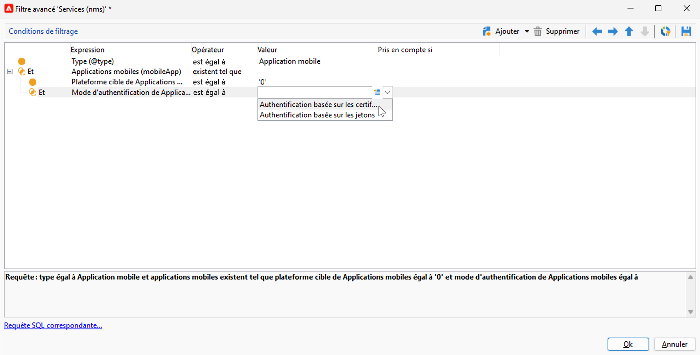
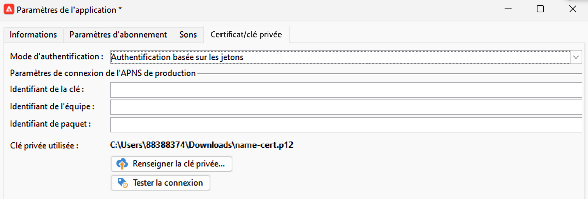

# Modifications du canal de notification push {#push-upgrade}

Vous pouvez utiliser Campaign pour envoyer des notifications push sur les appareils iOs et Android. Pour ce faire, Campaign repose sur des services d’abonnement à des application spécifiques.

Certaines modifications importantes apportées au service Android FCM (Firebase Cloud Messaging), publiées en 2024, pourront avoir une incidence sur votre mise en œuvre d’Adobe Campaign. Il se peut que la configuration de vos services d’abonnement pour les messages push Android doive être mise à jour pour prendre en charge cette modification.

En outre, Adobe recommande vivement de passer à une connexion au service APN basée sur des jetons plutôt que sur des certificats, pour une solution davantage sécurisée et évolutive.

## Service Google Android Firebase Cloud Messaging (FCM) {#fcm-push-upgrade}

### Qu’est-ce qui a changé ? {#fcm-changes}

Dans le cadre des efforts constants de Google pour améliorer ses services, les API FCM héritées seront abandonnées le **22 juillet 2024**. Apprenez-en davantage sur le protocole HTTP de Firebase Cloud Messaging en consultant la documentation de Firebase de Google [&#128279;](https://firebase.google.com/docs/cloud-messaging/migrate-v1){target="_blank"}.

Adobe Campaign Classic v7 et Adobe Campaign v8 prennent déjà en charge les dernières API pour envoyer des notifications push. Cependant, certaines anciennes implémentations dépendent toujours des API héritées. Ces implémentations doivent être mises à jour.

### Cela vous concerne-t-il ? {#fcm-impact}

Si votre implémentation actuelle prend en charge les services d’abonnement se connectant à FCM à l’aide des API héritées, cela vous concerne. La transition vers les dernières API est obligatoire pour éviter toute interruption de service. Dans ce cas, les équipes Adobe vous contacteront.

Pour vérifier si cela vous concerne, vous pouvez filtrer vos **services et abonnements** selon le filtre ci-dessous :


* Si l’un de vos services de notification push actifs utilise l’API **HTTP (héritée)**, votre configuration sera directement affectée par cette modification. Vous devez passer en revue vos configurations actuelles et les déplacer vers les API les plus récentes, comme décrit ci-dessous.

* Si votre configuration utilise exclusivement l’API **HTTP v1** pour les notifications push Android, vous êtes déjà en conformité et aucune autre action ne sera requise de votre part.

### Comment effectuer la mise à jour ? {#fcm-transition-procedure}

#### Conditions préalables {#fcm-transition-prerequisites}

* Le fichier JSON du compte du service SDK Firebase Admin Android est nécessaire pour que l’application mobile soit déplacée vers HTTP v1. Découvrez comment obtenir ce fichier dans la documentation de [Google Firebase](https://firebase.google.com/docs/admin/setup#initialize-sdk){target="_blank"}.

* Pour Campaign Classic v7, la prise en charge de HTTP v1 a été ajoutée à la version 20.3.1. Si votre environnement s’exécute sur une ancienne version, une condition préalable à la transition vers HTTP v1 est de mettre à niveau votre environnement vers la [dernière build Campaign Classic](https://experienceleague.adobe.com/docs/campaign-classic/using/release-notes/latest-release.html?lang=fr){target="_blank"}. Pour Campaign v8, HTTP v1 est pris en charge par toutes les versions et aucune mise à niveau n’est nécessaire.

* En tant qu’utilisateur ou utilisatrice On-Premise de Campaign Classic v7, vous devez mettre à niveau les serveurs d’exécution Marketing et en temps réel.

* Pour les déploiements hybrides, hébergés et Managed Cloud Services, en plus de la procédure de transition ci-dessous, contactez Adobe pour mettre à jour votre serveur d’exécution en temps réel (RT).

* À propos du compte externe de routage Android :

   * En tant qu’utilisateur ou utilisatrice On-Premise ou hybride de Campaign Classic v7, vérifiez que votre compte externe de routage Android est configuré avec `androidPushConnectorV2.js`. Apprenez-en davantage en consultant la [documentation de Campaign Classic v7](https://experienceleague.adobe.com/fr/docs/campaign-classic/using/sending-messages/sending-push-notifications/configure-the-mobile-app/configuring-the-mobile-application-android#configuring-external-account-android){target="_blank"}.

   * Pour les déploiements hybrides, hébergés et Managed Cloud Services, contactez également l’Assistance clientèle d’Adobe pour confirmer que le connecteur `androidPushConnectorV2.js (nms)` est bien sélectionné dans le compte externe de routage Android de votre serveur de mid-sourcing.

#### Procédure de transition {#fcm-transition-steps}

Pour déplacer votre environnement vers HTTP v1, procédez comme suit :

1. Accédez à votre liste de **services et abonnements**.
1. Répertoriez toutes les applications mobiles à l’aide de la version d’API **HTTP (héritée)**.
1. Pour chacune de ces applications mobiles, définissez la **version d’API** sur **HTTP v1**.
1. Cliquez sur le lien **[!UICONTROL Charger le fichier JSON du projet pour extraire les détails du projet…]** pour charger directement votre fichier clé JSON.

   Vous pouvez également saisir manuellement les informations suivantes :

   * **[!UICONTROL Identifiant du projet]**
   * **[!UICONTROL Clé privée]**
   * **[!UICONTROL Email client]**

   

1. Cliquez sur **[!UICONTROL Tester la connexion]** pour vérifier que votre configuration est correcte et que le serveur marketing a accès au FCM. Pour les déploiements de midsourcing, le bouton **[!UICONTROL Tester la connexion]** ne peut pas vérifier si le serveur a accès au service Android FCM (Firebase Cloud Messaging).
1. Vous pouvez, si nécessaire, enrichir un contenu de message push avec certaines **[!UICONTROL variables d&#39;application]**. Elles sont entièrement personnalisables et font partie de la payload du message envoyé à l&#39;appareil mobile.
1. Cliquez sur **[!UICONTROL Terminer]**, puis sur **[!UICONTROL Enregistrer]**.

   Vous trouverez ci-dessous les noms de payload FCM pour personnaliser davantage votre notification push. Ces options sont décrites [ici](#fcm-apps).

   | Type de message | Élément de message configurable (nom de payload FCM) | Options configurables (nom de payload FCM) |
   |:-:|:-:|:-:|
   | Message de données | N/A | validate_only |
   | Message de notification | title, body, android_channel_id, icon, sound, tag, color, click_action, image, ticker, sticky, visibility, notification_priority, notification_count <br> | validate_only |


>[!NOTE]
>
>Une fois ces modifications appliquées à tous vos serveurs, toutes les **nouvelles** diffusions de notifications push vers les appareils Android utilisent l’API HTTP v1. Les diffusions de notifications push existantes en reprise, en cours et actuellement utilisées continueront à utiliser l’API HTTP (héritée). Découvrez comment les mettre à jour dans la section ci-dessous.

#### Mise à jour des modèles existants {#fcm-transition-update}

Une fois la transition HTTP v1 terminée, vous devez mettre à jour vos **modèles de diffusion** pour les notifications push Android afin d’augmenter le nombre de messages par lot. Pour ce faire, accédez aux propriétés de votre modèle de diffusion Android puis, dans l’onglet **Diffusion**, définissez [Nombre de lots de messages](../../v8/send/configure-and-send.md#delivery-batch-quantity) sur **256**. Appliquez cette modification à tous les modèles de diffusion utilisés pour vos diffusions Android, ainsi qu’à toutes vos diffusions Android existantes.

Vous pouvez également mettre à jour les diffusions existantes et les modèles de diffusion créés avant la mise à niveau vers une version prenant en charge HTTP v1. Procédez comme suit :

* En tant que cliente ou client Managed Cloud Services ou hébergé, contactez Adobe pour mettre à jour vos modèles de diffusion Android existants.

* Pour les environnements On-Premise, téléchargez le script `fcm-httpv1-migration.js` et exécutez-le comme décrit ci-dessous.

  Téléchargez [fcm-httpv1-migration.zip](assets/do-not-localize/fcm-httpv1-migration-js.zip).

  >[!CAUTION]
  >
  >Le script doit être exécuté sur votre instance marketing On-Premise.


  +++Étapes de mise à jour des diffusions et des modèles existants (On-Premise uniquement)

  Pour corriger tous les modèles de diffusions et de diffusions créés avant la mise à niveau vers une version prenant en charge HTTP v1, procédez comme suit :

   1. Exportez vos diffusions existantes et les modèles de diffusion créés dans un package afin de pouvoir les restaurer en cas de problème inattendu pendant la correction.
   1. Exécutez la commande suivante en Posgresql :

      ```sql
      pg_dump -Fp -f /sftp/<db_name>-nmsdelivery-before_rd_script.sql -t nmsdelivery -d <db_name>
      ```

   1. Par défaut, le script est en mode `dryrun`. Vous pouvez le lancer dans ce mode pour vérifier si une diffusion doit être corrigée.

      Commande

      ```sql
      nlserver javascript -instance:<instance_name> -file fcm-httpv1-migration.js 
      ```

      Sortie

      ```sql
      ...
      HH:MM:SS >   Processing delivery (id:123456,  label:'Deliver on Android - New', name:'DM1234')
      HH:MM:SS >   Dry run: Would update androidCheckParams for delivery (id:123456,  label:'Deliver on Android - New', name:'DM1234')
      HH:MM:SS >   Processing delivery (id:567890,  label:'Deliver on Android - New', name:'DM5678')
      HH:MM:SS >   Dry run: Would update androidCheckParams for delivery (id:567890,  label:'Deliver on Android - New', name:'DM5678')
      ...
      HH:MM:SS >   Summary (XYZ processed deliverie(s) or delivery template(s)):
      HH:MM:SS >>  - X had not patchable androidCheckParams formula!
      HH:MM:SS >   - Y had androidCheckParams formula patched.
      HH:MM:SS >   - Z ignored as alreading having androidCheckParams formula patched.
      ```

      >[!NOTE]
      >
      >Les diffusions `not patchable` doivent être mises à jour manuellement. Leur ID se trouve dans le log.

   1. Exécutez le script en mode d’exécution de la manière suivante pour mettre à jour les diffusions :

      ```sql
      nlserver javascript -instance:<instance_name> -file fcm-httpv1-migration.js -arg:run
      ```

  +++

### Quel est l’impact pour mes applications Android ? {#fcm-apps}

Aucune modification spécifique du code des applications mobiles Android n’est requise et le comportement de notification ne doit pas changer.

Cependant, avec HTTP v1, vous pouvez personnaliser davantage votre notification push avec des **[!UICONTROL options supplémentaires HTTPV1]**.


Vous pouvez ainsi :

* utiliser le champ **[!UICONTROL Bandeau déroulant]** pour définir le texte du bandeau déroulant de votre notification ;
* utiliser le champ **[!UICONTROL Image]** pour définir l’URL de l’image à afficher dans votre notification ;
* utiliser le champ **[!UICONTROL Nombre de notifications]** pour définir le nombre de nouvelles informations non lues à afficher directement sur l’icône de l’application ;
* définir l’option **[!UICONTROL Permanent]** sur false afin que la notification soit automatiquement ignorée lorsque l’utilisateur ou l’utilisatrice clique dessus. Si elle est définie sur true, la notification reste affichée même lorsque l’utilisateur ou l’utilisatrice clique dessus ;
* définir le niveau de **[!UICONTROL priorité de notification]** de votre notification : par défaut, minimum, faible ou élevé ;
* définir le niveau de **[!UICONTROL visibilité]** de votre notification sur public, privé ou secret.

Pour plus d&#39;informations sur les **[!UICONTROL options supplémentaires HTTPv1]** et sur la façon de remplir ces champs, consultez la [documentation FCM](https://firebase.google.com/docs/reference/fcm/rest/v1/projects.messages#androidnotification){target="_blank"}.


## Service de notification Push Apple iOS (APN) {#apns-push-upgrade}

### Qu’est-ce qui a changé ? {#ios-changes}

Comme recommandé par Apple, vous devez sécuriser vos communications avec le service de notifications Push Apple (APN) en utilisant des jetons d’authentification sans état.

L’authentification par jeton offre un moyen sans état de communiquer avec le service APN. La communication sans état est plus rapide que la communication basée sur un certificat, car elle ne nécessite pas de service APN pour rechercher le certificat, ni d’autres informations en lien avec votre serveur de fournisseur. L’utilisation de l’authentification par jeton présente d’autres avantages :

* Vous pouvez utiliser le même jeton depuis plusieurs serveurs de fournisseurs.

* Vous pouvez utiliser un jeton pour distribuer des notifications pour toutes les applications de votre entreprise.

Apprenez-en davantage sur les connexions basées sur des jetons aux APNs dans la [documentation Apple Developer](https://developer.apple.com/documentation/usernotifications/establishing-a-token-based-connection-to-apns){target="_blank"}.

Adobe Campaign Classic v7 et Adobe Campaign v8 prennent en charge les connexions basées sur des jetons et sur des certificats. Si votre mise en œuvre repose sur une connexion basée sur un certificat, Adobe vous recommande vivement de la mettre à jour vers une connexion basée sur un jeton.

### Cela vous concerne-t-il ? {#ios-impact}

Si votre mise en œuvre actuelle repose sur des demandes basées sur des certificats pour vous connecter au service APN, cela vous concerne. Il est recommandé d’effectuer une transition basée sur un jeton.

Pour vérifier si cela vous concerne, vous pouvez filtrer vos **services et abonnements** selon le filtre ci-dessous :




* Si l’un de vos services de notifications push actifs utilise le mode **Authentification basée sur les certificats** (.p12), vos mises en œuvre actuelles doivent être examinées et déplacées vers un mode **Authentification basée sur les jetons** (.p8) comme décrit ci-dessous.

* Si votre configuration utilise exclusivement le mode **Authentification basée sur les jetons** pour les notifications push iOS, vous êtes déjà en conformité et aucune autre action de votre part ne sera requise.

### Comment effectuer la mise à jour ? {#ios-transition-procedure}

#### Conditions préalables {#ios-transition-prerequisites}

* Pour Campaign Classic v7, la prise en charge du mode **Authentification basée sur les jetons** a été ajoutée à la version 20.2. Si votre environnement s’exécute sur une ancienne version, une condition préalable à cette modification est de mettre à niveau votre environnement vers la [dernière build Campaign Classic](https://experienceleague.adobe.com/docs/campaign-classic/using/release-notes/latest-release.html?lang=fr){target="_blank"}. Pour Campaign v8, le mode **Authentification basée sur les jetons** est pris en charge par toutes les versions et aucune mise à niveau n’est nécessaire.

* Vous avez besoin d’une clé de signature de jeton d’authentification APN pour générer les jetons utilisés par votre serveur. Vous demandez cette clé à partir de votre compte de développeur Apple, comme expliqué dans la [documentation du développeur Apple](https://developer.apple.com/documentation/usernotifications/establishing-a-token-based-connection-to-apns){target="_blank"}.

* Pour les déploiements hybrides, hébergés et Managed Services, en plus de la procédure de transition ci-dessous, contactez Adobe pour mettre à jour votre serveur d’exécution en temps réel (RT). Le serveur de midsourcing n’est pas affecté.

* En tant qu’utilisateur ou utilisatrice On-Premise de Campaign Classic v7, vous devez mettre à niveau les serveurs d’exécution Marketing et en temps réel. Le serveur de midsourcing n’est pas affecté.

#### Procédure de transition {#ios-transition-steps}

Pour déplacer vos applications mobiles iOS vers le mode d’authentification basé sur les jetons, procédez comme suit :

1. Accédez à votre liste de **services et abonnements**.
1. Répertoriez toutes les applications mobiles utilisant le mode **Authentification basée sur les certificats** (.p12).
1. Modifiez chacune de ces applications mobiles et accédez à l’onglet **Certificat/clé privée**.
1. Dans la liste déroulante **Mode d’authentification**, sélectionnez le mode **Authentification basée sur les jetons** (.p8).
1. Renseignez les paramètres de connexion APN **[!UICONTROL Identifiant de la clé]**, **[!UICONTROL Identifiant de l’équipe]** et **[!UICONTROL Identifiant de version]**, puis sélectionnez votre certificat p8 en cliquant sur **[!UICONTROL Renseigner la clé privée...]**

   

1. Cliquez sur **[!UICONTROL Tester la connexion]** pour vérifier que votre configuration est correcte et que le serveur a accès au service APN. Pour les déploiements de midsourcing, le bouton **[!UICONTROL Tester la connexion]** ne peut pas vérifier si le serveur a accès au service APN.
1. Cliquez sur **[!UICONTROL Suivant]** pour passer à la configuration de l’application de production et procédez comme décrit ci-dessus.
1. Cliquez sur **[!UICONTROL Terminer]**, puis sur **[!UICONTROL Enregistrer]**.

Votre application iOS est maintenant déplacée vers le mode d’authentification basé sur les jetons.
