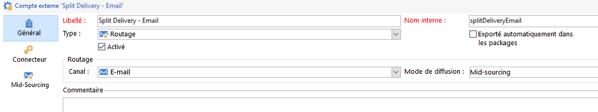
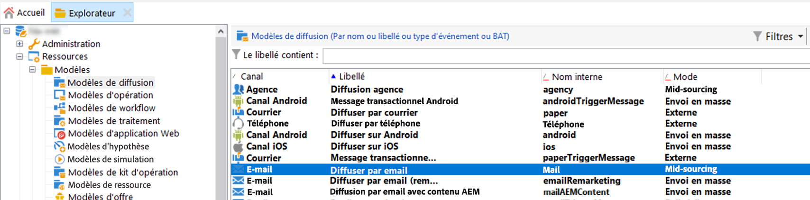
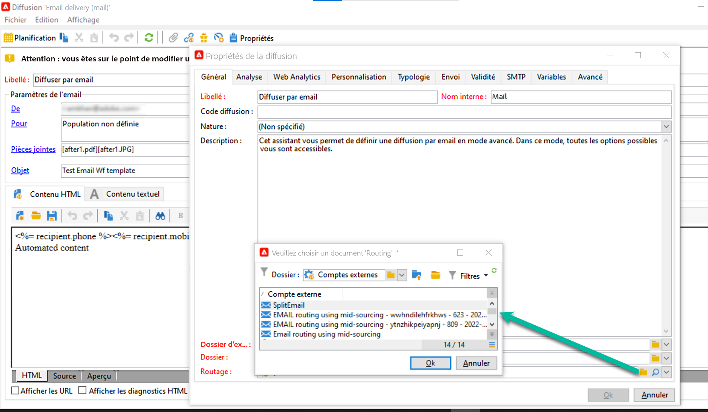
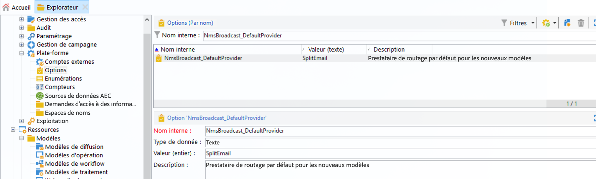

# Prise en main de l&#39;architecture de Campaign{#gs-ac-archi}

## Environnements {#environments}

Campaign est disponible sous forme d&#39;instances individuelles, où chaque instance représente un environnement Campaign complet.

Deux types d’environnements sont disponibles :

* **Environnement de production** : héberge les applications destinées aux professionnels.

* **Environnement de non-production** : utilisé pour divers tests de performances et de qualité avant que les modifications apportées à l&#39;application ne soient envoyées à l&#39;environnement de production.

Vous pouvez exporter et importer des packages d&#39;un environnement à l&#39;autre.

 Apprenez-en davantage sur les packages en consultant la [documentation de Campaign Classic v7](https://experienceleague.adobe.com/docs/campaign-classic/using/getting-started/administration-basics/working-with-data-packages.html?lang=fr){target="_blank"}

## Modèles de déploiement{#ac-deployment}

Deux modèles de déploiement sont disponibles :

* **Déploiement FDA Campaign**

  Dans son [Déploiement FDA](fda-deployment.md), [!DNL Adobe Campaign] v8 peut être connecté à [!DNL Snowflake] pour accéder aux données par le biais de la fonctionnalité Federated Data Access : vous pouvez accéder aux données externes et aux informations stockées dans votre [!DNL Snowflake] sans modifier la structure des données Adobe Campaign. PostgreSQL est la base de données principale. Vous pouvez utiliser Snowflake comme base de données secondaire pour étendre ensuite votre modèle de données et stocker vos données dans Snowflake. Par la suite, vous pourrez exécuter ETL, la segmentation et les rapports sur un jeu de données volumineux avec des performances optimales.

  >[!NOTE]
  >
  >Dans ce modèle de déploiement, la variable [!DNL Snowflake] La base de données secondaire n’est disponible que sur demande. Pour mettre à jour votre déploiement avec [!DNL Snowflake], contactez votre gestionnaire de transition d’Adobe.
  >

* **Déploiement Campaign Grands comptes (FFDA)**

  Dans un [déploiement Grands comptes (FFDA)](enterprise-deployment.md), [!DNL Adobe Campaign] v8 fonctionne avec deux bases de données : une base de données [!DNL Campaign] locale pour la messagerie en temps réel de l’interface utilisateur et les requêtes et écritures unitaires à travers les API, et une base de données [!DNL Snowflake] cloud pour l’exécution de campagnes, les requêtes par lots et l’exécution de workflows.

  Campaign v8 Enterprise présente le concept de **Full Federated Data Access** (FFDA) : toutes les données sont désormais distantes sur la base de données cloud. Avec cette nouvelle architecture, le déploiement Campaign v8 Enterprise (FFDA) simplifie la gestion des données : aucun index n&#39;est requis sur la base de données cloud. Il vous suffit de créer les tables et de copier les données pour démarrer. La technologie de base de données cloud ne nécessite pas de maintenance spécifique pour garantir le niveau de performances attendu.

## Partager l’exécution d’une diffusion {#split}

>[!AVAILABILITY]
>
>Cette fonctionnalité est disponible uniquement pour les clients et clientes disposant de plusieurs configurations d’instances MID.

En fonction de votre package Campaign v8, vous disposez d’un nombre spécifique d’instances de midsourcing en charge de l’exécution des diffusions.

Par défaut, les comptes externes de tous les canaux utilisent un mode de routage **[!UICONTROL alterné]**. Une diffusion est donc envoyée simultanément à partir de chaque instance mid-sourcing de manière alternée.

Afin d’optimiser les performances à la fois en termes de vitesse et d’échelle, vous pouvez permettre le partage automatique des diffusions entre vos instances mid-sourcing afin qu’elles soient diffusées plus rapidement aux destinataires. Cette opération est transparente lors de l’exécution de la diffusion à partir de l’instance marketing : une fois la diffusion envoyée, tous les logs sont consolidés ensemble avant d’être renvoyés à l’instance marketing dans un seul objet de diffusion.

Pour ce faire, des comptes externes supplémentaires avec le mode de routage **[!UICONTROL Partagé]** sont créés lors de l’approvisionnement pour chaque canal :

* Partager la diffusion - E-mail (splitDeliveryEmail)
* Partager la diffusion - SMS (splitDeliverySMS)
* Partager la diffusion - iOS (splitDeliveryIOS)
* Partager la diffusion - Android (splitDeliveryAndroid)

>[!IMPORTANT]
>
>Le mode de routage partagé est activé par défaut pour le compte « Partager la diffusion - E-mail ». Pour tous les autres comptes externes de canal, contactez votre Gestionnaire de transition d’Adobe pour que l’option soit activée.
>
>Par défaut, la valeur de la taille de seuil pour partager une diffusion entre plusieurs instances mid-sourcing est de 100 000. Vous pouvez modifier cette valeur dans l’option « NmsDelivery_MultiMidSplitThreshold » du menu **[!UICONTROL Administration]** / **[!UICONTROL Plateforme]** / **[!UICONTROL Options]** .

Pour que les comptes externes partagés soient le compte par défaut pour l’envoi des diffusions, vous devez modifier le fournisseur de routage dans vos modèles de diffusion. Pour ce faire, procédez comme suit :

1. Accédez au dossier **[!UICONTROL Ressources]** / **[!UICONTROL Modèles]** / **[!UICONTROL Modèles de diffusion]** et ouvrez le modèle de diffusion souhaité. Dans cet exemple, nous allons modifier le modèle de diffusion e-mail.

   

1. Cliquez sur le bouton **[!UICONTROL Propriétés]** et remplacez le fournisseur de routage par le compte externe de diffusion partagée correspondant.

   

1. Enregistrez vos modifications. Toutes les diffusions envoyées à l’aide du modèle utilisent désormais le mode de routage partagé par défaut.

<!--In addition, you can select split external accounts as the default routing provider for all future delivery templates. To do this, change the value of the **[!UICONTROL xtkoption NmsBroadcast_DefaultProvider]** option to the name of the split account.

 -->

## Architecture de Message Center{#transac-msg-archi}

La messagerie transactionnelle (Message Center) est le module de Campaign conçu pour gérer les messages de déclenchement.

 Découvrez comment envoyer des messages transactionnels dans [cette section](../send/transactional.md).

En réponse à l&#39;action d&#39;un client sur un site web, un événement est envoyé à Campaign par l&#39;intermédiaire d&#39;une API REST et le modèle de message est renseigné avec les informations ou les données fournies par le biais de l&#39;appel API. En outre, un message transactionnel est envoyé en temps réel au client. Ces messages peuvent être envoyés individuellement ou par lots via e-mail, SMS ou notifications push.

Dans cette architecture spécifique, la cellule d&#39;exécution est séparée de l&#39;instance de pilotage, ce qui offre une grande disponibilité et une meilleure gestion de la charge.

* L&#39;**instance de pilotage** (ou instance marketing) est utilisée par les spécialistes marketing et les équipes informatiques pour créer, configurer et publier des modèles de messages. Cette instance centralise également la surveillance et l&#39;historique des événements.

   Découvrez comment créer et publier des modèles de messages dans [cette section](../send/transactional.md).

* L&#39;**instance d&#39;exécution** renvoie les événements entrants (réinitialisation du mot de passe ou commandes à partir d&#39;un site web, par exemple) et envoie des messages personnalisés. Il peut y avoir plusieurs instances d&#39;exécution pour traiter les messages par l&#39;intermédiaire de la répartition de charge et mettre à l&#39;échelle le nombre d&#39;événements à poursuivre pour une disponibilité maximale.

>[!CAUTION]
>
>L&#39;instance de pilotage et la ou les instance(s) d&#39;exécution doivent être installées sur des machines différentes. Elles ne peuvent pas partager la même instance Campaign.

### Authentification

Pour utiliser ces fonctionnalités, les utilisateurs d’Adobe Campaign se connectent à l’instance de pilotage afin de créer les modèles de messages transactionnels, générer la prévisualisation du message grâce à une adresse de contrôle, afficher des rapports et suivre les instances d’exécution.

* Instance d&#39;exécution unique
Lors de l&#39;interaction avec une instance d&#39;exécution Message Center hébergée par Adobe, un système externe peut d&#39;abord récupérer un jeton de session (qui expire par défaut dans les 24 heures), en effectuant un appel API à la méthode de connexion à la session, et ce, à l&#39;aide d&#39;un nom d&#39;utilisateur et d&#39;un mot de passe fournis pour le compte.
Ensuite, avec le jeton de session fourni par l&#39;instance d&#39;exécution en réponse à l&#39;appel ci-dessus, l&#39;application externe peut lancer des appels API SOAP (rtEvents ou batchEvents) pour envoyer des communications, et ce, sans qu&#39;il y ait besoin d&#39;inclure le nom d&#39;utilisateur et le mot de passe du compte dans chaque appel SOAP.

* Instances d&#39;exécution multiples
Dans une architecture d&#39;exécution multi-cellules avec des instances d&#39;exécution multiples derrière une répartition de charge, la méthode de connexion invoquée par l&#39;application externe passe par la répartition de charge. Pour cette raison, une authentification par jeton ne peut pas être utilisée. Une authentification par utilisateur/mot de passe est requise.

En savoir plus sur les événements de messagerie transactionnelle sur [cette page](../send/event-processing.md).
