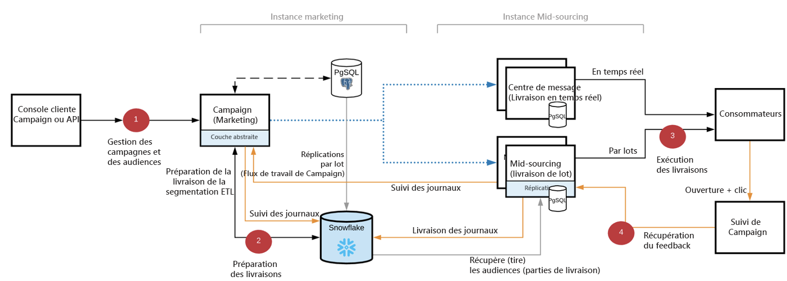

# Déploiement FFDA [!DNL Campaign] {#gs-ac-ffda}

Grâce à l’utilisation de [[!DNL Snowflake]](https://www.snowflake.com/){target="_blank"}, une technologie de base de données cloud, le déploiement Adobe Campaign Enterprise Full Federated Access (FFDA) améliore considérablement sa taille et sa vitesse, grâce à la capacité de gérer un nombre plus important de profils client, ainsi qu’à des taux de diffusion et de transactions par heure beaucoup plus élevés.

## Avantages {#ffda-benefits}

Campaign v8 Enterprise (FFDA) fournit une mise à l&#39;échelle de bout en bout à n&#39;importe quelle étape du processus, depuis le ciblage au reporting final :

* Mise à l&#39;échelle du volume de données que vous pouvez gérer (jusqu&#39;à 8 To)
* Mise à l&#39;échelle des performances de requêtes pour la segmentation et le ciblage ainsi que pour l&#39;ingestion et la sortie des données
* Mise à l&#39;échelle de la préparation des diffusions (des heures aux minutes)

Il s&#39;agit d&#39;une modification fondamentale de l&#39;architecture logicielle. Les données sont désormais distantes et Campaign fédère l&#39;intégralité d&#39;entre elles, y compris les profils. Les processus [!DNL Campaign] évoluent désormais de bout en bout, du ciblage à l&#39;exécution des messages : l&#39;ingestion des données, la segmentation, le ciblage, les requêtes et les diffusions s&#39;exécutent désormais en quelques minutes. Cette nouvelle version résout le défi de la mise à l&#39;échelle tout en conservant le même niveau de flexibilité et d&#39;extensibilité. Le nombre de profils est presque illimité et la rétention des données peut être étendue.

Le stockage dans le cloud est effectué dans **[!DNL Snowflake]** : un nouveau **compte externe** natif assure la connectivité avec la base de données dans le cloud. Il est configuré par Adobe et ne doit pas être modifié. [En savoir plus](../config/external-accounts.md)

Tout schéma prédéfini ou toute table intégrée devant être déplacé ou répliqué dans la base de données du cloud est fourni avec une extension de schéma intégrée sous l&#39;espace de noms **xxl**. Ces extensions contiennent toutes les modifications nécessaires au déplacement des schémas natifs depuis la base de données [!DNL Campaign] locale vers la base de données [!DNL Snowflake] dans le cloud et à l&#39;adaptation de leur structure en conséquence : nouvel UUID, liens mis à jour, etc.

>[!CAUTION]
>
> Les données client ne sont pas stockées dans la base de données [!DNL Campaign] locale. Par conséquent, toute table personnalisée doit être créée dans la base de données cloud.
>

## Architecture de Campaign Enterprise (FFDA){#ffda-archi}

Dans un [déploiement Enterprise (FFDA)](../architecture/enterprise-deployment.md), [!DNL Adobe Campaign] v8 fonctionne avec deux bases de données : une base de données [!DNL Campaign] locale pour la messagerie en temps réel de l&#39;interface utilisateur et les requêtes et écritures unitaires à travers les API, et une base de données [!DNL Snowflake] Cloud pour l&#39;exécution de campagnes, les requêtes par lots et l&#39;exécution de workflows.

Campaign v8 Enterprise présente le concept de **Full Federated Data Access** (FFDA) : toutes les données sont désormais distantes sur la base de données cloud.

Des API spécifiques sont disponibles pour gérer les données entre la base de données locale et la base de données cloud. Découvrez le fonctionnement de ces nouvelles API et comment les utiliser sur [cette page](new-apis.md).

La communication générale entre les serveurs et les processus est réalisée conformément au schéma suivant :

* Les modules de diffusion et de gestion des mails rebonds sont désactivés sur l&#39;instance.
* L&#39;application est configurée pour déléguer les envois des messages à un serveur de mid-sourcing distant via des appels SOAP (sur HTTP ou HTTPS).

La base de données [!DNL Snowflake] côté marketing permet d’effectuer les opérations suivantes :

* Stocker toutes les données client : les profils, les données personnalisées comme les transactions, les produits, les emplacements, etc.
* Stocker l’ensemble des événements et des données de comportement générés ou collectés par Campaign, tels que les logs de diffusion, les logs de tracking, les enregistrements push, etc.
* Stocker tous les agrégats de données de l’exemple ci-dessus
* Stockez une copie (h+1) des tables de référence (diffusions, énumérations, pays, etc.) qui sont utilisées dans les workflows, les campagnes et les rapports.
* Exécution de tous les processus et workloads par lots

La base de données PostgreSQL sur l&#39;instance marketing est utilisée pour :

* Exécuter certaines workloads, telles que les API à faible volume
* Stocker toutes les données de Campaign, y compris les paramètres de diffusion et de campagne, les définitions de workflow et de service
* Stocker toutes les tables de référence intégrées (énumérations, pays, etc.) qui sont répliquées vers [!DNL Snowflake].

  Cependant, vous ne pouvez pas :
   * Créer des personnalisations pour les données client ; par exemple, ne créez pas de table domestique dans PostgreSQL, mais uniquement dans Snowflake
   * Stocker les logs de diffusion, les logs de tracking, etc. sur la dimension de ciblage FFDA
   * Stocker un grand volume de données

La base de données PostgreSQL sur l&#39;instance de mid-sourcing est utilisée pour :

* Exécuter les diffusions par lots et en temps réel (RT)
* Envoyer des logs de diffusion et de tracking : notez que les identifiants des logs de diffusion et de tracking sont des UUID et non des identifiants 32 bits
* Collecter et stocker les données de suivi

## Impacts{#ffda-impacts}

### Mécanisme d&#39;évaluation des API [!DNL Campaign]{#staging-api}

Avec la base de données [!DNL Campaign] cloud, les appels unitaires d&#39;explosion ne sont pas recommandés en raison des performances (latence et simultanéité). À moins que vous n’envoyiez un volume extrêmement important, l’opération par lots doit être utilisée afin de garantir des performances optimales des API ; Campaign gère toujours les appels API au niveau de la base de données locale.

[Le mécanisme d’évaluation des API est présenté sur cette page.](staging.md)

### Nouvelles API{#new-apis}

De nouvelles API sont disponibles pour gérer la synchronisation des données entre la base de données [!DNL Campaign] locale et la base de données cloud. Un nouveau mécanisme a également été introduit pour gérer les appels API au niveau de la base de données locale afin d&#39;éviter la latence et d&#39;améliorer les performances globales.

[Les nouvelles API sont présentées sur cette page.](new-apis.md)

### Réplication des données{#data-replication}

Un workflow technique spécifique gère la réplication des tables qui doivent être présentes des deux côtés (base de données locale de Campaign et base de données dans le cloud). Ce workflow est déclenché toutes les heures et repose sur une nouvelle bibliothèque JavaScript intégrée.

>[!NOTE]
>
> Plusieurs politiques de réplication ont été créées en fonction de la taille de la table (XS, XL, etc.).
> Certaines tables sont répliquées en temps réel tandis que d&#39;autres le sont toutes les heures. Certaines tables disposeront de mises à jour incrémentielles tandis que d&#39;autres bénéficieront d&#39;une mise à jour complète.
>

[En savoir plus sur la réplication des données](replication.md)

### Gestion des identifiants{#id-mgt-ffda}

Les objets Campaign v8 utilisent désormais un **Identifiant universel unique (UUID)**, ce qui permet d’identifier des données à l’aide de valeurs uniques et illimitées.

Veuillez noter que cet identifiant est basé sur des chaînes et n&#39;est pas séquentiel. La clé primaire n&#39;est pas une valeur numérique dans Campaign v8 et vous devez utiliser les attributs **autouuid** et **autopk** dans vos schémas.

Dans Campaign Classic v7 et les versions antérieures, l&#39;unicité d&#39;une clé dans un schéma (c&#39;est-à-dire une table) est gérée au niveau du moteur de la base de données. Plus généralement, les moteurs de base de données classiques tels que PostgreSQL, Oracle ou SQL Server incluent un mécanisme natif pour empêcher l&#39;insertion de lignes dupliquées à partir d&#39;une colonne ou d&#39;un ensemble de colonnes via des clés primaires et/ou des index uniques. Les ID en double n&#39;existent pas dans ces versions lorsque l&#39;index correct et les clés primaires sont définis au niveau de la base de données.

Adobe Campaign v8 est fourni avec Snowflake comme base de données principale. Comme cela augmente considérablement l&#39;échelle des requêtes, l&#39;architecture répartie de la base de données Snowflake ne fournit pas de tels mécanismes de gestion et d&#39;application de l&#39;unicité d&#39;une clé dans une table. Par conséquent, avec Adobe Campaign v8, rien n&#39;empêche l&#39;ingestion de clés dupliquées dans une table. Les utilisateurs finaux sont désormais chargés d&#39;assurer la cohérence des clés au sein de la base de données Adobe Campaign. [En savoir plus](keys.md)

### Disponibilité des fonctionnalités {#feature-availability}

Certaines fonctionnalités ne sont pas disponibles dans le cadre d’un déploiement Grands comptes (FFDA) de Campaign, telles que :

* Gestion des ressources marketing
* Coupons
* Tracking web
* Questionnaires

**Rubriques connexes**

* [Bonnes pratiques relatives au modèle de données](../dev/datamodel-best-practices.md)
