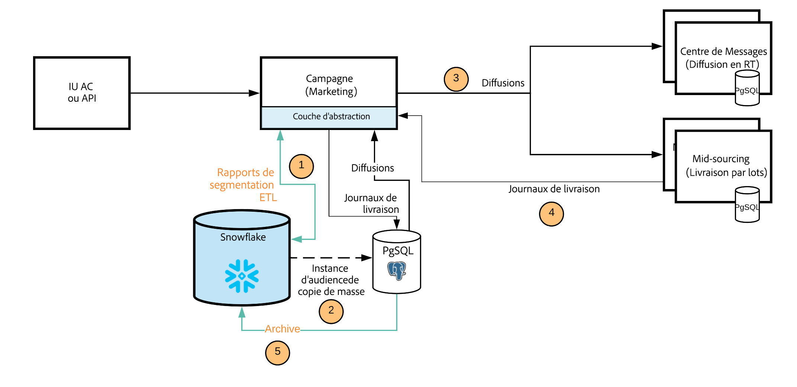

# [!DNL Campaign] FDA [!DNL Snowflake] déploiement{#gs-fda-snowflake}

Dans un [!DNL Snowflake] Déploiement FDA (par défaut), [!DNL Adobe Campaign] v8 est connecté à [!DNL Snowflake] pour accéder aux données via [Federated Data Access](../connect/fda.md) fonctionnalité : vous pouvez accéder aux données et aux informations externes stockées dans votre [!DNL Snowflake] sans modifier la structure des données Adobe Campaign.

## Avantages{#fda-benefits}

Ce modèle de déploiement présente les avantages suivants :

* **Stockage et performances**
Vous pouvez déplacer vos données historiques vers [!DNL Snowflake] et réduire ensuite les dépendances à la limite des Adobe Campaign ID. Cette architecture réduit également votre dépendance aux limites de stockage et de performances PostgreSQL. Comme moins de données sont stockées dans la base de données Campaign, les performances sont meilleures et les tâches de maintenance sont exécutées plus rapidement.

* **Extension du modèle de données et gestion des données**
Vous pouvez créer des tableaux dans [!DNL Snowflake] et les lier à Adobe Campaign, par exemple pour utiliser les données archivées sur les périodes de rétention, ou exécuter des processus de segmentation avec des performances exceptionnelles.

   Cette architecture vous permet également d’utiliser les fonctionnalités de workflow de Data Management dans [!DNL Snowflake]. Seuls les agrégats et les tables temporaires sont déplacés vers Campaign à des fins de personnalisation et de diffusion.

## Architecture{#fda-archi}

Avec ce modèle de déploiement, les utilisateurs d’Adobe Campaign peuvent étendre leurs données à [!DNL Snowflake] et tirer parti des avantages d’une seule plateforme de données intégrée pour de puissantes informations sur les données de campagne marketing en temps réel. Il permet aux utilisateurs de déverrouiller la valeur profonde de leurs données en leur offrant une seule plateforme unifiée et facile à utiliser pour l’analyse des données. La plateforme de données cloud ne nécessite aucune gestion, car elle prend infiniment en charge n’importe quel volume de données marketing d’Adobe Campaign.

La communication générale entre les serveurs et les processus est réalisée conformément au schéma suivant :

PostgreSQL est la base de données Principale et Snowflake la base de données secondaire. Vous pouvez étendre votre modèle de données et stocker vos données sur Snowflake. Par la suite, vous pourrez exécuter ETL, la segmentation et les rapports sur un ensemble de données volumineux avec des performances exceptionnelles.
